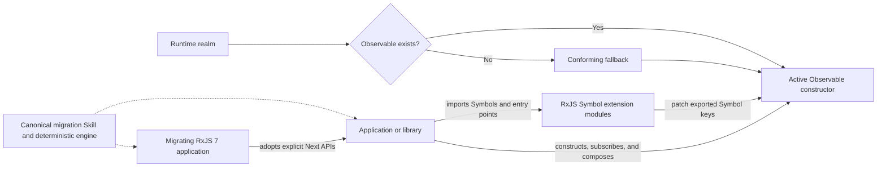
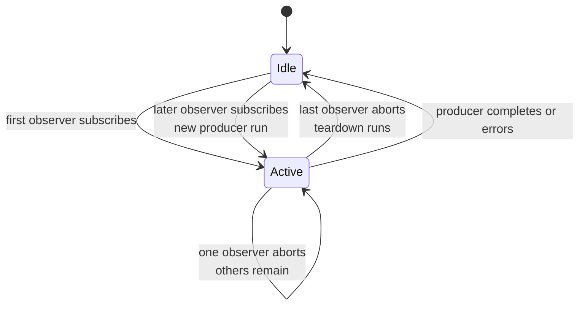
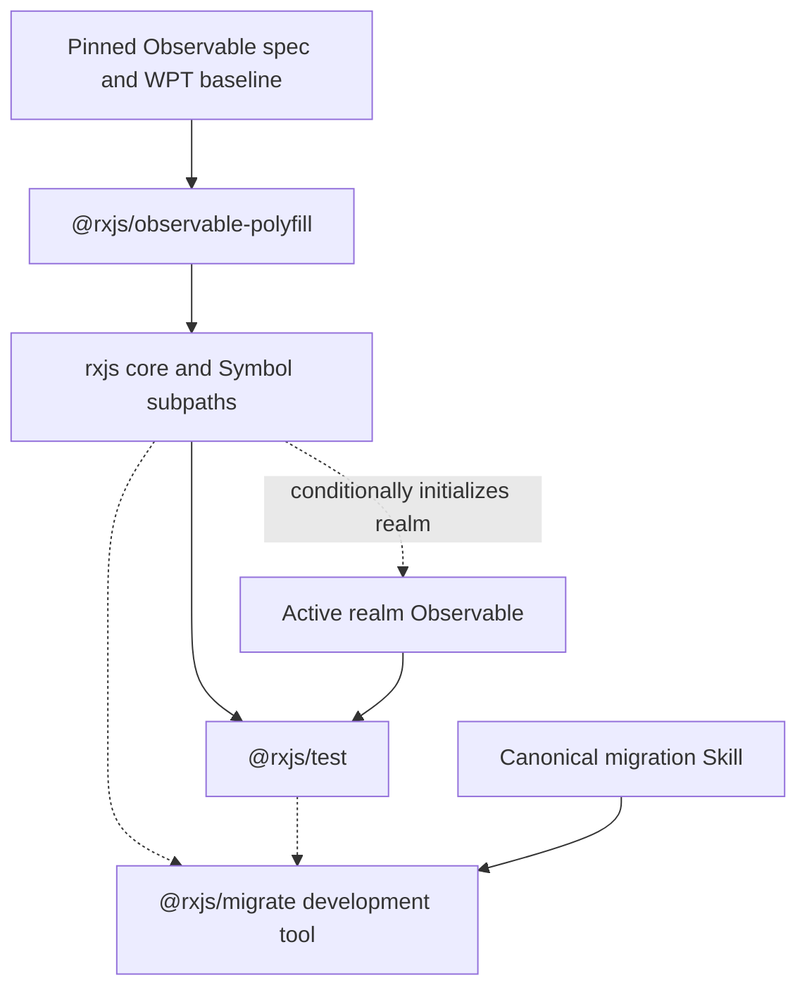

# RxJS Next architecture

## Executive summary

RxJS Next is changing RxJS from an owner of the Observable primitive into an
extension library for the web-platform Observable.

The target architecture has three conceptual layers:

1. **Platform acquisition:** use a native `Observable`, or install a conforming
   fallback when it is absent.
2. **RxJS extensions:** patch exported Symbol-keyed factories and operators onto
   the selected constructor or prototype.
3. **Migration tooling:** provide one canonical portable Skill, thin harness
   adapters, and a bounded deterministic transform engine based on stabilized
   runtime contracts and classified RxJS 7 behavioral evidence.

The branch now has a buildable three-package foundation for the platform and
extension layers, but it remains a prototype rather than a release. The
fallback is held to every selected Observable test at the pinned WPT revision;
there are no RxJS-specific conformance exceptions. P0.3 implements the package,
installation, detection, and initial realm boundaries accepted in D-039
through D-041. P0.4 adds the shared lifecycle safety rail. P0.5 pins the written
Observable rules and executable WPT gate and restores complete conformance by
superseding D-042 with D-045.

## Architecture context

The branch was created by replacing most of the `packages/rxjs` implementation
and its RxJS 7 tests with a small platform-based experiment. The initiating
commit describes it as “a new implementation built on top of the platform
observable (using the polyfill for now).”

The rest of the monorepo remains largely RxJS 7-era infrastructure:

- the root README and documentation application describe the existing
  generation;
- package manifests use the first RxJS 9 prerelease version, `9.0.0-beta.0`;
- the inherited `@rxjs/observable` workspace package has been removed;
- release and CI paths are being redesigned for the accepted RxJS 9 support
  matrix; package documentation is local, while the documentation application
  remains outside this workstream.

Those artifacts are useful history and migration evidence, but they are not
automatically part of the target architecture.

## Target system context



## Single-maintainer release boundary

RxJS 9 explicitly assumes one human author, reviewer, merger, release operator,
and security responder. Pull requests expose changes and run required checks;
they are not evidence of independent approval.

Beta publication is a local, interactive operation from a clean `master`
checkout that exactly matches its remote. `pnpm release:beta <version>` validates
the synchronized four-package version, runs repository and package gates, packs
the packages, prints their SHA-512 integrities, and runs npm publication dry
runs. Ben must then type the exact version before npm's own OTP/WebAuthn flow
publishes each tarball under `next`. The supporting packages publish first and
`rxjs` publishes last. Registry integrity and dist-tags are verified before the
command reports success.

CI has no npm publishing credential and no workflow can publish. The design
deliberately trusts Ben's local machine and npm account at the publication
boundary instead of adding a GitHub App, trusted publisher, private staging,
release environment, or automated release-PR system. This keeps the process
understandable and makes the residual risk explicit: a compromised maintainer
machine or npm authentication can still compromise a release. Required CI,
interactive WebAuthn, exact package ordering, dry runs, and registry-integrity
verification reduce mistakes without pretending to remove that trust.

Useful producer-per-subscription values and Subjects remain intentional APIs
inside `rxjs`; they do not form a separate compatibility layer or package.
Migration tooling is not a runtime dependency.

## Current component inventory

| Component                      | Current responsibility                                                                                                                                                                                           | Intended responsibility                                                                                        | Current gap                                                                                       |
| ------------------------------ | ---------------------------------------------------------------------------------------------------------------------------------------------------------------------------------------------------------------- | -------------------------------------------------------------------------------------------------------------- | ------------------------------------------------------------------------------------------------- |
| `packages/observable-polyfill` | Conditionally supplies the ambient platform-shaped `Observable`, paired `Subscriber`, native-style methods, `EventTarget.when()`, and fallback metadata                                                          | Independently publishable conditional fallback and owner of the base ambient platform types                    | P6.2 must complete the accepted runtime matrix and release gate                                   |
| `packages/rxjs`                | Installs entry-scoped Symbol operators, factories, and async-iteration adapters by direct exact-Symbol assignment; exports intentional subjects, producer-per-subscription primitives, notifications, and errors | Main Symbol-extension library with direct exact-Symbol assignment plus intentional non-operator RxJS Next APIs | P6.2 must complete bundle-budget and release qualification                                        |
| `packages/rxjs/src/testing`    | Contains obsolete exploratory fake timers and an experimental `ScheduledObservable`                                                                                                                              | Retained only as prototype history until removed                                                               | Superseded by the accepted `@rxjs/test` boundary                                                  |
| `packages/test`                | Provides `rxTest`, marble factories/assertions, virtual host scheduling, and explicit cold/hot/platform source models                                                                                            | Implementation-neutral framework testing that consumes an already active realm Observable                      | P6.2 must complete the accepted runtime matrix                                                    |
| `packages/migrate`             | Provides a versioned deterministic engine, canonical portable Skill, safe Skill installer, structured CLIs, capability and contract schemas, package/fixture gates, and committed Codex qualification records    | Deterministic migration engine and canonical versioned Skill; never a runtime dependency                       | Broader repository, capability, model, and non-Codex outcome qualification remains future work    |
| `apps/rxjs.dev`                | Existing RxJS documentation site                                                                                                                                                                                 | Maintained independently and integrated only in a later explicitly coordinated change                          | Represents the prior generation and is outside this project plan's edit, build, and publish scope |

## Platform Observable lifecycle

### Intended semantics

The living Observable specification associates each Observable with a weak
reference to an active `Subscriber`. A first observer starts producer work.
Additional observers join that active subscriber. Aborting an observer removes
it; when the last observer leaves, the subscriber closes and producer teardown
runs. A later observer can start a new producer subscription.

Do not summarize that lifecycle by assigning one persistent “hot” or “cold”
label to the Observable. Those terms describe when the producer exists relative
to a particular subscription:

- **Cold:** subscription creates the producer.
- **Hot:** the producer already exists before subscription.

The first platform subscription creates the active producer. A concurrent
subscription joins that already-existing producer. After the ref count reaches
zero, a later subscription creates a new producer. Sharing, multicasting,
replay, and ref counting are separate properties and do not redefine those
terms. In particular, an instantiated `Subject` is hot because the producer
exists before observers subscribe. See D-035.



Each active `Subscriber`:

- owns the internal observer list;
- exposes `next`, `error`, and `complete`;
- exposes an `AbortSignal`;
- accepts teardown callbacks;
- ignores `next` and `complete` after closure and reports invalid late errors
  according to the platform algorithm.

This lifecycle is a core architectural constraint, not an implementation
detail. Operators on the platform surface must not create independent upstream
producer work for each observer. An intentional type such as `ColdObservable`
may expose a different direct-subscription contract without redefining the
platform surface.

### Current implementation

`packages/observable-polyfill/src/index.ts` models the shared lifecycle with:

- a `WeakRef<Subscriber<T>>` on each `ObservableImpl`;
- a `Set` of safe observers on the active subscriber;
- an internal `AbortController`;
- ref-count closure when the observer set becomes empty;
- explicit close state that aborts the subscriber signal before running
  teardown callbacks in reverse insertion order;
- a required `next(value)` argument for every platform `Subscriber`, including
  `Subscriber<void>`; explicit `next(undefined)` is valid for a void
  subscriber, while an omitted runtime argument throws before active-state or
  notification-delivery checks;
- immediate execution of teardowns registered after closure;
- a small `AbortController.prototype.abort` bridge for signals that have
  Observable work registered, because JavaScript exposes abort events but not
  the DOM-standard abort-algorithm hook that must run before those events;
- global Web IDL-shaped `Observable` and non-constructible `Subscriber`
  interfaces.

`Observable.from` now follows the pinned platform conversion order:
Observable identity, async iterable, sync iterable, then Promise. It no longer
accepts arbitrary subscribables at this platform boundary. Sync and async
iterators use explicit protocol loops so the fallback can preserve iterator
method sampling, `return(reason)`, abort timing, and pending-result behavior
that `for await...of` intentionally hides.

The structure and behavior pass the pinned Observable WPT revision in window,
dedicated-worker, same-origin iframe, and Web IDL coverage. D-045 supersedes
D-042: the fallback again enforces the pinned revision's required-argument rule
for `Subscriber.next`, and the strict gate permits no product-policy divergence
from any selected upstream test.
The abort-algorithm bridge is installed only with the fallback constructor. It
still patches that realm's `AbortController.prototype.abort`, because
JavaScript does not expose the required DOM abort-algorithm hook; controllers
without registered Observable algorithms delegate directly to the captured
platform method.

### Shared native/fallback lifecycle contract

P0.4 adds one self-contained contract under
`packages/observable-polyfill/test/lifecycle`. The Node half clears the realm,
imports the built package, verifies its frozen fallback marker, and exercises
the selected fallback. The browser half serializes that exact contract into a
disposable pinned-Chrome session and verifies that the selected constructor is
native and unmarked. The contract covers activation and sharing, late joins,
individual and last-observer abort, restart, completion, error, synchronous
reentrancy, teardown registration and reverse ordering, and host reporting of
thrown observer callbacks.

The browser execution primitive is shared with the attested WPT harness rather
than defining a second browser-selection path. Both the pinned blocking job and
latest-Chrome advisory job run the lifecycle contract before WPT. Passing this
contract demonstrates agreement only for its bounded lifecycle claims; the
pinned WPT suite remains the conformance authority for the broader platform
surface.

## Native selection and polyfill boundary

### Accepted target

Importing or initializing RxJS must result in one active platform Observable
constructor for the realm:

- preserve any existing constructor without probing it;
- install the fallback only when needed;
- never install both as competing identities;
- install the paired fallback `Subscriber` only with the fallback constructor;
- install `EventTarget.prototype.when` only when `EventTarget` exists and the
  method is absent.

### Current implementation

P0.3 implements D-041:

- `import '@rxjs/observable-polyfill'` conditionally initializes the current
  realm;
- every public `rxjs` entry point evaluates that initializer before it touches
  `Observable`;
- `observablePolyfillInfo` uses
  `Symbol.for('rxjs.observable.polyfill.info.v1')` to address a frozen
  `{ packageName, version }` marker on an RxJS-installed constructor;
- `getObservablePolyfillInfo(constructor = globalThis.Observable)` returns that
  marker or `undefined` without claiming that an unmarked implementation is
  native or conforming;
- an earlier marked or unmarked constructor wins and is never replaced.

The marker property is non-enumerable, non-writable, and non-configurable.
Marker-object identity distinguishes two installation instances of the same
package version without a UUID or crypto requirement. Initialization performs
its checks once when the module evaluates; operators do not poll the marker.
All required property changes are preflighted and committed as one
transaction. A failed definition rolls back earlier changes; an unsupported
frozen target produces a named error instead of leaving a partial realm.

Each window, iframe, worker, or server isolate initializes itself. Imports do
not walk child realms or transparently extend foreign constructors. Server
installation is isolate-global and idempotent rather than per-request.

## Attested Observable WPT harness

The WPT harness is a test boundary around the current fallback, not a second
installation contract. It does not change production source, exports, ambient
types, or the accepted native-first direction. Its purpose is to run the
upstream Observable suite in disposable browser realms while proving that each
reported result came from the RxJS fallback rather than the browser's native
implementation.

The written standards reference is WICG/observable commit
`d74bace7cf80200a01c81cfe20961e29ac7fa3d8`, specifically `spec.bs`. It is used
to understand the rules and diagnose failures; it is not a second executable
success gate. The harness pins web-platform-tests/wpt commit
`6a009d73f0d315941b90cac13a9523a2a08c631b`. It vendors exactly 29 files from
`dom/observable/tentative/`—including the `EventTarget.prototype.when`
coverage—and eight derived support files: the license, GC helper, two IDLs,
and four WPT harness/parser scripts. The 37 imported files remain byte-for-byte
identical to upstream; provenance records each Git blob and SHA-256, and an
expected-URL inventory makes missing or duplicated execution a hard failure.
Verification derives the support closure from the test sources and rejects
both missing dependencies and unexplained extras. Updates use a shallow,
blob-filtered sparse checkout and require explicit review of source,
dependency, URL, and realm-pattern changes.

Execution uses an ignored generated shadow tree:

1. The real polyfill source is synchronously bundled for tests. A manifest
   records every source hash and the final bundle SHA-256.
2. Before the bundle runs, bootstrap code captures native `Observable`,
   `Observable.prototype.subscribe`, and `EventTarget.prototype.when`
   descriptors and references. The pinned blocking browser must expose them,
   and the disposable realm must permit them to be masked.
3. After fallback installation, a non-enumerable test-only attestation checks
   that the active constructor, `subscribe`, and `when` references exactly
   equal the bundle-installed references, differ from the captured native
   references, and report the expected bundle hash.
4. Generated metadata injects bootstrap and an attestation registrar into
   every `.any.js`, `.window.js`, HTML, and IDL URL, then registers the one
   named attestation subtest after upstream source setup has run. This
   preserves upstream testharness properties such as
   `allow_uncaught_exception`. The `.any.js` injection is what reaches
   dedicated-worker variants. Reviewed same-origin
   `contentWindow` access installs and verifies the same bundle in the child
   before upstream code uses it. The four iframe URLs cannot pass their single
   attestation until all nine reviewed child-realm accesses have verified.
   New realm-creation patterns or child-count drift fail import verification
   until reviewed.
5. A report auditor independently requires exactly one passing attestation per
   expected URL. Expectation metadata cannot suppress attestation failures.

`pnpm run test:wpt` is the strict conformance gate. It succeeds only when the
official browser WPT runner completes, every expected URL runs once, every
realm attests exact RxJS identity, the report is complete, and every upstream
test and subtest passes. Any failure, error, timeout, or not-run result produces
a readable terminal report and a nonzero process exit.

`pnpm run test:wpt:baseline` is a separately named harness diagnostic. It compares
Observable behavior with the reviewed known-failure baseline while retaining
all completeness and identity gates. The baseline is accepted only after three
consecutive complete runs agree, and unexpected failures and unexpected passes
both reject it. It is not the default test command and is not a conformance
claim.

The initial narrowed-closure baseline contained 52 generated URLs and 487
reported upstream subtests. All 52 implementation attestations passed.
Top-level statuses were 33 `OK`, 15 `ERROR`, and 4 `TIMEOUT`; reported upstream
subtest statuses were 314 `PASS`, 159 `FAIL`, 8 `TIMEOUT`, and 6 `NOTRUN`.

At P1.4b completion, all 52 URLs reported `OK`, all 525 upstream subtests
reported `PASS`, and all 52 implementation attestations passed against Chrome
for Testing `150.0.7871.126`. Three further complete attested runs produced
identical results before the obsolete failure metadata was removed. D-042
temporarily changed the argument-presence contract; D-045 supersedes it and
restores the same complete result as the required current baseline.

For bounded network and execution cost, the official sparse WPT runner is
cached by WPT revision, operating system, and Python version. Chrome for
Testing `150.0.7871.126` and its matching driver are locked by artifact
checksum, with warm offline execution required. The blocking job uses fixed
concurrency and a wall-clock limit; a non-blocking scheduled latest-Chrome run
reports browser drift separately.

## Symbol extension model

### Current pattern

Every current exact public extension module:

1. creates and exports a Symbol;
2. augments the global `Observable` or `ObservableCtor` TypeScript interface;
3. assigns an implementation directly to the constructor or prototype under
   that exact Symbol;
4. creates returned observables through the receiver's construction protocol.

D-051 and P4.I1 establish this direct-assignment pattern without changing
Symbol identity, public augmentation, construction, or operator behavior.

The accepted target instance-extension pattern looks like this:

```ts
export const example: unique symbol = Symbol('example');

declare global {
  interface Observable<T> {
    [example](): Observable<T>;
  }
}

Observable.prototype[example] = function <T>(this: Observable<T>): Observable<T> {
  const ObservableCtor = this.constructor as ObservableCtor;
  return new ObservableCtor((subscriber) => {
    this.subscribe(subscriber, { signal: subscriber.signal });
  });
};
```

Consumers import the Symbol as the stable access key:

```ts
import { scan } from 'rxjs/scan';

const totals = source[scan]((total, value) => total + value, 0);
```

### Native and RxJS operator coexistence

The RxJS Symbol catalog is not limited to operators missing from the platform.
It also provides Symbols for overlapping names such as `map` and `filter`:

```ts
import { map } from 'rxjs/map';

const platformNames = source.map((value) => value.name);
const rxjsNames = source[map]((value) => value.name);
```

These are two intentional public surfaces on the same Observable:

- `source.map(...)` is the platform-shaped string API. A native implementation
  owns it when present; the conforming fallback supplies it only when the
  platform Observable itself is absent.
- `source[map](...)` is the RxJS API. Providing it even for an overlapping name
  lets developers use the same Symbol-based style for the complete RxJS
  operator catalog.
- The RxJS implementation may delegate to the platform method when the
  contracts match, wrap it, or independently implement additional inputs,
  overloads, or behavior. Those differences are part of the RxJS contract and
  require focused documentation and tests. Delegation must also preserve the
  receiver's approved `[create]` policy; it cannot turn a ColdObservable Symbol
  result into a platform Observable as an accidental fast path.
- Installing the RxJS Symbol must never replace or alias over the string-named
  platform property.

The same ownership rule applies in fallback mode: the fallback's `.map` remains
the platform-conformance surface, while `[map]` remains a separately versioned
RxJS extension. A shared familiar name is not a promise that every overload,
type, or edge case is identical.

### Why side-effect patching is collision-safe

The use of Symbols changes the risk profile of prototype patching. A unique
Symbol behaves like an unforgeable property key for ordinary collaboration:

```ts
const first = Symbol('scan');
const second = Symbol('scan');

first === second; // false
```

The description is only a debugging label. A string property named `"scan"`,
or a different Symbol also described as `"scan"`, cannot overwrite the
implementation stored under `first`. Code must possess the exact Symbol value
to read or replace that property.

That gives each exported RxJS Symbol a deliberately narrow authority boundary:

- importing the extension module installs an implementation in that Symbol's
  slot;
- importing the exported Symbol lets a consumer invoke that capability;
- an unrelated library can patch its own Symbol without colliding, even if it
  uses the same description;
- code that has deliberately received the RxJS Symbol can replace that one
  implementation, but it cannot accidentally trample other Symbol extensions.

This directly addresses a deficiency of the RxJS 5
`rxjs/add/operator/*` design. Those modules patched string-named properties such
as `Observable.prototype.map`. The string name was shared global territory, so
another library, another RxJS copy, or a different version could replace the
method based on import order. Symbol-keyed patching removes that accidental
shared namespace while retaining the convenience of import-time installation.

This is collision isolation, not a security boundary. Reflective code can
enumerate Symbol properties, and an exported Symbol is intentionally available
to its importers. The guarantee is that unrelated code cannot collide merely by
choosing the same name.

The guarantee is strongest with unique Symbols, which remain the rule for
public RxJS operators and factories. `Symbol.for(key)` deliberately uses a
shared global registry: any code that knows `key` can recover the same Symbol
and write to the same slot.

The one accepted exception is the internal construction protocol in D-037.
Compatible copies use `Symbol.for('rxjs.kernel.create.v1')` so an operator from
one copy can discover the construction policy of an Observable subclass from
another copy. The ABI version belongs to the protocol rather than the package
release. Installation keeps an existing callable implementation and rejects an
occupied non-callable slot. No public operator Symbol becomes globally
recoverable as a result.

### Constructor preservation

`create.ts` installs the receiver's versioned `[create]` protocol, and
operators and factories invoke that protocol directly for derived results.
The inherited implementation preserves a same-realm subclass whose constructor
accepts the platform initializer shape; an explicit override may select another
result contract. `ColdObservable` uses that seam to construct another plain
`ColdObservable`. Its native string-named methods instead delegate through a
fresh base Observable and return platform Observables. Static Symbols follow
their static receiver. Incompatible constructors and generic borrowing onto
unrelated objects are unsupported. Transparent cross-realm operation is not
supported: each realm initializes its own constructor and extensions.

Input conversion is deliberately independent. Operator inputs use the active
realm's platform `Observable.from`, preserving its accepted input categories,
ordering, identity, and errors rather than asking a result subclass to redefine
normalization. Source subscriptions inherit the derived subscriber's signal;
operator-local early-cancellation boundaries join their own controller with
that signal. One positional internal source-subscription helper binds default
forwarding callbacks, wraps operator overrides, routes synchronous setup
failures through the source-error path, and joins an optional local signal.
Synchronous callbacks, host setup, and conversions are forwarded as stream
errors, while downstream observer exceptions retain platform host reporting.
Raw subscriptions remain at root-core and Subject-like connection boundaries,
async-generator adapters without a destination Subscriber, lifecycles retained
beyond the outer result, and terminal/finalization paths whose ordering or
host-reporting behavior would be changed by destination-signal ownership.

### Installation side effects

An extension import mutates `Observable` or `Observable.prototype`. That makes
the following architectural concerns inseparable from the API:

- the active constructor must exist before the module evaluates;
- duplicate package copies must agree on Symbol identity or remain isolated in
  a documented way;
- tree-shaking metadata must not incorrectly erase required installation;
- patching may fail for non-extensible constructors or prototypes.

Every public `rxjs` root or subpath import first evaluates the conditional
polyfill initializer for its realm. The root then installs only the shared
construction kernel needed by its non-operator core exports. An operator or
factory subpath installs only its own exact Symbol capability plus required
kernel dependencies. The root does not install the complete operator catalog.
The package declares `sideEffects: true`; direct subpaths supply the intended
capability granularity while preventing a bundler from erasing acquisition or
installation merely because an imported Symbol binding is unused.

Browser windows, worker realms, Node, Deno, and Bun are supported only through
the exact D-053 matrix when the required web primitives exist. Hardened globals
and non-extensible constructors or prototypes are outside the initial claim.
Public extension installation may surface the native assignment error and a
paired static/instance capability has no transactional guarantee on those
unsupported targets. Other edge runtimes remain unclaimed until tested.

P2.1 accepts D-048: public extension Symbols are exact and module-owned. An
independently evaluated duplicate package copy or other version receives a
different public Symbol and installs a separate slot. RxJS 9 `import` and Node
`require(esm)` instead share the same ESM module identity. Only
the versioned construction ABI remains shared across compatible copies. P2.2
historically added a common internal installer for those public slots. It
preflighted every requested constructor and prototype property, treated the
identical value as an idempotent installation, rejected an occupied exact key,
and rolled back earlier definitions if a later definition failed. Installed
properties were non-enumerable, writable, and configurable. Missing capacity
and mutation failures produced capability-named diagnostics. D-051 and P4.I1
supersede that installation mechanism.

P3.3 completed the historical catalog adoption. P4.I1 then migrated all 97
current exact public extension Symbols to direct assignment, including
async-iteration Symbols that return generators instead of Observables. The
common installer and its installer-only tests no longer exist. A blocking
source audit now requires each public capability to assign its exported exact
Symbol on the declared constructor or prototype and rejects RxJS-specific
string-named additions or a return to the installer abstraction.

D-051 supersedes that installation mechanism while preserving D-048's identity,
realm, and bundling policy. Exact module-owned Symbols already isolate unrelated
libraries, package copies, and versions; normal module caching
handles repeat evaluation of one module instance. The accepted target is direct
assignment to the constructor or prototype under the module's own exported
Symbol. It deliberately removes runtime preflight, collision diagnostics,
descriptor customization, extensibility checks, and rollback. P4.I1 completed
the code, test, audit, and bundle-evidence migration. Direct assignment uses
the ordinary writable, enumerable, configurable descriptor; unsupported
hardened targets receive no RxJS-specific preflight, rollback, or diagnostic.

### Public Symbol consistency

Public extension modules use `Symbol('name')`, producing a key unique to that
module evaluation. The former unreviewed `Symbol.for('buffer')` exception has
been removed, and public declarations use explicit `unique symbol` types.
`create.ts` continues to use the accepted namespaced global protocol key from
D-037. D-048 records the version, duplicate-copy, realm, and collision
consequences of that split.

## Current API inventory

This inventory documents what exists in source, not a supported public API.

### Platform-shaped fallback surface

- Constructor and subscription: `Observable`, `Observable.from`,
  `Observable.prototype.subscribe`
- Observable-returning methods: `takeUntil`, `map`, `filter`, `take`, `drop`,
  `flatMap`, `switchMap`, `inspect`, `catch`, `finally`
- Promise-returning methods: `forEach`, `first`, `last`, `find`, `some`,
  `every`, `reduce`, `toArray`
- Event integration: `EventTarget.prototype.when`
- Subscriber surface: `next`, `error`, `complete`, `addTeardown`, `active`,
  `signal`

### Symbol extensions in `packages/rxjs`

| Placement           | Current extensions                                                                                                                                                                                                                                                                                                                                                                                                                                                                                                                                                                                                                                                                                                                                                                                                       |
| ------------------- | ------------------------------------------------------------------------------------------------------------------------------------------------------------------------------------------------------------------------------------------------------------------------------------------------------------------------------------------------------------------------------------------------------------------------------------------------------------------------------------------------------------------------------------------------------------------------------------------------------------------------------------------------------------------------------------------------------------------------------------------------------------------------------------------------------------------------ |
| Static and instance | `create`, `combine`, `combineLatest`, `concat`, `merge`, `onErrorResumeNext`, `pipe`, `race`                                                                                                                                                                                                                                                                                                                                                                                                                                                                                                                                                                                                                                                                                                                             |
| Static              | `animationFrames`, `forkJoin`, `generate`, `interval`, `partition`, `timer`                                                                                                                                                                                                                                                                                                                                                                                                                                                                                                                                                                                                                                                                                                                                              |
| Instance            | `buffer`, `bufferTime`, `catchError`, `combineLatestAll`, `count`, `debounce`, `defaultIfEmpty`, `delay`, `distinct`, `distinctUntilChanged`, `distinctUntilKeyChanged`, `elementAt`, `every`, `exhaustMap`, `expand`, `filter`, `finalize`, `find`, `findIndex`, `first`, `isEmpty`, `iterateBufferedValues`, `iterateEachValue`, `iterateLatestValue`, `iterateNextValue`, `last`, `map`, `max`, `mergeMap`, `min`, `observeOn`, `pairwise`, `pluck`, `reduce`, `repeat`, `retry`, `sampleTime`, `scan`, `sequenceEqual`, `single`, `skip`, `skipLast`, `skipUntil`, `skipWhile`, `startWith`, `subscribeOn`, `switchMap`, `take`, `takeLast`, `takeUntil`, `takeWhile`, `tap`, `throttle`, `throwIfEmpty`, `timeInterval`, `timeout`, `timestamp`, `windowCount`, `windowTime`, `withLatestFrom`, `zipAll`, `zipWith` |

The exact RxJS `map`, `filter`, `first`, `last`, and `find` Symbols coexist
with the fallback's same-familiar-name string methods. Installing an RxJS
extension does not replace or widen the platform method; callers select the
contract through the property key.

### Intentional non-operator primitives

- `Subject`, including a class-local `asObservable()` method that returns a
  distinct non-mutating view through the Subject's platform Observable base
- `ColdObservable`
- `PerSubscriptionSubjectBase`, an advanced abstract base for hot Subject
  variants that require setup for every direct subscription
- `behaviorSubject`
- `replaySubject`
- `TimeoutError`
- `zip`
- experimental fake timers and `ScheduledObservable`

These APIs remain subject to focused public-contract review, but they belong to
`rxjs` rather than a separate compatibility product. Passing an RxJS 7 test
against one of them does not imply source, type, import, or lifecycle
compatibility with RxJS 7.

The four exact async-iteration Symbols convert the receiver's push
notifications into a fresh, lazy, one-shot async generator. `iterateEachValue`
retains a lossless FIFO queue; `iterateBufferedValues` yields lossless
microtask-coalesced snapshots; `iterateLatestValue` retains only the latest
unread value; and `iterateNextValue` accepts only the first value that arrives
while the generator has an outstanding request. The last two strategies are
deliberately lossy. A synchronously completing source therefore yields every
value through `iterateEachValue`, one batch through
`iterateBufferedValues`, only its final value through
`iterateLatestValue`, and no values through `iterateNextValue`.

Each generator owns its own queue, buffer, latest-value slot, or demand slot,
but it subscribes directly to its receiver. Concurrent generators over a
platform Observable are separate observers of the same shared, ref-counted
active producer. A generator that joins late sees only future source
notifications; closing one generator leaves the producer active while another
observer remains, and a later iteration after ref-count closure starts a new
producer run. The same Symbol methods on `ColdObservable` instead activate one
independent producer per generator because its direct `subscribe()` contract is
producer-per-subscription.

Iteration starts the subscription only when the generator is first advanced.
Generator cleanup aborts its observer when a loop breaks, its body throws, or
the generator is explicitly closed. Accepted queued, buffered, or latest
values are yielded before source completion or error becomes visible. The
former standalone `eachValueFrom` and `bufferedValuesFrom` source modules and
package subpaths were removed rather than retained as aliases.

Notifier gates, synchronous queries, property selection, prefix/pair
sequencing, and partitioning keep one state machine per active platform
producer run. Concurrent observers share that state, while restart after the
ref count reaches zero begins with fresh state. Early terminal queries cancel
synchronous upstream work before delivering their result. The two static
`partition` branches retain independent predicate and index state over the
same platform-converted input.

`windowCount` emits its first read-only window before source activation and
supports tumbling, overlapping, and gapped cadence. Source completion completes
live windows, source errors error them, and outer cancellation silently
releases them without converting cancellation into completion. Synchronous
`generate` and recursive `expand` likewise keep one activation-scoped state
machine. `expand` uses FIFO concurrency and iterative draining, so synchronous
recursion does not grow the JavaScript stack.

The numeric form of the Symbol-keyed `debounce` uses host timers rather than an
RxJS scheduler. Each source value replaces the pending timer, normal source
completion flushes the pending value immediately before completing, and result
cancellation clears the timer through the platform subscriber lifecycle.
Concurrent fallback observers share that one active timer and source
subscription; numeric debounce does not introduce producer-per-observer work.

The exact `delay` Symbol schedules each value with a host timeout, delays normal
completion until every pending value is delivered, and forwards source errors
immediately. A `Date` supplies one absolute release boundary. The exact
`sampleTime` Symbol likewise uses a host interval and emits only the latest
value received since the preceding tick. `timestamp` and `timeInterval` read
`Date.now()` by default and accept the narrow timestamp-provider contract
required by their RxJS 7 evidence; they do not introduce a general scheduler
abstraction. `animationFrames` uses the host animation-frame callback timestamp
for its default `timestamp`, derives `elapsed` from the active timestamp
provider, and cancels through the platform subscriber lifecycle.

The unified `timeout` Symbol supports initial and per-value host deadlines.
Expiry aborts the source before activating the configured fallback; absent a
fallback it errors with the exported `TimeoutError` and its `seen`,
`lastValue`, and `meta` context. Source completion, source error, and result
cancellation all cancel pending timeout work through `AbortSignal`.

The exact `bufferTime` Symbol uses host timers for sequential or overlapping
buffers. Sequential buffers restart their span after a size-triggered close;
overlapping buffers retain the configured creation cadence. Completion flushes
each active buffer in creation order, errors discard them, and cancellation
clears all close and creation timers.

The exact `windowTime` Symbol follows the same host-time cadence while exposing
read-only Subject views. Sequential windows reopen after time- or size-based
closure; overlapping windows retain their creation cadence. Source terminal
events terminate active windows before the outer result, while outer
cancellation releases windows silently.

The exact `observeOn` and `subscribeOn` Symbols use host timeouts instead of a
public scheduler. `observeOn` defers notifications in source order;
`subscribeOn` defers source activation. Both cancel pending work through the
derived subscriber's `AbortSignal` and retain one shared, ref-counted platform
activation for concurrent observers.

All platform-layer host work resolves its scheduling and cancellation
functions from `globalThis` at the moment work is scheduled or cancelled.
RxJS-owned provider/delegate objects and module-evaluation captures are not part
of the Next runtime boundary. This lets the same `@rxjs/test` realm patch
virtualize RxJS operators and ordinary application host calls.

`Subject.asObservable()` does not add a string-named method to
`Observable.prototype`. The returned base-Observable view forwards
`next`/`error`/`complete` from the Subject, delegates cancellation through the
derived subscriber's `AbortSignal`, and therefore retains the selected base
Observable's lifecycle. With the platform fallback, concurrent view observers
share one active forwarding subscription and ref-count it; the view does not
recreate RxJS 7 producer-per-subscription behavior.

The standalone `zip(sources)` retains one FIFO buffer per input. Without its
non-RxJS `fillAfterComplete` option, it completes as soon as any completed
input has no buffered value left, because no further complete tuple is
possible. This includes an input that completes empty and the point immediately
after a final tuple drains a previously completed input. Result completion,
input error, and last-observer cancellation close every active input through
the result subscriber's `AbortSignal`; concurrent platform observers share one
ref-counted zip activation. Synchronous termination stops activation of later
inputs. With `fillAfterComplete`, a completed empty input instead contributes
the configured fill value while another input still has a real buffered value;
the result completes after every input is complete and all real buffered
values have been drained. An empty source list completes immediately.

## Test architecture

`@rxjs/test` is a separate development-time package. Its `rxTest` function
owns the virtual-time engine, redirects supported realm scheduling APIs for the
complete async test lifetime, evaluates registered expectations, and restores
the original property descriptors in every exit path.

The API makes lifecycle semantics explicit:

- `cold()` creates an independent producer during each subscription;
- `hot()` creates a subject-like absolute-timeline producer before
  subscriptions;
- `observable()` follows the platform's shared/ref-counted active producer
  lifecycle: the first subscription creates a producer, concurrent
  subscriptions join it, and a later subscription after ref-count closure
  creates another.

The package does not expose `TestScheduler` or add scheduler arguments to the
main library. Its public `ColdObservable` dependency conditionally initializes
the fallback when the realm has no Observable and preserves an existing native
constructor. See `docs/rxjs-next/TESTING_DESIGN.md`, D-012, D-034, and D-043.

The RxJS 7 marble-test evidence is maintained separately under
`packages/rxjs/test/ported`. A source-pinned manifest records one
disposition for each of 2,338 registrations expanded from 2,201 physical
declarations, including parameterized variants, source-skipped declarations,
missing APIs, and obsolete scheduler internals. Every record has a unique case
ID, executable program, and cold parity registration; unavailable capabilities
fail explicitly instead of removing the source case from collection. The
repository owns 147 formatted Vitest `.spec.ts` files for each of the cold and
platform modes. They were produced by a one-time migration and are now normal
checked-in source: each file imports `rxTest` and public RxJS Symbols directly,
and each test has a real repository filename and line number. Modes
run in isolated Vitest processes so the platform constructor is selected
before extension modules load. All 2,338 definitions are registered in each
available mode.

Cold mode installs the fallback platform base without replacing the global
with `ColdObservable`. Its `cold()` fixtures extend `ColdObservable`, and
explicit cold constructors and static factories name `ColdObservable`
directly. `hot()` fixtures extend the active global constructor and derive
ordinary platform Observables; `observable()` directly uses the active global
constructor and its shared/ref-counted lifecycle. Platform modes use the
ambient `globalThis.Observable`; tests never import a fallback constructor.

The RxJS `test:unit` gate registers every ported case as an ordinary test in
cold and polyfill modes: a converted-program failure, missing API, unsupported
harness dependency, source-skipped case, or exact duplicate fails the command
instead of being quarantined or inverted with an expected-failure wrapper.
Vitest's unmodified built-in default reporter provides human output and real
clickable locations. The CI verifier captures Vitest's verbose per-case result
stream; the static migration report maps declaration order back to manifest
case IDs without putting machine identifiers in test names. Tests use ordinary
Vitest assertions and spies without a compatibility assertion layer. Dedicated
platform cases assert the
shared/ref-counted lifecycle directly. Native loading also verifies that the
ambient constructor was not replaced. The recorded mode baselines remain
diagnostic evidence and do not change default test outcomes. Under D-055, a
separate CI verifier executes the complete per-case audits and requires
their exact case-ID pass sets to match the reviewed 2,299/39 cold and 2,316/22
polyfill baselines. Both regressions and unexpected passes block CI so evidence
and classifications cannot drift silently. See `RXJS_7_MARBLE_TEST_PORT_NOTES.md`,
D-013, and D-055.

RxJS 7 helper inputs that expose only a lowercase `subscribe` method or legacy
interop protocol remain unchanged in the checked-in migration evidence. They
are classified as `compatibility-only` and fail explicitly where the current
surface rejects arbitrary subscribables. Replacing those inputs with platform
Observables would change the behavioral claim rather than preserve it.

P0.M1 established an exploratory `@rxjs/migrate` package. P0.M3 hardened its
framework-neutral semantic transform, versioned capability registry,
Mocha/Chai-to-Vitest adapter, structured dry-run-first CLI, contract schemas,
safe batch writes, package gates, and canonical Skill integrity primitives.
D-046 narrows the accepted product to that deterministic engine and the single
canonical Skill, while thin Codex, Claude Code, and Cursor adapters expose the
same versioned Skill. The former MCP prototype, bin, export, dependency, tests,
and claims are removed. Framework
syntax remains an adapter boundary, so projects may preserve their current
runner or add another source/target pair without changing `rxTest` semantics.
The repository's native/polyfill execution matrix remains local test
infrastructure, not generated user code. See
`packages/migrate/docs/MIGRATION_TOOLING_DESIGN.md`.

### Agent-first migration architecture

The migration Skill owns project discovery, baseline capture, behavioral
classification, migration-contract approval, bounded execution, repair, and
closeout. Before changing source, it records each affected pipeline as
`platform-shared`, `producer-per-direct-subscription`, `subject-hot`,
`not-applicable`, `unsupported`, or `unresolved`. Unsupported or unresolved
behavior, missing characterization evidence, and lifecycle-sensitive choices
remain visible escalation points rather than transform defaults.

The deterministic engine may parse source, apply reviewed capability mappings,
adapt framework syntax, and return diagnostics. It must not choose lifecycle
semantics, manufacture missing evidence, or declare a project migrated. A
mechanical fixture lane now proves transform, diagnostics, source and target
type checks, pinned RxJS 7 and Next behavior, path containment, dry-run/write,
idempotence, imports, and packed publication properties. A separate agent
evaluation lane proves reviewed outcomes from the same canonical Skill digest.
P0.M5 qualifies that lane only for Codex/ChatGPT; Claude Code and Cursor retain
P0.M4 installation and discovery evidence but no measured migration-outcome
claim. `packages/migrate/docs/MIGRATION_TOOLING_DESIGN.md` is the controlling
product and validation
contract.

The 2026-08-01 qualification snapshot ran four pinned RxJS 7 repositories
through Codex `0.146.0-alpha.3.1` with `gpt-5.6-sol` at medium reasoning. All
four passed the 14 semantic gate families: three completed their approved
migrations and the weak-coverage/unsupported scenario made its required safe
stop before target installation or migration writes. The records bind
`@rxjs/migrate` and the canonical Skill to `8.0.0-alpha.14`, retain five
SHA-256-addressed artifacts per run, and are verified offline. This is bounded
evidence for those scenarios and settings, not a general automatic-migration
or cross-harness reliability claim.

`docs/rxjs-next/RxJS-7-parity.md` is the generated public-surface map. Its
machine-readable capability registry distinguishes instance operator Symbols,
static factory Symbols, ambient-platform constructions, and standalone values.
Pipeable migration invokes `source[targetSymbol](...adaptedArgs)`: exact
operators retain their arguments, while explicitly recorded unified mappings
such as
`bufferCount → buffer({ maxSize, startEvery, emitRemainingOnError: false })`
and
`bufferWhen → buffer({ delay: closingSelector, emitEmpty: true, emitRemainingOnError: false })`
adapt old signatures. The count-window configuration starts an initial buffer
when the producer activates, supports overlapping or gapped windows, emits
full buffers as they reach `maxSize`, and emits remaining non-empty buffers in
creation order on completion. Supplying `startEvery` selects this count-window
mode. When it is omitted, delay-window buffering evaluates its closing
selector before activating source work; a synchronous selector failure errors
the result without activating the source. The `bufferWhen` mapping discards an
active partial buffer when the source errors. A similarly named platform
string method is not treated as RxJS Symbol parity.
RxJS 7 `buffer(closingNotifier)` uses the same delay-window mode with
`restartDelay: false`, retaining one notifier subscription across boundary
values while the default delay-selector mode restarts after every boundary.
RxJS 7 `audit(durationSelector)` and `throttle(durationSelector, config)` share
the Symbol-keyed `throttle` implementation. A duration value closes a window;
duration completion only cleans it up and does not emit a trailing value.
Throttle starts a new duration after a trailing emission, while the audit
adapter sets `leading: false`, `trailing: true`, and
`restartOnTrailing: false` so the next source value starts the next audit
window. Source completion waits only when an active duration owns a pending
trailing value.

Direct identity mappings cover `takeUntil`, `skipUntil`, `pluck`, `find`,
`findIndex`, `throwIfEmpty`, `isEmpty`, `startWith`, `pairwise`, and
`windowCount`. `partition` and `generate` map to exact static Symbols.
RxJS 7 `expand(project, numericConcurrency)` maps to
`source[expand](project, { concurrent: numericConcurrency })`. Reusing one
projected platform fixture during recursion retains the case-scoped
shared/ref-counted expectation from D-013 rather than manufacturing a cold
inner. Legacy scheduler forms of `startWith`, `generate`, and `expand` are not
public platform contracts. Their ported behavioral claims execute through
explicit `@rxjs/test` scheduling rewrites at the migration-evidence boundary;
see D-033.

## Intentional producer-per-subscription APIs

### Why the distinction is necessary

An ordinary RxJS 7 cold Observable creates a separate producer execution during
each subscription. The platform Observable creates one producer for its first
subscription and shares that active producer among current observers. Changing
the platform layer to recreate RxJS 7's producer-per-subscription model would
violate the project foundation and make native and polyfilled behavior diverge.

D-039 rejects a separate RxJS 7 compatibility runtime. RxJS Next can still
publish a type with a producer-per-direct-subscription contract when that
behavior is useful and explicit. Such a type is an intentional Next API, not a
facade that promises RxJS 7 imports, subscriptions, pipeable operators,
schedulers, or types.

### Current prototypes

`ColdObservable` subclasses the active platform Observable, overrides
`subscribe()`, and creates a new `ColdSubscriber` per direct JavaScript call.
It also defines the shared versioned `[create]` protocol so RxJS Symbol
operators return plain ColdObservables. Its string-named platform methods take
the opposite path: each delegates through a fresh base Observable view, so
Observable-returning methods return platform Observables and Promise consumers
still activate the cold source correctly. `PerSubscriptionSubjectBase`, the
behavior-subject factory, and the replay-subject factory build on that
direct-subscription mechanism.

`PerSubscriptionSubjectBase` is an advanced abstract base rather than an
ordinary Subject for application code. Like every Subject, its instance is a
hot producer that exists before its observers subscribe. “Per subscription”
describes observer-local setup, not producer creation. Its material differences
from `Subject` are:

- `Subject` extends the platform Observable. Concurrent observers can share
  one active platform `Subscriber`, which the Subject stores as one fanout
  destination.
- `PerSubscriptionSubjectBase` extends `ColdObservable`, so every direct call
  to `subscribe()` creates a separate `ColdSubscriber` and calls the protected
  `_subscribe` hook.
- `BehaviorSubject` and `ReplaySubject` currently use that per-observer hook to
  emit a current value or replay buffered values to each late observer. Merely
  changing their base class to the current `Subject` would skip that hook when
  a late observer joins an already-active platform subscription.
- The base has separate input/output type parameters. A subclass using
  different types owns the safety of that conversion; `Subject` has one value
  type.
- `Subject` provides `asObservable()` and overrides the Symbol-keyed creation
  hook so operator results use the immutable platform Observable base.
  `PerSubscriptionSubjectBase` instead inherits the cold `[create]` protocol.
  Symbol-operator results are plain ColdObservables rather than mutable Subject
  subclasses, while native-method results are platform Observables.

The constructor is protected and the class is abstract so it cannot be
presented as a beginner-facing replacement for `Subject`. Its default
`_subscribe` implementation handles retained terminal events and live fanout.
Subclasses normally perform their observer-local setup and delegate to that
implementation. A subclass that calls the lower-level `addSubscriber` helper
instead owns terminal handling, replay ordering, active-state checks, and
teardown correctness.

The hook is deliberately a **direct-subscription hook**.
`ColdObservable`'s explicit native-method overrides reach it by subscribing
the fresh platform view to the cold source. For a behavior or replay subject,
that means observer-local setup runs once for each active platform view, while
concurrent observers of the same native result share that platform activation.
Borrowed or newly introduced native methods are not automatically covered;
the method-inventory test must identify and force review of platform-surface
growth.

For a plain Subject, the extra per-subscription plumbing has no identified
fanout purpose. The current behavior- and replay-subject prototypes are its
concrete subclasses because they need observer-local replay. The former
`ColdSubject` name was removed rather than retained as an alias; it incorrectly
implied a cold producer and obscured the base-class intent.

D-050 stabilizes these classes and factories in the main `rxjs` package as
intentional Next APIs. Their public declarations expose Symbol-derived results
as `Observable<T>` even when D-037 selects a `ColdObservable` at runtime; the
type surface does not encode producer lifecycle. Cancellation remains
AbortSignal-based, Subject terminal and replay behavior is covered directly,
and none of these contracts creates an RxJS 7 compatibility claim. See
`COMPATIBILITY.md` for the migration-evidence policy.

## Package and import architecture

### Current package facts

- All current package manifests report `9.0.0-beta.0`.
- `packages/observable` and its workspace-preparation references are removed.
- `rxjs` declares an exact runtime dependency on
  `@rxjs/observable-polyfill`.
- Every public `rxjs` source entry reaches the conditional initializer before
  reading or extending `Observable`.
- The root source exports the approved non-operator core. Each public source
  subpath has one ESM runtime and declaration export.
- The polyfill's ambient declarations are emitted from its package entry.
- All four release packages build one ESM output without self-links or source
  specs in the packed artifact. Browser, Webpack, `import`, and Node
  `require(esm)` conditions share that output where applicable.
- Repository metadata names each package's actual directory.
- ESM, Node `require(esm)`, declaration-consumer, bundler, and per-realm import
  fixtures exercise the package map. D-053 defines the final support matrix.

### Accepted package map and import behavior

The published runtime map has three products:

| Package                     | Accepted responsibility                                                                            |
| --------------------------- | -------------------------------------------------------------------------------------------------- |
| `@rxjs/observable-polyfill` | Independently publishable conditional fallback and owner of the base ambient platform declarations |
| `rxjs`                      | Symbol extensions plus intentional non-operator RxJS Next classes and values                       |
| `@rxjs/test`                | Implementation-neutral test harness that consumes an already initialized realm                     |

`@rxjs/observable` has no target role and is removed. No runtime
compatibility package replaces it.

`rxjs` declares a runtime dependency on `@rxjs/observable-polyfill`. Every
public root or subpath import first evaluates the conditional initializer. The
root exports non-operator core values—cold, Subject, connectable, notification,
and public-error primitives—without installing the operator and factory
catalog. An operator or factory subpath installs only its exported exact Symbol
capability and internal kernel dependencies.

The polyfill package owns the ambient TypeScript declarations for
`Observable`, `Subscriber`, `ObservableValue`, and `EventTarget.when`.
Individual `rxjs` entry points augment those base declarations only with the
Symbols they export. `@rxjs/test` imports the public `ColdObservable` entry;
that entry preserves an existing constructor or conditionally initializes the
fallback when the realm is empty.

### Supported release environments

D-053 selects one published ESM implementation for every supported target.
Node `22.13.0+` on the Node 22 line and maintained Node 24 are blocking; Node
26 is advisory during beta. Latest stable Chrome and Firefox, current desktop
Safari, current Mobile Safari in an iOS simulator, current stable Deno and Bun,
and Webpack 5 are blocking. The pinned Chrome 150 WPT lane remains the
reproducible conformance authority; current browser lanes detect integration
and upstream drift.

Browser, Webpack, `import`, and Node `require(esm)` conditions point to the same
`dist/esm` files and declarations. There is no CommonJS or target-specific code
copy. The Node bridge is a supported transition on the declared Node range,
not a CommonJS artifact or a promise to legacy resolvers. Deno and Bun consume
the unchanged npm package. Tests for those environments must not introduce
shims, runtime branches, dependencies, or bundle bytes.

Supported runtimes supply `WeakRef`, `AbortSignal.any`, `Symbol.dispose`,
`EventTarget`, and applicable DOM types. The accepted error-reporting fallback
continues to cover hosts without `globalThis.reportError`. Other edge runtimes,
hardened globals, non-extensible installation targets, and transparent
cross-realm operation remain unclaimed.

### Documentation ownership

D-052 keeps package-relative user documentation inside the package it
describes. The RxJS 7 migration guide and its generated evidence references
therefore live under `packages/rxjs`; migration-engine and canonical-Skill
documentation lives under `packages/migrate`; and testing-package
documentation belongs under `packages/test`. Repository-wide charter,
architecture, decisions, open questions, compatibility policy, and active-plan
records remain under `docs/rxjs-next`.

The root README is the repository entry point and may link to those package
containers. `apps/rxjs.dev` is maintained by a separate workstream and is not
edited, built, tested, published, or otherwise used as a delivery surface by
this project plan. Future website integration requires an explicit coordinated
change after the package documentation stabilizes.

### Target dependency direction

The runtime dependency direction is acyclic:



The fallback must not depend on RxJS operators or migration tooling.
`@rxjs/test` preserves an existing native constructor and otherwise receives
the fallback through its public RxJS cold dependency.

## Repository workspace and tooling

The repository uses pnpm 10.34.5 for local development, workspace execution,
CI, and release preparation. `pnpm-workspace.yaml` is the authoritative
workspace definition for the four packages under `packages/*` and the
`apps/rxjs.dev` application; the root project provides shared tooling, making
six install projects in total. pnpm's default isolated linker keeps
package-local type dependencies separate without a public-hoist bridge. The
docs application continues to resolve its declared RxJS 7 dependency from the
registry rather than linking the exploratory local `rxjs` package.

Dependency build scripts use a version-bounded allow/deny policy with
`strictDepBuilds` enabled. Newly introduced install scripts therefore require
explicit review. CI installs the committed pnpm lockfile with
`--frozen-lockfile`. Repository scripts declare dependencies they use directly;
in particular, RxJS tests declare Chai and the release helper declares Yargs
instead of depending on a flat installation layout. A version-pinned patch
changes Husky 4's generated pnpm hook runner from the obsolete
`pnpx --no-install` form to `pnpm exec`.

CI has four durable ownership layers. Main CI runs focused package behavior,
lint, builds, declarations, imports, publication fixtures, runtime contracts,
the exact migration-evidence audits, bundle-analysis tests, SafariDriver unit
tests, and active-workflow validation on pull requests and `master`.
TypeScript-latest also runs in both contexts. Pinned Observable WPT and the full
browser, Webpack, performance, adoption, Deno, Bun, desktop Safari, and Mobile
Safari release-readiness matrix are path-aware on pull requests and
unconditional on `master`. The latest-Chrome drift lane and Node 26 remain
advisory; other accepted release lanes are blocking. Release coherence guards
the commands, environment matrix, and `master` triggers.

## Build and test baseline

Verified on 2026-07-24 from commit `9e94c090e`:

| Check                           | Result                                                                                | Interpretation                                                                                                                                                           |
| ------------------------------- | ------------------------------------------------------------------------------------- | ------------------------------------------------------------------------------------------------------------------------------------------------------------------------ |
| Polyfill source tests           | 4 unique source tests pass                                                            | Covers global installation, basic next/complete teardown, error flow, and `EventTarget.when`; not conformance                                                            |
| RxJS source tests               | 1 test passes                                                                         | Covers one `scan` example only                                                                                                                                           |
| Polyfill package build          | Fails                                                                                 | Ambient platform declarations are not visible to the build entry, causing missing global types and follow-on errors                                                      |
| Polyfill package lint           | Fails                                                                                 | The existing ESLint project points at `packages/observable/tsconfig.json`, which does not include the polyfill sources                                                   |
| RxJS package build              | Fails                                                                                 | `tshy` rejects the array-valued root export configuration before compilation                                                                                             |
| Workspace project discovery     | Passes with the Nx daemon disabled                                                    | Discovers `@rxjs/observable-polyfill`, `@rxjs/observable`, `rxjs`, and `rxjs.dev`                                                                                        |
| Attested Observable WPT harness | Strict command fails on current conformance gaps; explicit baseline diagnostic passes | 37-file approved closure, 52 generated URLs, 52 passing exact-identity attestations, readable terminal failures, three identical baseline runs, and a warm offline rerun |

The P0.T3 parity baseline was verified on 2026-07-29. The strict
`pnpm --filter rxjs test` command passed 705 focused source tests, then passed
all 2,338 registrations in both cold and polyfill modes. The durable ledger
retains all 1,923 cases that failed an earlier complete audit and marks every
row `FIXED`. The final manifest contains 1,503 active, 831
compatibility/expected-failure, and 4 exact-deduplicate registrations; those
dispositions remain classification metadata and do not weaken ordinary test
semantics.

The P0.3 package baseline was verified on 2026-07-30 with Node `24.12.0`:

| Check                                           | Result                                                                                                                                              |
| ----------------------------------------------- | --------------------------------------------------------------------------------------------------------------------------------------------------- |
| Frozen-lockfile install and workspace discovery | Passes; five install projects and four Nx projects, with only the three accepted runtime packages                                                   |
| Workspace publication preparation               | Passes builds and lints for `@rxjs/observable-polyfill`, `rxjs`, and `@rxjs/test`                                                                   |
| Package fixtures                                | All three packages pass clean multi-dialect builds, declaration consumers, ESM imports, and CommonJS imports                                        |
| Conditional installation fixtures               | Pass missing-global, marker, foreign/earlier constructor, independent `when`, direct-subpath, core-only root, worker-realm, and frozen-target cases |
| Published-file dry runs                         | Contain `dist` runtime/declaration artifacts plus package metadata; no source specs or generated self-links                                         |
| Polyfill and test-package source suites         | 49 polyfill/harness tests and 75 `@rxjs/test` tests pass                                                                                            |
| Attested Observable WPT harness                 | 52/52 URLs, 525/525 upstream subtests, and 52/52 exact RxJS identity attestations pass; no failure expectations or skips                            |

Rebuilding the formerly disconnected polyfill entry also exposed that the
historical focused RxJS source-test baseline had been consuming a stale
fallback artifact. P0.4 reconciled the focused suite to 733/733 passing tests
against the rebuilt fallback. After removing invalid wrappers that had replaced
RxJS 7 arbitrary-subscribable inputs, the Phase 3 complete cold migration audit
now passes 2,299/2,338 and the fallback audit passes 2,316/2,338. The 39 cold
failures are 24 explicit D-013/D-043 lifecycle divergences and 15
compatibility-only arbitrary-subscribable inputs. The 22 fallback failures are
seven of those lifecycle divergences and the same 15 compatibility-only
inputs. No portable or harness-rewrite failure remains unexplained, and neither
audit has a skipped or pending registration. Because the default ported command
intentionally has no expected-failure quarantine, the all-mode RxJS command
remains nonzero while this evidence stays executable.
The package-independent lifecycle contract itself passes against both the
packaged fallback and native Observable.

The P2.4 extension-kernel baseline was verified on 2026-08-01:

| Check                           | Result                                                                                                                                                                                    |
| ------------------------------- | ----------------------------------------------------------------------------------------------------------------------------------------------------------------------------------------- |
| Focused RxJS source suite       | 756/756 tests pass                                                                                                                                                                        |
| Kernel source and type contract | The common installer/helpers and all six pilot capabilities pass strict source typing and focused descriptor, construction, sharing, cancellation, terminal, and error tests              |
| Package and bundler contract    | Builds, declaration consumers, ESM/CommonJS imports, duplicate-dialect coexistence, frozen-target failure, root tree-shaking, and retained direct extension imports pass                  |
| Native/fallback kernel contract | The same eight cases pass against the packaged fallback and native Observable in Chrome `150.0.7871.126`                                                                                  |
| Targeted migrated evidence      | 97/98 pilot registrations pass in cold mode and 97/98 pass in fallback mode; only the classified compatibility-only `switchMap` arbitrary-subscribable input remains unsupported by D-049 |
| Complete migrated evidence      | 2,296/2,338 cold and 2,321/2,343 fallback registrations pass; the remaining restoration/compatibility backlog is outside the extension-kernel phase                                       |

That historical baseline proved the P2.4 common extension pattern, not RxJS 7
runtime compatibility or completion of the operator catalog. The strict all-mode
ported command therefore remains intentionally nonzero while Phase 3 and
Phase 4 classify and resolve the remaining API work.

The P3.4 restoration audit supersedes the complete-migrated-evidence row for
the current 2,338-case corpus: 2,299 cold and 2,316 fallback cases pass. Every
remaining failure is explicitly `intentional-divergence` or
`compatibility-only`; the reviewed case-ID baselines and generated migration
ledger are the authoritative current evidence.

P4.I1 supersedes the installer-specific portions of the P2.4 baseline. All 97
exact public Symbols now use direct assignment, and the following current
verification passed on 2026-08-01:

| Check                            | Result                                                                                                                                                                         |
| -------------------------------- | ------------------------------------------------------------------------------------------------------------------------------------------------------------------------------ |
| Focused RxJS source suite        | 106 files and 750 tests pass; the six removed cases were installer-only transactional tests                                                                                    |
| Direct-installation source audit | All 97 exact public Symbols install on their declared static or instance target; installer references and RxJS-specific string additions are rejected                          |
| Type and package contracts       | Public declaration consumers, build, ESM/CommonJS imports, duplicate-dialect coexistence, root isolation, direct-extension bundling, and retained D-041 fallback fixtures pass |
| Native/fallback kernel contract  | The same eight cases pass against the packaged fallback and native Observable in Chrome `150.0.7871.126`                                                                       |
| Representative bundle delta      | `import 'rxjs/map'` falls from 15,726 to 14,447 minified bytes (-1,279; -8.1%), 4,584 to 4,244 gzip bytes (-340; -7.4%), and 4,126 to 3,819 Brotli bytes (-307; -7.4%)         |
| Root-only bundle control         | `import 'rxjs'` is byte-identical before and after: 19,650 minified, 5,638 gzip, and 5,050 Brotli bytes                                                                        |

The bundle comparison used esbuild 0.19.11 for a browser-platform ESM bundle
with tree shaking and minification, gzip level 9, and default Brotli settings.

The repository and published packages require Node `>=22.13.0`. Node 22 and
Node 24 are blocking release lanes, while Node 26 is advisory during beta. The
blocking Observable WPT workflow uses Node 24, and the harness
unit, import-verification, doctor, and browser-baseline checks have been
verified on Node `24.12.0`. D-053 records the final published-package matrix.

The P6.2 release baseline was verified on 2026-08-01 and supersedes the package,
runtime, bundler, performance, and conformance portions of earlier baselines:

| Check                 | Current result                                                                                                                                                                          |
| --------------------- | --------------------------------------------------------------------------------------------------------------------------------------------------------------------------------------- |
| Four-package train    | All builds, declaration consumers, ESM imports, Node `require(esm)` bridges, migration-document freshness checks, and publication dry runs pass                                         |
| Focused source suites | 51 polyfill, 750 RxJS, 75 test-harness, and 166 migration tests pass                                                                                                                    |
| Node                  | Runtime and ESM/`require(esm)` import contracts pass on 22.13.0, 24.12.0, and advisory 26.5.0                                                                                           |
| Alternate runtimes    | The unchanged package-built ESM passes on Deno 2.8.0 and Bun 1.3.14                                                                                                                     |
| Browser engines       | The eight-case contract passes Chrome 151 (native Observable), Firefox 153 (fallback), and WebKit 26.5 (fallback); branded desktop and Mobile Safari use blocking SafariDriver CI lanes |
| Webpack and budgets   | Webpack 5.106.2 consumes 19 `dist/esm` modules and emits 17,502 bytes against a 22,000-byte ceiling; Node 24 map and cancellation medians exceed their checked-in floors                |
| Observable WPT        | 52/52 URLs, 525/525 upstream subtests, and 52/52 exact RxJS identity attestations pass in pinned Chrome 150                                                                             |

The complete ported RxJS 7 corpus remains intentionally nonzero: 39 cold and
22 fallback cases encode accepted lifecycle divergences or unsupported
arbitrary-subscribable compatibility. They are retained as ordinary executable
evidence without skip or expected-failure inversion and are not a release-gate
failure. The package-local release-gate contract and current budgets are in
`packages/rxjs/docs/RELEASE_GATES.md`.

## Target architecture invariants

These invariants should become automated fitness functions:

1. Importing the fallback never replaces an existing Observable or
   `EventTarget.when`.
2. Native and fallback test modes run the same RxJS platform-layer operator
   suite.
3. No RxJS-specific string-named property is added to the platform
   `Observable` constructor or prototype.
4. Every platform operator in the supported RxJS catalog has a corresponding
   exported Symbol, without changing the platform's string-named method.
5. Every Symbol extension uses an exact module-owned public key and the approved
   direct-assignment pattern.
6. Independently evaluated package copies coexist under distinct public Symbol
   keys without replacing one another; `import` and Node `require(esm)` share
   one module identity.
7. Every returned platform-layer observable preserves the approved constructor
   behavior within its initialized realm; transparent cross-realm operation is
   not implied.
8. Cancellation propagates through the platform signal without leaving active
   upstream work after the last observer leaves.
9. Intentional producer-per-subscription APIs are explicit in imports and
   types and cannot be reached accidentally through the platform entry point.
10. Every public package entry builds, type-checks, imports, and executes in each
    supported environment and module system.
11. Every RxJS 7 migration mapping identifies its behavioral evidence,
    required source change, and any documented divergence without implying a
    runtime compatibility product.
12. Standards conformance work records the exact specification and WPT
    revisions under test.
13. Every WPT result used for fallback assessment proves exact RxJS bundle
    identity in its execution realm; expectation metadata cannot waive that
    proof.
14. Architecture changes update the decision log and project documents in the
    same change.
15. Migration tooling never infers lifecycle intent: a migration begins from a
    reviewed contract manifest, uses one canonical Skill digest across the
    installed harness adapters, and passes the applicable mechanical and
    explicitly qualified agent-outcome gates.

## Initial fitness-function scorecard

| Characteristic         | Check                                                                                                                               | Target enforcement                                                        |
| ---------------------- | ----------------------------------------------------------------------------------------------------------------------------------- | ------------------------------------------------------------------------- |
| Native-first           | Import fallback with a sentinel native constructor and assert identity is unchanged                                                 | Unit and package-import tests                                             |
| Conformance harness    | Observable WPT at `6a009d73f0d315941b90cac13a9523a2a08c631b`, with exact bundle identity attested per URL                           | Blocking strict `test:wpt` job plus a complete-result baseline diagnostic |
| Extension safety       | Snapshot string properties; verify each module installs only its exported exact Symbol and leaves platform string methods untouched | Unit tests and CI                                                         |
| Lifecycle              | Multi-observer, ref-count, abort, synchronous reentrancy, error, and teardown-order cases                                           | Shared platform test suite                                                |
| Native/fallback parity | Run the same operator cases against both implementations                                                                            | CI matrix                                                                 |
| Package integrity      | Build, type, ESM and Node `require(esm)` import, browser/Webpack bundle, runtime-matrix, and duplicate-copy fixtures                | Package and release CI                                                    |
| Migration evidence     | RxJS 7 mappings backed by tests or accepted-divergence records without runtime-emulation claims                                     | Migration review and generated-ledger checks                              |
| Mechanical migration   | Deterministic fixtures prove diagnostics, containment, dry-run/write equivalence, idempotence, build, and behavior                  | Package CI and pre-release gate                                           |
| Agent migration        | Codex/ChatGPT produces approved completion or safe-stop outcomes for the four representative repositories                           | Offline verification of committed qualification records and artifacts     |

## Known architectural risks

| Risk                                                             | Impact                                                            | Mitigation direction                                                                                                         |
| ---------------------------------------------------------------- | ----------------------------------------------------------------- | ---------------------------------------------------------------------------------------------------------------------------- |
| Living platform proposal changes                                 | Polyfill and operators drift from browsers                        | Pin revisions, track upstream, and advance deliberately                                                                      |
| Global mutation and load order                                   | Native behavior is replaced or imports fail nondeterministically  | D-041's conditional transaction, package fixtures, and P0.4's shared lifecycle contract cover the selected base constructor  |
| Duplicate packages create different Symbols                      | Extensions appear missing even though code imported them          | D-048 documents distinct public keys; package fixtures prove coexistence and consumers use the Symbol from their module copy |
| Prototype patching is restricted                                 | Extensions cannot install in hardened or unusual realms           | Keep those realms unclaimed; direct assignment may surface native errors or partial paired installation                      |
| RxJS 7 tests encode different producer-per-subscription behavior | False failures lead contributors to corrupt platform semantics    | Classify tests and keep cold evidence distinct from platform claims                                                          |
| Migration evidence is mistaken for runtime compatibility         | Users depend on unsupported RxJS 7 imports or lifecycle behavior  | State migration actions and unsupported surfaces without publishing an emulation package                                     |
| Mechanical output is mistaken for a complete migration           | Lifecycle-sensitive changes pass syntax checks but alter behavior | Require a reviewed contract manifest, characterization evidence, and agent-outcome gates                                     |
| Harness adapters or copied Skills drift                          | Different agents give materially different migration advice       | Ship one versioned canonical Skill and verify adapter digest plus smoke scenarios                                            |
| Package metadata or exports regress                              | Builds pass locally but published artifacts are unusable          | Keep package build, pack, import, and type fixtures as release gates                                                         |
| Minimal tests allow semantic regressions                         | Prototype behavior becomes accidental policy                      | Add lifecycle and extension-kernel safety rails before expanding operators                                                   |
| Browser-native Observable leaks into a fallback WPT realm        | Results falsely appear to prove the RxJS implementation           | Exact reference-and-bundle attestation per URL, unsuppressible report audit, negative controls, and reviewed realm patterns  |
| WPT/browser downloads make conformance impractical               | Contributors skip or inconsistently run the gate                  | Vendor the small approved test closure and checksum-cache the sparse runner, pinned browser, and matching driver             |

## Evidence and references

Repository evidence:

- `packages/observable-polyfill/src/index.ts`
- `packages/observable-polyfill/test/import`
- `packages/observable-polyfill/test/wpt/config.json`
- `packages/observable-polyfill/test/wpt/provenance.json`
- `packages/observable-polyfill/test/wpt/expected-test-urls.json`
- `packages/rxjs/src/create.ts`
- `packages/rxjs/src/index.ts`
- `packages/rxjs/test/import`
- `packages/rxjs/src/pipe.ts`
- `packages/rxjs/src/cold-observable.ts`
- `packages/rxjs/src/per-subscription-subject-base.ts`
- package manifests and branch history from `origin/master...platform-observable`

External sources:

- [Observable specification](https://wicg.github.io/observable/)
- [Observable proposal and explainer](https://github.com/WICG/observable)
- [Observable WPT results](https://wpt.fyi/results/dom/observable/tentative?label=experimental&label=master&aligned)
- [Observable WPT sources](https://github.com/web-platform-tests/wpt/tree/master/dom/observable/tentative)
- [`rxjs-for-await` async-iteration strategies at the reviewed revision](https://github.com/benlesh/rxjs-for-await/tree/94f9cf9cb015ac3700dfd1850eb81d36962eb70f)
