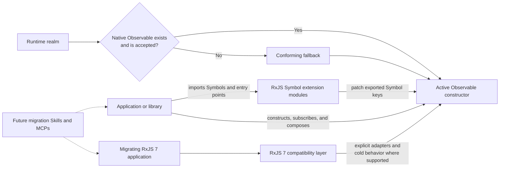
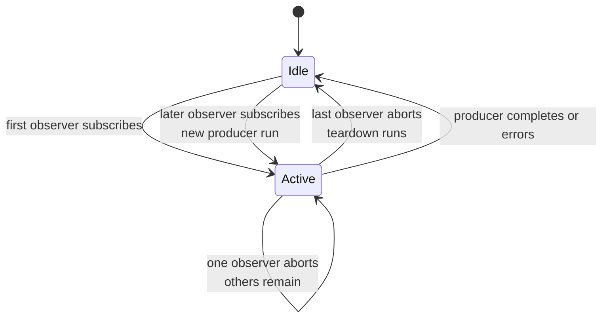
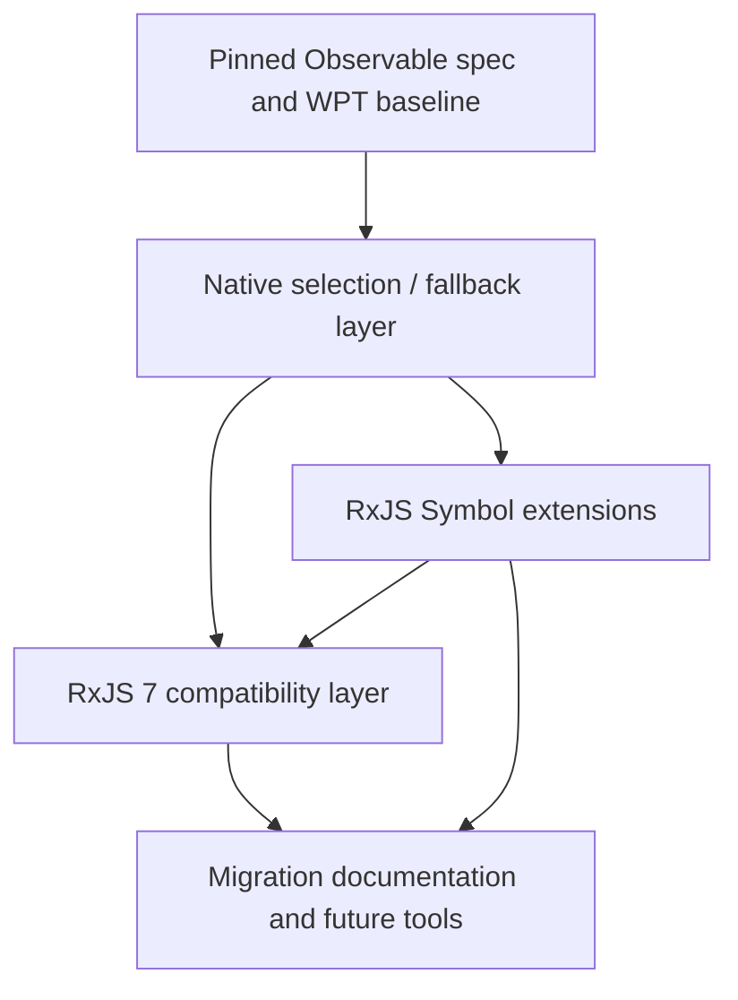

# RxJS Next architecture

## Executive summary

RxJS Next is changing RxJS from an owner of the Observable primitive into an
extension library for the web-platform Observable.

The target architecture has four conceptual layers:

1. **Platform acquisition:** use a native `Observable`, or install a conforming
   fallback when it is absent.
2. **RxJS extensions:** patch exported Symbol-keyed factories and operators onto
   the selected constructor or prototype.
3. **Compatibility:** provide explicit adapters and cold-per-subscription
   behavior for supported RxJS 7 use cases.
4. **Migration tooling:** eventually provide documentation, Skills, and MCP
   capabilities based on the stabilized runtime and compatibility contracts.

The branch already demonstrates each of the first three ideas, but it is a
prototype rather than a buildable or conforming release. This document
separates the implemented shape from the intended invariants.

## Architecture context

The branch was created by replacing most of the `packages/rxjs` implementation
and its RxJS 7 tests with a small platform-based experiment. The initiating
commit describes it as “a new implementation built on top of the platform
observable (using the polyfill for now).”

The rest of the monorepo remains largely RxJS 7-era infrastructure:

- the root README and documentation application describe the existing
  generation;
- package manifests still use `8.0.0-alpha.14`;
- `@rxjs/observable` remains as an inherited RxJS 7-style core;
- release, CI, and documentation paths have not been redesigned for the new
  package model.

Those artifacts are useful history and migration evidence, but they are not
automatically part of the target architecture.

## Target system context



The compatibility and tooling labels are conceptual boundaries. Their final
package names are open decisions.

## Current component inventory

| Component | Current responsibility | Intended responsibility | Current gap |
| --- | --- | --- | --- |
| `packages/observable-polyfill` | Defines an ambient platform-shaped API, implements `Observable`, `Subscriber`, native-style operators, promise-returning consumers, and `EventTarget.when()` | Supply the pinned platform behavior only when the runtime lacks an acceptable implementation | Unconditionally overwrites globals, does not build, and has not been tested against WPT |
| `packages/rxjs` | Side-effectfully installs Symbol-keyed operators/factories; contains subjects, cold primitives, async-iterable adapters, and early testing utilities | Main Symbol-extension library, with compatibility behavior moved behind an explicit boundary | Package exports are invalid/incomplete, the fallback dependency is undeclared, installation conventions vary, and only one operator has a test |
| `packages/observable` | Exposes the inherited RxJS 7 `Observable`, `Subscriber`, `Subscription`, and related helpers | Undecided: remove/archive, rename, or deliberately reuse inside compatibility | It is not used by the new runtime path but is still part of workspace preparation |
| `packages/rxjs/src/testing` | Contains fake timers and an experimental `ScheduledObservable` | Provide test infrastructure appropriate for shared platform semantics and compatibility tests | No stable public entry point or test contract |
| `apps/rxjs.dev` | Existing RxJS documentation site | Eventually explain the new platform and migration model | Still represents the prior generation; redesign is out of scope for the foundation phase |

## Platform Observable lifecycle

### Intended semantics

The living Observable specification associates each Observable with a weak
reference to an active `Subscriber`. A first observer starts producer work.
Additional observers join that active subscriber. Aborting an observer removes
it; when the last observer leaves, the subscriber closes and producer teardown
runs. A later observer can start a new producer subscription.

This is accurately summarized as **cold until subscribed, shared while active,
and ref-counted**.



Each active `Subscriber`:

- owns the internal observer list;
- exposes `next`, `error`, and `complete`;
- exposes an `AbortSignal`;
- accepts teardown callbacks;
- ignores `next` and `complete` after closure and reports invalid late errors
  according to the platform algorithm.

This lifecycle is a core architectural constraint, not an implementation
detail. Operators must not create independent upstream producer work for each
observer unless they are explicitly in the compatibility layer.

### Current implementation

`packages/observable-polyfill/src/index.ts` models the shared lifecycle with:

- a `WeakRef<Subscriber<T>>` on each `ObservableImpl`;
- a `Set` of safe observers on the active subscriber;
- an internal `AbortController`;
- ref-count closure when the observer set becomes empty;
- teardown execution when the internal signal aborts.

The structure reflects the platform direction, but conformance has not been
established. Representative known differences include:

- the file always assigns `globalThis.Observable`;
- `EventTarget.prototype.when` is always assigned;
- `Observable.from` accepts arbitrary subscribables and checks conversion types
  in a different order from the current specification;
- the current Promise conversion emits a value without completing;
- iterable conversion calls `complete()` twice;
- teardowns are stored and executed in insertion order, while the current
  specification closes them in reverse insertion order;
- `addTeardown()` does not immediately execute a teardown registered after
  closure.

This is not an exhaustive conformance review. WPT and a pinned specification
revision will define the real gap list later.

## Native selection and polyfill boundary

### Target invariant

Importing or initializing RxJS must result in one active platform Observable
constructor for the realm:

- preserve an accepted native constructor;
- install the fallback only when needed;
- never install both as competing identities;
- make test and compatibility environments able to select the implementation
  deliberately.

### Current behavior

The fallback assigns `globalThis.Observable = ObservableImpl` without a guard.
It also replaces `EventTarget.prototype.when`. Consequently, importing it in a
runtime that already implements Observable would replace native behavior. This
conflicts with accepted decision D-002.

The final detection and installation API is open. It must be decided before
normalizing imports across operator modules, because import side effects are
part of that contract.

## Symbol extension model

### Current pattern

Most extension modules:

1. create and export a Symbol;
2. augment the global `Observable` or `ObservableCtor` TypeScript interface;
3. assign an implementation to the constructor or prototype under that Symbol;
4. create returned observables through the receiver's constructor.

A simplified instance extension looks like this:

```ts
export const example: unique symbol = Symbol('example');

declare global {
  interface Observable<T> {
    [example](): Observable<T>;
  }
}

Observable.prototype[example] = function <T>(
  this: Observable<T>
): Observable<T> {
  const ObservableCtor = this.constructor as ObservableCtor;
  return new ObservableCtor((subscriber) => {
    this.subscribe(subscriber, { signal: subscriber.signal });
  });
};
```

Consumers import the Symbol as the stable access key:

```ts
import { scan } from 'rxjs/scan';

const totals = source[scan]((total, value) => total + value, 0);
```

### Native and RxJS operator coexistence

The RxJS Symbol catalog is not limited to operators missing from the platform.
It also provides Symbols for overlapping names such as `map` and `filter`:

```ts
import { map } from 'rxjs/map';

const platformNames = source.map((value) => value.name);
const rxjsNames = source[map]((value) => value.name);
```

These are two intentional public surfaces on the same Observable:

- `source.map(...)` is the platform-shaped string API. A native implementation
  owns it when present; the conforming fallback supplies it only when the
  platform Observable itself is absent.
- `source[map](...)` is the RxJS API. Providing it even for an overlapping name
  lets developers use the same Symbol-based style for the complete RxJS
  operator catalog.
- The RxJS implementation may delegate to the platform method when the
  contracts match, wrap it, or independently implement additional inputs,
  overloads, or behavior. Those differences are part of the RxJS contract and
  require focused documentation and tests.
- Installing the RxJS Symbol must never replace or alias over the string-named
  platform property.

The same ownership rule applies in fallback mode: the fallback's `.map` remains
the platform-conformance surface, while `[map]` remains a separately versioned
RxJS extension. A shared familiar name is not a promise that every overload,
type, or edge case is identical.

### Why side-effect patching is collision-safe

The use of Symbols changes the risk profile of prototype patching. A unique
Symbol behaves like an unforgeable property key for ordinary collaboration:

```ts
const first = Symbol('scan');
const second = Symbol('scan');

first === second; // false
```

The description is only a debugging label. A string property named `"scan"`,
or a different Symbol also described as `"scan"`, cannot overwrite the
implementation stored under `first`. Code must possess the exact Symbol value
to read or replace that property.

That gives each exported RxJS Symbol a deliberately narrow authority boundary:

- importing the extension module installs an implementation in that Symbol's
  slot;
- importing the exported Symbol lets a consumer invoke that capability;
- an unrelated library can patch its own Symbol without colliding, even if it
  uses the same description;
- code that has deliberately received the RxJS Symbol can replace that one
  implementation, but it cannot accidentally trample other Symbol extensions.

This directly addresses a deficiency of the RxJS 5
`rxjs/add/operator/*` design. Those modules patched string-named properties such
as `Observable.prototype.map`. The string name was shared global territory, so
another library, another RxJS copy, or a different version could replace the
method based on import order. Symbol-keyed patching removes that accidental
shared namespace while retaining the convenience of import-time installation.

This is collision isolation, not a security boundary. Reflective code can
enumerate Symbol properties, and an exported Symbol is intentionally available
to its importers. The guarantee is that unrelated code cannot collide merely by
choosing the same name.

The guarantee is strongest with unique Symbols. `Symbol.for(key)` deliberately
uses a shared global registry: any code that knows `key` can recover the same
Symbol and write to the same slot. A globally registered key may solve
duplicate-package discoverability, but it gives up some collision isolation and
therefore requires an explicit, namespaced design decision.

### Constructor preservation

`create.ts` and helper functions use either `this.constructor` or a static
receiver so derived results can use the receiver's Observable constructor.
This is directionally important for native subclasses and realms, but the
required edge-case behavior is still open.

### Installation side effects

An extension import mutates `Observable` or `Observable.prototype`. That makes
the following architectural concerns inseparable from the API:

- the active constructor must exist before the module evaluates;
- duplicate imports should be idempotent;
- duplicate package copies must agree on Symbol identity or remain isolated in
  a documented way;
- tree-shaking metadata must not incorrectly erase required installation;
- property descriptors and collision behavior must be specified;
- patching may fail for non-extensible constructors or prototypes.

The branch has no common installer or collision guard yet.

### Current Symbol inconsistency

Most modules use `Symbol('name')`, producing a key unique to that module
instance. `buffer.ts` uses `Symbol.for('buffer')`, producing a
global-registry key. `with-latest-from.ts` also lacks the explicit
`unique symbol` annotation used by most other modules.

The unique-symbol form provides the collision-safety described above.
`Symbol.for` changes that property by making the key recoverable from its
registry name. No one form should be copied as policy until the identity and
duplicate-install decision is resolved.

## Current API inventory

This inventory documents what exists in source, not a supported public API.

### Platform-shaped fallback surface

- Constructor and subscription: `Observable`, `Observable.from`,
  `Observable.prototype.subscribe`
- Observable-returning methods: `takeUntil`, `map`, `filter`, `take`, `drop`,
  `flatMap`, `switchMap`, `inspect`, `catch`, `finally`
- Promise-returning methods: `forEach`, `first`, `last`, `find`, `some`,
  `every`, `reduce`, `toArray`
- Event integration: `EventTarget.prototype.when`
- Subscriber surface: `next`, `error`, `complete`, `addTeardown`, `active`,
  `signal`

### Symbol extensions in `packages/rxjs`

| Placement | Current extensions |
| --- | --- |
| Static and instance | `create`, `combine`, `combineLatest`, `concat`, `merge`, `pipe`, `race` |
| Static | `animationFrames`, `interval`, `timer` |
| Instance | `buffer`, `debounce`, `defaultIfEmpty`, `exhaustMap`, `mergeMap`, `repeat`, `retry`, `scan`, `skipLast`, `skipWhile`, `switchMap`, `takeLast`, `takeWhile`, `throttle`, `timeout`, `withLatestFrom` |

The current source does not yet contain Symbol counterparts for every
platform-named operator. In particular, `map` and `filter` appear only on the
fallback today. Adding their RxJS Symbols is target work required by D-003,
not a claim about the present branch.

### Standalone and compatibility-oriented primitives

- `Subject`
- `ColdObservable`
- `ColdSubject`
- `behaviorSubject`
- `replaySubject`
- `eachValueFrom`
- `bufferedValuesFrom`
- `zip`
- experimental fake timers and `ScheduledObservable`

The mixture of Symbol extensions, classes, factories, and standalone functions
is exploratory. The canonical public shape remains open.

## Compatibility boundary

### Why a boundary is necessary

An ordinary RxJS 7 cold Observable starts a separate producer execution for
each subscription. The platform Observable shares one active producer
subscription among its current observers. Changing the platform layer to
recreate RxJS 7's model would violate the project foundation and make native
and polyfilled behavior diverge.

### Current prototypes

`ColdObservable` overrides `subscribe()` and creates a new `ColdSubscriber` per
call. `ColdSubject`, the behavior-subject factory, and the replay-subject factory
build on that mechanism. These classes demonstrate a possible compatibility
seam.

They currently live inside the main `rxjs` package and are not a settled
compatibility contract. Their naming, typing, cancellation, teardown error
behavior, and relationship to a native Observable require deliberate design.

See `COMPATIBILITY.md` for the compatibility policy.

## Package and import architecture

### Current package facts

- All three packages report `8.0.0-alpha.14`.
- `rxjs` imports `@rxjs/observable-polyfill` from a few modules but declares no
  runtime dependency on it.
- Many extension modules patch `Observable` without importing an initializer,
  so direct-subpath evaluation assumes the global already exists.
- `rxjs` has no source `index.ts`, although its manifest references one.
- The `tshy.exports["."]` value in `rxjs` is an array, which the installed build
  tool rejects.
- The published `exports` map exposes `./index` rather than a root `"."` entry,
  while `main` and `types` point at root index artifacts.
- the `rxjs` and polyfill repository metadata both point at
  `packages/observable`.
- the polyfill's ambient declaration file is not connected to its build entry,
  so its source cannot see the declared globals during a clean build.

These are release blockers, not merely documentation defects.

### Target dependency direction

The conceptual dependency direction should remain acyclic:



Whether these boxes map one-to-one to npm packages is unresolved. The fallback
must not depend on RxJS operators or compatibility code.

## Build and test baseline

Verified on 2026-07-24 from commit `9e94c090e`:

| Check | Result | Interpretation |
| --- | --- | --- |
| Polyfill source tests | 4 unique source tests pass | Covers global installation, basic next/complete teardown, error flow, and `EventTarget.when`; not conformance |
| RxJS source tests | 1 test passes | Covers one `scan` example only |
| Polyfill package build | Fails | Ambient platform declarations are not visible to the build entry, causing missing global types and follow-on errors |
| RxJS package build | Fails | `tshy` rejects the array-valued root export configuration before compilation |
| Workspace project discovery | Passes with the Nx daemon disabled | Discovers `@rxjs/observable-polyfill`, `@rxjs/observable`, `rxjs`, and `rxjs.dev` |

The repository declares Node 18 or Node 20, while the inspection environment
used Node 24. Direct package tests passed despite that mismatch. Future baseline
work should use a declared runtime before attributing tool failures to source.

## Target architecture invariants

These invariants should become automated fitness functions:

1. Importing the fallback never replaces an accepted native Observable.
2. Native and fallback test modes run the same RxJS platform-layer operator
   suite.
3. No RxJS-specific string-named property is added to the platform
   `Observable` constructor or prototype.
4. Every platform operator in the supported RxJS catalog has a corresponding
   exported Symbol, without changing the platform's string-named method.
5. Every Symbol extension uses the approved identity and installation helper.
6. Installing an extension twice is safe and deterministic.
7. Every returned platform-layer observable preserves the approved constructor
   and realm behavior.
8. Cancellation propagates through the platform signal without leaving active
   upstream work after the last observer leaves.
9. Compatibility-only cold behavior cannot be reached accidentally through the
   platform entry point.
10. Every public package entry builds, type-checks, imports, and executes in each
   supported environment and module system.
11. Every RxJS 7 compatibility claim maps to a passing test or a documented,
    reviewed divergence.
12. Standards conformance work records the exact specification and WPT
    revisions under test.
12. Architecture changes update the decision log and project documents in the
    same change.

## Initial fitness-function scorecard

| Characteristic | Check | Target enforcement |
| --- | --- | --- |
| Native-first | Import fallback with a sentinel native constructor and assert identity is unchanged | Unit and package-import tests |
| Conformance | Selected tests from a pinned Observable WPT revision | CI conformance job; detailed plan deferred |
| Extension safety | Snapshot string properties; verify only approved Symbol keys are installed and repeat installation is idempotent | Unit tests and CI |
| Lifecycle | Multi-observer, ref-count, abort, synchronous reentrancy, error, and teardown-order cases | Shared platform test suite |
| Native/fallback parity | Run the same operator cases against both implementations | CI matrix |
| Package integrity | Build, type, ESM/CJS import, browser bundle, and duplicate-install fixtures | Package CI |
| Compatibility | RxJS 7 behavior ledger entries backed by tests or accepted-divergence records | Compatibility CI and review |
| Migration | Representative application fixtures compile and pass behavior tests | Pre-release gate |

## Known architectural risks

| Risk | Impact | Mitigation direction |
| --- | --- | --- |
| Living platform proposal changes | Polyfill and operators drift from browsers | Pin revisions, track upstream, and advance deliberately |
| Global mutation and load order | Native behavior is replaced or imports fail nondeterministically | Decide one installation contract and test every entry point |
| Duplicate packages create different Symbols | Extensions appear missing even though code imported them | Decide registry/version strategy and add duplicate-install fixtures |
| Prototype patching is restricted | Extensions cannot install in hardened or unusual realms | Define supported environments and consider explicit functional fallbacks |
| RxJS 7 tests encode incompatible cold behavior | False failures lead contributors to corrupt platform semantics | Classify tests and keep a separate compatibility suite |
| Compatibility layer grows into a second full RxJS | Maintenance and migration never converge | Publish a support matrix, prioritize real migration needs, and define retirement posture |
| Package metadata remains inherited | Builds pass locally but published artifacts are unusable | Make package import/type fixtures a release gate |
| Minimal tests allow semantic regressions | Prototype behavior becomes accidental policy | Add lifecycle and extension-kernel safety rails before expanding operators |

## Evidence and references

Repository evidence:

- `packages/observable-polyfill/src/index.ts`
- `packages/observable-polyfill/src/observable-polyfill.d.ts`
- `packages/rxjs/src/create.ts`
- `packages/rxjs/src/pipe.ts`
- `packages/rxjs/src/cold-observable.ts`
- `packages/rxjs/src/cold-subject.ts`
- package manifests and branch history from `origin/master...platform-observable`

External sources:

- [Observable specification](https://wicg.github.io/observable/)
- [Observable proposal and explainer](https://github.com/WICG/observable)
- [Observable WPT results](https://wpt.fyi/results/dom/observable/tentative?label=experimental&label=master&aligned)
- [Observable WPT sources](https://github.com/web-platform-tests/wpt/tree/master/dom/observable/tentative)
