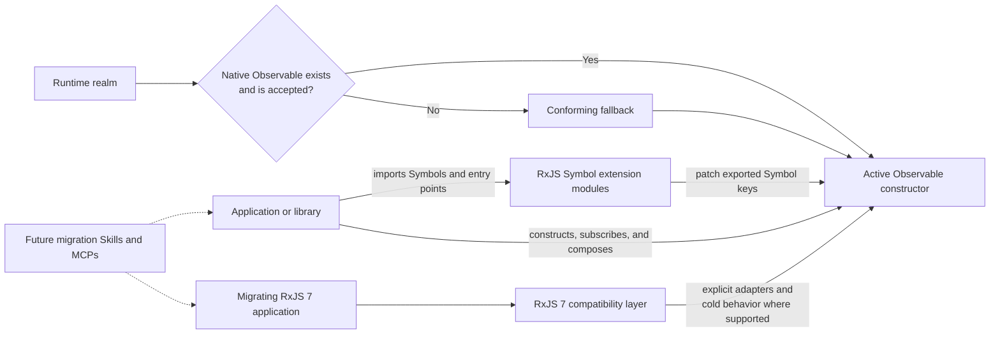
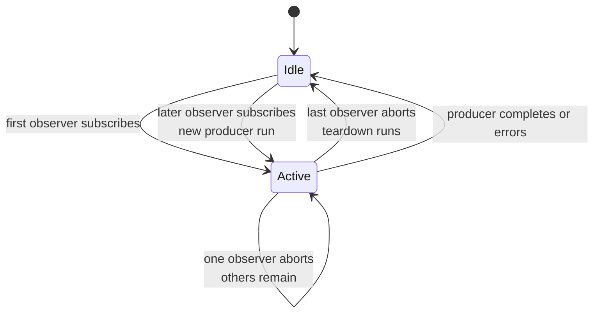
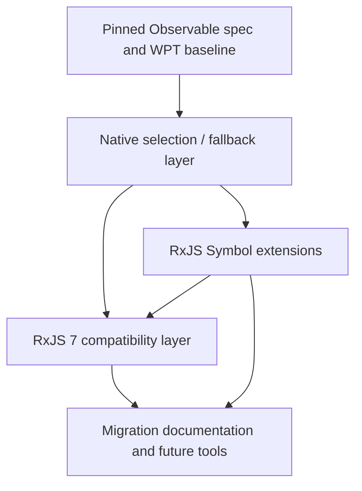

# RxJS Next architecture

## Executive summary

RxJS Next is changing RxJS from an owner of the Observable primitive into an
extension library for the web-platform Observable.

The target architecture has four conceptual layers:

1. **Platform acquisition:** use a native `Observable`, or install a conforming
   fallback when it is absent.
2. **RxJS extensions:** patch exported Symbol-keyed factories and operators onto
   the selected constructor or prototype.
3. **Compatibility:** provide explicit adapters and cold-per-subscription
   behavior for supported RxJS 7 use cases.
4. **Migration tooling:** eventually provide documentation, Skills, and MCP
   capabilities based on the stabilized runtime and compatibility contracts.

The branch already demonstrates each of the first three ideas, but it remains
a prototype rather than a buildable release. The fallback now passes the
pinned Observable WPT suite; package selection, installation, and build
boundaries remain unresolved. This document separates the implemented shape
from the intended invariants.

## Architecture context

The branch was created by replacing most of the `packages/rxjs` implementation
and its RxJS 7 tests with a small platform-based experiment. The initiating
commit describes it as “a new implementation built on top of the platform
observable (using the polyfill for now).”

The rest of the monorepo remains largely RxJS 7-era infrastructure:

- the root README and documentation application describe the existing
  generation;
- package manifests still use `8.0.0-alpha.14`;
- `@rxjs/observable` remains as an inherited RxJS 7-style core;
- release, CI, and documentation paths have not been redesigned for the new
  package model.

Those artifacts are useful history and migration evidence, but they are not
automatically part of the target architecture.

## Target system context



The compatibility and tooling labels are conceptual boundaries. Their final
package names are open decisions.

## Current component inventory

| Component                      | Current responsibility                                                                                                                                       | Intended responsibility                                                                      | Current gap                                                                                                                                    |
| ------------------------------ | ------------------------------------------------------------------------------------------------------------------------------------------------------------ | -------------------------------------------------------------------------------------------- | ---------------------------------------------------------------------------------------------------------------------------------------------- |
| `packages/observable-polyfill` | Defines an ambient platform-shaped API, implements `Observable`, `Subscriber`, native-style operators, promise-returning consumers, and `EventTarget.when()` | Supply the pinned platform behavior only when the runtime lacks an acceptable implementation | Passes the pinned WPT suite, but still unconditionally overwrites globals and does not build because its ambient declarations are disconnected |
| `packages/rxjs`                | Side-effectfully installs Symbol-keyed operators/factories; contains subjects, cold primitives, async-iterable adapters, and early testing utilities         | Main Symbol-extension library, with compatibility behavior moved behind an explicit boundary | Package exports are invalid/incomplete, the fallback dependency is undeclared, installation conventions vary, and only one operator has a test |
| `packages/observable`          | Exposes the inherited RxJS 7 `Observable`, `Subscriber`, `Subscription`, and related helpers                                                                 | Undecided: remove/archive, rename, or deliberately reuse inside compatibility                | It is not used by the new runtime path but is still part of workspace preparation                                                              |
| `packages/rxjs/src/testing`    | Contains obsolete exploratory fake timers and an experimental `ScheduledObservable`                                                                          | Retained only as prototype history until removed                                             | Superseded by the accepted `@rxjs/test` boundary                                                                                               |
| `packages/test`                | Provides `rxTest`, marble factories/assertions, virtual host scheduling, and explicit cold/hot/platform source models                                        | Framework-neutral testing for platform RxJS and RxJS 7 compatibility behavior                | Depends on the active realm Observable; package-acquisition wiring follows the still-open P0.2 contract                                        |
| `apps/rxjs.dev`                | Existing RxJS documentation site                                                                                                                             | Eventually explain the new platform and migration model                                      | Still represents the prior generation; redesign is out of scope for the foundation phase                                                       |

## Platform Observable lifecycle

### Intended semantics

The living Observable specification associates each Observable with a weak
reference to an active `Subscriber`. A first observer starts producer work.
Additional observers join that active subscriber. Aborting an observer removes
it; when the last observer leaves, the subscriber closes and producer teardown
runs. A later observer can start a new producer subscription.

This is accurately summarized as **cold until subscribed, shared while active,
and ref-counted**.



Each active `Subscriber`:

- owns the internal observer list;
- exposes `next`, `error`, and `complete`;
- exposes an `AbortSignal`;
- accepts teardown callbacks;
- ignores `next` and `complete` after closure and reports invalid late errors
  according to the platform algorithm.

This lifecycle is a core architectural constraint, not an implementation
detail. Operators must not create independent upstream producer work for each
observer unless they are explicitly in the compatibility layer.

### Current implementation

`packages/observable-polyfill/src/index.ts` models the shared lifecycle with:

- a `WeakRef<Subscriber<T>>` on each `ObservableImpl`;
- a `Set` of safe observers on the active subscriber;
- an internal `AbortController`;
- ref-count closure when the observer set becomes empty;
- explicit close state that aborts the subscriber signal before running
  teardown callbacks in reverse insertion order;
- immediate execution of teardowns registered after closure;
- a small `AbortController.prototype.abort` bridge for signals that have
  Observable work registered, because JavaScript exposes abort events but not
  the DOM-standard abort-algorithm hook that must run before those events;
- global Web IDL-shaped `Observable` and non-constructible `Subscriber`
  interfaces.

`Observable.from` now follows the pinned platform conversion order:
Observable identity, async iterable, sync iterable, then Promise. It no longer
accepts arbitrary subscribables at this platform boundary. Sync and async
iterators use explicit protocol loops so the fallback can preserve iterator
method sampling, `return(reason)`, abort timing, and pending-result behavior
that `for await...of` intentionally hides.

The structure and behavior pass the pinned Observable WPT revision in window,
dedicated-worker, same-origin iframe, and Web IDL coverage. This is a bounded
conformance claim, not a claim about later specification or WPT revisions.
Known architectural gaps remain:

- the file always assigns `globalThis.Observable` and `globalThis.Subscriber`;
- `EventTarget.prototype.when` is always assigned;
- the abort-algorithm bridge patches `AbortController.prototype.abort`,
  although controllers without registered Observable algorithms delegate
  directly to the captured platform method;
- the ambient declarations are not connected to the package build.

## Native selection and polyfill boundary

### Target invariant

Importing or initializing RxJS must result in one active platform Observable
constructor for the realm:

- preserve an accepted native constructor;
- install the fallback only when needed;
- never install both as competing identities;
- make test and compatibility environments able to select the implementation
  deliberately.

### Current behavior

The fallback assigns `globalThis.Observable = ObservableImpl` without a guard.
It also replaces `EventTarget.prototype.when`. Consequently, importing it in a
runtime that already implements Observable would replace native behavior. This
conflicts with accepted decision D-002.

The final detection and installation API is open. It must be decided before
normalizing imports across operator modules, because import side effects are
part of that contract.

## Attested Observable WPT harness

The WPT harness is a test boundary around the current fallback, not a second
installation contract. It does not change production source, exports, ambient
types, or the accepted native-first direction. Its purpose is to run the
upstream Observable suite in disposable browser realms while proving that each
reported result came from the RxJS fallback rather than the browser's native
implementation.

The harness pins WPT commit
`6a009d73f0d315941b90cac13a9523a2a08c631b`. It vendors exactly 29 files from
`dom/observable/tentative/`—including the `EventTarget.prototype.when`
coverage—and eight derived support files: the license, GC helper, two IDLs,
and four WPT harness/parser scripts. The 37 imported files remain byte-for-byte
identical to upstream; provenance records each Git blob and SHA-256, and an
expected-URL inventory makes missing or duplicated execution a hard failure.
Verification derives the support closure from the test sources and rejects
both missing dependencies and unexplained extras. Updates use a shallow,
blob-filtered sparse checkout and require explicit review of source,
dependency, URL, and realm-pattern changes.

Execution uses an ignored generated shadow tree:

1. The real polyfill source is synchronously bundled for tests. A manifest
   records every source hash and the final bundle SHA-256.
2. Before the bundle runs, bootstrap code captures native `Observable`,
   `Observable.prototype.subscribe`, and `EventTarget.prototype.when`
   descriptors and references. The pinned blocking browser must expose them,
   and the disposable realm must permit them to be masked.
3. After fallback installation, a non-enumerable test-only attestation checks
   that the active constructor, `subscribe`, and `when` references exactly
   equal the bundle-installed references, differ from the captured native
   references, and report the expected bundle hash.
4. Generated metadata injects bootstrap and an attestation registrar into
   every `.any.js`, `.window.js`, HTML, and IDL URL, then registers the one
   named attestation subtest after upstream source setup has run. This
   preserves upstream testharness properties such as
   `allow_uncaught_exception`. The `.any.js` injection is what reaches
   dedicated-worker variants. Reviewed same-origin
   `contentWindow` access installs and verifies the same bundle in the child
   before upstream code uses it. The four iframe URLs cannot pass their single
   attestation until all nine reviewed child-realm accesses have verified.
   New realm-creation patterns or child-count drift fail import verification
   until reviewed.
5. A report auditor independently requires exactly one passing attestation per
   expected URL. Expectation metadata cannot suppress attestation failures.

`pnpm run test:wpt` is the strict conformance gate. It succeeds only when the
official browser WPT runner completes, every expected URL runs once, every
realm attests exact RxJS identity, the report is complete, and every upstream
test and subtest passes. Any failure, error, timeout, or not-run result produces
a readable terminal report and a nonzero process exit.

`pnpm run test:wpt:baseline` is a separately named harness diagnostic. It compares
Observable behavior with the reviewed known-failure baseline while retaining
all completeness and identity gates. The baseline is accepted only after three
consecutive complete runs agree, and unexpected failures and unexpected passes
both reject it. It is not the default test command and is not a conformance
claim.

The initial narrowed-closure baseline contained 52 generated URLs and 487
reported upstream subtests. All 52 implementation attestations passed.
Top-level statuses were 33 `OK`, 15 `ERROR`, and 4 `TIMEOUT`; reported upstream
subtest statuses were 314 `PASS`, 159 `FAIL`, 8 `TIMEOUT`, and 6 `NOTRUN`.

After P1.4b, all 52 URLs report `OK`, all 525 upstream subtests report `PASS`,
and all 52 implementation attestations pass against Chrome for Testing
`150.0.7871.126`. Three further complete attested runs produced identical
results before the obsolete failure metadata was removed.

For bounded network and execution cost, the official sparse WPT runner is
cached by WPT revision, operating system, and Python version. Chrome for
Testing `150.0.7871.126` and its matching driver are locked by artifact
checksum, with warm offline execution required. The blocking job uses fixed
concurrency and a wall-clock limit; a non-blocking scheduled latest-Chrome run
reports browser drift separately.

## Symbol extension model

### Current pattern

Most extension modules:

1. create and export a Symbol;
2. augment the global `Observable` or `ObservableCtor` TypeScript interface;
3. assign an implementation to the constructor or prototype under that Symbol;
4. create returned observables through the receiver's constructor.

A simplified instance extension looks like this:

```ts
export const example: unique symbol = Symbol('example');

declare global {
  interface Observable<T> {
    [example](): Observable<T>;
  }
}

Observable.prototype[example] = function <T>(this: Observable<T>): Observable<T> {
  const ObservableCtor = this.constructor as ObservableCtor;
  return new ObservableCtor((subscriber) => {
    this.subscribe(subscriber, { signal: subscriber.signal });
  });
};
```

Consumers import the Symbol as the stable access key:

```ts
import { scan } from 'rxjs/scan';

const totals = source[scan]((total, value) => total + value, 0);
```

### Native and RxJS operator coexistence

The RxJS Symbol catalog is not limited to operators missing from the platform.
It also provides Symbols for overlapping names such as `map` and `filter`:

```ts
import { map } from 'rxjs/map';

const platformNames = source.map((value) => value.name);
const rxjsNames = source[map]((value) => value.name);
```

These are two intentional public surfaces on the same Observable:

- `source.map(...)` is the platform-shaped string API. A native implementation
  owns it when present; the conforming fallback supplies it only when the
  platform Observable itself is absent.
- `source[map](...)` is the RxJS API. Providing it even for an overlapping name
  lets developers use the same Symbol-based style for the complete RxJS
  operator catalog.
- The RxJS implementation may delegate to the platform method when the
  contracts match, wrap it, or independently implement additional inputs,
  overloads, or behavior. Those differences are part of the RxJS contract and
  require focused documentation and tests.
- Installing the RxJS Symbol must never replace or alias over the string-named
  platform property.

The same ownership rule applies in fallback mode: the fallback's `.map` remains
the platform-conformance surface, while `[map]` remains a separately versioned
RxJS extension. A shared familiar name is not a promise that every overload,
type, or edge case is identical.

### Why side-effect patching is collision-safe

The use of Symbols changes the risk profile of prototype patching. A unique
Symbol behaves like an unforgeable property key for ordinary collaboration:

```ts
const first = Symbol('scan');
const second = Symbol('scan');

first === second; // false
```

The description is only a debugging label. A string property named `"scan"`,
or a different Symbol also described as `"scan"`, cannot overwrite the
implementation stored under `first`. Code must possess the exact Symbol value
to read or replace that property.

That gives each exported RxJS Symbol a deliberately narrow authority boundary:

- importing the extension module installs an implementation in that Symbol's
  slot;
- importing the exported Symbol lets a consumer invoke that capability;
- an unrelated library can patch its own Symbol without colliding, even if it
  uses the same description;
- code that has deliberately received the RxJS Symbol can replace that one
  implementation, but it cannot accidentally trample other Symbol extensions.

This directly addresses a deficiency of the RxJS 5
`rxjs/add/operator/*` design. Those modules patched string-named properties such
as `Observable.prototype.map`. The string name was shared global territory, so
another library, another RxJS copy, or a different version could replace the
method based on import order. Symbol-keyed patching removes that accidental
shared namespace while retaining the convenience of import-time installation.

This is collision isolation, not a security boundary. Reflective code can
enumerate Symbol properties, and an exported Symbol is intentionally available
to its importers. The guarantee is that unrelated code cannot collide merely by
choosing the same name.

The guarantee is strongest with unique Symbols. `Symbol.for(key)` deliberately
uses a shared global registry: any code that knows `key` can recover the same
Symbol and write to the same slot. A globally registered key may solve
duplicate-package discoverability, but it gives up some collision isolation and
therefore requires an explicit, namespaced design decision.

### Constructor preservation

`create.ts` and helper functions use either `this.constructor` or a static
receiver so derived results can use the receiver's Observable constructor.
This is directionally important for native subclasses and realms, but the
required edge-case behavior is still open.

### Installation side effects

An extension import mutates `Observable` or `Observable.prototype`. That makes
the following architectural concerns inseparable from the API:

- the active constructor must exist before the module evaluates;
- duplicate imports should be idempotent;
- duplicate package copies must agree on Symbol identity or remain isolated in
  a documented way;
- tree-shaking metadata must not incorrectly erase required installation;
- property descriptors and collision behavior must be specified;
- patching may fail for non-extensible constructors or prototypes.

The branch has no common installer or collision guard yet.

### Current Symbol inconsistency

Most modules use `Symbol('name')`, producing a key unique to that module
instance. `buffer.ts` uses `Symbol.for('buffer')`, producing a
global-registry key. `with-latest-from.ts` also lacks the explicit
`unique symbol` annotation used by most other modules.

The unique-symbol form provides the collision-safety described above.
`Symbol.for` changes that property by making the key recoverable from its
registry name. No one form should be copied as policy until the identity and
duplicate-install decision is resolved.

## Current API inventory

This inventory documents what exists in source, not a supported public API.

### Platform-shaped fallback surface

- Constructor and subscription: `Observable`, `Observable.from`,
  `Observable.prototype.subscribe`
- Observable-returning methods: `takeUntil`, `map`, `filter`, `take`, `drop`,
  `flatMap`, `switchMap`, `inspect`, `catch`, `finally`
- Promise-returning methods: `forEach`, `first`, `last`, `find`, `some`,
  `every`, `reduce`, `toArray`
- Event integration: `EventTarget.prototype.when`
- Subscriber surface: `next`, `error`, `complete`, `addTeardown`, `active`,
  `signal`

### Symbol extensions in `packages/rxjs`

| Placement           | Current extensions                                                                                                                                                                                  |
| ------------------- | --------------------------------------------------------------------------------------------------------------------------------------------------------------------------------------------------- |
| Static and instance | `create`, `combine`, `combineLatest`, `concat`, `merge`, `pipe`, `race`                                                                                                                             |
| Static              | `animationFrames`, `interval`, `timer`                                                                                                                                                              |
| Instance            | `buffer`, `debounce`, `defaultIfEmpty`, `exhaustMap`, `mergeMap`, `repeat`, `retry`, `scan`, `skipLast`, `skipWhile`, `switchMap`, `takeLast`, `takeWhile`, `throttle`, `timeout`, `withLatestFrom` |

The current source does not yet contain Symbol counterparts for every
platform-named operator. In particular, `map` and `filter` appear only on the
fallback today. Adding their RxJS Symbols is target work required by D-003,
not a claim about the present branch.

### Standalone and compatibility-oriented primitives

- `Subject`, including a class-local `asObservable()` method that returns a
  distinct non-mutating view through the Subject's platform Observable base
- `ColdObservable`
- `ColdSubject`
- `behaviorSubject`
- `replaySubject`
- `eachValueFrom`
- `bufferedValuesFrom`
- `zip`
- experimental fake timers and `ScheduledObservable`

The mixture of Symbol extensions, classes, factories, and standalone functions
is exploratory. The canonical public shape remains open.

The numeric form of the Symbol-keyed `debounce` uses host timers rather than an
RxJS scheduler. Each source value replaces the pending timer, normal source
completion flushes the pending value immediately before completing, and result
cancellation clears the timer through the platform subscriber lifecycle.
Concurrent fallback observers share that one active timer and source
subscription; numeric debounce does not introduce cold-per-observer work.

`Subject.asObservable()` does not add a string-named method to
`Observable.prototype`. The returned base-Observable view forwards
`next`/`error`/`complete` from the Subject, delegates cancellation through the
derived subscriber's `AbortSignal`, and therefore retains the selected base
Observable's lifecycle. With the platform fallback, concurrent view observers
share one active forwarding subscription and ref-count it; the view does not
recreate RxJS 7 cold-per-subscription behavior.

The standalone `zip(sources)` retains one FIFO buffer per input. Without its
non-RxJS `fillAfterComplete` option, it completes as soon as any completed
input has no buffered value left, because no further complete tuple is
possible. This includes an input that completes empty and the point immediately
after a final tuple drains a previously completed input. Result completion,
input error, and last-observer cancellation close every active input through
the result subscriber's `AbortSignal`; concurrent platform observers share one
ref-counted zip activation. Synchronous termination stops activation of later
inputs. With `fillAfterComplete`, a completed empty input instead contributes
the configured fill value while another input still has a real buffered value;
the result completes after every input is complete and all real buffered
values have been drained. An empty source list completes immediately.

## Test architecture

`@rxjs/test` is a separate development-time package. Its `rxTest` function
owns the virtual-time engine, redirects supported realm scheduling APIs for the
complete async test lifetime, evaluates registered expectations, and restores
the original property descriptors in every exit path.

The API makes lifecycle semantics explicit:

- `cold()` is an RxJS 7-style producer-per-subscription test double;
- `hot()` is a subject-like absolute timeline;
- `observable()` follows the platform's shared/ref-counted active producer
  lifecycle and logs producer activation windows.

The package does not expose `TestScheduler` or add scheduler arguments to the
main library. It consumes the active Observable selected for the realm and
does not force-install or replace that constructor. See
`docs/rxjs-next/TESTING_DESIGN.md` and D-012.

The RxJS 7 marble-test evidence is maintained separately under
`packages/rxjs/test/ported`. A generated, source-pinned manifest records one
disposition for each of 2,338 registrations expanded from 2,201 physical
declarations, including parameterized variants, source-skipped declarations,
missing APIs, and obsolete scheduler internals. Every record has a unique case
ID, executable program, and cold parity registration; unavailable capabilities
fail explicitly instead of removing the source case from collection. The
executable harness starts cold, fallback-platform, and native-if-present modes
in isolated per-mode processes so the constructor is selected before extension
modules load. Optional diagnostic sharding preserves that isolation while
splitting registrations across processes. All 2,338 definitions are registered
in each available mode.

Cold mode activates `ColdObservable` for producer-per-subscription evidence.
Platform modes use the ambient `globalThis.Observable`; tests do not import a
fallback constructor. The default `test:ported` gate registers every case as
an ordinary test in cold and polyfill modes: a converted-program failure,
missing API, unsupported harness dependency, source-skipped case, or exact
duplicate fails the command instead of being quarantined or inverted with an
expected-failure wrapper. The launcher defaults to one process per mode to
avoid repeating Vitest transformation and collection. Explicit shard-count and
concurrency environment overrides remain available; when used, the launcher
continues running every shard, renders completion and heartbeat state in one
in-place interactive status line, and expands all failed shard diagnostics
before returning nonzero. Ported Chai assertions temporarily provide Loupe's
documented display hook for Observable values so failure formatting cannot
invoke the platform `inspect` operator recursively; the hook is removed after
the synchronous assertion.
Non-interactive logs receive one final progress summary instead of a stream of
updates. Dedicated platform cases assert the shared/ref-counted lifecycle
directly. Native loading also verifies that the ambient constructor was not
replaced. The recorded mode baselines remain diagnostic evidence and do not
change default test outcomes. See
`RXJS_7_MARBLE_TEST_PORT_NOTES.md` and D-013.

The repo-committed `rxjs-next-marble-migration` Skill is a portable authoring
guide, not part of this test runtime. Repository revision discovery, manifest
generation, capability loading, and disposition policy remain outside it.

`docs/rxjs-next/RxJS-7-parity.md` is the generated public-surface map. Its
machine-readable capability registry distinguishes instance operator Symbols,
static factory Symbols, ambient-platform constructions, and standalone values.
Pipeable migration invokes `source[targetSymbol](...adaptedArgs)`: exact
operators retain their arguments, while explicitly recorded unified mappings
such as
`bufferCount → buffer({ maxSize, startEvery, emitRemainingOnError: false })`
and
`bufferWhen → buffer({ delay: closingSelector, emitEmpty: true, emitRemainingOnError: false })`
adapt old signatures. The count-window configuration starts an initial buffer
when the producer activates, supports overlapping or gapped windows, emits
full buffers as they reach `maxSize`, and emits remaining non-empty buffers in
creation order on completion. Supplying `startEvery` selects this count-window
mode. When it is omitted, delay-window buffering evaluates its closing
selector before activating source work; a synchronous selector failure errors
the result without activating the source. The `bufferWhen` mapping discards an
active partial buffer when the source errors. A similarly named platform
string method is not treated as RxJS Symbol parity.
RxJS 7 `buffer(closingNotifier)` uses the same delay-window mode with
`restartDelay: false`, retaining one notifier subscription across boundary
values while the default delay-selector mode restarts after every boundary.
RxJS 7 `audit(durationSelector)` and `throttle(durationSelector, config)` share
the Symbol-keyed `throttle` implementation. A duration value closes a window;
duration completion only cleans it up and does not emit a trailing value.
Throttle starts a new duration after a trailing emission, while the audit
adapter sets `leading: false`, `trailing: true`, and
`restartOnTrailing: false` so the next source value starts the next audit
window. Source completion waits only when an active duration owns a pending
trailing value.

## Compatibility boundary

### Why a boundary is necessary

An ordinary RxJS 7 cold Observable starts a separate producer execution for
each subscription. The platform Observable shares one active producer
subscription among its current observers. Changing the platform layer to
recreate RxJS 7's model would violate the project foundation and make native
and polyfilled behavior diverge.

### Current prototypes

`ColdObservable` overrides `subscribe()` and creates a new `ColdSubscriber` per
call. `ColdSubject`, the behavior-subject factory, and the replay-subject factory
build on that mechanism. These classes demonstrate a possible compatibility
seam.

They currently live inside the main `rxjs` package and are not a settled
compatibility contract. Their naming, typing, cancellation, teardown error
behavior, and relationship to a native Observable require deliberate design.

See `COMPATIBILITY.md` for the compatibility policy.

## Package and import architecture

### Current package facts

- All three packages report `8.0.0-alpha.14`.
- `rxjs` imports `@rxjs/observable-polyfill` from a few modules but declares no
  runtime dependency on it.
- Many extension modules patch `Observable` without importing an initializer,
  so direct-subpath evaluation assumes the global already exists.
- `rxjs` has no source `index.ts`, although its manifest references one.
- The `tshy.exports["."]` value in `rxjs` is an array, which the installed build
  tool rejects.
- The published `exports` map exposes `./index` rather than a root `"."` entry,
  while `main` and `types` point at root index artifacts.
- the `rxjs` and polyfill repository metadata both point at
  `packages/observable`.
- the polyfill's ambient declaration file is not connected to its build entry,
  so its source cannot see the declared globals during a clean build.

These are release blockers, not merely documentation defects.

### Target dependency direction

The conceptual dependency direction should remain acyclic:



Whether these boxes map one-to-one to npm packages is unresolved. The fallback
must not depend on RxJS operators or compatibility code.

## Repository workspace and tooling

The repository uses pnpm 10.34.5 for local development, workspace execution,
CI, and release preparation. `pnpm-workspace.yaml` is the authoritative
workspace definition for the four packages under `packages/*` and the
`apps/rxjs.dev` application; the root project provides shared tooling, making
six install projects in total. pnpm's default isolated linker keeps
package-local type dependencies separate without the former hoisting
exceptions.

The workspace currently enables `linkWorkspacePackages` and narrowly
public-hoists only `@rxjs/observable-polyfill`. That hoist is a development-only
bridge for the existing undeclared import from `packages/rxjs`. It does not
answer which published package owns or installs the fallback, and it must be
removed or replaced when P0.2 settles that contract. The docs application
continues to resolve its declared RxJS 7 dependency from the registry rather
than linking the exploratory local `rxjs` package.

Dependency build scripts use a version-bounded allow/deny policy with
`strictDepBuilds` enabled. Newly introduced install scripts therefore require
explicit review. CI installs the committed pnpm lockfile with
`--frozen-lockfile`. Repository scripts declare dependencies they use directly;
in particular, RxJS tests declare Chai and the release helper declares Yargs
instead of depending on a flat installation layout. A version-pinned patch
changes Husky 4's generated pnpm hook runner from the obsolete
`pnpx --no-install` form to `pnpm exec`.

## Build and test baseline

Verified on 2026-07-24 from commit `9e94c090e`:

| Check                           | Result                                                                                | Interpretation                                                                                                                                                           |
| ------------------------------- | ------------------------------------------------------------------------------------- | ------------------------------------------------------------------------------------------------------------------------------------------------------------------------ |
| Polyfill source tests           | 4 unique source tests pass                                                            | Covers global installation, basic next/complete teardown, error flow, and `EventTarget.when`; not conformance                                                            |
| RxJS source tests               | 1 test passes                                                                         | Covers one `scan` example only                                                                                                                                           |
| Polyfill package build          | Fails                                                                                 | Ambient platform declarations are not visible to the build entry, causing missing global types and follow-on errors                                                      |
| Polyfill package lint           | Fails                                                                                 | The existing ESLint project points at `packages/observable/tsconfig.json`, which does not include the polyfill sources                                                   |
| RxJS package build              | Fails                                                                                 | `tshy` rejects the array-valued root export configuration before compilation                                                                                             |
| Workspace project discovery     | Passes with the Nx daemon disabled                                                    | Discovers `@rxjs/observable-polyfill`, `@rxjs/observable`, `rxjs`, and `rxjs.dev`                                                                                        |
| Attested Observable WPT harness | Strict command fails on current conformance gaps; explicit baseline diagnostic passes | 37-file approved closure, 52 generated URLs, 52 passing exact-identity attestations, readable terminal failures, three identical baseline runs, and a warm offline rerun |

The repository development engine declaration accepts Node 18, Node 20, and
Node 24. The blocking Observable WPT workflow uses Node 24, and the harness
unit, import-verification, doctor, and browser-baseline checks have been
verified on Node `24.12.0`. This tooling support does not settle the final
published-package runtime matrix, which remains part of release planning.

## Target architecture invariants

These invariants should become automated fitness functions:

1. Importing the fallback never replaces an accepted native Observable.
2. Native and fallback test modes run the same RxJS platform-layer operator
   suite.
3. No RxJS-specific string-named property is added to the platform
   `Observable` constructor or prototype.
4. Every platform operator in the supported RxJS catalog has a corresponding
   exported Symbol, without changing the platform's string-named method.
5. Every Symbol extension uses the approved identity and installation helper.
6. Installing an extension twice is safe and deterministic.
7. Every returned platform-layer observable preserves the approved constructor
   and realm behavior.
8. Cancellation propagates through the platform signal without leaving active
   upstream work after the last observer leaves.
9. Compatibility-only cold behavior cannot be reached accidentally through the
   platform entry point.
10. Every public package entry builds, type-checks, imports, and executes in each
    supported environment and module system.
11. Every RxJS 7 compatibility claim maps to a passing test or a documented,
    reviewed divergence.
12. Standards conformance work records the exact specification and WPT
    revisions under test.
13. Every WPT result used for fallback assessment proves exact RxJS bundle
    identity in its execution realm; expectation metadata cannot waive that
    proof.
14. Architecture changes update the decision log and project documents in the
    same change.

## Initial fitness-function scorecard

| Characteristic         | Check                                                                                                            | Target enforcement                                                                |
| ---------------------- | ---------------------------------------------------------------------------------------------------------------- | --------------------------------------------------------------------------------- |
| Native-first           | Import fallback with a sentinel native constructor and assert identity is unchanged                              | Unit and package-import tests                                                     |
| Conformance harness    | Observable WPT at `6a009d73f0d315941b90cac13a9523a2a08c631b`, with exact bundle identity attested per URL        | Blocking strict `test:wpt` job plus an explicit known-failure baseline diagnostic |
| Extension safety       | Snapshot string properties; verify only approved Symbol keys are installed and repeat installation is idempotent | Unit tests and CI                                                                 |
| Lifecycle              | Multi-observer, ref-count, abort, synchronous reentrancy, error, and teardown-order cases                        | Shared platform test suite                                                        |
| Native/fallback parity | Run the same operator cases against both implementations                                                         | CI matrix                                                                         |
| Package integrity      | Build, type, ESM/CJS import, browser bundle, and duplicate-install fixtures                                      | Package CI                                                                        |
| Compatibility          | RxJS 7 behavior ledger entries backed by tests or accepted-divergence records                                    | Compatibility CI and review                                                       |
| Migration              | Representative application fixtures compile and pass behavior tests                                              | Pre-release gate                                                                  |

## Known architectural risks

| Risk                                                      | Impact                                                           | Mitigation direction                                                                                                        |
| --------------------------------------------------------- | ---------------------------------------------------------------- | --------------------------------------------------------------------------------------------------------------------------- |
| Living platform proposal changes                          | Polyfill and operators drift from browsers                       | Pin revisions, track upstream, and advance deliberately                                                                     |
| Global mutation and load order                            | Native behavior is replaced or imports fail nondeterministically | Decide one installation contract and test every entry point                                                                 |
| Duplicate packages create different Symbols               | Extensions appear missing even though code imported them         | Decide registry/version strategy and add duplicate-install fixtures                                                         |
| Prototype patching is restricted                          | Extensions cannot install in hardened or unusual realms          | Define supported environments and consider explicit functional fallbacks                                                    |
| RxJS 7 tests encode incompatible cold behavior            | False failures lead contributors to corrupt platform semantics   | Classify tests and keep a separate compatibility suite                                                                      |
| Compatibility layer grows into a second full RxJS         | Maintenance and migration never converge                         | Publish a support matrix, prioritize real migration needs, and define retirement posture                                    |
| Package metadata remains inherited                        | Builds pass locally but published artifacts are unusable         | Make package import/type fixtures a release gate                                                                            |
| Minimal tests allow semantic regressions                  | Prototype behavior becomes accidental policy                     | Add lifecycle and extension-kernel safety rails before expanding operators                                                  |
| Browser-native Observable leaks into a fallback WPT realm | Results falsely appear to prove the RxJS implementation          | Exact reference-and-bundle attestation per URL, unsuppressible report audit, negative controls, and reviewed realm patterns |
| WPT/browser downloads make conformance impractical        | Contributors skip or inconsistently run the gate                 | Vendor the small approved test closure and checksum-cache the sparse runner, pinned browser, and matching driver            |

## Evidence and references

Repository evidence:

- `packages/observable-polyfill/src/index.ts`
- `packages/observable-polyfill/src/observable-polyfill.d.ts`
- `packages/observable-polyfill/test/wpt/config.json`
- `packages/observable-polyfill/test/wpt/provenance.json`
- `packages/observable-polyfill/test/wpt/expected-test-urls.json`
- `packages/rxjs/src/create.ts`
- `packages/rxjs/src/pipe.ts`
- `packages/rxjs/src/cold-observable.ts`
- `packages/rxjs/src/cold-subject.ts`
- package manifests and branch history from `origin/master...platform-observable`

External sources:

- [Observable specification](https://wicg.github.io/observable/)
- [Observable proposal and explainer](https://github.com/WICG/observable)
- [Observable WPT results](https://wpt.fyi/results/dom/observable/tentative?label=experimental&label=master&aligned)
- [Observable WPT sources](https://github.com/web-platform-tests/wpt/tree/master/dom/observable/tentative)
