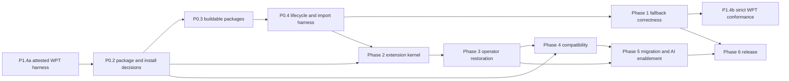

# RxJS Next active project plan

## Executive summary

The project will establish a reliable platform Observable foundation before
expanding the operator catalog or compatibility promises. The user temporarily
prioritized an attested Observable WPT harness ahead of the package and
installation decision. That completed slice adds test infrastructure and a
reviewed failure baseline only; making the fallback conform remains later work.
Package-boundary work now resumes at P0.2. Skills/MCP design remains deferred.

No dates, staffing commitments, or final release version are assigned.

## Status protocol

- `DONE`: completion bar met and evidence recorded.
- `NEXT`: the single active step.
- `PLANNED`: sequenced but not active.
- `BLOCKED`: cannot proceed without a named decision or external change.
- `DEFERRED`: accepted work intentionally not designed or scheduled yet.

Keep exactly one `NEXT` item. When it completes, mark it `DONE`, record
verification in the session log, and move `NEXT` to the earliest unblocked
item.

## Success criteria

- Native Observable is preserved and the fallback is installed only according
  to the approved contract.
- Platform behavior is validated against a pinned specification and selected
  WPT baseline.
- Symbol extension identity, installation, construction, cancellation, typing,
  and packaging conventions are uniform and tested.
- Supported operators are backed by classified RxJS 7 behavioral evidence.
- The compatibility layer has an explicit support matrix and package/type
  boundary.
- Every published entry point builds and passes import/type fixtures in
  supported environments.
- Migration guidance and future AI tools are generated from accepted behavior,
  not prototype assumptions.

## Active queue

### Phase 0 — Foundation and architectural safety rails

| Status    | ID   | Outcome                                                                                                                |
| --------- | ---- | ---------------------------------------------------------------------------------------------------------------------- |
| `DONE`    | P0.1 | Record the charter, current architecture, compatibility policy, decisions, risks, open questions, and AI working rules |
| `NEXT`    | P0.2 | Decide the package map and native-versus-polyfill installation contract                                                |
| `PLANNED` | P0.3 | Restore green builds and coherent public entry points for the selected package map                                     |
| `PLANNED` | P0.4 | Add a native/fallback lifecycle test harness and package-import fixtures                                               |
| `PLANNED` | P0.5 | Pin the first Observable specification and WPT revisions used as the conformance baseline                              |

#### P0.1 completion evidence

- Added the `docs/rxjs-next` document set and root `AGENTS.md`.
- Mapped all current packages and the Symbol extension inventory.
- Verified four unique polyfill tests and one RxJS operator test pass.
- Verified the polyfill package build fails because ambient platform
  declarations are disconnected from the build entry.
- Verified the RxJS package build fails because the root `tshy` export is
  invalid.

#### P0.2 completion bar

Record accepted decisions covering:

- the purpose or removal of `@rxjs/observable`;
- the final conceptual and npm package boundaries for fallback, extensions, and
  compatibility;
- which package owns ambient platform types;
- explicit versus automatic fallback installation;
- behavior when a native constructor or `EventTarget.when` already exists;
- runtime dependency direction;
- root and subpath import side effects;
- supported realm and server-runtime assumptions for initialization.

Update `ARCHITECTURE.md`, `DECISIONS.md`, `OPEN_QUESTIONS.md`, and package-map
diagrams. No implementation is required for this decision step.

#### P0.3 completion bar

- All selected packages build from a clean checkout on a declared Node runtime.
- Root and subpath exports map to existing sources and generated types.
- Runtime dependencies are declared.
- Source tests are excluded from published output unless deliberately shipped.
- Repository metadata points to the correct package paths.
- At least one ESM and one CommonJS import fixture passes for each claimed
  package format.

#### P0.4 completion bar

- One test contract can run against a selected native implementation and the
  fallback.
- It covers first subscribe, concurrent observers, late join, individual abort,
  last-observer abort, restart, completion, error, synchronous reentrancy,
  teardown registration, teardown order, and thrown observer callbacks.
- Package fixtures detect missing initialization, wrong side effects, duplicate
  installation, and type visibility.

#### P0.5 completion bar

- Exact upstream specification and WPT commit identifiers are recorded.
- The relationship between upstream tests and local test modes is documented.
- An update policy and owner are named.
- This step does not require a complete WPT execution pipeline.

### Phase 1 — Platform fallback correctness

| Status    | ID    | Outcome                                                                                                          |
| --------- | ----- | ---------------------------------------------------------------------------------------------------------------- |
| `PLANNED` | P1.1  | Implement the approved native selection and conditional fallback installation                                    |
| `PLANNED` | P1.2  | Bring core subscription, abort, teardown, error-reporting, and `Observable.from` behavior to the pinned baseline |
| `PLANNED` | P1.3  | Bring native platform methods and `EventTarget.when` to the pinned baseline                                      |
| `DONE`    | P1.4a | Build the attested Observable WPT test harness and record its stable current-behavior baseline                   |
| `PLANNED` | P1.4b | Make the fallback pass the pinned Observable WPT suite                                                           |

#### P1.4a completion bar

- WPT is pinned to
  `6a009d73f0d315941b90cac13a9523a2a08c631b`, and only its approved
  Observable dependency closure is vendored byte-for-byte with Git-blob
  provenance and an exact generated URL inventory.
- The ignored execution tree instruments window, dedicated-worker, same-origin
  iframe, and Web IDL coverage without modifying imported WPT sources.
- Every expected URL has exactly one unsuppressible passing attestation proving
  the active constructor, `subscribe`, and `EventTarget.prototype.when` are the
  exact RxJS bundle identities, differ from captured native references, and
  report the expected bundle SHA-256.
- Negative controls prove native leakage, restored native identities, a wrong
  bundle ID, a missing worker/iframe attestation, and allowlisted attestation
  results all fail the independent auditor.
- The official runner, exact Chrome for Testing `150.0.7871.126`, and matching
  driver are checksum-locked and cached so a warm second run needs no network.
- The default `test:wpt` command is a strict conformance gate with readable
  terminal failures. The explicitly named baseline diagnostic distinguishes
  harness/report failures from known Observable behavior failures, and three
  consecutive complete runs must agree before granular expectations are
  accepted.
- Importer, provenance, inventory, realm-pattern, and report-auditor unit tests
  pass; CI uploads raw reports, diffs, logs, inventories, and per-realm
  identities.
- No production source, public API, ambient type, export, runtime dependency,
  installation contract, or compatibility behavior changes.

#### P1.4b completion bar

- `test:wpt` passes against the approved WPT and browser revisions.
- Behavior fixes remain within the accepted native-first installation and
  platform-lifecycle architecture.
- Each obsolete failure expectation is deliberately removed as its behavior is
  corrected.

#### P1.4a completion evidence

- Vendored exactly 29 files under `dom/observable/tentative/` and eight
  source-derived support files: 37 upstream files and 716,874 bytes total.
  Provenance records every Git blob and SHA-256; the generated inventory
  contains only 52 `/dom/observable/tentative/` URLs.
- Verified all 52 URLs run exactly once and all 52 exact-identity attestations
  pass against implementation bundle
  `c03cd03b65e0337e0f73f202602529b87db1c2dfb1271bbd2e6857477c258e2a`.
  Evidence includes dedicated-worker, Web IDL, and four combined
  window/same-origin-iframe attestations covering all nine reviewed child
  realms.
- Recorded granular expectation metadata after three identical complete runs.
  The current non-conforming baseline is 33 `OK`, 15 `ERROR`, and 4 `TIMEOUT`
  top-level results, with 314 `PASS`, 159 `FAIL`, 8 `TIMEOUT`, and 6 `NOTRUN`
  upstream subtests.
- Passed 45 harness unit tests covering import/provenance/inventory/closure,
  realm review, report completeness and classification, stability, and every
  required attestation negative control. The package's four existing source
  tests also pass.
- Passed `wpt:doctor`, `wpt:verify-import`, `test:wpt:baseline`, and
  two further consecutive narrowed-closure runs with
  `RXJS_WPT_OFFLINE=1`. Chrome for Testing and ChromeDriver were both exactly
  `150.0.7871.126`.
- Added blocking path-filtered strict-conformance CI, a scheduled advisory
  latest-Chrome job, cache keys, fixed concurrency/timeouts, and
  always-uploaded raw reports, concise summaries, logs, inventories, and
  per-realm identity evidence.
- Declared Node 24 tooling support and moved both WPT workflow jobs to Node 24;
  import verification, harness tests, doctor, and browser execution work on
  Node `24.12.0` without bypassing the engine check.
- Made no production source, public API, ambient type, export, runtime
  dependency, installation-contract, or compatibility-behavior change.

Phase exit:

- the fallback passes the agreed local lifecycle/conversion suite;
- native preservation is enforced;
- known differences from the pinned specification are listed;
- no main-library work depends on undocumented fallback behavior.

### Phase 2 — Symbol extension kernel

| Status    | ID   | Outcome                                                                                       |
| --------- | ---- | --------------------------------------------------------------------------------------------- |
| `PLANNED` | P2.1 | Decide Symbol identity, versioning, duplicate-install, realm, and collision policy            |
| `PLANNED` | P2.2 | Implement one typed extension installer for static and instance capabilities                  |
| `PLANNED` | P2.3 | Define constructor preservation, input conversion, cancellation, and error-forwarding helpers |
| `PLANNED` | P2.4 | Convert a small representative operator set to the kernel and validate native/fallback parity |

Representative pilot set:

- one native-overlapping synchronous operator such as `map` or `filter`, with
  both the platform string form and RxJS Symbol form tested;
- one RxJS-only synchronous operator such as `scan`;
- one higher-order operator such as `switchMap`;
- one time-based operator such as `timeout`;
- one static factory such as `timer`;
- `pipe` or its approved replacement.

Phase exit:

- the pilot operators share one implementation pattern;
- direct subpath imports are deterministic;
- duplicate installation and type augmentation are tested;
- no string-named RxJS property is added to the platform API;
- the native-overlap pilot proves that the string-named platform method remains
  untouched and the corresponding Symbol-keyed RxJS form coexists with it;
- any additional behavior in the RxJS form is documented and tested.

### Phase 3 — Operator restoration and parity

| Status    | ID   | Outcome                                                                         |
| --------- | ---- | ------------------------------------------------------------------------------- |
| `PLANNED` | P3.1 | Inventory the former RxJS 7 public operator and creation API by migration value |
| `PLANNED` | P3.2 | Create and maintain the compatibility ledger                                    |
| `PLANNED` | P3.3 | Restore operators in small families using the extension kernel                  |
| `PLANNED` | P3.4 | Classify, retain, or rewrite former RxJS 7 tests for each restored family       |

Do not use “all former tests pass” as an unqualified milestone. The gate is that
every supported API has portable or rewritten evidence and every divergence is
explicit.

### Phase 4 — RxJS 7 compatibility product

| Status    | ID   | Outcome                                                                          |
| --------- | ---- | -------------------------------------------------------------------------------- |
| `PLANNED` | P4.1 | Decide the compatibility type, package, conversion, and cancellation contracts   |
| `PLANNED` | P4.2 | Stabilize cold-per-subscription and subscription-facade primitives               |
| `PLANNED` | P4.3 | Implement the approved pipeable operator experience                              |
| `PLANNED` | P4.4 | Add supported subjects, schedulers, testing, and interop by prioritized category |
| `PLANNED` | P4.5 | Publish the compatibility support matrix and representative application fixtures |

Phase exit:

- compatibility is opt-in and visible in imports and types;
- conversions state whether they change sharing or cancellation;
- every support claim maps to tests;
- unsupported categories are documented.

### Phase 5 — Migration experience and AI enablement

| Status     | ID   | Outcome                                                                         |
| ---------- | ---- | ------------------------------------------------------------------------------- |
| `PLANNED`  | P5.1 | Write migration guidance from the compatibility ledger and accepted divergences |
| `PLANNED`  | P5.2 | Validate mechanical and semantic migration steps on representative applications |
| `DEFERRED` | P5.3 | Design the RxJS usage and RxJS 7 migration Skills                               |
| `DEFERRED` | P5.4 | Design MCP capabilities, permissions, packaging, and versioning                 |

AI tools must consume versioned project knowledge and produce reviewable
changes. They must not infer migration safety solely from matching operator
names.

### Phase 6 — Release readiness

| Status    | ID   | Outcome                                                                               |
| --------- | ---- | ------------------------------------------------------------------------------------- |
| `PLANNED` | P6.1 | Finalize version naming, supported environments, support policy, and release channels |
| `PLANNED` | P6.2 | Complete package, type, bundle, performance, and conformance gates                    |
| `PLANNED` | P6.3 | Publish API, compatibility, migration, and contributor documentation                  |
| `PLANNED` | P6.4 | Run pre-release adoption, resolve blockers, and approve the major release             |

## Dependencies

The first standards revision can be pinned while build work proceeds, but
conformance implementation depends on a runnable harness.

## Risk register

| Risk                                                | Impact                                         | Likelihood | Current response                                                                                  |
| --------------------------------------------------- | ---------------------------------------------- | ---------- | ------------------------------------------------------------------------------------------------- |
| Package boundaries remain implicit                  | Rework across every import, type, and test     | High       | P0.2 is restored as the single `NEXT` item                                                        |
| Upstream proposal changes                           | Fallback and native behavior drift             | High       | Pin revisions before conformance claims                                                           |
| Prototype code becomes accidental policy            | Semantics are preserved without review         | High       | Documents distinguish current fact from accepted direction                                        |
| Symbol identity fails with duplicate installs       | Extensions are present under inaccessible keys | High       | P2.1 plus package fixtures                                                                        |
| RxJS 7 suite pressures platform behavior backward   | Native and fallback layers diverge             | High       | Mandatory test classification and separate compatibility layer                                    |
| Compatibility scope becomes unbounded               | Release cannot converge                        | Medium     | Support matrix and prioritized API categories                                                     |
| Global patching fails in hardened realms            | Library cannot initialize                      | Medium     | Decide supported environments and fallback access patterns                                        |
| Tooling is designed before APIs stabilize           | Skills encode obsolete migrations              | Medium     | Skills and MCP design are deferred                                                                |
| Current CI/release infrastructure assumes RxJS 7    | Published artifacts fail despite source tests  | High       | Package-import fixtures and release gates precede expansion                                       |
| WPT runs accidentally exercise native Observable    | False confidence in fallback behavior          | High       | P1.4a exact-identity attestation and an independent, unsuppressible report audit                  |
| WPT/browser setup is too large or network-dependent | Slow or skipped local and CI validation        | Medium     | Vendor only the approved closure and checksum-cache the sparse runner and exact browser artifacts |

## Out of scope until activated

- fixes that make the fallback pass the WPT suite until P1.4b is activated;
- final documentation-site architecture;
- a complete operator priority list;
- final compatibility support percentages;
- Skills/MCP schemas and permissions;
- release dates.

## Session log

### 2026-07-24 — Documentation foundation

- Analyzed branch history, packages, source modules, manifests, tests, and the
  current Observable specification/WPT locations.
- Created the project charter, architecture, compatibility policy, decision
  log, open-question register, active plan, and repository AI guidance.
- Verified the narrow source-test and build baseline recorded under P0.1.
- Set P0.2, package and installation contract decisions, as the only `NEXT`
  step.

### 2026-07-24 — Symbol patching rationale

- Documented why exact Symbol keys make import-time prototype patching safe
  from accidental name collisions.
- Recorded the contrast with RxJS 5 `rxjs/add/operator/*` string-key patching.
- Clarified that `Symbol.for` trades away some collision isolation and requires
  an explicit namespacing decision.

### 2026-07-24 — Dual platform and RxJS operator surface

- Accepted that RxJS exports Symbols for operators such as `map` and `filter`
  even when the platform provides same-familiar-name string methods.
- Recorded `observable.map(project)` as the platform contract and
  `observable[map](project)` as the RxJS contract.
- Allowed the RxJS form to delegate or provide additional functionality while
  requiring the platform method to remain untouched and all differences to be
  documented and tested.

### 2026-07-24 — User-prioritized attested Observable WPT harness

- Recorded the explicit priority change from P0.2 to the test-infrastructure
  slice P1.4a while preserving one `NEXT` item.
- Split harness construction and its current-failure baseline from P1.4b,
  which will later make the fallback pass the strict conformance gate.
- Accepted WPT commit
  `6a009d73f0d315941b90cac13a9523a2a08c631b`, per-realm exact
  implementation attestation, unsuppressible report auditing, and cached pinned
  browser/runner operation.
- Completed P1.4a with the exact 37-file Observable/support closure, 52-URL
  attested inventory, stable granular failure baseline, negative controls, CI
  evidence, and warm offline proof.
- Restored P0.2 as the single `NEXT` item. Strict WPT conformance remains the
  separate planned P1.4b effort.

### 2026-07-24 — Node 24 WPT tooling support

- Expanded the repository development engine declaration to accept Node 24
  while retaining Node 18 and Node 20.
- Moved the blocking and advisory Observable WPT workflows to Node 24.
- Verified the WPT import, unit, doctor, and browser-baseline paths on Node
  `24.12.0` without an engine-check override.
- Kept P0.2 as the single `NEXT` item; final published-package runtime support
  remains an open release decision.

### 2026-07-24 — Strict default WPT command and terminal diagnostics

- Made `yarn test:wpt` and the blocking CI job require all upstream WPT results
  to pass; the current implementation therefore exits nonzero.
- Retained the known-failure comparison only as the explicitly named
  `yarn test:wpt:baseline` harness diagnostic.
- Added progress messages, aggregate status and identity counts, every
  non-passing URL and subtest, and direct artifact paths to terminal output.
- Kept P0.2 as the single `NEXT` item; implementation conformance remains the
  separate planned P1.4b effort.
