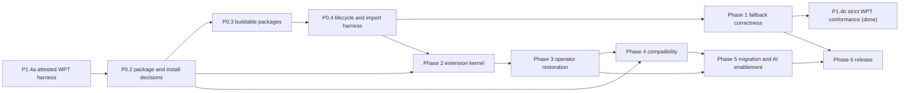

# RxJS Next active project plan

## Executive summary

The project will establish a reliable platform Observable foundation before
expanding the operator catalog or compatibility promises. The user temporarily
prioritized the attested Observable WPT harness and fallback-conformance work
ahead of the package and installation decision. Both slices are complete:
the fallback passes the pinned suite while exact implementation identity is
proved in every tested realm. The portable RxJS 7-to-Next marble-test migration
Skill, its independent vetting, and the classified repository port are also
complete. The user has clarified that preservation in a manifest is not enough:
all cases must become executable parity registrations even when their
capabilities are absent. The exhaustive follow-up is complete: 2,201 physical
test declarations expand to 2,338 uniquely identified registrations, including
parameterized and source-skipped evidence. Package-boundary work resumes at
P0.2. A later user-prioritized runner follow-up also removed expected-failure
quarantine from the default ported command and added live shard progress.
Broader Skills/MCP product design remains deferred.

No dates, staffing commitments, or final release version are assigned.

## Status protocol

- `DONE`: completion bar met and evidence recorded.
- `NEXT`: the single active step.
- `PLANNED`: sequenced but not active.
- `BLOCKED`: cannot proceed without a named decision or external change.
- `DEFERRED`: accepted work intentionally not designed or scheduled yet.

Keep exactly one `NEXT` item. When it completes, mark it `DONE`, record
verification in the session log, and move `NEXT` to the earliest unblocked
item.

## Success criteria

- Native Observable is preserved and the fallback is installed only according
  to the approved contract.
- Platform behavior is validated against a pinned specification and selected
  WPT baseline.
- Symbol extension identity, installation, construction, cancellation, typing,
  and packaging conventions are uniform and tested.
- Supported operators are backed by classified RxJS 7 behavioral evidence.
- The compatibility layer has an explicit support matrix and package/type
  boundary.
- Every published entry point builds and passes import/type fixtures in
  supported environments.
- Migration guidance and future AI tools are generated from accepted behavior,
  not prototype assumptions.

## Active queue

### Phase 0 — Foundation and architectural safety rails

| Status    | ID     | Outcome                                                                                                                |
| --------- | ------ | ---------------------------------------------------------------------------------------------------------------------- |
| `DONE`    | P0.1   | Record the charter, current architecture, compatibility policy, decisions, risks, open questions, and AI working rules |
| `DONE`    | P0.T1  | Design and implement the user-prioritized framework-neutral `@rxjs/test` virtual-time package                          |
| `DONE`    | P0.T2a | Create a portable RxJS 7-to-Next marble-test migration Skill                                                           |
| `DONE`    | P0.T2b | Vet the migration Skill independently before using it on the repository                                                |
| `DONE`    | P0.T2c | Port and classify the RxJS 7 marble-test corpus without repairing production behavior                                  |
| `DONE`    | P0.T2d | Materialize every inventoried marble case as an executable parity-test registration                                    |
| `DONE`    | P0.T2e | Exhaustively convert remaining runnable RxJS 7 marble evidence and expand capability mappings                          |
| `DONE`    | P0.T2f | Make the default ported-test gate strict and progress-visible                                                          |
| `NEXT`    | P0.2   | Decide the package map and native-versus-polyfill installation contract                                                |
| `PLANNED` | P0.3   | Restore green builds and coherent public entry points for the selected package map                                     |
| `PLANNED` | P0.4   | Add a native/fallback lifecycle test harness and package-import fixtures                                               |
| `PLANNED` | P0.5   | Pin the first Observable specification and WPT revisions used as the conformance baseline                              |

#### P0.1 completion evidence

- Added the `docs/rxjs-next` document set and root `AGENTS.md`.
- Mapped all current packages and the Symbol extension inventory.
- Verified four unique polyfill tests and one RxJS operator test pass.
- Verified the polyfill package build fails because ambient platform
  declarations are disconnected from the build entry.
- Verified the RxJS package build fails because the root `tshy` export is
  invalid.

#### P0.T1 completion evidence

- Added the framework-neutral `@rxjs/test` package and public `rxTest`
  function; no scheduler instance or manual scheduler mode is exposed.
- Added marble parsing, async virtual-time controls, default and configurable
  assertions, and distinct `cold`, `hot`, and platform `observable` sources.
- Isolated marble grammar in a pure internal parser with direct unit coverage,
  independently of the virtual-time runtime.
- Virtualized the supported host timing and clock APIs with exact restoration,
  same-realm serialization, pending-work diagnostics, and task/time guards.
- Passed 66 focused behavior, parser, and cleanup tests, lint, TypeScript source checks,
  Nx build/test targets, the multi-dialect package build, strict declaration
  coexistence with the Observable polyfill, and built ESM/CommonJS imports.
- Recorded D-012 and the complete contract in `TESTING_DESIGN.md`.

#### P0.T2a completion bar

- A repo-committed Skill teaches developers to migrate RxJS 7 TestScheduler
  marble cases to `rxTest`, ColdObservable, and the platform Observable.
- The Skill preserves the caller's test framework, requires the global
  Observable for platform cases, and separates mechanical changes from
  semantic review.
- The Skill and bundled helpers contain no RxJS-repository paths, branches,
  commits, Git operations, or package-internal assumptions.

#### P0.T2a completion evidence

- Added the repo-committed `rxjs-next-marble-migration` Skill with concise
  workflow guidance, conversion and lifecycle references, examples, and a
  migration-report template.
- Added dependency-free file analysis, duplicate-candidate detection,
  review-flag detection, and a portability checker that accepts ordinary
  filesystem paths without source-control behavior.
- Passed helper tests, the portability scan across all nine Skill files, the
  Skill structural validator, and temporary `.skill` packaging.

#### P0.T2b completion bar

- Skill structure, links, examples, helper scripts, and packaging validate.
- Independent skill evaluation has no unresolved blocking or fix-first finding.
- Consumer-style fixtures cover synchronous, higher-order, timed, cancellation,
  duplicate, missing-operator, sharing-divergence, and obsolete-harness cases.
- No repository marble-test port begins before this bar is met.

#### P0.T2b completion evidence

- Exercised the dependency-free analyzer in a temporary consumer-style project
  across synchronous, higher-order, timed, cancellation, duplicate,
  missing-operator, sharing-divergence, and obsolete scheduler-internal cases.
- Parsed representative migrated `rxTest` cases for framework preservation,
  awaited flush, Symbol invocation, and global Observable construction.
- Corrected the one initial evaluation warning by making the Skill trigger
  sentence explicit.
- Passed the structural validator and independent plugin evaluation at 100/100
  with no failures, warnings, or fix-first recommendations.

#### P0.T2c completion bar

- Every inventoried RxJS 7 marble case has exactly one recorded disposition:
  active, expected failure, missing API, deduplicated, or unsupported/obsolete.
- Shared definitions can run in isolated ColdObservable, polyfill, and
  native-if-present modes without importing the platform constructor.
- Repository notes reconcile source counts, duplicate provenance, known
  failures, missing APIs, and semantic divergences.
- Production Observable, operator, and compatibility implementations are not
  changed to make the port pass.

#### P0.T2c completion evidence

- Read the production `7.x` ref without checking it out and pinned
  `e5351d02e225e275ac0e497c7b66eaa5f0c88791` only in the repository port
  records.
- Reconciled all 2,146 inventoried cases as 333 active, 422 expected failure,
  1,251 missing API, 4 deduplicated, and 136 unsupported/obsolete.
- Added a reproducible generated manifest retaining original provenance,
  converted definitions, classifications, reasons, capability gaps, and exact
  duplicate links.
- Added isolated cold, polyfill, native-if-present, and per-mode audit commands.
  Normal cold and polyfill each register all 2,146 source cases; native
  detection skips explicitly in the current Node realm. Cold audit records 335
  passes and 1,811 failures; polyfill audit records 340 passes and 1,806
  failures.
- Recorded the platform shared/ref-counted lifecycle separately from
  compatibility-cold expectations and required platform cases to construct
  from the ambient Observable.
- Added D-013 and the detailed port notes. No production implementation was
  changed, and P0.2 is restored as the single `NEXT` item.

#### P0.T2d completion bar

- All 2,146 inventoried source cases are registered by the parity harness,
  including missing APIs, scheduler/harness dependencies, deduplicated
  provenance, and obsolete coverage.
- Missing capabilities fail with explicit source-linked capability diagnostics
  rather than being omitted from test collection.
- The raw parity command reports the complete pass/fail/duplicate disposition
  without changing production operators or compatibility behavior.
- Normal and platform modes remain bounded; any required sharding or process
  isolation is part of the harness rather than a reason to omit cases.
- Port notes, verification evidence, and the generated manifest agree on the
  registered total.

#### P0.T2d completion evidence

- Preserved a mechanically generated executable program for every manifest
  entry, including all four deduplicated source locations and all 136
  scheduler/harness-dependent cases.
- Registered all 2,146 cases in cold, polyfill, and native-if-present modes.
  Mode-specific pass baselines execute verified cases normally; every other
  non-duplicate case remains an expected-failure parity gate until its exact
  capability and behavior are available.
- Made missing APIs and unavailable harness facilities fail with explicit
  source ID, original claim, and capability/rewrite reason. The raw cold audit
  reports 1,811 failures and 335 passes; the polyfill audit reports 1,806
  failures and 340 passes.
- Added role-aware import mapping so
  `source.pipe(operator(arg1, arg2))` invokes its exact or unified Next Symbol
  as `source[targetSymbol](...adaptedArgs)`, separately from static factory
  Symbols, ambient-platform constructions, and standalone values.
- Added one machine-readable capability registry and the generated
  `RxJS-7-parity.md` map covering 113 RxJS 7 operators and 34 creation/utility
  functions, including every missing exact surface and marble-case usage
  counts.
- Passed the complete 2,146-registration cold and polyfill gates, native
  auto-detection, manifest validation, parity-document freshness, and
  reproducible generation. No production source was changed by the port. P0.2
  is restored as the single `NEXT` item.

#### P0.T2e completion bar

- Re-audit every unsupported or missing-capability disposition against the
  current RxJS Next source and platform Observable surface.
- Prefer an executable mechanical conversion for every source-linked claim,
  including helper-generated and scheduler-shaped cases, while preserving
  explicit failures for unavailable behavior.
- Run the complete cold and polyfill inventories plus native auto-detection and
  raw audits without changing production operators to satisfy expectations.
- Regenerate the capability map, parity document, dispositions, mode
  baselines, and notes from the pinned read-only RxJS 7 source revision.

#### P0.T2e completion evidence

- Reconciled 2,201 physical declarations into 2,338 unique registrations,
  including 169 parameterized variants and all four source-skipped cases.
- Preserved an executable converted program for every registration. Only 11
  cases remain classified unsupported/obsolete, and each produces an explicit
  source-linked diagnostic rather than disappearing from the suite.
- Expanded the executable capability registry to 51 operator mappings, 18
  factory mappings, and 11 standalone values, including exact, partial, and
  unified mappings for the newly available APIs.
- Added unique case-ID baselines, complete sharded audit merging, ambient
  native-constructor identity checks, and five dedicated platform lifecycle
  cases.
- Passed the complete 2,338-case normal cold and polyfill gates. Raw audits
  recorded 432 cold passes with 1,906 failures and 436 polyfill passes with
  1,902 failures. Native mode skipped explicitly in the current Node realm.
- Regenerated the manifest, parity map, reviewed baselines, and port notes
  without changing production source.

#### P0.T2f completion bar

- Every applicable ported registration uses ordinary test semantics in the
  default cold, polyfill, and native-if-present modes.
- Recorded pass baselines cannot skip, quarantine, or invert a default test
  result.
- The launcher continues through every shard, reports visible progress while
  they run, expands every failed shard's diagnostics, and exits nonzero when
  any test fails.
- No production Observable, operator, or compatibility behavior changes.

#### P0.T2f completion evidence

- Removed the mode-baseline registration branch and all `it.fails` use from the
  ported suite; all applicable manifest cases now register with ordinary
  `it(...)`.
- Added one in-place interactive status line, refreshed on shard completion and
  every ten seconds, showing completed, running, queued, failed, and elapsed
  counts. Non-interactive output emits only a final progress summary.
- Regenerated the manifest so now-visible failure reasons describe failing
  parity evidence without claiming those tests remain quarantined.
- Ran the default `test:ported` command through all 16 cold and all 16 polyfill
  shards. Cold completed in 84 seconds and polyfill in 94 seconds; every shard
  exposed failures, all failed-shard diagnostics were expanded, and the command
  returned exit code 1 as intended.
- Preserved the one proven non-yielding converted program as a registered,
  immediate explicit failure so it cannot freeze its shard. Production source
  was unchanged.

#### P0.2 completion bar

Record accepted decisions covering:

- the purpose or removal of `@rxjs/observable`;
- the final conceptual and npm package boundaries for fallback, extensions, and
  compatibility;
- which package owns ambient platform types;
- explicit versus automatic fallback installation;
- behavior when a native constructor or `EventTarget.when` already exists;
- runtime dependency direction;
- root and subpath import side effects;
- supported realm and server-runtime assumptions for initialization.

Update `ARCHITECTURE.md`, `DECISIONS.md`, `OPEN_QUESTIONS.md`, and package-map
diagrams. No implementation is required for this decision step.

#### P0.3 completion bar

- All selected packages build from a clean checkout on a declared Node runtime.
- Root and subpath exports map to existing sources and generated types.
- Runtime dependencies are declared.
- Source tests are excluded from published output unless deliberately shipped.
- Repository metadata points to the correct package paths.
- At least one ESM and one CommonJS import fixture passes for each claimed
  package format.

#### P0.4 completion bar

- One test contract can run against a selected native implementation and the
  fallback.
- It covers first subscribe, concurrent observers, late join, individual abort,
  last-observer abort, restart, completion, error, synchronous reentrancy,
  teardown registration, teardown order, and thrown observer callbacks.
- Package fixtures detect missing initialization, wrong side effects, duplicate
  installation, and type visibility.

#### P0.5 completion bar

- Exact upstream specification and WPT commit identifiers are recorded.
- The relationship between upstream tests and local test modes is documented.
- An update policy and owner are named.
- This step does not require a complete WPT execution pipeline.

### Phase 1 — Platform fallback correctness

| Status    | ID    | Outcome                                                                                                          |
| --------- | ----- | ---------------------------------------------------------------------------------------------------------------- |
| `PLANNED` | P1.1  | Implement the approved native selection and conditional fallback installation                                    |
| `PLANNED` | P1.2  | Bring core subscription, abort, teardown, error-reporting, and `Observable.from` behavior to the pinned baseline |
| `PLANNED` | P1.3  | Bring native platform methods and `EventTarget.when` to the pinned baseline                                      |
| `DONE`    | P1.4a | Build the attested Observable WPT test harness and record its stable current-behavior baseline                   |
| `DONE`    | P1.4b | Make the fallback pass the pinned Observable WPT suite                                                           |

#### P1.4a completion bar

- WPT is pinned to
  `6a009d73f0d315941b90cac13a9523a2a08c631b`, and only its approved
  Observable dependency closure is vendored byte-for-byte with Git-blob
  provenance and an exact generated URL inventory.
- The ignored execution tree instruments window, dedicated-worker, same-origin
  iframe, and Web IDL coverage without modifying imported WPT sources.
- Every expected URL has exactly one unsuppressible passing attestation proving
  the active constructor, `subscribe`, and `EventTarget.prototype.when` are the
  exact RxJS bundle identities, differ from captured native references, and
  report the expected bundle SHA-256.
- Negative controls prove native leakage, restored native identities, a wrong
  bundle ID, a missing worker/iframe attestation, and allowlisted attestation
  results all fail the independent auditor.
- The official runner, exact Chrome for Testing `150.0.7871.126`, and matching
  driver are checksum-locked and cached so a warm second run needs no network.
- The default `test:wpt` command is a strict conformance gate with readable
  terminal failures. The explicitly named baseline diagnostic distinguishes
  harness/report failures from known Observable behavior failures, and three
  consecutive complete runs must agree before granular expectations are
  accepted.
- Importer, provenance, inventory, realm-pattern, and report-auditor unit tests
  pass; CI uploads raw reports, diffs, logs, inventories, and per-realm
  identities.
- No production source, public API, ambient type, export, runtime dependency,
  installation contract, or compatibility behavior changes.

#### P1.4b completion bar

- `test:wpt` passes against the approved WPT and browser revisions.
- Behavior fixes remain within the accepted native-first installation and
  platform-lifecycle architecture.
- Each obsolete failure expectation is deliberately removed as its behavior is
  corrected.

#### P1.4b completion evidence

- Corrected the platform lifecycle without introducing RxJS 7 cold semantics:
  subscriber closure now preserves abort reasons, aborts before LIFO teardown,
  executes late teardowns immediately, retains shared/ref-counted production,
  and reports late or unhandled errors through the platform-shaped global path.
- Added the non-constructible global `Subscriber` surface and required Web IDL
  names, tags, descriptors, argument checks, and detached-realm behavior.
- Corrected `Observable.from` conversion order and Observable identity,
  Promise completion, sync/async iterator acquisition, close reasons, protocol
  errors, pending-result behavior, and microtask timing. The explicit async
  iterator loop documents why `for await...of` cannot preserve these observable
  protocol details.
- Corrected pinned platform behavior in `takeUntil`, `take`, `drop`, `every`,
  `reduce`, `inspect`, and Promise-returning consumers without adding
  string-named RxJS compatibility behavior.
- Added a scoped abort-algorithm bridge because public `abort` event listeners
  run too late to model the DOM-standard cancellation order. Signals without
  registered Observable work continue through the captured native abort
  implementation.
- Fixed generated attestation registration so upstream `setup()` properties
  are established before the identity subtest starts the reporting protocol.
  The vendored WPT sources remain byte-for-byte unchanged.
- Passed `yarn test:wpt` with 52/52 URLs `OK`, 525/525 upstream subtests
  `PASS`, and 52/52 exact-identity attestations in Chrome for Testing
  `150.0.7871.126`. The passing implementation bundle for that run was
  `778edfac15639cd4531a590cd36450ad273a0a692df2e8a1436564dca3cb89f8`.
- Regenerated the baseline after three further identical complete attested
  runs, deleting all 25 obsolete failure `.ini` files. The package's 49 focused
  tests and pinned-import verification pass.
- Reconfirmed the existing P0.3 blocker: package build and lint still fail
  because the ambient declarations are disconnected from the package and root
  TypeScript configurations. No package-boundary work was folded into this
  conformance slice.

#### P1.4a completion evidence

- Vendored exactly 29 files under `dom/observable/tentative/` and eight
  source-derived support files: 37 upstream files and 716,874 bytes total.
  Provenance records every Git blob and SHA-256; the generated inventory
  contains only 52 `/dom/observable/tentative/` URLs.
- Verified all 52 URLs run exactly once and all 52 exact-identity attestations
  pass against implementation bundle
  `c03cd03b65e0337e0f73f202602529b87db1c2dfb1271bbd2e6857477c258e2a`.
  Evidence includes dedicated-worker, Web IDL, and four combined
  window/same-origin-iframe attestations covering all nine reviewed child
  realms.
- Recorded the initial granular expectation metadata after three identical
  complete runs. That pre-P1.4b baseline was 33 `OK`, 15 `ERROR`, and 4
  `TIMEOUT` top-level results, with 314 `PASS`, 159 `FAIL`, 8 `TIMEOUT`, and 6
  `NOTRUN` reported upstream subtests.
- Passed 45 harness unit tests covering import/provenance/inventory/closure,
  realm review, report completeness and classification, stability, and every
  required attestation negative control. The package's four existing source
  tests also pass.
- Passed `wpt:doctor`, `wpt:verify-import`, `test:wpt:baseline`, and
  two further consecutive narrowed-closure runs with
  `RXJS_WPT_OFFLINE=1`. Chrome for Testing and ChromeDriver were both exactly
  `150.0.7871.126`.
- Added blocking path-filtered strict-conformance CI, a scheduled advisory
  latest-Chrome job, cache keys, fixed concurrency/timeouts, and
  always-uploaded raw reports, concise summaries, logs, inventories, and
  per-realm identity evidence.
- Declared Node 24 tooling support and moved both WPT workflow jobs to Node 24;
  import verification, harness tests, doctor, and browser execution work on
  Node `24.12.0` without bypassing the engine check.
- Made no production source, public API, ambient type, export, runtime
  dependency, installation-contract, or compatibility-behavior change.

Phase exit:

- the fallback passes the agreed local lifecycle/conversion suite;
- native preservation is enforced;
- known differences from the pinned specification are listed;
- no main-library work depends on undocumented fallback behavior.

### Phase 2 — Symbol extension kernel

| Status    | ID   | Outcome                                                                                       |
| --------- | ---- | --------------------------------------------------------------------------------------------- |
| `PLANNED` | P2.1 | Decide Symbol identity, versioning, duplicate-install, realm, and collision policy            |
| `PLANNED` | P2.2 | Implement one typed extension installer for static and instance capabilities                  |
| `PLANNED` | P2.3 | Define constructor preservation, input conversion, cancellation, and error-forwarding helpers |
| `PLANNED` | P2.4 | Convert a small representative operator set to the kernel and validate native/fallback parity |

Representative pilot set:

- one native-overlapping synchronous operator such as `map` or `filter`, with
  both the platform string form and RxJS Symbol form tested;
- one RxJS-only synchronous operator such as `scan`;
- one higher-order operator such as `switchMap`;
- one time-based operator such as `timeout`;
- one static factory such as `timer`;
- `pipe` or its approved replacement.

Phase exit:

- the pilot operators share one implementation pattern;
- direct subpath imports are deterministic;
- duplicate installation and type augmentation are tested;
- no string-named RxJS property is added to the platform API;
- the native-overlap pilot proves that the string-named platform method remains
  untouched and the corresponding Symbol-keyed RxJS form coexists with it;
- any additional behavior in the RxJS form is documented and tested.

### Phase 3 — Operator restoration and parity

| Status    | ID   | Outcome                                                                         |
| --------- | ---- | ------------------------------------------------------------------------------- |
| `PLANNED` | P3.1 | Inventory the former RxJS 7 public operator and creation API by migration value |
| `PLANNED` | P3.2 | Create and maintain the compatibility ledger                                    |
| `PLANNED` | P3.3 | Restore operators in small families using the extension kernel                  |
| `PLANNED` | P3.4 | Classify, retain, or rewrite former RxJS 7 tests for each restored family       |

Do not use “all former tests pass” as an unqualified milestone. The gate is that
every supported API has portable or rewritten evidence and every divergence is
explicit.

### Phase 4 — RxJS 7 compatibility product

| Status    | ID   | Outcome                                                                               |
| --------- | ---- | ------------------------------------------------------------------------------------- |
| `PLANNED` | P4.1 | Decide the compatibility type, package, conversion, and cancellation contracts        |
| `PLANNED` | P4.2 | Stabilize cold-per-subscription and subscription-facade primitives                    |
| `PLANNED` | P4.3 | Implement the approved pipeable operator experience                                   |
| `PLANNED` | P4.4 | Add supported subjects, compatibility schedulers, and interop by prioritized category |
| `PLANNED` | P4.5 | Publish the compatibility support matrix and representative application fixtures      |

Phase exit:

- compatibility is opt-in and visible in imports and types;
- conversions state whether they change sharing or cancellation;
- every support claim maps to tests;
- unsupported categories are documented.

### Phase 5 — Migration experience and AI enablement

| Status     | ID   | Outcome                                                                         |
| ---------- | ---- | ------------------------------------------------------------------------------- |
| `PLANNED`  | P5.1 | Write migration guidance from the compatibility ledger and accepted divergences |
| `PLANNED`  | P5.2 | Validate mechanical and semantic migration steps on representative applications |
| `DEFERRED` | P5.3 | Design the broader RxJS usage/migration Skill portfolio and distribution        |
| `DEFERRED` | P5.4 | Design MCP capabilities, permissions, packaging, and versioning                 |

AI tools must consume versioned project knowledge and produce reviewable
changes. They must not infer migration safety solely from matching operator
names.

### Phase 6 — Release readiness

| Status    | ID   | Outcome                                                                               |
| --------- | ---- | ------------------------------------------------------------------------------------- |
| `PLANNED` | P6.1 | Finalize version naming, supported environments, support policy, and release channels |
| `PLANNED` | P6.2 | Complete package, type, bundle, performance, and conformance gates                    |
| `PLANNED` | P6.3 | Publish API, compatibility, migration, and contributor documentation                  |
| `PLANNED` | P6.4 | Run pre-release adoption, resolve blockers, and approve the major release             |

## Dependencies

The first standards revision can be pinned while build work proceeds, but
conformance implementation depends on a runnable harness.

## Risk register

| Risk                                                | Impact                                         | Likelihood | Current response                                                                                  |
| --------------------------------------------------- | ---------------------------------------------- | ---------- | ------------------------------------------------------------------------------------------------- |
| Package boundaries remain implicit                  | Rework across every import, type, and test     | High       | P0.2 is restored as the single `NEXT` item                                                        |
| Upstream proposal changes                           | Fallback and native behavior drift             | High       | Pin revisions before conformance claims                                                           |
| Prototype code becomes accidental policy            | Semantics are preserved without review         | High       | Documents distinguish current fact from accepted direction                                        |
| Symbol identity fails with duplicate installs       | Extensions are present under inaccessible keys | High       | P2.1 plus package fixtures                                                                        |
| RxJS 7 suite pressures platform behavior backward   | Native and fallback layers diverge             | High       | Mandatory test classification and separate compatibility layer                                    |
| Compatibility scope becomes unbounded               | Release cannot converge                        | Medium     | Support matrix and prioritized API categories                                                     |
| Global patching fails in hardened realms            | Library cannot initialize                      | Medium     | Decide supported environments and fallback access patterns                                        |
| Tooling is designed before APIs stabilize           | Skills encode obsolete migrations              | Medium     | The portable marble Skill is vetted; broader Skill/MCP distribution remains deferred              |
| Current CI/release infrastructure assumes RxJS 7    | Published artifacts fail despite source tests  | High       | Package-import fixtures and release gates precede expansion                                       |
| WPT runs accidentally exercise native Observable    | False confidence in fallback behavior          | High       | P1.4a exact-identity attestation and an independent, unsuppressible report audit                  |
| WPT/browser setup is too large or network-dependent | Slow or skipped local and CI validation        | Medium     | Vendor only the approved closure and checksum-cache the sparse runner and exact browser artifacts |

## Out of scope until activated

- final documentation-site architecture;
- a complete operator priority list;
- final compatibility support percentages;
- Skills/MCP schemas and permissions;
- release dates.

## Session log

### 2026-07-24 — Documentation foundation

- Analyzed branch history, packages, source modules, manifests, tests, and the
  current Observable specification/WPT locations.
- Created the project charter, architecture, compatibility policy, decision
  log, open-question register, active plan, and repository AI guidance.
- Verified the narrow source-test and build baseline recorded under P0.1.
- Set P0.2, package and installation contract decisions, as the only `NEXT`
  step.

### 2026-07-24 — Symbol patching rationale

- Documented why exact Symbol keys make import-time prototype patching safe
  from accidental name collisions.
- Recorded the contrast with RxJS 5 `rxjs/add/operator/*` string-key patching.
- Clarified that `Symbol.for` trades away some collision isolation and requires
  an explicit namespacing decision.

### 2026-07-24 — Dual platform and RxJS operator surface

- Accepted that RxJS exports Symbols for operators such as `map` and `filter`
  even when the platform provides same-familiar-name string methods.
- Recorded `observable.map(project)` as the platform contract and
  `observable[map](project)` as the RxJS contract.
- Allowed the RxJS form to delegate or provide additional functionality while
  requiring the platform method to remain untouched and all differences to be
  documented and tested.

### 2026-07-24 — User-prioritized attested Observable WPT harness

- Recorded the explicit priority change from P0.2 to the test-infrastructure
  slice P1.4a while preserving one `NEXT` item.
- Split harness construction and its current-failure baseline from P1.4b,
  which will later make the fallback pass the strict conformance gate.
- Accepted WPT commit
  `6a009d73f0d315941b90cac13a9523a2a08c631b`, per-realm exact
  implementation attestation, unsuppressible report auditing, and cached pinned
  browser/runner operation.
- Completed P1.4a with the exact 37-file Observable/support closure, 52-URL
  attested inventory, stable granular failure baseline, negative controls, CI
  evidence, and warm offline proof.
- Restored P0.2 as the single `NEXT` item. Strict WPT conformance remains the
  separate planned P1.4b effort.

### 2026-07-24 — Node 24 WPT tooling support

- Expanded the repository development engine declaration to accept Node 24
  while retaining Node 18 and Node 20.
- Moved the blocking and advisory Observable WPT workflows to Node 24.
- Verified the WPT import, unit, doctor, and browser-baseline paths on Node
  `24.12.0` without an engine-check override.
- Kept P0.2 as the single `NEXT` item; final published-package runtime support
  remains an open release decision.

### 2026-07-24 — Strict default WPT command and terminal diagnostics

- Made `yarn test:wpt` and the blocking CI job require all upstream WPT results
  to pass; the current implementation therefore exits nonzero.
- Retained the known-failure comparison only as the explicitly named
  `yarn test:wpt:baseline` harness diagnostic.
- Added progress messages, aggregate status and identity counts, every
  non-passing URL and subtest, and direct artifact paths to terminal output.
- Kept P0.2 as the single `NEXT` item; implementation conformance remains the
  separate planned P1.4b effort.

### 2026-07-24 — Pinned Observable WPT conformance

- Temporarily moved `NEXT` from P0.2 to P1.4b at the user's direction, fixed
  only the Observable and `EventTarget.prototype.when` fallback, completed
  P1.4b, and restored P0.2 as the single `NEXT` item.
- Audited the harness before changing behavior: all 52 disposable realms used
  the exact bundled fallback constructor, `subscribe`, and `when` identities;
  no native implementation or later overwrite explained the failures.
- Corrected Subscriber lifecycle, abort/teardown ordering, error reporting,
  detached realms, Web IDL shape, platform input conversion, iterator
  protocols, Promise consumers, and the small set of platform operators
  exposed by the pinned suite.
- Kept the async-iterator conversion as an explicit pull loop and documented
  why `for await...of` cannot express the required acquisition, close-reason,
  timing, and pending-result semantics.
- Corrected generated attestation timing after discovering that an early
  completed identity subtest caused upstream `setup()` options to be ignored.
  No vendored WPT source was edited.
- Passed the pinned strict suite with 52/52 URLs, 525/525 upstream subtests, and
  52/52 exact-identity attestations, then recorded three additional identical
  runs and removed every obsolete failure expectation.
- Passed all 49 package tests and pinned-import verification. Reconfirmed,
  without expanding scope, the documented P0.3 package build/lint configuration
  failure.

### 2026-07-24 — Framework-neutral RxJS testing package

- User-prioritized and completed P0.T1 without changing the active Observable
  acquisition contract still queued at P0.2.
- Added the `@rxjs/test` package with `rxTest`, async virtual-time controls,
  marble assertions, and separate `cold`, `hot`, and platform `observable`
  source models.
- Virtualized timers, animation and idle callbacks, Node immediates and timer
  handles, `AbortSignal.timeout`, clocks, queued microtasks, and `reportError`;
  every patch is restored after success or failure.
- Added the accepted testing design and D-012, plus architecture,
  compatibility, and open-question updates.
- Passed 66 focused tests, lint, TypeScript checks, Nx build/test targets, the
  multi-dialect package build, strict declaration coexistence with the
  Observable polyfill, and built ESM/CommonJS imports. P0.2 remains the single
  `NEXT` item.

### 2026-07-24 — Standalone marble parser follow-up

- Renamed the internal parser boundary to `marble-parser.ts` and kept it free
  of virtual-clock, host, Observable, and assertion dependencies.
- Added 33 direct unit cases for alignment whitespace, duration conversion,
  message diagrams, synchronous groups, hot carets, subscription diagrams,
  time diagrams, animation/idle timing plans, Unicode markers, and invalid
  grammar.
- Locked the alignment example to the source column of `^` and documented the
  difference between source-only spacing and ignored in-string padding.
- Kept the parser internal so this implementation improvement does not create
  an unreviewed public subpath; P0.2 remains the single `NEXT` item.

### 2026-07-25 — RxJS 7 marble-test migration Skill and classified port

- Temporarily moved `NEXT` from P0.2 through the user-ordered Skill creation,
  independent vetting, and repository port steps, advancing only after each
  completion bar passed.
- Added the portable `rxjs-next-marble-migration` Skill with framework-neutral
  conversion guidance, lifecycle classifications, examples, reporting, and
  dependency-free analysis and portability helpers.
- Passed helper fixtures, portability checks, structural validation, temporary
  packaging, and independent plugin evaluation at 100/100 with no blocking or
  fix-first findings.
- Read the production `7.x` ref without checking it out, pinned
  `e5351d02e225e275ac0e497c7b66eaa5f0c88791`, and reconciled all 2,146
  inventoried marble cases into one generated disposition ledger.
- Added isolated cold, polyfill, native-if-present, and raw-audit modes. The
  normal cold and polyfill gates pass; the current Node native mode skips
  explicitly; cold and polyfill audits expose their complete mode-specific
  implementation, capability, conversion, and lifecycle mismatches without
  repairing production behavior.
- Recorded D-013, testing and compatibility updates, and complete port notes.
  Restored P0.2 as the single `NEXT` item.

### 2026-07-25 — Complete executable parity registration and API map

- Reopened the user-prioritized marble port after clarifying that manifest-only
  preservation was insufficient for missing capabilities.
- Materialized all 2,146 source cases as cold test registrations and retained
  executable converted programs for every disposition.
- Corrected the import-role mapper so pipeable operators resolve to exact
  or explicitly unified instance Symbols while creation functions resolve
  independently to static Symbols or ambient-platform constructions.
- Added explicit missing-capability and unavailable-harness failures, plus
  Vitest argument pass-through for focused audits.
- Generated `RxJS-7-parity.md` from the pinned RxJS 7 public indexes and the
  shared machine-readable registry: 113 pipeable operators and 34
  creation/utility functions with current mappings, case counts, partial
  analogues, and missing status.
- Passed all 2,146 normal cold and polyfill source registrations, with four
  exact duplicates skipped in each normal mode. The raw cold audit reports
  1,811 failures and 335 passes; the polyfill audit reports 1,806 failures and
  340 passes. Native mode skips honestly in the current Node realm.
- Added executable unified mappings, including
  `bufferCount(size) → source[buffer]({ maxSize: size })`, and retained
  unsupported overloads as failing parity evidence.
- Restored P0.2 as the single `NEXT` item without changing production source.

### 2026-07-25 — Exhaustive parameterized marble conversion

- Re-audited the pinned source with an AST-based declaration and helper
  expander. The earlier 2,146-case inventory omitted parameterized variants and
  source-skipped evidence; the authoritative inventory is now 2,338
  registrations from 2,201 physical declarations.
- Expanded all loop- and helper-declared variants, including 117 `share`
  configurations, 48 multicasting deprecation equivalents, and four buffer
  cases. All four source-skipped tests remain executable parity evidence.
- Reduced unsupported/obsolete classification from 136 to 11 without guessing
  behavior. The remaining cases protect scheduler-private parser/queue state
  or depend on `phonyMarbelize`.
- Expanded executable API mappings, corrected overload guards, introduced
  unique case-ID baselines and strict sharded audit merging, and protected
  native constructor identity before extension loading.
- Passed both 2,338-registration normal gates and complete cold/polyfill raw
  audits. No production source was changed to satisfy an old expectation.
- Marked P0.T2e complete and restored P0.2 as the single `NEXT` item.

### 2026-07-25 — Ported-test console follow-up

- Replaced per-case success output from normal ported-test commands with a
  concise per-mode summary and an unmistakable final `PASS` or `FAIL`.
- Kept reviewed parity passes and quarantined known gaps separately visible so
  a green harness result does not imply full RxJS 7 behavioral parity.
- Preserved expanded diagnostics for failed shards and direct Vitest reporter
  output when explicit Vitest arguments are supplied.
- Kept P0.2 as the single `NEXT` item.

### 2026-07-25 — Strict ported-test execution and live progress

- Temporarily reprioritized the user-requested P0.T2f runner follow-up and
  restored P0.2 as the single `NEXT` item after completing it.
- Removed expected-failure quarantine from every applicable ported
  registration; recorded baselines remain evidence only.
- Regenerated harness diagnostics to remove stale quarantine wording without
  changing any disposition or converted program.
- Added an in-place shard-completion and heartbeat status so a slow or stalled
  shard remains visible without scrolling the terminal.
- Verified the default cold and polyfill run completed every shard, expanded
  the failures, and returned nonzero without changing production behavior.

### 2026-07-25 — In-place ported-test progress

- Replaced newline-per-update progress with one interactive status line that is
  cleared and redrawn on shard completion and heartbeat refresh.
- Bounded redirected and CI output to one final progress summary.
- Verified an interactive cold run completed all 16 shards in 87 seconds while
  rewriting one progress row, then expanded every failure and returned exit
  code 1 as intended.
- Kept P0.2 as the single `NEXT` item.
