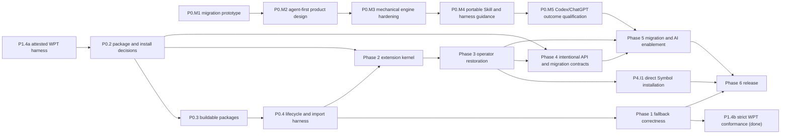

# RxJS Next active project plan

## Executive summary

The project will establish a reliable platform Observable foundation before
expanding the operator catalog and migration promises. The user temporarily
prioritized the attested Observable WPT harness and fallback-conformance work
ahead of the package and installation decision. Both slices are complete:
the fallback passes every pinned Observable WPT while exact implementation
identity is proved in every tested realm. D-045 supersedes D-042 and requires
an explicit `Subscriber.next` argument, including `next(undefined)` for a
platform `Subscriber<void>`. The portable RxJS 7-to-Next
marble-test migration
Skill, its independent vetting, and the classified repository port are also
complete. The user has clarified that preservation in a manifest is not enough:
all cases must become executable parity registrations even when their
capabilities are absent. The exhaustive follow-up is complete: 2,201 physical
test declarations expand to 2,338 uniquely identified registrations, including
parameterized and source-skipped evidence. The user has now temporarily
prioritized and completed P0.T3: the durable failure ledger retains every
original failure, all 2,338 registrations pass in cold and polyfill modes, and
the strict RxJS unit gate was green against the artifact then in use. P0.3
later exposed that the focused portion had consumed a stale polyfill build.
P0.4 has reconciled that evidence with one reusable lifecycle contract that
runs against the packaged fallback and a browser-native implementation, and
has completed the package-import safety fixtures. P0.2 has now accepted
the three-package map,
conditional per-realm fallback contract, and migration-over-emulation
direction. P0.3 has now implemented those package decisions, restored clean
publication builds, and added the required import/realm evidence. P0.5 records
the written specification reference, executable WPT pin, maintainer-owned
update policy, and complete all-pass gate. A later
user-prioritized runner follow-up removed expected-failure quarantine. P0.DX4
replaced that custom dynamic launcher and shard renderer with real Vitest files
and stock reporting. The user then clarified that those files must be ordinary
owned migration results rather than generator-owned artifacts, and prioritized
P0.M1 with a publishable, framework-adaptable migration package dogfooded on
this repository. The user-prioritized repository package-manager migration to pnpm 10 is complete
without deciding the P0.2 publication boundary. The root developer command
guide is also concise, task-oriented, and explicit about known failing gates.
The user has now made the complete agent-first migration experience the top
project priority. The focused P0.M1 package is useful mechanical groundwork,
but its nine package tests and unreferenced single source fixture do not prove
general RxJS 7 migration safety. P0.M2 is complete: D-046 and
`packages/migrate/docs/MIGRATION_TOOLING_DESIGN.md` defines the agent-first
product contract, explicit
lifecycle classification, separate mechanical and agent evidence lanes, one
canonical Skill with thin Codex/Claude/Cursor adapters, and no MCP release
surface. P0.M3 and P0.M4 are complete: the bounded engine now supports one
canonical portable Skill, copy-only Codex/Claude/Cursor adapters,
digest-tracked updates, and a generated repository discovery copy. P0.M5 is
also complete: four Codex/ChatGPT representative runs passed the 14 semantic
gate families, with three completed migrations and one required safe stop.
Phase 1 is complete. P1.1 through P1.3 required no additional runtime work:
P0.3 and P0.4 had already completed the conditional-installation and shared
lifecycle boundaries, while P0.5 and P1.4b had already completed the pinned
fallback-conformance work. Phase 2 is also complete: D-048 and D-049 define
the extension kernel, and the `map`, `scan`, `switchMap`, `timeout`, `timer`,
and `pipe` pilot proves it against packaged fallback and browser-native
Observable. P3.1 confirmed that Phase 0 already restored the broad operator
catalog and executable evidence; the remaining Phase 3 work is to move the
catalog onto the accepted extension kernel. P3.2 has materialized the existing
parity map as a validated migration-evidence ledger. P3.3 moved the full exact
Symbol catalog onto the transactional extension kernel, and P3.4 completed the
source-pinned evidence audit. D-051 now supersedes that installation mechanism:
P4.I1 removed the common installer and moved all 97 public capabilities to
direct exact-Symbol assignment without changing operator behavior. Phase 4 is
complete. P5.1 produced package-local migration guidance and moved the
generated evidence references beside the `rxjs` package. A P5.2 closure audit
then confirmed that the existing deterministic, contract-fixture, and
four-repository qualification evidence already satisfies representative
application validation. P6.1 then accepted the exact RxJS 9 support and
distribution policy, synchronized `9.0.0-beta.0`, and collapsed four duplicate
dialects into one ESM implementation. P6.2 through P6.4 completed the release
matrix, package-local documentation, packed-consumer adoption, and beta
approval. P6.5 closed the terminal audit. P6.6 then centralized eligible RxJS
source subscriptions through the D-049 helper and recorded the resulting
bundle-size reduction. P6.7 then removed the remaining derived-construction
wrappers in favor of direct D-037 `[create]` calls and recorded a further
bundle-size reduction. P6.8 completed durable pull-request and `master` CI
ownership for every accepted RxJS 9 test and release check. P6.9 implemented
truthful status signals and security automation and validated their first live
GitHub results. The user then explicitly prioritized P6.11, which removed
inherited callback `thisArg` parameters and their hot-path dispatch cost. P6.10
remains the sole `NEXT` item: one understandable, interactive single-maintainer
beta publication command with npm two-factor authentication and no CI
publishing credential.

RxJS 9 and `9.0.0-beta.0` are selected under D-007. D-053 defines runtime,
browser, bundler, channel, and RxJS 7 maintenance policy. Dates and staffing
commitments remain unassigned.

## Status protocol

- `DONE`: completion bar met and evidence recorded.
- `NEXT`: the single active step.
- `PLANNED`: sequenced but not active.
- `BLOCKED`: cannot proceed without a named decision or external change.
- `DEFERRED`: accepted work intentionally not designed or scheduled yet.

Keep exactly one `NEXT` item while the execution queue is open. When it
completes, mark it `DONE`, record verification in the session log, and move
`NEXT` to the earliest unblocked item. A completed queue has no `NEXT` item.

## Success criteria

- Native Observable is preserved and the fallback is installed only according
  to the approved contract.
- Platform behavior passes every selected Observable test from the pinned WPT
  revision, with the related written specification revision recorded for
  diagnosis and reproducibility.
- Symbol extension identity, installation, construction, cancellation, typing,
  and packaging conventions are uniform and tested.
- Supported operators are backed by classified RxJS 7 behavioral evidence.
- RxJS 7 migration mappings are backed by classified evidence and do not imply
  a runtime compatibility package.
- The primary migration experience is agent-led: it assesses the repository,
  protects uncovered behavior with an RxJS 7 baseline, classifies the intended
  Next contract, invokes only proven mechanical transforms, and iterates with
  the developer until agreed build and test gates are green.
- Deterministic transforms are fixture-tested for output, compilation,
  idempotence, diagnostics, and behavior; agent-produced migrations are judged
  by declared contracts and test outcomes rather than exact source shape.
- One portable migration workflow has documented discovery, installation,
  invocation, permission, and verification paths for Codex, Claude, and
  Cursor, with harness-specific adapters kept thin and testable.
- Every published entry point builds and passes import/type fixtures in
  supported environments.
- Migration guidance and future AI tools are generated from accepted behavior,
  not prototype assumptions.

## Active queue

### Phase 0 — Foundation and architectural safety rails

| Status | ID     | Outcome                                                                                                            |
| ------ | ------ | ------------------------------------------------------------------------------------------------------------------ |
| `DONE` | P0.1   | Record the charter, current architecture, migration policy, decisions, risks, open questions, and AI working rules |
| `DONE` | P0.T1  | Design and implement the user-prioritized framework-neutral `@rxjs/test` virtual-time package                      |
| `DONE` | P0.T2a | Create a portable RxJS 7-to-Next marble-test migration Skill                                                       |
| `DONE` | P0.T2b | Vet the migration Skill independently before using it on the repository                                            |
| `DONE` | P0.T2c | Port and classify the RxJS 7 marble-test corpus without repairing production behavior                              |
| `DONE` | P0.T2d | Materialize every inventoried marble case as an executable parity-test registration                                |
| `DONE` | P0.T2e | Exhaustively convert remaining runnable RxJS 7 marble evidence and expand capability mappings                      |
| `DONE` | P0.T2f | Make the default ported-test gate strict and progress-visible                                                      |
| `DONE` | P0.T3  | Resolve the cold and polyfill RxJS 7 parity failures through the durable operator/function work queue              |
| `DONE` | P0.DX1 | Migrate repository workspaces, automation, and contributor tooling from Yarn Classic to pnpm 10                    |
| `DONE` | P0.DX2 | Make the root developer command guide concise, accurate, and task-oriented                                         |
| `DONE` | P0.DX3 | Add cached one-shot bundle comparison for current Next and published RxJS versions                                 |
| `DONE` | P0.DX4 | Materialize normal rxTest specs with stock Vitest reporting and real source locations                              |
| `DONE` | P0.I1  | Add four explicit Symbol-based Observable-to-async-iterator strategies                                             |
| `DONE` | P0.2   | Decide the package map and native-versus-polyfill installation contract                                            |
| `DONE` | P0.3   | Restore green builds and coherent public entry points for the selected package map                                 |
| `DONE` | P0.4   | Add a native/fallback lifecycle test harness and package-import fixtures                                           |
| `DONE` | P0.M1  | Publish and dogfood one-time RxJS 7-to-Next test migration tooling                                                 |
| `DONE` | P0.M2  | Design the agent-first migration product, contracts, fixture strategy, and cross-harness distribution              |
| `DONE` | P0.M3  | Harden `@rxjs/migrate` as the deterministic mechanical engine with comprehensive executable fixtures               |
| `DONE` | P0.M4  | Publish the portable migration Skill and thin Codex, Claude, and Cursor integration guidance                       |
| `DONE` | P0.M5  | Qualify the end-to-end Codex/ChatGPT workflow on representative repositories and behavioral outcome gates          |
| `DONE` | P0.5   | Pin the written Observable reference and require every selected test from the executable WPT revision to pass      |

#### P0.1 completion evidence

- Added the `docs/rxjs-next` document set and root `AGENTS.md`.
- Mapped all current packages and the Symbol extension inventory.
- Verified four unique polyfill tests and one RxJS operator test pass.
- Verified the polyfill package build fails because ambient platform
  declarations are disconnected from the build entry.
- Verified the RxJS package build fails because the root `tshy` export is
  invalid.

#### P0.T1 completion evidence

- Added the framework-neutral `@rxjs/test` package and public `rxTest`
  function; no scheduler instance or manual scheduler mode is exposed.
- Added marble parsing, async virtual-time controls, default and configurable
  assertions, and distinct `cold`, `hot`, and platform `observable` sources.
- Isolated marble grammar in a pure internal parser with direct unit coverage,
  independently of the virtual-time runtime.
- Virtualized the supported host timing and clock APIs with exact restoration,
  same-realm serialization, pending-work diagnostics, and task/time guards.
- Passed 66 focused behavior, parser, and cleanup tests, lint, TypeScript source checks,
  Nx build/test targets, the multi-dialect package build, strict declaration
  coexistence with the Observable polyfill, and built ESM/CommonJS imports.
- Recorded D-012 and the complete contract in `TESTING_DESIGN.md`.

#### P0.T2a completion bar

- A repo-committed Skill teaches developers to migrate RxJS 7 TestScheduler
  marble cases to `rxTest`, ColdObservable, and the platform Observable.
- The Skill preserves the caller's test framework, requires the global
  Observable for platform cases, and separates mechanical changes from
  semantic review.
- The Skill and bundled helpers contain no RxJS-repository paths, branches,
  commits, Git operations, or package-internal assumptions.

#### P0.T2a completion evidence

- Added the repo-committed `rxjs-next-marble-migration` Skill with concise
  workflow guidance, conversion and lifecycle references, examples, and a
  migration-report template.
- Added dependency-free file analysis, duplicate-candidate detection,
  review-flag detection, and a portability checker that accepts ordinary
  filesystem paths without source-control behavior.
- Passed helper tests, the portability scan across all nine Skill files, the
  Skill structural validator, and temporary `.skill` packaging.

#### P0.T2b completion bar

- Skill structure, links, examples, helper scripts, and packaging validate.
- Independent skill evaluation has no unresolved blocking or fix-first finding.
- Consumer-style fixtures cover synchronous, higher-order, timed, cancellation,
  duplicate, missing-operator, sharing-divergence, and obsolete-harness cases.
- No repository marble-test port begins before this bar is met.

#### P0.T2b completion evidence

- Exercised the dependency-free analyzer in a temporary consumer-style project
  across synchronous, higher-order, timed, cancellation, duplicate,
  missing-operator, sharing-divergence, and obsolete scheduler-internal cases.
- Parsed representative migrated `rxTest` cases for framework preservation,
  awaited flush, Symbol invocation, and global Observable construction.
- Corrected the one initial evaluation warning by making the Skill trigger
  sentence explicit.
- Passed the structural validator and independent plugin evaluation at 100/100
  with no failures, warnings, or fix-first recommendations.

#### P0.T2c completion bar

- Every inventoried RxJS 7 marble case has exactly one recorded disposition:
  active, expected failure, missing API, deduplicated, or unsupported/obsolete.
- Shared definitions can run in isolated ColdObservable, polyfill, and
  native-if-present modes without importing the platform constructor.
- Repository notes reconcile source counts, duplicate provenance, known
  failures, missing APIs, and semantic divergences.
- Production Observable, operator, and direct-subscription implementations are not
  changed to make the port pass.

#### P0.T2c completion evidence

- Read the production `7.x` ref without checking it out and pinned
  `e5351d02e225e275ac0e497c7b66eaa5f0c88791` only in the repository port
  records.
- Reconciled all 2,146 inventoried cases as 333 active, 422 expected failure,
  1,251 missing API, 4 deduplicated, and 136 unsupported/obsolete.
- Added a reproducible generated manifest retaining original provenance,
  converted definitions, classifications, reasons, capability gaps, and exact
  duplicate links.
- Added isolated cold, polyfill, native-if-present, and per-mode audit commands.
  Normal cold and polyfill each register all 2,146 source cases; native
  detection skips explicitly in the current Node realm. Cold audit records 335
  passes and 1,811 failures; polyfill audit records 340 passes and 1,806
  failures.
- Recorded the platform shared/ref-counted lifecycle separately from cold-mode
  expectations and required platform cases to construct
  from the ambient Observable.
- Added D-013 and the detailed port notes. No production implementation was
  changed, and P0.2 is restored as the single `NEXT` item.

#### P0.T2d completion bar

- All 2,146 inventoried source cases are registered by the parity harness,
  including missing APIs, scheduler/harness dependencies, deduplicated
  provenance, and obsolete coverage.
- Missing capabilities fail with explicit source-linked capability diagnostics
  rather than being omitted from test collection.
- The raw parity command reports the complete pass/fail/duplicate disposition
  without changing production operators or direct-subscription behavior.
- Normal and platform modes remain bounded; any required sharding or process
  isolation is part of the harness rather than a reason to omit cases.
- Port notes, verification evidence, and the generated manifest agree on the
  registered total.

#### P0.T2d completion evidence

- Preserved a mechanically generated executable program for every manifest
  entry, including all four deduplicated source locations and all 136
  scheduler/harness-dependent cases.
- Registered all 2,146 cases in cold, polyfill, and native-if-present modes.
  Mode-specific pass baselines execute verified cases normally; every other
  non-duplicate case remains an expected-failure parity gate until its exact
  capability and behavior are available.
- Made missing APIs and unavailable harness facilities fail with explicit
  source ID, original claim, and capability/rewrite reason. The raw cold audit
  reports 1,811 failures and 335 passes; the polyfill audit reports 1,806
  failures and 340 passes.
- Added role-aware import mapping so
  `source.pipe(operator(arg1, arg2))` invokes its exact or unified Next Symbol
  as `source[targetSymbol](...adaptedArgs)`, separately from static factory
  Symbols, ambient-platform constructions, and standalone values.
- Added one machine-readable capability registry and the generated
  `RxJS-7-parity.md` map covering 113 RxJS 7 operators and 34 creation/utility
  functions, including every missing exact surface and marble-case usage
  counts.
- Passed the complete 2,146-registration cold and polyfill gates, native
  auto-detection, manifest validation, parity-document freshness, and
  reproducible generation. No production source was changed by the port. P0.2
  is restored as the single `NEXT` item.

#### P0.T2e completion bar

- Re-audit every unsupported or missing-capability disposition against the
  current RxJS Next source and platform Observable surface.
- Prefer an executable mechanical conversion for every source-linked claim,
  including helper-generated and scheduler-shaped cases, while preserving
  explicit failures for unavailable behavior.
- Run the complete cold and polyfill inventories plus native auto-detection and
  raw audits without changing production operators to satisfy expectations.
- Regenerate the capability map, parity document, dispositions, mode
  baselines, and notes from the pinned read-only RxJS 7 source revision.

#### P0.T2e completion evidence

- Reconciled 2,201 physical declarations into 2,338 unique registrations,
  including 169 parameterized variants and all four source-skipped cases.
- Preserved an executable converted program for every registration. Only 11
  cases remain classified unsupported/obsolete, and each produces an explicit
  source-linked diagnostic rather than disappearing from the suite.
- Expanded the executable capability registry to 51 operator mappings, 18
  factory mappings, and 11 standalone values, including exact, partial, and
  unified mappings for the newly available APIs.
- Added unique case-ID baselines, complete sharded audit merging, ambient
  native-constructor identity checks, and five dedicated platform lifecycle
  cases.
- Passed the complete 2,338-case normal cold and polyfill gates. Raw audits
  recorded 432 cold passes with 1,906 failures and 436 polyfill passes with
  1,902 failures. Native mode skipped explicitly in the current Node realm.
- Regenerated the manifest, parity map, reviewed baselines, and port notes
  without changing production source.

#### P0.T2f completion bar

- Every applicable ported registration uses ordinary test semantics in the
  default cold, polyfill, and native-if-present modes.
- Recorded pass baselines cannot skip, quarantine, or invert a default test
  result.
- The launcher continues through every shard, reports visible progress while
  they run, expands every failed shard's diagnostics, and exits nonzero when
  any test fails.
- No production Observable, operator, or direct-subscription behavior changes.

#### P0.T2f completion evidence

- Removed the mode-baseline registration branch and all `it.fails` use from the
  ported suite; all applicable manifest cases now register with ordinary
  `it(...)`.
- Added one in-place interactive status line, refreshed on shard completion and
  every ten seconds, showing completed, running, queued, failed, and elapsed
  counts. Non-interactive output emits only a final progress summary.
- Regenerated the manifest so now-visible failure reasons describe failing
  parity evidence without claiming those tests remain quarantined.
- Ran the default `test:ported` command through all 16 cold and all 16 polyfill
  shards. Cold completed in 84 seconds and polyfill in 94 seconds; every shard
  exposed failures, all failed-shard diagnostics were expanded, and the command
  returned exit code 1 as intended.
- Preserved the one proven non-yielding converted program as a registered,
  immediate explicit failure so it cannot freeze its shard. Production source
  was unchanged.

#### P0.T3 completion bar

- `RXJS_7_PORTED_FAILURES.md` retains every cold or polyfill failure by stable
  case ID, even after the case becomes `FIXED`.
- Every tracked case belongs to exactly one operator/function work packet and
  uses only `TODO`, `IN-PROCESS`, `FIXED`, or a `BLOCKED` status with a named
  dependency.
- Each packet is resolved at the correct platform, intentional Next, harness, or
  approved-divergence boundary without weakening RxJS 7 behavioral evidence.
- Complete cold and polyfill audits account for all 2,338 cases, every tracked
  row is `FIXED`, and the normal strict ported-test gate passes.
- Completion evidence and the final session log are recorded before restoring
  P0.2 as the single `NEXT` item.

#### P0.T3 completion evidence

- The durable ledger retains all 1,923 cases that failed an authoritative
  audit, assigns each to exactly one of 140 work packets, and marks every row
  `FIXED`.
- Complete cold and polyfill audits each passed all 2,338 registrations with
  zero failures. The final manifest has 1,503 active, 831
  compatibility/expected-failure, and 4 exact-deduplicate registrations; every
  non-duplicate registration still executes with ordinary strict semantics.
- `pnpm --filter rxjs test` passed 705 focused source tests, then both complete
  parity modes.
- Scheduler-specific RxJS 7 evidence is resolved at the explicit
  migration-evidence boundary recorded in D-033. No public scheduler class,
  general scheduler argument, string-named RxJS method, or global-registry
  Symbol was introduced.
- P0.2 is restored as the single `NEXT` item.

#### P0.DX1 completion evidence

- Pinned pnpm 10.34.5, made `pnpm-workspace.yaml` authoritative, generated a
  pnpm lockfile from the former Yarn lockfile, and removed Yarn tooling and
  lockfile support.
- Kept pnpm's isolated linker, added explicit Chai and Yargs dependencies
  exposed by that layout, and limited the temporary polyfill bridge to one
  documented root public-hoist without changing the published package contract.
- Added a version-bounded dependency-build policy with `strictDepBuilds`,
  converted CI, release, documentation, generated commands, and contributor
  guidance, and retained npm for publication and end-user installation.
- Patched the pinned Husky 4 hook runner to use `pnpm exec`, preserving the
  configured commit hooks under pnpm 10 without a dependency upgrade.
- Passed a clean frozen install and a stable repeat install, five-project Nx
  discovery, 53 polyfill tests, 66 `@rxjs/test` tests plus package fixtures, six
  focused RxJS tests, parity freshness, WPT import verification, and the strict
  attested WPT run with 52/52 URLs, 525/525 upstream subtests, and 52/52
  identity attestations.
- Confirmed the docs app resolves published RxJS 7.8.1 and does not receive the
  local polyfill bridge. The release dry-run reaches the unchanged package
  build/lint baseline. Existing Angular/TypeScript peer warnings, the Node 24
  docs-test ESM failure, the optional RE2 Node 24 build failure, and the known
  RxJS Next package build/lint failures remain out of scope.
- Restored P0.2 as the single `NEXT` item.

#### P0.DX2 completion evidence

- Replaced the root setup list with compact, task-oriented command tables for
  workspace discovery, fast package feedback, documentation, WPT, and release
  preparation.
- Highlighted the common inner-loop commands and named all five pnpm workspace
  projects.
- Distinguished focused green checks from the intentionally failing full RxJS
  parity suite and known P0.3 build/lint baselines.
- Linked specialized docs and verified the listed commands against current
  workspace scripts while keeping P0.2 as the single `NEXT` item.

#### P0.DX3 completion evidence

- Added a one-shot production Webpack comparison for the current RxJS Next
  runtime surface with and without the Observable fallback, plus the public
  root surface of selected published RxJS versions.
- Kept the analyzer toolchain in a disposable pnpm project and left workspace
  dependencies and the lockfile unchanged.
- Cached each published version's standalone bundle, complete module stats,
  registry integrity, and configuration fingerprint under an ignored local
  cache. Exact cache hits do not resolve or rebuild the published package;
  `--refresh` is the explicit rebuild path.
- Flattened fresh and cached compilations into one analyzer-compatible stats
  document and generated one static gzip-first report under
  `dist/bundle-analysis/`.
- Verified CLI parsing, source filtering, cache keys, and stats composition
  with focused Node tests. The default `7.8.2` integration run, cache-hit
  reuse, and refresh behavior are recorded in the session log.

#### P0.DX4 completion evidence

- Materialized 147 formatted Vitest files per execution mode, with 2,338
  direct `rxTest` cases in each and source-pinned RxJS 7 URL comments.
- Removed the dynamic registration module and custom shard/progress launcher.
  Normal runs use Vitest's public built-in default reporter unchanged, so
  diagnostics point to real repository files and lines.
- Made cold construction explicit without replacing `globalThis.Observable`:
  cold fixtures extend `ColdObservable`, hot fixtures extend the active global
  constructor and derive ordinary platform Observables, and `observable()`
  directly models that global constructor.
- Complete built-in JSON audits record 2,296/2,338 cold passes and
  2,316/2,338 fallback-platform passes. Generated file/declaration order maps
  audit results back to manifest case IDs without polluting human test names.
- Kept P0.5 as the sole project-level `NEXT` item.

#### P0.M1 completion evidence

- Added the publishable `@rxjs/migrate` workspace package with a
  framework-neutral migration core,
  a one-time CLI, reusable Skill assets, and an exploratory read-only MCP
  prototype later excluded from the accepted release product by D-046.
- Source- and target-test-framework concerns are adapters. The first supported
  path migrates Mocha/Chai tests to Vitest without coupling `rxTest` conversion
  semantics to Vitest.
- Dogfooded its Mocha/Chai-to-Vitest adapter while adopting the repository's
  ported corpus as ordinary human-readable
  specs with local file names and file-level source repository, revision, and
  path provenance. No test tells contributors to edit or rerun a generator.
- Each migrated test calls `rxTest` through normal test-framework code. Any
  migration-specific comment explains a real semantic rewrite; parameterized
  source cases are materialized as direct tests rather than dynamic runners.
- Cold and platform source lifecycles remain explicit in the test files. Only
  the repository-owned platform execution matrix selects native versus
  polyfill Observable implementations in isolated realms.
- The former test-file generator is not part of the test, audit, or contributor
  workflow. Stock Vitest reporters continue to provide clickable real paths.
- Verified 9 package tests, lint, ESM/CommonJS imports, CLI dry run, package
  build and publication dry run, and the portable Skill checks. Focused
  `@rxjs/test` and RxJS source suites pass 75/75 and 733/733 tests.
- Complete owned-file audits cover all 2,338 cases per mode and retain the
  reviewed 2,296 cold and 2,316 fallback-platform passes. Representative
  formerly dynamic suites pass 176/176 direct tests; the focused concat
  failure reports its real checked-in file and line through stock Vitest.

#### P0.M2 completion bar

- A maintainer-facing design document defines the migration user journey:
  repository/version and coverage assessment; warnings and test
  recommendations; optional pre-migration characterization tests that pass on
  RxJS 7; explicit target-contract classification; mechanical transformation;
  and an interactive build/test/repair loop that ends green or with a
  developer-accepted, documented blocker.
- Product boundaries are explicit. `@rxjs/migrate` is the deterministic,
  versioned codemod engine and never claims to complete a migration alone. The
  portable Skill is the primary reasoning and orchestration layer. A separate
  MCP is included only if the design identifies capabilities that a
  machine-readable CLI and local agent tools cannot provide adequately.
- The design identifies one canonical Skill source and a distribution/version
  model that avoids duplicated instructions while documenting discovery,
  installation, invocation, permissions, and updates for Codex, Claude, and
  Cursor. Shared workflow semantics are portable; harness-specific material is
  limited to adapters and installation instructions.
- A fixture and evaluation specification distinguishes deterministic golden
  transformations from nondeterministic agent outcomes. Mechanical fixtures
  cover parsing, exact or invariant output shape, compilation, idempotence,
  diagnostics, and behavior. Agent fixtures use RxJS 7 characterization
  baselines, explicit Next-contract manifests, compile/build/test outcomes,
  intentional divergences, and required refusal/escalation cases.
- The design includes representative fixture categories for `ColdObservable`,
  platform sharing/ref counting, Subjects, cancellation, teardown order,
  scheduling/timing, errors, input conversion, repeated subscriptions,
  unsupported APIs, missing coverage, and mixed mechanically supported and
  unsupported pipelines.
- D-044 and related architecture, compatibility, open-question, and risk
  records are corrected where they overstate current validation or conflate
  the codemod, Skill, CLI, and MCP responsibilities. Later implementation
  steps have developer-ready scope, dependencies, and observable exit gates.

#### P0.M2 execution handoff

- **Objective:** create the package-owned migration tooling design (now at
  `packages/migrate/docs/MIGRATION_TOOLING_DESIGN.md`) as the
  controlling product and technical design for the complete agent-first
  migration experience.
- **Why now:** migration safety is a release-defining user experience, while
  P0.M1 currently risks making a nine-test codemod prototype and thin MCP look
  like the complete product.
- **Scope in:** audit the present package, Skills, MCP, decisions, and claims;
  specify the user journey and contract-classification protocol; define the
  mechanical and agent fixture schemas; choose canonical Skill ownership and
  Codex/Claude/Cursor distribution boundaries; set explicit MCP decision
  criteria; and correct controlling documentation.
- **Scope out:** production codemod changes, package restructuring, publishing,
  and live outcome qualification. Those belong to P0.M3 through P0.M5; D-047
  later bounded the live P0.M5 lane to Codex/ChatGPT.
- **Dependencies:** current RxJS Next architecture and migration evidence plus
  the user-approved workflow recorded here. Full operator stabilization is not
  required for the design, because capability claims must be versioned and
  evidence-linked rather than copied into static instructions.
- **Verification:** documentation links resolve; package/Skill/MCP boundaries
  are consistent across the charter, architecture, decisions, compatibility
  policy, open questions, and plan; fixture gates have negative controls; and
  the plan retains exactly one `NEXT` marker.
- **Execution skills:** lead with `developer-experience` for the portable paved
  road and `technical-business-documents` for the durable product contract;
  use TypeScript expertise only when P0.M3 begins implementation.

#### P0.M2 completion evidence

- Added `MIGRATION_TOOLING_DESIGN.md` as the controlling product and technical
  design. It defines the eight-stage journey from authority discovery through
  reviewed closeout, including RxJS 7 baseline and characterization gates.
- Defined the migration contract manifest and six explicit lifecycle targets:
  `platform-shared`, `producer-per-direct-subscription`, `subject-hot`,
  `not-applicable`, `unsupported`, and `unresolved`. The last two remain
  visible stop or escalation states.
- Separated deterministic mechanical fixtures from nondeterministic agent
  evaluations. The schemas require diagnostics, containment, dry-run/write
  equivalence, idempotence, compilation, behavior, negative controls, contract
  manifests, and refusal/escalation evidence.
- Covered ColdObservable, platform sharing/ref counting, Subjects,
  cancellation, teardown, timing, errors, input conversion, repeated
  subscriptions, unsupported APIs, missing coverage, and mixed pipelines.
- Selected `packages/migrate/skill` as the only authored Skill source. Thin
  Codex, Claude Code, and Cursor placements consume the same package version
  and content digest and have explicit discovery, invocation, permission,
  update, and smoke-test requirements.
- Recorded D-046, partially superseded D-044, and excluded the P0.M1 MCP
  prototype from the release contract. P0.M3 owns its removal; any future MCP
  requires a new accepted decision and independently validated product
  contract.
- Reconciled the charter, architecture, compatibility policy, open questions,
  testing design, port notes, package README, risks, and downstream P0.M3-P0.M5
  exit gates. This design slice intentionally changed no production code or
  test baseline.

#### P0.M3 completion bar

- `@rxjs/migrate` exposes a programmatic core and dry-run-first,
  machine-readable CLI with narrow preconditions, structured findings, safe
  file boundaries, and no agent- or harness-specific runtime dependency.
- Comprehensive checked-in input/expected-output fixtures exercise every
  supported mapping and argument adapter plus aliasing, shadowing, mixed
  supported/unsupported pipelines, malformed input, framework preservation,
  platform/cold selection, diagnostics, and negative controls.
- Every successful fixture parses, type-checks against its declared RxJS 7 and
  Next environments as applicable, is idempotent, and runs behavior tests that
  prove the declared preserved claims. A shape-only assertion is never the sole
  evidence for semantic migration.
- CLI/API equivalence, dry-run/write behavior, path containment, package
  imports, publication contents, and failure exit codes are tested. The
  package documentation describes only the mechanically supported subset.

#### P0.M3 completion evidence

- Replaced the prototype capability list with a versioned, schema-validated
  registry of ten fixture-backed mappings and eight argument adapters. The
  engine refuses incompatible registries, ambiguous lifecycle selection,
  unsafe bindings, malformed source, unsupported overloads, and non-atomic
  mixed pipelines without changing refused file bytes.
- Added structured deterministic diagnostics and a versioned migration
  contract manifest with a separate readiness assessment. Schema validity can
  no longer be mistaken for resolved lifecycle intent, approvals, diagnostics,
  verification, or blockers.
- Added exact mechanical fixtures and negative controls for output and
  diagnostic drift, malformed input/output, non-idempotence, false success,
  compile regression, behavior drift, CLI/API mismatch, and lexical or symlink
  path escape. All ten source fixtures compile against pinned RxJS `7.8.1`;
  all ten outputs compile against current Next types; representative behavior
  comparisons execute the pinned RxJS 7 runtime and current target contracts.
- Added whole-batch planning before writes, canonical path containment,
  duplicate and alias rejection, no-overwrite defaults, refusal-safe writes,
  and versioned JSON CLI results with distinct success, refusal,
  invalid-argument, and operational-failure exits.
- Added ESM, CommonJS, declaration-consumer, and pack-inventory gates. Removed
  the MCP bin, export, implementation, tests, dependency, transitive lockfile
  entries, and documentation claims. Added the Node-only canonical Skill
  digest primitive required by P0.M4.
- Fixed the `switchMap` projection-result declaration exposed by the new target
  type gate. Passed 91 migration tests, package build/types/imports/pack, lint,
  RxJS public type checks, and diff checks. Advanced P0.M4 as the sole `NEXT`
  item.

#### P0.M4 completion bar

- One canonical portable Skill implements the agent workflow and consumes the
  versioned mechanical engine and migration evidence without copying mutable
  capability claims into harness-specific instructions.
- The Skill requires an RxJS 7 green baseline, coverage/risk report, explicit
  Next-contract classification, developer interaction for ambiguous intent,
  and post-migration build/test repair. It forbids weakening tests or silently
  selecting platform versus producer-per-subscription behavior.
- Codex, Claude, and Cursor each have tested installation, discovery,
  invocation, permission, and update instructions plus a minimal smoke
  scenario that reaches the same portable workflow.
- The accepted D-046 product ships no MCP. A future MCP would require a new
  evidence-backed decision, product boundary, and independent validation.

#### P0.M4 completion evidence

- Expanded `packages/migrate/skill` into the canonical eight-stage agent
  workflow, including assessment, RxJS 7 baseline and characterization tests,
  explicit lifecycle approval, dry-run-first bounded transforms, repair, and
  reviewed closeout without mutable prose copies of the capability registry.
- Added copy-only, atomic Codex, Claude Code, and Cursor adapters with
  package-version/digest provenance and `check`, `install`, `update`, and
  `remove` operations. Local changes are classified and protected unless
  force is explicit; Codex and Cursor share one `.agents/skills` copy.
- Replaced the independently authored repository Skill with the generated
  `.agents/skills/rxjs-next-migration` copy, preserving natural Codex and Cursor
  invocation while keeping `packages/migrate/skill` as the only authored
  source.
- Added 21 harness acceptance cases for discovery, explicit and implicit
  invocation metadata, least privilege, byte/digest identity, no-symlink
  installation, stale and modified state, updates, force, and removal.
- Documented installation, invocation, permissions, maintenance, and the
  common read-only smoke scenario in `MIGRATION_SKILL_GUIDE.md`; rechecked the
  official host documentation and locally inspected Codex
  `0.146.0-alpha.3.1`, Claude Code `2.1.119`, and Cursor `3.13.10`.
- Passed 114 migration tests, Skill structural validation, lint, build,
  declaration-consumer tests, ESM/CommonJS imports, package publication dry
  run, generated-copy digest checks, and diff checks. D-046 remains intact:
  no MCP binary, export, files, or runtime dependency ships.

#### P0.M5 completion bar

- Representative repositories cover application and library layouts,
  TypeScript configurations, test frameworks, strong and weak initial test
  coverage, cold-preserving migrations, intentional platform migrations,
  mixed contracts, and unsupported behavior.
- End-to-end evaluations start from pinned RxJS 7 revisions, record baseline
  tests, run the agent workflow, and judge generated changes by compilation,
  build/test outcomes, contract manifests, diagnostics, and intentional
  divergences rather than exact text.
- Codex/ChatGPT runs demonstrate the required safety gates and developer
  decision points across all representative repositories. P0 does not claim
  live Claude Code or Cursor outcome parity; those harnesses retain only the
  P0.M4 Skill installation and discovery evidence. Nondeterministic source
  variation is permitted; undisclosed behavioral variation, skipped required
  warnings, weakened tests, or unsafe automatic contract choices fail the
  evaluation.
- Release-facing documentation states measured coverage and limitations and
  does not claim general automatic migration beyond the passing fixture and
  representative-repository evidence.

#### P0.M5 completion evidence

- Added four immutable RxJS `7.8.1` seed repositories spanning application and
  library layouts, Vitest, Mocha, Jest, strong and weak coverage, cold,
  platform, mixed, and unsupported contracts. Their lockfiles, tree identities,
  baseline builds, and tests are executable offline.
- Ran the closed four-scenario matrix through Codex `0.146.0-alpha.3.1` with
  `gpt-5.6-sol` at medium reasoning and canonical Skill/engine version
  `8.0.0-alpha.14`. All four records pass all 14 semantic gate families.
- `app-cold-strong`, `app-platform-strong`, and `library-mixed-strong`
  completed their approved migrations with green target build and held-out
  behavior. `library-weak-unsupported` retained the unsupported behavior and
  made the expected safe stop before target installation or migration writes.
- Committed four qualification records and 20 SHA-256-bound artifacts: prompt
  plus final response, contract manifest, patch, command results, and final
  report for each run. Command/tool evidence is retained in the command
  results, patch, and observed-authority record. Full event streams were not
  retained for the first three runs and are not claimed by the conversation
  artifacts.
- Kept the measured result explicitly Codex/ChatGPT-only under D-047. P0.M4's
  Claude Code and Cursor installation/discovery evidence remains valid, but
  their live migration outcomes remain unmeasured.

#### P0.I1 completion bar

- Four exact instance Symbols expose lossless FIFO, lossless buffered, lossy
  latest-value, and lossy next-demand async iteration.
- Each invocation returns a fresh lazy generator, preserves the receiver's
  direct-subscription lifecycle, and aborts its observer during generator
  cleanup.
- Focused tests cover synchronous and delayed producers, terminal behavior,
  microtask coalescing, cancellation, platform sharing/ref counting, and
  `ColdObservable` producer-per-subscription behavior.
- Public comments and architecture records explain the implications of
  multiple generators over platform and direct-subscription Observables.

#### P0.I1 completion evidence

- Added `iterateEachValue`, `iterateBufferedValues`, `iterateLatestValue`, and
  `iterateNextValue` exact Symbol modules with a shared internal async-generator
  implementation and detailed API documentation.
- Removed the exploratory `eachValueFrom` and `bufferedValuesFrom` sources and
  package subpaths without aliases. The four replacement subpaths are present
  in both the source build inventory and published export map.
- Added 16 focused behavior, type, lifecycle, error, completion, and
  cancellation tests. The complete RxJS gate passed 101 focused files with 733
  tests, followed by all 2,338 cold and 2,338 polyfill parity cases.
- Recorded D-038 against reviewed `rxjs-for-await` revision
  `94f9cf9cb015ac3700dfd1850eb81d36962eb70f` and updated architecture,
  migration-policy, and open-question records.
- Package metadata parses successfully. The package build reaches only the
  documented P0.3 baseline where `tshy` rejects the existing array-valued root
  source export; it reports no change-specific build diagnostic.
- At the time this evidence was recorded, P0.2 remained the single
  project-level `NEXT` item.

#### P0.2 completion bar

Record accepted decisions covering:

- the purpose or removal of `@rxjs/observable`;
- the final conceptual and npm package boundaries for fallback, extensions,
  testing, and the explicit absence of a runtime compatibility product;
- which package owns ambient platform types;
- explicit versus automatic fallback installation;
- behavior when a native constructor or `EventTarget.when` already exists;
- runtime dependency direction;
- root and subpath import side effects;
- supported realm and server-runtime assumptions for initialization.

Update `ARCHITECTURE.md`, `DECISIONS.md`, `OPEN_QUESTIONS.md`, and package-map
diagrams. No implementation is required for this decision step.

#### P0.2 completion evidence

- Accepted `@rxjs/observable-polyfill`, `rxjs`, and `@rxjs/test` as the three
  target runtime products. Selected `@rxjs/observable` for physical removal in
  P0.3 with no archive, rename, or compatibility reuse.
- Assigned the base ambient `Observable`, `Subscriber`, `ObservableValue`, and
  `EventTarget.when` declarations to the independently publishable polyfill
  package. `rxjs` owns subpath-scoped Symbol augmentations. At P0.2 acceptance,
  `@rxjs/test` remained implementation-neutral; D-043 later gave its explicit
  cold fixture a public `ColdObservable` dependency.
- Required every public `rxjs` entry point to evaluate the conditional
  polyfill initializer. The root exports non-operator core values without
  installing the full Symbol catalog; a Symbol subpath installs only its own
  capability and required kernel dependencies.
- Preserved any existing `Observable` or `EventTarget.when` without probing,
  warning, or replacement. A missing constructor receives the paired RxJS
  fallback `Observable` and `Subscriber`; a missing `when` is filled only when
  `EventTarget` exists.
- Defined the stable
  `Symbol.for('rxjs.observable.polyfill.info.v1')` metadata contract,
  `observablePolyfillInfo`, and `getObservablePolyfillInfo`. Frozen
  `{ packageName, version }` marker-object identity distinguishes installation
  instances without UUID or crypto requirements.
- Defined initialization as independent per window, iframe, worker, or server
  isolate, with no realm traversal or transparent foreign-Observable support.
  The initial capability claim covers browser/worker realms and maintained
  Node releases; other runtimes and hardened surfaces remain unclaimed.
- Rejected a separate RxJS 7 runtime compatibility product. Retained
  `ColdObservable`, Subjects, and Symbol-keyed composition as intentional Next
  APIs, while making documentation, classified evidence, and migration Skills
  the supported migration direction. MCP was then optional and deferred;
  D-046 later excluded it from the accepted migration product.
- Recorded D-039 through D-041, updated the charter, architecture, migration
  policy, open questions, and package/dependency diagrams, and reserved all
  runtime, manifest, package-removal, and fixture work for P0.3.

#### P0.3 completion bar

- `packages/observable` and its preparation/tooling references are removed.
- The conditional polyfill, read-only version/instance metadata, and detection
  helper implement D-041 without partially installing on failure.
- Every `rxjs` public entry initializes its realm; the root exports only the
  approved non-operator core, and each Symbol subpath installs only its selected
  capability and kernel dependencies.
- `@rxjs/test` continues to require an already active realm constructor and
  never selects or replaces it.
- All selected packages build from a clean checkout on a declared Node runtime.
- Root and subpath exports map to existing sources and generated types.
- Runtime dependencies are declared.
- Source tests are excluded from published output unless deliberately shipped.
- Repository metadata points to the correct package paths.
- At least one ESM and one CommonJS import fixture passes for each claimed
  package format.
- Fixtures prove missing-global installation and marker metadata, preservation
  of native/foreign and earlier-version constructors, independent conditional
  `EventTarget.when`, direct subpath initialization, a root with no operator
  Symbols, separate-realm isolation, and clear failure on unsupported frozen
  targets.

#### P0.3 completion evidence

- Removed `packages/observable`, its root preparation gate, README inventory
  entry, TypeScript bridge, workspace hoist, and lockfile project.
- Made `@rxjs/observable-polyfill` a conditional per-realm initializer with the
  frozen D-041 marker and helper. Property changes are preflighted and applied
  transactionally; unsupported frozen targets fail clearly without retaining
  an Observable, Subscriber, abort bridge, or `EventTarget.when` partial.
- Added the declared polyfill runtime dependency to `rxjs`. Every public source
  entry reaches the initializer; the root exports only the approved
  non-operator core, and individual subpaths retain capability-scoped Symbol
  installation.
- Kept `@rxjs/test` constructor-neutral and added a missing-global import
  fixture proving that importing it does not select or install Observable.
- Replaced the invalid root export array with source-backed root and subpath
  exports. All three manifests emit matching ESM, CommonJS, browser, and
  webpack runtime/declaration paths, point at their actual repository
  directories, include only `dist` plus package metadata, and disable generated
  self-links.
- Added declaration-consumer and built ESM/CommonJS fixtures for all three
  packages. Added isolated-process/worker fixtures for missing globals,
  metadata, foreign and earlier constructors, independent `when`, direct
  subpaths, root Symbol isolation, separate realms, and frozen targets.
- On Node `24.12.0`, `pnpm install --frozen-lockfile`, workspace discovery, and
  `pnpm prepare-packages` pass. Package build/type/import gates pass for all
  three products; dry-run packs contain no source specs.
- The polyfill/harness suite passes 49 tests and `@rxjs/test` passes 73. The
  pinned strict WPT gate passes 52/52 URLs, 525/525 upstream subtests, and
  52/52 exact RxJS identity attestations.
- A clean polyfill build exposed that the prior focused RxJS baseline had
  consumed a stale fallback artifact. The current diagnostic passes 678/733
  focused tests; P0.4 owns the shared selected-implementation lifecycle
  contract needed to restore that command as a blocking gate.

#### P0.4 completion bar

- One test contract can run against a selected native implementation and the
  fallback.
- It covers first subscribe, concurrent observers, late join, individual abort,
  last-observer abort, restart, completion, error, synchronous reentrancy,
  teardown registration, teardown order, and thrown observer callbacks.
- Package fixtures detect missing initialization, wrong side effects, duplicate
  installation, and type visibility.

#### P0.4 completion evidence

- Added one self-contained lifecycle contract and executed that exact function
  against the built `@rxjs/observable-polyfill` package in Node and the native
  Observable in pinned Chrome `150.0.7871.126`.
- The five grouped cases cover first activation, concurrent observers, late
  join, individual and last-observer abort, restart, completion, error,
  synchronous reentrancy, late teardown registration, reverse teardown order,
  and thrown `next`, `error`, and `complete` callbacks.
- Added mixed ESM/CommonJS duplicate-install fixtures in both load orders. They
  prove that a second package dialect preserves the selected `Observable`,
  paired `Subscriber`, `EventTarget.when`, abort bridge, and frozen marker
  object identities.
- The existing missing-global, foreign/native preservation, frozen-target,
  declaration-consumer, and built ESM/CommonJS fixtures continue to prove
  initialization, side-effect, and type-visibility boundaries for all three
  packages.
- Added the lifecycle contract to both pinned and latest-Chrome Observable CI
  jobs. At P0.4 completion, the reusable browser-script runner passed the
  pinned strict WPT gate: 52/52 URLs, 525/525 upstream subtests, and 52/52
  implementation attestations. D-042 temporarily changed the void notification
  contract; D-045 supersedes it and restores the complete required result.
- Reconciled the stale focused suite: 101 files and 733/733 tests pass against
  the rebuilt fallback. A correction audit removed invalid platform-Observable
  wrappers around RxJS 7 arbitrary-subscribable inputs. The complete cold
  migration audit now passes 2,323/2,338 and the fallback audit passes
  2,316/2,338. The 15 shared legacy-input failures and seven additional
  fallback retry/shared-error failures remain executable product evidence; the
  strict all-mode command therefore remains nonzero without weakening or
  quarantining those cases.

#### P0.5 completion bar

- WICG/observable commit `d74bace7cf80200a01c81cfe20961e29ac7fa3d8`
  and its `spec.bs` are recorded as the written reference for understanding
  behavior and diagnosing failures.
- web-platform-tests/wpt commit
  `6a009d73f0d315941b90cac13a9523a2a08c631b` is recorded as the executable
  success gate.
- `pnpm run test:wpt` passes 52/52 URLs, 525/525 upstream subtests, and 52/52
  exact RxJS implementation checks, with no upstream edits, skips, failures,
  errors, timeouts, not-run results, or accepted-failure metadata.
- RxJS maintainers own the pins. A new WPT revision requires an explicit exact
  commit, review of every changed Observable test and realm pattern, verified
  provenance, and the same complete all-pass result before adoption.

#### P0.5 completion evidence

- Restored the Web IDL required-argument check before the fallback
  subscriber's active-state check. Missing arguments now throw even after
  closure, while explicit `undefined` is delivered normally.
- Required an explicit TypeScript value for every platform `Subscriber`, and
  mechanically changed affected `Subscriber<void>` producers to
  `next(undefined)` without changing unrelated `Subject<void>` contracts.
- Superseded D-042 with D-045 and recorded the roles, exact revisions,
  ownership, and update policy for the WICG written reference and executable
  WPT suite.
- Passed 51 focused polyfill tests, the polyfill declaration-consumer check,
  733 focused RxJS tests, 75 `@rxjs/test` tests, pinned-import provenance for
  all 52 URLs, and the five-case shared native/fallback lifecycle contract.
- Against Chrome `150.0.7871.126`, both `pnpm run test:wpt:baseline` and strict
  `pnpm run test:wpt` passed with 52/52 `OK` URLs, 525/525 passing upstream
  subtests, and 52/52 passing exact RxJS implementation attestations.

### Phase 1 — Platform fallback correctness

| Status | ID    | Outcome                                                                                                          |
| ------ | ----- | ---------------------------------------------------------------------------------------------------------------- |
| `DONE` | P1.1  | Close conditional-installation conformance gaps exposed after the P0.3 package implementation                    |
| `DONE` | P1.2  | Bring core subscription, abort, teardown, error-reporting, and `Observable.from` behavior to the pinned baseline |
| `DONE` | P1.3  | Bring native platform methods and `EventTarget.when` to the pinned baseline                                      |
| `DONE` | P1.4a | Build the attested Observable WPT test harness and record its stable current-behavior baseline                   |
| `DONE` | P1.4b | Make the fallback pass the pinned Observable WPT suite                                                           |

#### P1.1–P1.3 closure evidence

- P1.1 was already satisfied by P0.3's transactional conditional initializer
  and package/realm fixtures, plus P0.4's mixed ESM/CommonJS duplicate-install
  and native/fallback lifecycle coverage. No remaining installation gap was
  identified that belonged to the fallback layer.
- P1.2 and P1.3 were already satisfied by P1.4b and P0.5. The attested strict
  WPT gate covers the selected subscription, abort, teardown, error-reporting,
  `Observable.from`, native-method, and `EventTarget.when` behavior and permits
  no accepted failure metadata.
- A 2026-08-01 closure audit passed all 51 focused polyfill/harness tests, the
  package build, declaration consumer, ESM/CommonJS import and duplicate-load
  fixtures, and the five-case lifecycle contract against both the packaged
  fallback and native Observable in Chrome `150.0.7871.126`.
- The same audit passed strict offline WPT conformance with 52/52 `OK` URLs,
  525/525 passing upstream subtests, and 52/52 passing exact-RxJS-identity
  attestations. The implementation bundle was
  `697e4a814b79aa9d443f93cad87144c7a2984df75c26901f1e4600e18c0f1745`.
- Older fallback-only failures in the RxJS 7 ported corpus concern RxJS
  extension and migration-evidence behavior. They do not contradict the
  platform fallback's pinned conformance and remain outside Phase 1 rather
  than motivating duplicate fallback implementation.

#### P1.4a completion bar

- WPT is pinned to
  `6a009d73f0d315941b90cac13a9523a2a08c631b`, and only its approved
  Observable dependency closure is vendored byte-for-byte with Git-blob
  provenance and an exact generated URL inventory.
- The ignored execution tree instruments window, dedicated-worker, same-origin
  iframe, and Web IDL coverage without modifying imported WPT sources.
- Every expected URL has exactly one unsuppressible passing attestation proving
  the active constructor, `subscribe`, and `EventTarget.prototype.when` are the
  exact RxJS bundle identities, differ from captured native references, and
  report the expected bundle SHA-256.
- Negative controls prove native leakage, restored native identities, a wrong
  bundle ID, a missing worker/iframe attestation, and allowlisted attestation
  results all fail the independent auditor.
- The official runner, exact Chrome for Testing `150.0.7871.126`, and matching
  driver are checksum-locked and cached so a warm second run needs no network.
- The default `test:wpt` command is a strict conformance gate with readable
  terminal failures. The explicitly named baseline diagnostic distinguishes
  harness/report failures from known Observable behavior failures, and three
  consecutive complete runs must agree before granular expectations are
  accepted.
- Importer, provenance, inventory, realm-pattern, and report-auditor unit tests
  pass; CI uploads raw reports, diffs, logs, inventories, and per-realm
  identities.
- No production source, public API, ambient type, export, runtime dependency,
  installation contract, or migration-contract changes.

#### P1.4b completion bar

- `test:wpt` passes against the approved WPT and browser revisions.
- Behavior fixes remain within the accepted native-first installation and
  platform-lifecycle architecture.
- Each obsolete failure expectation is deliberately removed as its behavior is
  corrected.

#### P1.4b completion evidence

- Corrected the platform lifecycle without introducing RxJS 7 cold semantics:
  subscriber closure now preserves abort reasons, aborts before LIFO teardown,
  executes late teardowns immediately, retains shared/ref-counted production,
  and reports late or unhandled errors through the platform-shaped global path.
- Added the non-constructible global `Subscriber` surface and required Web IDL
  names, tags, descriptors, argument checks, and detached-realm behavior.
- Corrected `Observable.from` conversion order and Observable identity,
  Promise completion, sync/async iterator acquisition, close reasons, protocol
  errors, pending-result behavior, and microtask timing. The explicit async
  iterator loop documents why `for await...of` cannot preserve these observable
  protocol details.
- Corrected pinned platform behavior in `takeUntil`, `take`, `drop`, `every`,
  `reduce`, `inspect`, and Promise-returning consumers without adding
  string-named legacy RxJS behavior.
- Added a scoped abort-algorithm bridge because public `abort` event listeners
  run too late to model the DOM-standard cancellation order. Signals without
  registered Observable work continue through the captured native abort
  implementation.
- Fixed generated attestation registration so upstream `setup()` properties
  are established before the identity subtest starts the reporting protocol.
  The vendored WPT sources remain byte-for-byte unchanged.
- Passed the strict `test:wpt` command with 52/52 URLs `OK`, 525/525 upstream subtests
  `PASS`, and 52/52 exact-identity attestations in Chrome for Testing
  `150.0.7871.126`. The passing implementation bundle for that run was
  `778edfac15639cd4531a590cd36450ad273a0a692df2e8a1436564dca3cb89f8`.
- Regenerated the baseline after three further identical complete attested
  runs, deleting all 25 obsolete failure `.ini` files. The package's 49 focused
  tests and pinned-import verification pass.
- Reconfirmed the existing P0.3 blocker: package build and lint still fail
  because the ambient declarations are disconnected from the package and root
  TypeScript configurations. No package-boundary work was folded into this
  conformance slice.

#### P1.4a completion evidence

- Vendored exactly 29 files under `dom/observable/tentative/` and eight
  source-derived support files: 37 upstream files and 716,874 bytes total.
  Provenance records every Git blob and SHA-256; the generated inventory
  contains only 52 `/dom/observable/tentative/` URLs.
- Verified all 52 URLs run exactly once and all 52 exact-identity attestations
  pass against implementation bundle
  `c03cd03b65e0337e0f73f202602529b87db1c2dfb1271bbd2e6857477c258e2a`.
  Evidence includes dedicated-worker, Web IDL, and four combined
  window/same-origin-iframe attestations covering all nine reviewed child
  realms.
- Recorded the initial granular expectation metadata after three identical
  complete runs. That pre-P1.4b baseline was 33 `OK`, 15 `ERROR`, and 4
  `TIMEOUT` top-level results, with 314 `PASS`, 159 `FAIL`, 8 `TIMEOUT`, and 6
  `NOTRUN` reported upstream subtests.
- Passed 45 harness unit tests covering import/provenance/inventory/closure,
  realm review, report completeness and classification, stability, and every
  required attestation negative control. The package's four existing source
  tests also pass.
- Passed `wpt:doctor`, `wpt:verify-import`, `test:wpt:baseline`, and
  two further consecutive narrowed-closure runs with
  `RXJS_WPT_OFFLINE=1`. Chrome for Testing and ChromeDriver were both exactly
  `150.0.7871.126`.
- Added blocking path-filtered strict-conformance CI, a scheduled advisory
  latest-Chrome job, cache keys, fixed concurrency/timeouts, and
  always-uploaded raw reports, concise summaries, logs, inventories, and
  per-realm identity evidence.
- Declared Node 24 tooling support and moved both WPT workflow jobs to Node 24;
  import verification, harness tests, doctor, and browser execution work on
  Node `24.12.0` without bypassing the engine check.
- Made no production source, public API, ambient type, export, runtime
  dependency, installation-contract, or migration-contract change.

Phase exit:

- the fallback passes the agreed local lifecycle/conversion suite;
- native preservation is enforced;
- no selected WPT difference or accepted failure remains;
- no main-library work depends on undocumented fallback behavior.

### Phase 2 — Symbol extension kernel

| Status | ID   | Outcome                                                                                       |
| ------ | ---- | --------------------------------------------------------------------------------------------- |
| `DONE` | P2.1 | Decide Symbol identity, versioning, duplicate-install, realm, and collision policy            |
| `DONE` | P2.2 | Implement one typed extension installer for static and instance capabilities                  |
| `DONE` | P2.3 | Define constructor preservation, input conversion, cancellation, and error-forwarding helpers |
| `DONE` | P2.4 | Convert a small representative operator set to the kernel and validate native/fallback parity |

#### P2.1 completion bar

- Public Symbol identity across module evaluations, package copies, versions,
  and realms is explicit.
- The public/global-registry boundary and construction-protocol exception are
  complete, including the former `buffer` exception.
- Duplicate-version coexistence, exact-key collision handling, extension
  descriptors, unsupported targets, and package side effects have accepted
  policies that P2.2 and P2.4 can implement and verify.

#### P2.1 completion evidence

- Accepted D-048: public capabilities use exact module-owned Symbols; only the
  D-037 construction ABI and D-041 fallback metadata use namespaced global
  registry keys.
- Defined independently evaluated ESM/CommonJS dialects and version-skewed
  copies as isolated public capabilities that may coexist without load-order
  replacement. No cross-realm traversal or public Symbol identity promise is
  made.
- Removed `Symbol.for('buffer')`; the 12-case focused buffer suite passes and a
  source audit finds no public `Symbol.for` capability outside `create`.
- Chose transactional, non-enumerable installation with exact-key conflict
  rejection, named unsupported-target diagnostics, explicit side-effectful
  package metadata, and bundler fixtures as the P2.2/P2.4 implementation bar.

#### P2.2 completion bar

- One internal typed API installs static-only, instance-only, or paired exact
  Symbol capabilities.
- Installation is idempotent for the identical value, rejects an occupied
  exact key, reports non-extensible targets clearly, and cannot leave a
  partially installed paired capability.
- Extension descriptors and package side-effect metadata implement D-048.

#### P2.2 completion evidence

- Added `installObservableExtension` with typed static and instance
  implementations, constructor/prototype preflight, atomic definition and
  rollback, and capability-named diagnostics.
- Defined public capability properties as non-enumerable, writable, and
  configurable. Exact-key conflicts are never overwritten.
- Added six focused cases covering paired installation, descriptors,
  idempotence, conflict preflight, frozen targets, rollback, and invalid empty
  requests; all pass.
- Added explicit `sideEffects: true` package metadata and passed the strict
  RxJS source type-check. P2.4 owns the packed bundler proof and pilot adoption.

#### P2.3 completion bar

- Derived construction and platform input conversion have distinct accepted
  contracts for ordinary receivers, compatible subclasses, intentional
  overrides, and unsupported incompatible or foreign receivers.
- One helper pattern owns downstream cancellation, optional operator-local
  cancellation, terminal forwarding, and synchronous exception forwarding.
- No helper restores RxJS 7 arbitrary subscribables, Subscription facades,
  schedulers, string-named methods, or cross-realm promises.

#### P2.3 completion evidence

- Accepted D-049: results use the receiver's versioned `[create]`; inputs use
  the active realm's platform `Observable.from`; incompatible constructors and
  generic unrelated-object borrowing are unsupported.
- Added internal helpers for receiver-driven derived creation, active-realm
  conversion, signal-owned source subscription, and discriminated synchronous
  error forwarding.
- Removed the two unused pre-kernel helpers that constructed through an
  unchecked `.constructor` or provided an unadopted forwarding wrapper.
- Six helper-contract tests cover compatible subclass creation, explicit
  protocol overrides, base-platform conversion, cancellation and teardown,
  terminal forwarding, and thrown callback errors. All pass with the strict
  RxJS source type-check.

Representative pilot set:

- one native-overlapping synchronous operator such as `map` or `filter`, with
  both the platform string form and RxJS Symbol form tested;
- one RxJS-only synchronous operator such as `scan`;
- one higher-order operator such as `switchMap`;
- one time-based operator such as `timeout`;
- one static factory such as `timer`;
- `pipe` or its approved replacement.

#### P2.4 completion evidence

- Migrated the exact `map`, `scan`, `switchMap`, `timeout`, `timer`, and
  `pipe` capabilities to the common installer and helper pattern. The set
  covers a native-overlap operator, synchronous state, higher-order
  cancellation, time-based recovery, a static factory, and both static and
  instance composition.
- Added focused behavior and descriptor coverage, including shared activation
  and restart, compatible subclass construction, exact Symbol identity,
  string-method non-interference, cancellation-before-recovery, and thrown
  callback forwarding. All 756 focused RxJS source tests pass.
- Passed strict source typing, package builds, declaration consumers, ESM and
  CommonJS imports, mixed-dialect duplicate-capability coexistence, frozen
  target failure, and bundler retention/tree-shaking fixtures.
- Passed the same eight-case extension-kernel contract against the packaged
  fallback and native Observable in Chrome `150.0.7871.126`; the CI workflow
  now runs that contract with both pinned and current browser evidence.
- The targeted migrated `map`, `scan`, `switchMap`, `timeout`, and `timer`
  evidence passes 97/98 registrations in each mode. The sole exception is the
  already-classified compatibility-only `switchMap` arbitrary-subscribable
  case, which D-049 intentionally leaves unsupported. The complete strict
  audits remain nonzero only on the broader Phase 3/4 restoration backlog:
  2,296/2,338 cold and 2,321/2,343 fallback registrations pass.

Phase exit:

- the pilot operators share one implementation pattern;
- direct subpath imports are deterministic;
- duplicate installation and type augmentation are tested;
- no string-named RxJS property is added to the platform API;
- the native-overlap pilot proves that the string-named platform method remains
  untouched and the corresponding Symbol-keyed RxJS form coexists with it;
- any additional behavior in the RxJS form is documented and tested.

### Phase 3 — Operator restoration and parity

| Status | ID   | Outcome                                                                                           |
| ------ | ---- | ------------------------------------------------------------------------------------------------- |
| `DONE` | P3.1 | Audit the existing API/evidence inventory and rebase the remaining restoration by migration value |
| `DONE` | P3.2 | Audit and maintain the migration-evidence ledger                                                  |
| `DONE` | P3.3 | Restore operators in small families using the extension kernel                                    |
| `DONE` | P3.4 | Classify, retain, or rewrite former RxJS 7 tests for each restored family                         |

Do not use “all former tests pass” as an unqualified milestone. The gate is that
every supported API has portable or rewritten evidence and every divergence is
explicit.

#### P3.1 completion bar

- Reconcile the published subpath inventory, exact Symbol catalog, parity
  capability registry, and executable RxJS 7 evidence without recreating the
  Phase 0 audit.
- Separate already restored behavior from extension-kernel adoption, evidence
  metadata, and intentional compatibility gaps.
- Order the remaining work by migration value while preserving small
  operator-family commits and the accepted platform lifecycle.

#### P3.1 completion evidence

- Audited 117 public source subpaths and 97 exact public extension Symbols.
  Six pilot capabilities (`map`, `scan`, `switchMap`, `timeout`, `timer`, and
  `pipe`) already use the transactional installer; the other 91 exact
  capabilities retain pre-kernel direct installation and are implementation
  migration work rather than missing APIs.
- Reconciled the versioned parity registry: it describes 111 RxJS 7 operators,
  21 creation/static functions, and 29 public values. The source-pinned corpus
  retains 2,338 executable registrations, with 2,296 reviewed cold passes and
  2,316 reviewed fallback passes before the Phase 2 pilot additions.
- Confirmed that the remaining ordinary failures are already classified input
  conversion or lifecycle evidence. There are no `missing-api` or
  `unsupported-or-obsolete` registrations hidden from collection.
- Rebased P3.3 into four migration-value families: portable synchronous and
  query operators; combination, flattening, recovery, and recursive operators;
  host-time, windowing, and static factories; then sharing, connection,
  Subject-adjacent, and async-iteration capabilities. Each family must adopt
  the installer without changing its accepted behavior or public Symbol.
- Assigned P3.2 to materialize the existing parity and package data as one
  validated ledger before code migration. P3.4 will then audit every family
  against focused, cold, fallback, native/fallback-kernel, type, and package
  evidence rather than treating a raw RxJS 7 pass total as the milestone.

#### P3.2 completion bar

- One machine-readable ledger contains every prioritized RxJS 7 operator,
  creation function, and public value exactly once.
- Each row records the RxJS 7 import, evidence, Next surface, sharing and
  cancellation models, classification, type status, migration action, and
  controlling decision or open question.
- Generation is deterministic, rejects incomplete or duplicate rows, and
  produces a readable checked-in summary.

#### P3.2 completion evidence

- Added one generated 161-entry ledger covering all 111 registry operators,
  21 creation/static functions, and 29 values, types, and standalone
  functions exactly once.
- Joined each entry to the source-pinned manifest. The ledger retains 2,271
  distinct evidence cases and records the seven entries with no direct case as
  `uncovered` rather than implying support.
- Recorded former import path, exact case IDs and source files, Next mapping
  and status, sharing and cancellation models, test classifications, type
  status, migration action, adapter, rationale, and controlling decisions.
- Added deterministic generation and check commands. Validation rejects
  incomplete entries, duplicate IDs, total drift, and evidence-count drift;
  both the machine-readable JSON and readable Markdown views must be current.
- Updated the compatibility policy to make the generated ledger authoritative
  for Phase 3. P4.2 retains responsibility for final prioritized type status,
  and P4.3 retains responsibility for the unsupported-surface catalog.

#### P3.3 completion bar

- Every public exact Symbol capability installs through the D-048 transactional
  installer; no direct public constructor or prototype assignment remains.
- Each migrated implementation preserves its exact Symbol, ambient
  augmentation, derived-construction policy, input boundary, cancellation,
  error, and package subpath behavior.
- Small family commits pass focused source typing and the narrowest relevant
  behavior tests before the next family begins.

#### P3.3 completion evidence

- Migrated all 91 pre-kernel exact capabilities to the common installer in
  nine focused family commits. Together with the six Phase 2 pilots, all 97
  current exact public Symbols now install transactionally.
- Kept every public Symbol, ambient augmentation, implementation body,
  package subpath, and accepted behavior intact. Paired static/instance
  capabilities now install atomically rather than through two assignments.
- Verified each family with its focused behavior suite: state and query,
  terminal, combination, higher-order, buffering/windowing, timed/static,
  sharing/connection, and async-iteration coverage all passed.
- Added a blocking source audit to both the ordinary RxJS unit gate and package
  gate. It requires every exact public Symbol to import and use the common
  installer and rejects direct public constructor or prototype assignment.
- The complete focused source suite passes 107 files and 756 tests. The public
  declaration consumer and multi-dialect package build pass. The broad raw
  TypeScript project command remains unsuitable because it includes the known
  generated parity-source diagnostics; the package build and public consumer
  are the accepted type gates for this slice.

#### P3.4 completion bar

- Every supported family links focused evidence and a classified RxJS 7 claim;
  every compatibility-only or intentional difference stays explicit.
- Complete cold and fallback audits account for all registrations without
  skip, quarantine, or expected-failure inversion; native/fallback kernel,
  type, build, and package gates cover the public installation contract.
- Phase 3 documentation records exact results and advances the sole `NEXT`
  marker to P4.1.

#### P3.4 completion evidence

- Re-ran all 2,338 source-pinned registrations in both complete audit modes
  with ordinary Vitest semantics and no skipped or pending cases. Cold mode
  records 2,299 passes and 39 failures; fallback mode records 2,316 passes and
  22 failures.
- Corrected three cold evidence claims that had accidentally carried
  producer-per-observer or `ColdObservable` subclass expectations past a
  hot-derived platform boundary. Focused partition, groupBy, and buffering
  suites now pass all 63 registrations.
- Audited every remaining failure by exact case ID. Cold mode retains 24
  intentional D-013/D-043 lifecycle divergences and 15 compatibility-only
  arbitrary-subscribable inputs; fallback mode retains seven of those
  lifecycle divergences and the same 15 compatibility-only inputs. No failing
  portable or harness-rewrite claim remains.
- Regenerated and validated the classification ledger and recorded the reviewed
  case-ID pass baseline. Focused source, native/fallback kernel, public type,
  package build, installation, and import gates cover the restored public
  families and installation contract.
- Phase 3 is complete. P4.1 is the sole project-level `NEXT` item.

### Phase 4 — Intentional API and migration contracts

| Status | ID    | Outcome                                                                                      |
| ------ | ----- | -------------------------------------------------------------------------------------------- |
| `DONE` | P4.1  | Stabilize intentional cold, Subject, and Symbol-composition APIs on their own Next contracts |
| `DONE` | P4.2  | Complete the migration-evidence ledger for prioritized RxJS 7 public APIs                    |
| `DONE` | P4.3  | Record unsupported RxJS 7 imports, types, schedulers, interop, and deprecated aliases        |
| `DONE` | P4.4  | Add representative migration fixtures for the accepted API and lifecycle boundaries          |
| `DONE` | P4.I1 | Remove the common public-extension installer and restore direct exact-Symbol assignment      |

Phase exit:

- intentional Next APIs are explicit in imports and types;
- producer, sharing, and cancellation semantics are documented directly;
- every migration mapping links behavioral evidence and required source work;
- unsupported RxJS 7 categories are documented without an emulation promise;
- public Symbol capabilities install directly without a shared runtime
  installer or transactional installation contract.

#### P4.1 completion evidence

- Recorded D-050 and stabilized the root/subpath contracts for
  `ColdObservable`, `Subject`, `AsyncSubject`, the lowercase behavior/replay
  factories, the advanced abstract `PerSubscriptionSubjectBase`, and exact
  Symbol-keyed static/instance `pipe`.
- Kept lifecycle explicit: cold direct subscriptions create independent work;
  every Subject instance is hot; observer-local replay does not imply a cold
  producer; native-method results cross to the shared platform lifecycle.
- Documented the public type boundary: Symbol results are declared as
  `Observable<T>` even when D-037 selects `ColdObservable` at runtime, so
  producer lifecycle is not inferred from the widened result type.
- Added a published-declaration consumer covering every intentional API through
  both root and explicit subpath imports, factory/config types, advanced-base
  subclassing, Subject views, and typed static/instance composition. The public
  type gate passes.
- Marked P4.1 `DONE` and advanced P4.2 as the sole project-level `NEXT` item.

#### P4.2 completion evidence

- Completed all 161 prioritized ledger rows: 154 use direct source-pinned
  executable evidence, four alias/equivalent rows link canonical executable
  evidence, and three rows name pinned non-marble or focused Next evidence.
  No row remains uncovered.
- Added reviewed cold and fallback totals to every linked evidence set. The
  generator rejects inconsistent totals and any failing linked case not
  classified `compatibility-only` or `intentional-divergence`.
- Finalized public type status as 150 changed, seven preserved, and four
  compatibility-only rows; no status remains deferred. “Changed” records an
  intentional published mapping, not an assertion of RxJS 7 signature parity.
- Linked D-050 to the stabilized cold, Subject-family, and exact Symbol
  composition rows and retained the exact case IDs, source files, local
  evidence, adapter, migration action, lifecycle, cancellation, and controlling
  decisions in the machine-readable ledger.
- Regeneration and freshness checks pass. Marked P4.2 `DONE` and advanced P4.3
  as the sole project-level `NEXT` item.

#### P4.3 completion evidence

- Added a pinned machine-readable catalog with 27 reviewed groups covering 147
  named RxJS 7 import, public-type, scheduler, interop, and deprecated-alias
  surfaces. Every group records a disposition, migration direction, rationale,
  and controlling decisions without promising a compatibility runtime.
- Generated the readable unsupported-surface guide from that authority and
  defined explicit replace, manual-review, unsupported, test-only, and removed
  dispositions. Automation may proceed only for an evidence-ledger-backed
  replace mapping and must stop for every other disposition.
- Added a validation and freshness gate tied to the pinned executable manifest.
  It rejects category or critical-surface omissions, duplicate entries, stale
  generated guidance, source-pin drift, and any scheduler-bearing capability
  that is missing from the scheduler review inventory.
- Added the unsupported-surface check beside the completed migration ledger in
  the ordinary package gate. Marked P4.3 `DONE` and advanced P4.4 as the sole
  project-level `NEXT` item.

#### P4.4 completion evidence

- Added four explicit migration fixtures for the accepted cold-preserving,
  platform-shared, hot-Subject, and unsupported scheduler/interop outcomes.
  Each fixture names its pinned RxJS 7 source, target lifecycle, cancellation
  owner, controlling decisions, linked ledger/catalog rows, and unsafe negative
  control.
- Type-checked all three migrated targets against the current public RxJS Next
  declarations. The safe-stop fixture deliberately has no invented target and
  links the scheduler, legacy interop, arbitrary-subscribable, and multicasting
  review categories instead.
- Executed producer multiplicity, final-observer cancellation and restart,
  behavior/replay state, exact Symbol construction, and lifecycle-swap negative
  controls. The full migration package passes 17 files and 166 tests.
- Marked P4.4 `DONE`. The original Phase 4 contract work is complete; P4.I1 is
  the sole project-level `NEXT` item under the later D-051 simplification.

#### P4.I1 completion bar

- Replace every `installObservableExtension` call with direct assignment to
  `Observable`, `Observable.prototype`, or the already established constructor
  target under the module's own exported exact Symbol.
- Delete the installer implementation and its installer-only tests. Do not
  replace them with another runtime abstraction for collision checks,
  idempotence, descriptor customization, extensibility preflight, paired
  rollback, or named mutation diagnostics.
- Revise the source audit to require exact module-owned Symbols, direct
  installation under those Symbols, and no RxJS-specific string-named
  constructor or prototype additions. Preserve the D-037 shared construction
  protocol as a separate accepted exception.
- Update focused kernel, ESM/CommonJS, duplicate-dialect, and bundler fixtures
  to the D-051 contract. Remove extension-specific frozen-target cases and
  assertions for non-enumerable public Symbol descriptors, transactional paired
  installation, or custom unsupported-target errors; retain D-041's separate
  fallback-acquisition frozen-target coverage.
- Preserve public Symbols, ambient declarations, operator implementations,
  construction and cancellation behavior, subpath side effects, root operator
  isolation, and platform string-method non-interference.
- Record the minified and compressed bundle delta for a representative direct
  extension import and run the narrow focused, source-audit, type, package,
  import, bundler, and native/fallback kernel gates. WPT is not a gate for the
  RxJS-owned Symbol descriptor or installation mechanism.

#### P4.I1 completion evidence

- Migrated all 97 exact public Symbol capabilities in ten small family commits
  while preserving the public Symbols, ambient declarations, implementation
  bodies, construction, cancellation, lifecycle, and string-method isolation.
- Deleted `installObservableExtension` and its six installer-only tests. The
  replacement audit requires direct installation on the declared static or
  instance target, rejects installer references and RxJS-specific string-named
  additions, and keeps D-037's construction protocol separate.
- Updated descriptor, ESM/CommonJS, duplicate-dialect, bundler, and kernel
  fixtures to the D-051 contract. The D-041 frozen fallback-acquisition fixture
  remains; unsupported extension targets receive ordinary assignment behavior.
- With esbuild 0.19.11, the minified `import 'rxjs/map'` browser ESM bundle fell
  from 15,726 to 14,447 bytes (-1,279; -8.1%); gzip fell from 4,584 to 4,244
  (-340; -7.4%); and Brotli fell from 4,126 to 3,819 (-307; -7.4%). The
  root-only control stayed byte-identical at 19,650 minified, 5,638 gzip, and
  5,050 Brotli bytes.
- Passed the 106-file/750-test focused source suite, the 97-Symbol source audit,
  public types, build, package/import and bundler fixtures, and all eight kernel
  cases against the packaged fallback and native Observable in Chrome
  `150.0.7871.126`.
- Marked P4.I1 `DONE`, completed Phase 4, and advanced P5.1 as the sole
  project-level `NEXT` item.

### Phase 5 — Migration experience and AI enablement

| Status     | ID   | Outcome                                                                              |
| ---------- | ---- | ------------------------------------------------------------------------------------ |
| `DONE`     | P5.1 | Write migration guidance from the migration-evidence ledger and accepted divergences |
| `DONE`     | P5.2 | Validate mechanical and semantic migration steps on representative applications      |
| `DEFERRED` | P5.3 | Evaluate later RxJS usage Skills beyond the canonical migration workflow             |
| `DEFERRED` | P5.4 | Evaluate optional integrations only under a new evidence-backed product decision     |

AI tools must consume versioned project knowledge and produce reviewable
changes. They must not infer migration safety solely from matching operator
names.

#### P5.1 completion bar

- One package-local guide gives an RxJS 7 user a task-oriented path from a
  green baseline through lifecycle classification, bounded transformation,
  semantic review, and verified closeout.
- The guide covers Symbol imports and composition, platform versus
  producer-per-direct-subscription behavior, signal cancellation, teardown,
  platform input conversion, Subjects, schedulers, testing, and safe-stop
  conditions without implying a compatibility runtime.
- The generated migration-evidence ledger and unsupported-surface catalog live
  inside the `rxjs` package container and retain deterministic freshness gates.
- Public examples type-check, package-local and repository-governance links
  resolve, and no `apps/rxjs.dev` path or documentation-site command changes.

#### P5.1 completion evidence

- Added `packages/rxjs/MIGRATION.md` as the concise golden path, including the
  explicit four-way lifecycle choice, direct Symbol composition examples,
  AbortSignal cancellation and teardown examples, conversion/realm limits,
  Subject and scheduler guidance, automation boundaries, and a completion
  checklist.
- Moved the generated migration-evidence ledger and unsupported-surface guide
  to `packages/rxjs/docs`, changed their generators and freshness gates to the
  package-local paths, and updated repository-wide compatibility references.
- Added a strict declaration consumer for the guide's Symbol chaining,
  Symbol-keyed pipe, subscription signal, teardown, and ColdObservable examples.
- Accepted D-007 with RxJS 9 and `9.0.0-beta.0`, and recorded D-052 for
  package-local documentation plus the explicit rxjs.dev exclusion.
- Passed the public type consumer, migration ledger/catalog freshness gates,
  parity-document freshness, relative-link validation, formatting/diff checks,
  and a path audit confirming no `apps/rxjs.dev` change. Advanced P5.2 as the
  sole `NEXT` item.

#### P5.2 completion bar

- Representative application and library repositories exercise strong and weak
  coverage, multiple test frameworks, cold-preserving, platform-shared, mixed,
  Subject, and unsupported migration outcomes.
- Mechanical steps are covered by exact transforms, compilation, idempotence,
  diagnostics, refusal safety, and behavior; semantic steps are covered by
  explicit contract decisions, held-out behavior, protected tests, and
  intentional-divergence review.
- At least one unsupported or insufficiently covered repository proves a timely
  safe stop before target installation or migration writes.
- Offline grading verifies the retained qualification records and artifacts.
  Any live-model claim remains bounded to the recorded harness, model, versions,
  repositories, and outcome gates.

#### P5.2 completion evidence

- Audited P0.M3, P4.4, and P0.M5 against the package-local migration guide and
  recorded the guide-to-evidence map in
  `packages/migrate/docs/MIGRATION_QUALIFICATION.md`.
- Confirmed four immutable RxJS 7 application/library seeds spanning Vitest,
  Mocha, Jest, strong and weak coverage, cold, shared platform, mixed, and
  unsupported target contracts. Three complete and one makes the required safe
  stop before target installation or migration writes.
- Re-ran all 17 `@rxjs/migrate` suites and 166 tests, including deterministic
  mechanical behavior, the four P4.4 lifecycle outcomes, seed oracles, the
  14-family semantic grader, the closed four-record matrix, and artifact
  mutation controls. All pass.
- Passed the migration package build, declaration consumer, ESM/CommonJS
  imports, and publication dry run. The audit adds no new cross-harness or
  automatic-migration claim and does not rewrite the immutable
  `8.0.0-alpha.14` qualification snapshot.
- Marked P5.2 `DONE`, completed the planned Phase 5 work, left P5.3 and P5.4
  intentionally deferred, and advanced P6.1 as the sole `NEXT` item.

### Phase 6 — Release readiness

| Status | ID    | Outcome                                                                               |
| ------ | ----- | ------------------------------------------------------------------------------------- |
| `DONE` | P6.1  | Finalize version naming, supported environments, support policy, and release channels |
| `DONE` | P6.2  | Complete package, type, bundle, performance, and conformance gates                    |
| `DONE` | P6.3  | Publish package-local API, migration, and contributor documentation                   |
| `DONE` | P6.4  | Run pre-release adoption, resolve blockers, and approve the major release             |
| `DONE` | P6.5  | Complete the terminal plan, verification, and documentation-site exclusion audit      |
| `DONE` | P6.6  | Centralize eligible source subscriptions and record bundle-size evidence              |
| `DONE` | P6.7  | Use direct `[create]` construction and record bundle-size evidence                    |
| `DONE` | P6.8  | Complete RxJS 9 CI coverage and validate the resulting pull-request workflow matrix   |
| `DONE` | P6.9  | Validate the first live dependency-review and Scorecard runs on GitHub                |
| `NEXT` | P6.10 | Publish and verify the first beta with the interactive release command                |
| `DONE` | P6.11 | Remove inherited callback `thisArg` parameters and direct-call callback hot paths     |

#### P6.9 completion bar

- The root README exposes authoritative `master` CI, release-readiness, WPT,
  npm channel, download, and license signals plus factual native-Observable and
  Symbol-extension badges. The package security-assurance document presents
  OpenSSF Scorecard in context rather than as a headline release claim.
- Prepublication wording does not claim that `9.0.0-beta.0` is already on npm
  or direct readers to install the older prerelease currently under `next`.
- A SHA-pinned Scorecard workflow publishes attested results and SARIF from
  `master` on push and a weekly schedule; a SHA-pinned pull-request dependency
  review blocks new moderate-or-higher runtime and development vulnerabilities.
- Active-workflow formatting, release coherence, documentation links, badge
  targets, and the no-runtime/no-`rxjs.dev` scope boundary are verified. The
  first default-branch Scorecard publication, code-scanning result, and
  dependency-review required-check rule are verified live.

#### P6.9 implementation evidence

- Initially added ten source-linked README badges: three `master` workflow signals,
  OpenSSF Scorecard, npm `latest` and `next`, monthly downloads, license, and
  two architecture-backed native/Symbol claims. P6.10 later moved Scorecard to
  the security-assurance document because it is secondary to release evidence. The image endpoints
  returned HTTP 200; workflow and Scorecard destinations resolved, while npm's
  canonical web pages returned their expected automated-client 403 response.
- Corrected the unpublished-beta wording, removed the unsafe `rxjs@next`
  installation command, and retained the planned API example without claiming
  that `9.0.0-beta.0` is already available.
- Added full-SHA-pinned Scorecard v2.4.4 and dependency-review v5.0.0 workflows.
  Local YAML parsing, active-workflow formatting, documentation links, all 24
  release-check tests, release coherence, and diff checks pass; `apps/rxjs.dev`
  and runtime/package source are unchanged.
- Dependency review passed on merged PR #7613. After merge, `master` run
  30919216705 published the first successful Scorecard result, CodeQL passed,
  and the repository's protected-branch status list included `Dependency
review`. This completes P6.9; the later P6.10 ruleset migration must preserve
  that required check rather than moving it into the master-only wait list.

#### P6.10 completion bar

- The public runbook and security-assurance document state that Ben is the sole
  author, reviewer, merger, release operator, and security responder. No team,
  approving review, CODEOWNER, environment reviewer, or succession role is
  required or implied.
- `pnpm release:beta <9.0.0-beta.N>` is the sole publication entry. It refuses
  live operation outside a clean, remote-synchronized `master`, in CI, without
  an interactive terminal, or with `NPM_TOKEN`/`NODE_AUTH_TOKEN` present.
- The command requires synchronized package metadata, runs release and package
  gates, packs all four packages, prints SHA-512 integrities, runs npm publish
  dry runs, and requires the exact version as confirmation before publication.
- npm interactive OTP/WebAuthn authorizes each public package. The three scoped
  packages publish before `rxjs`; every registry integrity and `next` tag must
  match, and `rxjs@latest` must remain on RxJS 7.
- A partial retry skips an immutable package version only when the registry
  integrity equals the newly packed tarball. Any byte change requires a fresh
  beta version.
- Root vulnerability paths are classified; only time-bounded `apps/rxjs.dev`
  exceptions remain. Package publishing access disallows automation tokens
  after the three new package records are initialized.
- P6.10 remains active through the interactive publication, registry integrity
  verification, npm channel verification, and immutable GitHub Release.

#### P6.10 implementation evidence

- D-057 records the abandoned staged design and its unsupported new-package
  bootstrap assumption; D-058 accepts the simpler local boundary. The release
  App was deleted before any npm stage or publication.
- Removed the release App, automated release PR, two-build candidate,
  qualification, OIDC staging, typed authorization, doctor, staged-comment,
  and automated-finalizer workflows and scripts.
- Added the tested interactive beta command, exact publish order, clean-master
  and no-token guards, dry runs, resumable integrity checks, channel checks, and
  an operator-focused runbook. Existing CI, CodeQL, dependency review, OSV,
  package gates, and release-readiness coverage remain.
- Local verification is recorded in the P6.10 session entry. Live npm
  OTP/WebAuthn publication, package-access hardening, registry verification,
  and the immutable GitHub Release remain required before `DONE`.

#### P6.11 completion bar

- Every RxJS Next callback API is audited for a separate `thisArg`; the exact
  affected API inventory is recorded.
- Receiver-aware overloads, implementation parameters, and `.call` dispatch
  are removed from all affected APIs without changing platform-polyfill
  receiver binding required by Web IDL and iterator protocols.
- Focused and migrated tests no longer assert library-provided callback
  receivers; source-pinned RxJS 7 identifiers remain historical evidence, and
  active replacements demonstrate closures or `Function.prototype.bind`.
- Focused source, migrated cold/polyfill, public type, package, kernel,
  migration-document freshness, lint, and diff gates pass.

#### P6.11 completion evidence

- Audited RxJS production source and found exactly six APIs with a separate
  callback receiver argument: Symbol-keyed `every`, `filter`, `find`,
  `findIndex`, and `map`, plus static Symbol-keyed `partition`. Removed every
  receiver-aware overload, implementation parameter, and callback `.call`.
- Replaced active receiver assertions with ordinary value/index/source tests,
  closures, or explicitly bound callbacks. Added public declaration checks
  that reject the removed second or third arguments. Classified all six
  source-pinned RxJS 7 cases as intentional divergences and made their
  executable migrated programs bind callbacks instead of exercising the
  removed overload.
- Passed all 750 RxJS source tests, the 76 affected cold and 76 affected
  polyfill migrated tests, lint with zero errors, public types, package build,
  migration-document freshness, 97-Symbol installation, and all package import
  fixtures. Exact complete audits retained the reviewed 2,299/39 cold and
  2,316/22 polyfill outcomes.
- Passed the eight-case packaged fallback/native Chrome 150 kernel contract.
  The release performance gate measured approximately 63.0 million map values
  and 140,627 cancellations per second. Marked P6.11 `DONE`; the completed
  execution queue has no `NEXT` marker.

#### P6.1 completion bar

- All release packages share the accepted RxJS 9 prerelease identity and exact
  internal dependency versions; runtime metadata, fixtures, lockfile, and the
  checked-in migration Skill adapter agree.
- One accepted decision defines blocking and advisory Node lanes, desktop and
  Mobile Safari plus evergreen browser coverage, Webpack, Deno, Bun, npm
  channels, RxJS 7 maintenance, and explicitly unclaimed environments.
- Published JavaScript is ESM-only. Browser, Webpack, `import`, and Node
  `require(esm)` resolution share the same files, with no CommonJS or
  runtime-specific code copy.
- A release-coherence gate rejects version, dependency, runtime identity,
  migration Skill, Node range, distribution, npm-channel, or rxjs.dev-exclusion
  drift.

#### P6.1 completion evidence

- Accepted D-053 with Node `22.13+`/24 blocking, Node 26 advisory, current
  Chrome/Firefox/desktop Safari/Mobile Safari, Webpack 5, Deno, and Bun; RxJS 9
  beta uses npm `next`, RxJS 7 remains `latest` and maintained.
- Synchronized all four manifests, exact internal dependencies, runtime
  identities, import fixtures, lockfile entries, and the checked-in canonical
  migration Skill adapter to `9.0.0-beta.0` while preserving the immutable
  `8.0.0-alpha.14` qualification records.
- Configured all four packages to build only `dist/esm`; removed legacy
  `main`/CommonJS and target-specific outputs. Browser, Webpack, `import`, and
  Node `require(esm)` conditions now resolve the same ESM files. The mixed-load
  fixture proves shared Symbol and fallback identity.
- Added tested distribution finalization and release-coherence gates. All four
  packages build, all declaration consumers pass, ESM and Node `require(esm)`
  imports pass on Node `24.12.0`, and no `apps/rxjs.dev` path changed or ran.
- Marked P6.1 `DONE` and advanced P6.2 as the sole `NEXT` item.

#### P6.2 completion bar

- Blocking Node 22.13+/24, current Chrome/Firefox/desktop Safari/Mobile Safari,
  Deno, Bun, and Webpack lanes plus advisory Node 26 are executable and guarded
  against release-policy drift.
- All four packages pass build, type, import/`require(esm)`, package, and
  publication checks from one ESM output; alternate runtimes add no shipped
  code or bundle bytes.
- Browser lifecycle/Symbol behavior, branded Safari, Webpack resolution and
  size, performance floors, and pinned Observable WPT conformance have explicit
  blocking gates and checked-in budgets or revisions.
- Evidence distinguishes current engine integration, branded Safari, pinned
  standards conformance, focused product behavior, and intentional RxJS 7
  migration divergences without changing their classifications.

#### P6.2 completion evidence

- Added guarded release workflows for blocking Node `22.13.0`/24, advisory Node
  26, Chrome 151, Firefox 153, WebKit 26.5, Webpack 5.106.2, Deno 2.8.0, Bun
  1.3.14, desktop Safari, and Mobile Safari in an actual iOS simulator. The
  release-coherence test rejects removal of any lane or any rxjs.dev reference.
- Passed the package-built runtime and ESM resolution contract locally on Node
  22.13.0, 24.12.0, advisory 26.5.0, Deno 2.8.0, and Bun 1.3.14. Node 22 and 26
  also pass ESM and `require(esm)` package imports; no runtime-specific source,
  dependency, condition, or artifact was added.
- Passed the same eight-case browser contract in Chromium 151 with native
  Observable and Firefox 153/WebKit 26.5 with the fallback. Added separate
  SafariDriver gates for branded desktop Safari and `platformName: iOS` plus
  `safari:useSimulator: true`; local Safari was not enabled persistently merely
  to manufacture evidence.
- Webpack consumed 19 `dist/esm` modules and emitted 17,502 minified bytes under
  a 22,000-byte ceiling. Node 24 medians reached approximately 50.4 million map
  values/second and 140,500 cancellations/second over floors of 5 million and
  30,000 respectively.
- Passed all four package builds, declaration consumers, imports, package
  fixtures and dry runs; focused suites pass 51 polyfill, 750 RxJS, 75 test,
  and 166 migration tests. The pinned Chrome 150 gate passes all 52 URLs, 525
  upstream subtests, and 52 exact-identity attestations.
- Recorded the executable matrix and budget rationale under
  `packages/rxjs/docs/RELEASE_GATES.md`, marked P6.2 `DONE`, and advanced P6.3
  as the sole `NEXT` item without changing or running `apps/rxjs.dev`.

#### P6.3 completion bar

- The root README clearly identifies the beta, explains why the release is
  RxJS 9 rather than RxJS 8, distinguishes RxJS 7 `latest` from RxJS 9 `next`,
  and puts the platform/Symbol/lifecycle model and first install example up
  front.
- Every release package has package-owned entry documentation; RxJS API,
  migration, release-gate, and contributor guidance and migration-engine
  product/qualification guidance stay inside their owning package containers.
- Package manifests publish the applicable README and documentation paths, all
  local documentation links resolve within the owning container, and
  publication dry runs contain the intended documents.
- A blocking freshness check rejects missing publication paths, broken or
  cross-container links, and documentation-site coupling without reading,
  building, testing, publishing, or deploying the site.

#### P6.3 completion evidence

- Replaced the repository README with an RxJS 9 beta entry point that answers
  “What happened to RxJS 8?”, explains native-first exact-Symbol composition,
  shows an install/use example, names the four package products, and states the
  release/support channels and current environment boundary.
- Added package READMEs for `rxjs`, `@rxjs/observable-polyfill`, and
  `@rxjs/test`; refreshed `@rxjs/migrate`; added package-local RxJS API and
  contributor guides; and retained the migration, unsupported-surface,
  evidence-ledger, and release-gate references beside `rxjs`.
- Moved the 650-line migration tooling design into `packages/migrate/docs`
  beside its qualification record and updated controlling repository links.
  Package metadata now points npm users at the package READMEs rather than the
  separate site workstream.
- Added tested package-documentation validation and made it part of
  `release:check`. All local links and package boundaries pass, and four npm
  publication dry runs include the expected README/docs/Skill content from one
  ESM artifact set.
- Marked P6.3 `DONE` and advanced P6.4 as the sole `NEXT` item. No
  `apps/rxjs.dev` path was changed, built, tested, published, or deployed.

#### P6.4 completion bar

- Exact `9.0.0-beta.0` tarballs install into an isolated representative
  consumer and pass ESM, Node `require(esm)`, public types, test-harness use,
  and browser bundling on blocking Node 22.13/24 and advisory Node 26.
- Packed artifacts contain only intended ESM output, package-local
  documentation, metadata, and the canonical migration Skill where applicable;
  source specs, duplicate dialects, and size-budget regressions are rejected.
- Representative application/library migration outcomes, package, runtime,
  browser, conformance, performance gates, and the release-version dry run
  leave no unexplained local beta blocker.
- A durable decision approves the synchronized RxJS 9 beta.0 train for npm
  `next` after blocking CI is green while explicitly withholding npm
  publication, stable `9.0.0`, and `latest` promotion.

#### P6.4 completion evidence

- Added a tested packed-artifact auditor and offline adoption gate. The exact
  tarballs pass ESM, `require(esm)`, strict TypeScript, `@rxjs/test`, and a
  20,222-byte browser bundle on Node 22.13.0, 24.12.0, and advisory 26.5.0.
- Audited 183,920-byte `rxjs`, 23,375-byte polyfill, 47,270-byte test, and
  112,638-byte migration tarballs under checked-in 250K/30K/60K/140K ceilings.
  No source spec, duplicate dialect, or required package-document omission was
  present.
- The Nx first-release dry run resolves all four packages from the prior alpha
  tag to `9.0.0-beta.0`. Release coherence protects the `next`/`latest`
  channels, supported matrix, documentation boundary, and version identities.
- Reused the closed P5.2 adoption matrix: three representative RxJS 7
  applications/libraries complete and one unsupported case stops safely across
  Vitest, Mocha, Jest, cold, platform-shared, mixed, Subject, and unsupported
  contracts.
- Accepted D-054 and recorded package-local approval for the RxJS 9 beta line
  under npm `next` after blocking CI is green. Stable `9.0.0`, `latest`
  promotion, npm publication, and website work remain outside this approval.
- Marked P6.4 `DONE` and advanced the terminal P6.5 closure audit as the sole
  `NEXT` item.

#### P6.5 completion bar

- A frozen-lockfile installation and all four release-package lint, build,
  declaration, import, package, and publication gates pass from the resulting
  workspace state.
- Release coherence, package-documentation, packed-consumer adoption, Webpack
  size, and performance budgets pass with the approved beta artifacts.
- Workflow syntax, diff hygiene, and the active-plan state pass a final audit;
  the release workflow neither references nor operates on the documentation
  application.
- `apps/rxjs.dev` has no worktree change and was not built, tested, published,
  or deployed during this project-plan execution.

#### P6.5 completion evidence

- Completed a frozen-lockfile install on Node 24.12.0 and then verified the
  lockfile offline. A legacy optional `re2` native build reported a non-blocking
  Node 24 compilation warning outside the four release packages; pnpm completed
  successfully and no release-package dependency relies on it.
- Passed lint with zero errors for all four release packages, then passed every
  package build, declaration consumer, ESM and Node `require(esm)` import,
  package fixture, and publication check. The audit fixed one previously masked
  test-only manifest dependency and scoped Nx's repository test-graph cycle out
  of the `@rxjs/test` package lint boundary.
- Re-passed all ten release/documentation unit and coherence checks, the exact
  packed-tarball consumer adoption gate, the 17,502-byte Webpack gate, and the
  performance floors at approximately 47.1 million map values/second and
  131,300 cancellations/second.
- Parsed every workflow, passed whitespace/diff checks, and confirmed an empty
  `apps/rxjs.dev` diff and status. No documentation-site command was run.
- Marked P6.5 `DONE`. All planned implementation work is complete, P5.3 and
  P5.4 remain explicitly accepted `DEFERRED` ideas rather than unfinished
  execution items, and the terminal queue intentionally has no `NEXT` marker.

#### P6.6 completion bar

- One internal positional `subscribeToSource` helper owns default forwarding,
  synchronous callback/setup error forwarding, and optional local-signal
  joining for every semantically eligible production source subscription.
- The obsolete helper alias, legacy options form, separate synchronous-error
  wrapper, and their dead types are removed.
- Remaining raw production subscriptions are limited to reviewed root-core,
  async-generator, and intentional host-reporting/terminal-order boundaries.
- Focused behavior, cold/fallback evidence, type, package, kernel, Webpack,
  and performance gates retain their accepted outcomes.
- Identical pre/post esbuild scenarios record minified, gzip, and Brotli
  changes for the root control, `map`, a representative operator set, and the
  complete runtime catalog; representative and catalog bundles shrink without
  growing the root control or `map` bundle.

#### P6.6 completion evidence

- Replaced the transitional helper pair with one positional
  `subscribeToSource`, migrated every semantically compatible operator/source
  module, and removed the legacy options form, alias, synchronous-error
  wrapper, and dead result/option types. Nine helper cases cover binding,
  default forwarding, callback/setup failures, destination cancellation, and
  joined local signals.
- Audited all production `.subscribe(...)` calls. The 24 remaining raw calls
  are confined to root-core direct subscriptions, Subject-like connection and
  retained-group lifecycles, async-generator adapters without a destination
  Subscriber, the helper itself, intentional reset/finalization host-error
  paths, and subscriptions whose source/boundary activation must outlive or
  follow the outer result's signal.
- Passed 753/753 focused source tests, lint with zero errors, strict public
  types, the complete build/package/migration/install/import gate, and the
  eight-case packaged-fallback/native-Chrome kernel contract. The reviewed
  audits remain unchanged at 2,299/2,338 cold and 2,316/2,338 fallback, with
  the same classified 39 and 22 failures.
- Passed Webpack 5.106.2 at 17,410 bytes and the performance gate at about
  42.16 million map values/second and 117,131 cancellations/second.
- Repeated the baseline's esbuild 0.19.11 browser-ESM `es2022` measurement with
  tree shaking, minification, gzip level 9, and Brotli quality 11. The baseline
  is HEAD `458e8d2c3` plus the initial helper/map diff identified by SHA-256
  `621c2f87648337d34b3e81e2ea4b53a2f326c180a387cabb39632bd137425c31`.

| Scenario                       |              Minified before → after |                 Gzip before → after |               Brotli before → after |
| ------------------------------ | -----------------------------------: | ----------------------------------: | ----------------------------------: |
| Root-only control              |         22,494 → 22,494 (0 B, 0.00%) |          6,376 → 6,376 (0 B, 0.00%) |          5,710 → 5,710 (0 B, 0.00%) |
| `map` subpath                  |      14,413 → 14,375 (-38 B, -0.26%) |        4,219 → 4,218 (-1 B, -0.02%) |          3,789 → 3,789 (0 B, 0.00%) |
| Representative 10-operator set |   21,133 → 19,348 (-1,785 B, -8.45%) |      6,235 → 5,751 (-484 B, -7.76%) |      5,564 → 5,175 (-389 B, -6.99%) |
| Complete runtime catalog       | 77,064 → 64,351 (-12,713 B, -16.50%) | 20,789 → 17,599 (-3,190 B, -15.34%) | 17,963 → 15,570 (-2,393 B, -13.32%) |

- Marked P6.6 `DONE`; the completed execution queue again has no `NEXT`
  marker.

#### P6.7 completion bar

- Every derived Observable in scope is constructed directly through the
  receiver's D-037 `[create]` protocol, with no single-line wrapper helper.
- Every production use of the legacy derived-construction helper moves to a
  direct `[create]` call; both wrapper helpers, the obsolete options type, and
  dead helper tests are removed.
- The user's draft `map` change remains a separate commit, followed by one
  commit per migrated operator/factory and separate helper cleanup,
  architecture/decision, and verification-evidence commits.
- Focused behavior, type, package, kernel, classified cold/fallback, Webpack,
  and performance gates retain their accepted outcomes.
- Identical pre/post esbuild scenarios record minified, gzip, and Brotli
  changes for the root control, `map`, representative operator set, and full
  runtime catalog without growing any scenario.

#### P6.7 completion evidence

- Moved `map`, `scan`, `switchMap`, `timeout`, and `timer` to direct receiver
  `[create]` construction. Removed `operate`, `createDerivedObservable`, the
  obsolete options type, and the two tests that existed only for the deleted
  wrappers; no production or test references remain.
- Kept the user's draft `map` migration separate, then committed each remaining
  operator or factory, helper cleanup, architecture/decision wording, and this
  verification evidence as independent small changes.
- Passed all 751 RxJS source tests, lint with zero errors, public types, the
  complete package/import gate, and the eight-case packaged-fallback/native
  Chrome kernel contract. The classified audits retained exactly 2,299 of
  2,338 cold passes and 2,316 of 2,338 fallback passes.
- Passed Webpack 5.106.2 at 17,369 bytes and the performance gate at about
  44.15 million map values/second and 125,014 cancellations/second.
- Repeated the baseline's esbuild 0.19.11 browser-ESM `es2022` measurement with
  tree shaking, minification, gzip level 9, and Brotli quality 11. The baseline
  is HEAD `94b95651e` plus the initial helper/map diff identified by SHA-256
  `76a8817c1383a6ef2a2bbe21ee17918814a6bf2d6aaa13d78c1dc578db5a8c1f`.

| Scenario                       |          Minified before → after |             Gzip before → after |           Brotli before → after |
| ------------------------------ | -------------------------------: | ------------------------------: | ------------------------------: |
| Root-only control              |     22,494 → 22,494 (0 B, 0.00%) |      6,376 → 6,376 (0 B, 0.00%) |      5,710 → 5,710 (0 B, 0.00%) |
| `map` subpath                  |  14,347 → 14,315 (-32 B, -0.22%) |    4,202 → 4,194 (-8 B, -0.19%) |    3,778 → 3,771 (-7 B, -0.19%) |
| Representative 10-operator set | 19,365 → 19,243 (-122 B, -0.63%) |   5,762 → 5,703 (-59 B, -1.02%) |   5,180 → 5,134 (-46 B, -0.89%) |
| Complete runtime catalog       | 64,368 → 64,231 (-137 B, -0.21%) | 17,606 → 17,542 (-64 B, -0.36%) | 15,591 → 15,508 (-83 B, -0.53%) |

- Marked P6.7 `DONE`; the completed execution queue has no `NEXT` marker.

#### P6.8 completion bar

- Every accepted source, package, type, import, migration-evidence, workflow,
  runtime, browser, bundle, performance, adoption, and WPT gate is owned by a
  pull-request or `master` workflow.
- The complete 2,338-case cold and polyfill audits run in CI and require exact
  equality with the reviewed 2,299/39 and 2,316/22 pass/failure baselines;
  incomplete execution and both unexpected failures and passes are blocking.
- Blocking Node 22.13/24, TypeScript-latest, WPT, release-readiness, Deno, Bun,
  Webpack, desktop Safari, and Mobile Safari jobs start on the validation PR;
  Node 26 and latest-Chrome drift remain explicitly advisory.
- Release coherence rejects removal of required commands, lanes, or `master`
  triggers, and package-local release documentation describes the durable CI
  policy without changing runtime APIs or `apps/rxjs.dev`.

#### P6.8 completion evidence

- Opened draft PR [#7611](https://github.com/ReactiveX/rxjs/pull/7611) from
  `benlesh:codex/ci-master-coverage` into `ReactiveX/rxjs:master`. At code SHA
  `829170c439`, main CI passed the exact Node 24 migration-evidence job plus the
  blocking Node 22.13 and maintained Node 24 package gates; advisory Node 26
  also passed.
- The CI verifier executed all 2,338 registrations in each mode and retained
  exactly 2,299/39 cold and 2,316/22 polyfill outcomes. Its negative tests
  reject incomplete reports, unknown or duplicate IDs, new failures, and
  unexpected passes. Clean runners build the polyfill package boundary before
  collecting the corpus.
- TypeScript-latest and pinned Chrome 150 WPT passed. The scheduled
  latest-Chrome lane remained advisory and was skipped on the pull request, as
  designed.
- Release readiness passed Chrome, Firefox, WebKit, Webpack, performance,
  packed adoption, Deno 2.8.0, Bun 1.3.14, desktop Safari, and Mobile Safari in
  an explicitly booted iOS simulator.
- Configuration failures found during PR validation covered clean-workspace
  build order, hosted WPT prerequisites, shallow migration-source checkout,
  current TypeScript compilation, adoption prerequisites, and Safari simulator
  selection. Each was corrected and guarded. No product-test failure was
  found.
- Marked P6.8 `DONE`; the completed execution queue has no `NEXT` marker. No
  runtime API, export, package format, type contract, publication, or
  `apps/rxjs.dev` change was made.

## Dependencies

The first standards revision can be pinned while build work proceeds, but
conformance implementation depends on a runnable harness.

## Risk register

| Risk                                                   | Impact                                                    | Likelihood | Current response                                                                                                                    |
| ------------------------------------------------------ | --------------------------------------------------------- | ---------- | ----------------------------------------------------------------------------------------------------------------------------------- |
| Native/fallback lifecycle evidence regresses           | Package acquisition can pass while semantics diverge      | Medium     | P0.4's shared contract and the attested strict WPT gate block fallback drift; RxJS extension evidence remains separately classified |
| Upstream proposal changes                              | Fallback and native behavior drift                        | High       | Pin revisions before conformance claims                                                                                             |
| Prototype code becomes accidental policy               | Semantics are preserved without review                    | High       | Documents distinguish current fact from accepted direction                                                                          |
| Symbol identity fails across package copies            | Extensions are present under inaccessible keys            | High       | D-048 exact-key isolation plus mixed-dialect and duplicate-capability package fixtures; no runtime conflict arbitration is required |
| RxJS 7 suite pressures platform behavior backward      | Native and fallback layers diverge                        | High       | Mandatory classification; evidence never implies a runtime compatibility product                                                    |
| Migration evidence is mistaken for emulation           | Users depend on unsupported RxJS 7 surfaces               | Medium     | Publish explicit source actions, semantic-review flags, and unsupported categories                                                  |
| Global patching fails in hardened realms               | Library cannot initialize                                 | Medium     | Leave hardened surfaces unclaimed; D-051 accepts native assignment errors and no paired-install rollback                            |
| Tooling is designed before APIs stabilize              | Skills encode obsolete migrations                         | Medium     | D-046 requires versioned capability evidence and portable workflow invariants; P0.M3 expands only for accepted contracts            |
| Mechanical output is mistaken for a complete migration | Users silently receive the wrong Observable lifecycle     | High       | D-046 makes the agent workflow primary and requires explicit contract classification before codemods                                |
| Agent output is judged only by source shape            | Nondeterministic rewrites can hide behavioral regressions | High       | D-046/P0.M5 require RxJS 7 baselines, contract manifests, compilation, and behavioral outcome gates                                 |
| Harness-specific instructions drift                    | Codex, Claude, and Cursor provide inconsistent safety     | Medium     | D-046 selects one canonical portable Skill; P0.M4 tests only thin harness installation adapters                                     |
| Current CI/release infrastructure assumes RxJS 7       | Published artifacts fail despite source tests             | High       | Package-import fixtures and release gates precede expansion                                                                         |
| WPT runs accidentally exercise native Observable       | False confidence in fallback behavior                     | High       | P1.4a exact-identity attestation and an independent, unsuppressible report audit                                                    |
| WPT/browser setup is too large or network-dependent    | Slow or skipped local and CI validation                   | Medium     | Vendor only the approved closure and checksum-cache the sparse runner and exact browser artifacts                                   |

## Out of scope until activated

- every change, build, test, publication, or deployment of `apps/rxjs.dev`;
- a complete operator priority list;
- release dates.

## Session log

### 2026-07-24 — Documentation foundation

- Analyzed branch history, packages, source modules, manifests, tests, and the
  current Observable specification/WPT locations.
- Created the project charter, architecture, compatibility policy, decision
  log, open-question register, active plan, and repository AI guidance.
- Verified the narrow source-test and build baseline recorded under P0.1.
- Set P0.2, package and installation contract decisions, as the only `NEXT`
  step.

### 2026-07-24 — Symbol patching rationale

- Documented why exact Symbol keys make import-time prototype patching safe
  from accidental name collisions.
- Recorded the contrast with RxJS 5 `rxjs/add/operator/*` string-key patching.
- Clarified that `Symbol.for` trades away some collision isolation and requires
  an explicit namespacing decision.

### 2026-07-24 — Dual platform and RxJS operator surface

- Accepted that RxJS exports Symbols for operators such as `map` and `filter`
  even when the platform provides same-familiar-name string methods.
- Recorded `observable.map(project)` as the platform contract and
  `observable[map](project)` as the RxJS contract.
- Allowed the RxJS form to delegate or provide additional functionality while
  requiring the platform method to remain untouched and all differences to be
  documented and tested.

### 2026-07-24 — User-prioritized attested Observable WPT harness

- Recorded the explicit priority change from P0.2 to the test-infrastructure
  slice P1.4a while preserving one `NEXT` item.
- Split harness construction and its current-failure baseline from P1.4b,
  which will later make the fallback pass the strict conformance gate.
- Accepted WPT commit
  `6a009d73f0d315941b90cac13a9523a2a08c631b`, per-realm exact
  implementation attestation, unsuppressible report auditing, and cached pinned
  browser/runner operation.
- Completed P1.4a with the exact 37-file Observable/support closure, 52-URL
  attested inventory, stable granular failure baseline, negative controls, CI
  evidence, and warm offline proof.
- Restored P0.2 as the single `NEXT` item. Strict WPT conformance remains the
  separate planned P1.4b effort.

### 2026-07-24 — Node 24 WPT tooling support

- Expanded the repository development engine declaration to accept Node 24
  while retaining Node 18 and Node 20.
- Moved the blocking and advisory Observable WPT workflows to Node 24.
- Verified the WPT import, unit, doctor, and browser-baseline paths on Node
  `24.12.0` without an engine-check override.
- Kept P0.2 as the single `NEXT` item; final published-package runtime support
  remains an open release decision.

### 2026-07-24 — Strict default WPT command and terminal diagnostics

- Made the strict `test:wpt` command and the blocking CI job require all upstream WPT results
  to pass; the current implementation therefore exits nonzero.
- Retained the known-failure comparison only as the explicitly named
  `test:wpt:baseline` harness diagnostic.
- Added progress messages, aggregate status and identity counts, every
  non-passing URL and subtest, and direct artifact paths to terminal output.
- Kept P0.2 as the single `NEXT` item; implementation conformance remains the
  separate planned P1.4b effort.

### 2026-07-24 — Pinned Observable WPT conformance

- Temporarily moved `NEXT` from P0.2 to P1.4b at the user's direction, fixed
  only the Observable and `EventTarget.prototype.when` fallback, completed
  P1.4b, and restored P0.2 as the single `NEXT` item.
- Audited the harness before changing behavior: all 52 disposable realms used
  the exact bundled fallback constructor, `subscribe`, and `when` identities;
  no native implementation or later overwrite explained the failures.
- Corrected Subscriber lifecycle, abort/teardown ordering, error reporting,
  detached realms, Web IDL shape, platform input conversion, iterator
  protocols, Promise consumers, and the small set of platform operators
  exposed by the pinned suite.
- Kept the async-iterator conversion as an explicit pull loop and documented
  why `for await...of` cannot express the required acquisition, close-reason,
  timing, and pending-result semantics.
- Corrected generated attestation timing after discovering that an early
  completed identity subtest caused upstream `setup()` options to be ignored.
  No vendored WPT source was edited.
- Passed the pinned strict suite with 52/52 URLs, 525/525 upstream subtests, and
  52/52 exact-identity attestations, then recorded three additional identical
  runs and removed every obsolete failure expectation.
- Passed all 49 package tests and pinned-import verification. Reconfirmed,
  without expanding scope, the documented P0.3 package build/lint configuration
  failure.

### 2026-07-24 — Framework-neutral RxJS testing package

- User-prioritized and completed P0.T1 without changing the active Observable
  acquisition contract still queued at P0.2.
- Added the `@rxjs/test` package with `rxTest`, async virtual-time controls,
  marble assertions, and separate `cold`, `hot`, and platform `observable`
  source models.
- Virtualized timers, animation and idle callbacks, Node immediates and timer
  handles, `AbortSignal.timeout`, clocks, queued microtasks, and `reportError`;
  every patch is restored after success or failure.
- Added the accepted testing design and D-012, plus architecture,
  compatibility, and open-question updates.
- Passed 66 focused tests, lint, TypeScript checks, Nx build/test targets, the
  multi-dialect package build, strict declaration coexistence with the
  Observable polyfill, and built ESM/CommonJS imports. P0.2 remains the single
  `NEXT` item.

### 2026-07-24 — Standalone marble parser follow-up

- Renamed the internal parser boundary to `marble-parser.ts` and kept it free
  of virtual-clock, host, Observable, and assertion dependencies.
- Added 33 direct unit cases for alignment whitespace, duration conversion,
  message diagrams, synchronous groups, hot carets, subscription diagrams,
  time diagrams, animation/idle timing plans, Unicode markers, and invalid
  grammar.
- Locked the alignment example to the source column of `^` and documented the
  difference between source-only spacing and ignored in-string padding.
- Kept the parser internal so this implementation improvement does not create
  an unreviewed public subpath; P0.2 remains the single `NEXT` item.

### 2026-07-25 — RxJS 7 marble-test migration Skill and classified port

- Temporarily moved `NEXT` from P0.2 through the user-ordered Skill creation,
  independent vetting, and repository port steps, advancing only after each
  completion bar passed.
- Added the portable `rxjs-next-marble-migration` Skill with framework-neutral
  conversion guidance, lifecycle classifications, examples, reporting, and
  dependency-free analysis and portability helpers.
- Passed helper fixtures, portability checks, structural validation, temporary
  packaging, and independent plugin evaluation at 100/100 with no blocking or
  fix-first findings.
- Read the production `7.x` ref without checking it out, pinned
  `e5351d02e225e275ac0e497c7b66eaa5f0c88791`, and reconciled all 2,146
  inventoried marble cases into one generated disposition ledger.
- Added isolated cold, polyfill, native-if-present, and raw-audit modes. The
  normal cold and polyfill gates pass; the current Node native mode skips
  explicitly; cold and polyfill audits expose their complete mode-specific
  implementation, capability, conversion, and lifecycle mismatches without
  repairing production behavior.
- Recorded D-013, testing and compatibility updates, and complete port notes.
  Restored P0.2 as the single `NEXT` item.

### 2026-07-25 — Complete executable parity registration and API map

- Reopened the user-prioritized marble port after clarifying that manifest-only
  preservation was insufficient for missing capabilities.
- Materialized all 2,146 source cases as cold test registrations and retained
  executable converted programs for every disposition.
- Corrected the import-role mapper so pipeable operators resolve to exact
  or explicitly unified instance Symbols while creation functions resolve
  independently to static Symbols or ambient-platform constructions.
- Added explicit missing-capability and unavailable-harness failures, plus
  Vitest argument pass-through for focused audits.
- Generated `RxJS-7-parity.md` from the pinned RxJS 7 public indexes and the
  shared machine-readable registry: 113 pipeable operators and 34
  creation/utility functions with current mappings, case counts, partial
  analogues, and missing status.
- Passed all 2,146 normal cold and polyfill source registrations, with four
  exact duplicates skipped in each normal mode. The raw cold audit reports
  1,811 failures and 335 passes; the polyfill audit reports 1,806 failures and
  340 passes. Native mode skips honestly in the current Node realm.
- Added executable unified mappings, including
  `bufferCount(size) → source[buffer]({ maxSize: size })`, and retained
  unsupported overloads as failing parity evidence.
- Restored P0.2 as the single `NEXT` item without changing production source.

### 2026-07-25 — Exhaustive parameterized marble conversion

- Re-audited the pinned source with an AST-based declaration and helper
  expander. The earlier 2,146-case inventory omitted parameterized variants and
  source-skipped evidence; the authoritative inventory is now 2,338
  registrations from 2,201 physical declarations.
- Expanded all loop- and helper-declared variants, including 117 `share`
  configurations, 48 multicasting deprecation equivalents, and four buffer
  cases. All four source-skipped tests remain executable parity evidence.
- Reduced unsupported/obsolete classification from 136 to 11 without guessing
  behavior. The remaining cases protect scheduler-private parser/queue state
  or depend on `phonyMarbelize`.
- Expanded executable API mappings, corrected overload guards, introduced
  unique case-ID baselines and strict sharded audit merging, and protected
  native constructor identity before extension loading.
- Passed both 2,338-registration normal gates and complete cold/polyfill raw
  audits. No production source was changed to satisfy an old expectation.
- Marked P0.T2e complete and restored P0.2 as the single `NEXT` item.

### 2026-07-25 — Ported-test console follow-up

- Replaced per-case success output from normal ported-test commands with a
  concise per-mode summary and an unmistakable final `PASS` or `FAIL`.
- Kept reviewed parity passes and quarantined known gaps separately visible so
  a green harness result does not imply full RxJS 7 behavioral parity.
- Preserved expanded diagnostics for failed shards and direct Vitest reporter
  output when explicit Vitest arguments are supplied.
- Kept P0.2 as the single `NEXT` item.

### 2026-07-25 — Strict ported-test execution and live progress

- Temporarily reprioritized the user-requested P0.T2f runner follow-up and
  restored P0.2 as the single `NEXT` item after completing it.
- Removed expected-failure quarantine from every applicable ported
  registration; recorded baselines remain evidence only.
- Regenerated harness diagnostics to remove stale quarantine wording without
  changing any disposition or converted program.
- Added an in-place shard-completion and heartbeat status so a slow or stalled
  shard remains visible without scrolling the terminal.
- Verified the default cold and polyfill run completed every shard, expanded
  the failures, and returned nonzero without changing production behavior.

### 2026-07-25 — In-place ported-test progress

- Replaced newline-per-update progress with one interactive status line that is
  cleared and redrawn on shard completion and heartbeat refresh.
- Bounded redirected and CI output to one final progress summary.
- Verified an interactive cold run completed all 16 shards in 87 seconds while
  rewriting one progress row, then expanded every failure and returned exit
  code 1 as intended.
- Kept P0.2 as the single `NEXT` item.

### 2026-07-29 — pnpm 10 repository migration

- Temporarily prioritized and completed P0.DX1, replacing Yarn Classic with
  pnpm 10.34.5 across workspace metadata, the lockfile, local scripts, CI,
  release preparation, docs tooling, generated commands, and contributor
  instructions.
- Preserved pnpm's isolated linker and recorded a narrow root-only polyfill
  public-hoist as a temporary workspace bridge that does not decide P0.2.
- Made dependency build scripts reviewable through version-bounded
  `allowBuilds` and `strictDepBuilds`; explicitly denied the message-only
  Core-JS and ES5-Ext scripts.
- Declared the Chai test dependency and the release helper's Yargs dependency
  that the former flat layout had hidden.
- Patched Husky 4's obsolete `pnpx --no-install` hook runner to use
  `pnpm exec`, then exercised the configured commit hooks successfully.
- Passed clean and repeated frozen installs, project discovery, focused package
  and RxJS tests, parity freshness, import verification, and the complete
  cached strict WPT suite. Exercised docs and release paths and retained their
  documented unrelated Node 24 and package-build failures.
- Restored P0.2 as the single `NEXT` item.

### 2026-07-29 — Root developer command guide

- Temporarily prioritized and completed P0.DX2.
- Organized the root README around setup, fast feedback, docs, WPT, and
  maintainer workflows, with concise why/when guidance.
- Highlighted common commands, linked the detailed workflow guides, and called
  out intentionally failing or blocked gates.
- Verified command and project names against the pnpm workspace and restored
  P0.2 as the single `NEXT` item.

### 2026-07-29 — RxJS 7 ported-test failure tracker

- At the user's direction, temporarily moved `NEXT` from P0.2 to P0.T3 and
  created `RXJS_7_PORTED_FAILURES.md` as the durable operator/function
  remediation queue.
- Ran complete 2,338-case cold and polyfill audits. Cold recorded 432 passes
  and 1,906 failures; polyfill recorded 436 passes and 1,902 failures. Their
  union contains 1,921 failing case IDs across 140 owner groups: 1,887 fail in
  both modes, 19 only in cold, and 15 only in polyfill.
- The first cold attempt hit a Vitest cache-directory race and was rejected
  because one shard report was absent. The clean rerun merged all 16 cold
  shards, and the polyfill audit merged all 16 shards on its first attempt.
- Added a reproducible tracker generator and stable case-ID status ledger.
  Regeneration preserves resolved rows as `FIXED`, retains active or blocked
  assignments, and rejects incomplete reports, unknown cases, invalid statuses,
  unnamed blockers, duplicate rows, or missing work packets.
- Ran the normal strict ported gate through all 16 shards in both modes. It
  returned exit code 1 as expected, with both modes failing and no omitted
  shard. The generator's check mode validates all 1,921 rows and 140 packets.
- P0.T3 remains the single `NEXT` item. The first recommended unblocked packet
  is RX7-NEVER: add an explicit observation boundary to the migrated test
  without changing `NEVER` runtime semantics.

### 2026-07-29 — P0.T3 existing-surface remediation wave 1

- Integrated separate reviewed fixes for the `NEVER` observation boundary,
  `raceWith` winner selection and cancellation, unsubscription-only
  observation marbles, overlapping and gapped `bufferCount` windows, seedless
  `scan`, and the `elementAt` default-value overload.
- The shared observation-boundary repair also completed the assigned
  `defaultIfEmpty` cases and repaired affected evidence across 37 owner groups.
  The complete audits now mark 89 original failures `FIXED`.
- Complete 16-shard audits recorded 523 cold passes with 1,815 failures and 525
  polyfill passes with 1,813 failures. The normal strict gate then completed
  all 16 shards in both modes and remained red, as expected, on unresolved
  mapped behavior and intentionally out-of-scope missing APIs.
- Recorded D-015 for count-window configuration on the unified `buffer` Symbol.
  Missing compatibility APIs such as `ArgumentOutOfRangeError` and `finalize`
  remain `TODO`; they were not introduced to make neighboring cases pass.
- The next existing-functionality packet is RX7-IGNORE-ELEMENTS, beginning with
  its never-observation harness boundary before moving to other small mapped
  edge cases. Missing non-scheduler APIs remain a later phase, and all
  scheduler-specific behavior remains deferred until the absolute end of
  P0.T3.
- P0.T3 remains the single project-level `NEXT` item.

### 2026-07-29 — P0.T3 existing-surface remediation wave 2

- Integrated separate reviewed fixes for the `ignoreElements` never-observation
  boundary, nonpositive `skipLast` identity behavior, and nonpositive
  `takeLast` empty behavior. The `takeLast` ambient declaration now exposes
  only the existing exported Symbol rather than a string-named method.
- Complete 16-shard audits recorded 529 cold passes with 1,809 failures and 531
  polyfill passes with 1,807 failures, adding six cases that pass in both
  modes. The normal strict gate again completed every cold and polyfill shard
  and remained red on the unresolved queue.
- The synthetic `ignoreElements` stop closes both its observation and expected
  source-subscription log. It does not alter production semantics or make the
  shared, ref-counted polyfill cold.
- No missing API or scheduler behavior was introduced. The next wave continues
  with small current mappings and their overload/error gaps; scheduler-specific
  cases remain deferred until the absolute end of P0.T3.
- P0.T3 remains the single project-level `NEXT` item.

### 2026-07-29 — P0.T3 existing-surface remediation wave 3

- Integrated separate reviewed fixes for two `switchAll` never-observation
  boundaries, `bufferWhen` source-error and synchronous-selector behavior, and
  the shared `@rxjs/test` same-frame unsubscription contract.
- `expectObservable` windows are now half-open: observation aborts run before
  ordinary work on the exact `!` frame. This repaired the two assigned
  `skipWhile` cases without changing production and also fixed two equivalent
  `takeWhile` cases.
- Complete 16-shard audits recorded 537 cold passes with 1,801 failures and 539
  polyfill passes with 1,799 failures, adding eight cases that pass in both
  modes. The normal strict gate completed all shards in both modes and remained
  red on the unresolved queue.
- All 16 `bufferWhen` cases now pass in both modes. Source errors discard the
  active partial buffer, and a synchronously throwing closing selector errors
  the result before source activation.
- No missing API or scheduler behavior was introduced. Scheduler-specific
  cases remain deferred until the absolute end of P0.T3, and P0.T3 remains the
  single project-level `NEXT` item.

### 2026-07-29 — P0.T3 existing-surface remediation wave 4

- Integrated separate reviewed fixes for three `mergeAll` never-observation
  boundaries, the RxJS 7 `race([sources])` operator overload, and `takeWhile`
  completion, source-error, and inclusive behavior.
- The `takeWhile` production repair forwards the source terminal lifecycle.
  Its RxJS 7 boolean `inclusive` overload is normalized only at the
  compatibility boundary to RxJS Next's `{ includeLast: true }` configuration.
- Complete 16-shard audits recorded 548 cold passes with 1,790 failures and 550
  polyfill passes with 1,788 failures, adding 11 cases that pass in both modes
  and bringing the original fixed cohort to 114.
- The normal strict gate completed all 16 shards in both modes and remained red
  on the unresolved queue. The shared, ref-counted polyfill was not made cold,
  and mode-only lifecycle differences remain visible in the tracker.
- No missing API or scheduler behavior was introduced. The next recommended
  existing-functionality packet is RX7-SKIP-LAST; scheduler-specific cases
  remain deferred until the absolute end of P0.T3, and P0.T3 remains the single
  project-level `NEXT` item.

### 2026-07-29 — P0.T3 existing-surface remediation wave 5

- Integrated separate reviewed fixes for the `skipLast` and `takeLast`
  never-observation boundaries, the static RxJS 7 `race([sources])` overload,
  and `sequenceEqual` length-mismatch completion.
- `sequenceEqual` now decides false as soon as a completed shorter input makes
  equality impossible and completes the derived subscriber so its AbortSignal
  closes both inputs. The RxJS 7 comparator overload and never-observation
  evidence remain separate unresolved work.
- Complete 16-shard audits recorded 557 cold passes with 1,781 failures and 559
  polyfill passes with 1,779 failures, adding nine cases that pass in both modes
  and bringing the original fixed cohort to 123.
- The normal strict gate completed all 16 shards in both modes and remained red
  on the unresolved queue. The shared, ref-counted polyfill was not made cold,
  and its mode-only lifecycle differences remain explicit evidence.
- No missing API or scheduler behavior was introduced. The next recommended
  existing-functionality packet is RX7-SWITCH-MAP-TO; scheduler-specific cases
  remain deferred until the absolute end of P0.T3, and P0.T3 remains the single
  project-level `NEXT` item.

### 2026-07-29 — P0.T3 existing-surface remediation wave 6

- Integrated separate reviewed fixes for three `switchMapTo`
  never-observation boundaries, `repeat` count semantics, and the RxJS 7
  `retry` reset-on-success default.
- `repeat` now treats `count` as the exact total source-activation count and
  completes without source activation for nonpositive counts. Its focused
  shared-polyfill coverage verifies that concurrent observers still share each
  repeated upstream activation.
- RxJS Next retains its intentional `retry` default of
  `resetOnSuccess: true`; the RxJS 7 compatibility adapter supplies the legacy
  `false` default without changing production semantics.
- Complete 16-shard audits recorded 575 cold passes with 1,763 failures and 577
  polyfill passes with 1,761 failures, adding 18 cases that pass in both modes
  and bringing the original fixed cohort to 141. Three count-root spillovers in
  delay-config cases passed without implementing scheduler behavior.
- The normal strict gate completed all 16 shards in both modes and remained red
  on the unresolved queue. No missing API or scheduler behavior was introduced.
  RX7-TO-ARRAY is the next recommended packet; its polyfill-only
  multiple-subscription evidence must preserve the shared, ref-counted
  lifecycle rather than making the polyfill cold.
- Scheduler-specific work remains deferred until the absolute end of P0.T3,
  and P0.T3 remains the single project-level `NEXT` item.

### 2026-07-29 — P0.T3 existing-surface remediation wave 7

- Integrated separate reviewed fixes for `toArray` lifecycle evidence,
  `onErrorResumeNext` sequencing and never boundaries, and same-frame hot
  observation ordering required by mapped concat/merge flattening cases.
- Mode-aware migrated evidence now retains RxJS 7's two cold upstream
  subscriptions while expecting one shared upstream subscription from the
  ref-counted platform polyfill. The rewrite is restricted to intentional
  subscription multiplicity and cannot alter values, errors, completion, or
  cancellation evidence.
- `onErrorResumeNext` now sequences the instance receiver before configured
  sources, advances on both completion and error, swallows exhausted errors,
  preserves constructor behavior, and cancels through the derived
  subscriber's AbortSignal.
- `@rxjs/test` now orders same-frame work as observation boundary, observation
  start, then ordinary source work. This observes hot frame-zero values without
  weakening the half-open `!` contract.
- Complete 16-shard audits recorded 606 cold passes with 1,732 failures and 608
  polyfill passes with 1,730 failures, adding 31 passes in each mode and
  bringing the original fixed cohort to 172. The shared fixes also repaired
  related concat/merge flattening, throttle-error, and TestScheduler evidence.
- The normal strict gate completed all 16 shards in both modes and remained red
  on the unresolved queue. No missing API or RxJS scheduler/provider behavior
  was introduced. Although RX7-DEBOUNCE-TIME is the generated recommendation,
  time/scheduler-related packets remain deferred until the absolute end; the
  next wave continues with non-time-based mapped behavior.
- P0.T3 remains the single project-level `NEXT` item.

### 2026-07-29 — P0.T3 existing-surface remediation wave 8

- Integrated separate reviewed commits for 24 finite observation boundaries,
  `exhaustMap` active-inner lifecycle, and source-led `withLatestFrom`
  semantics.
- The boundary commit closed only observations and source subscriptions still
  active at the original diagram horizon. It completed the mapped `concat`,
  `race`, and `concatMapTo` packets without changing production behavior.
- `exhaustMap` now counts an accepted inner before activation, ignores later
  outer values until that inner completes, delays result completion while an
  inner remains active, and propagates the result subscriber's AbortSignal to
  inner work. The root fix completed `exhaustAll` and repaired nine finite
  `exhaustMap` cases as spillover.
- `withLatestFrom` now activates latest-only inputs before the primary source,
  emits only on primary values after every latest-only input has a value, and
  terminates with the primary source. The optional projection is represented
  by the Symbol contract and executable port adapter.
- Focused lifecycle evidence confirms that concurrent polyfill observers share
  one ref-counted producer activation for both `exhaustMap` and
  `withLatestFrom`; no cold-per-subscription behavior was introduced into the
  platform layer.
- Complete 16-shard audits recorded 662 cold passes with 1,676 failures and 663
  polyfill passes with 1,675 failures, adding 56 and 55 passes respectively,
  with no regressions and 228 cases fixed from the original cohort. The
  one-pass mode delta is historical: the `withLatestFrom` throw case already
  passed in polyfill mode before this wave.
- The normal strict gate completed all 16 shards in both modes and remained red
  on the unresolved queue. No missing API or scheduler/provider behavior was
  introduced. The next wave continues non-time mapped behavior and finite
  observation evidence; scheduler-specific work remains deferred until the
  absolute end.
- P0.T3 remains the single project-level `NEXT` item.

### 2026-07-29 — P0.T3 existing-surface remediation wave 9

- Integrated separate reviewed commits for 22 remaining non-time composition
  observation boundaries, the instance `concat` receiver lifecycle, and the
  `sequenceEqual` comparator overload.
- The harness-only commit added finite horizons for mapped `merge`,
  `mergeWith`, `concatAll`, `concatMap`, `exhaustMap`, and `switchMap` cases.
  It closed only source and inner subscriptions still active at the original
  marble horizon.
- Instance `concat` had prepended its receiver before delegating to instance
  `merge`, which prepended the same receiver again. Removing that duplicate
  activation completed the non-scheduler `endWith` cohort and repaired
  additional `concatWith` and legacy concat evidence. Focused lifecycle tests
  prove serial ordering, no append after error, one receiver activation, and
  ref-counted cancellation after the last polyfill observer leaves.
- `sequenceEqual` now accepts the existing RxJS 7 comparator overload, calls it
  once per paired value, concludes on false, propagates comparator errors, and
  cancels both inputs through the result AbortSignal. Concurrent observers
  share one comparison run.
- Complete 16-shard audits recorded 721 cold passes with 1,617 failures and 722
  polyfill passes with 1,616 failures, adding 59 passes in each mode with no
  regressions and bringing the original fixed cohort to 287.
- The normal strict gate completed all 16 shards in both modes and remained red
  on the unresolved queue. The excluded `endWith` scheduler cases remain
  untouched. No missing API or scheduler/provider behavior was introduced; the
  next wave continues with current subjects and other non-time mapped
  behavior.
- P0.T3 remains the single project-level `NEXT` item.

### 2026-07-29 — P0.T3 existing-surface remediation wave 10

- Integrated separate reviewed commits for the RxJS 7 `buffer` notifier
  lifecycle, class-local `Subject.asObservable()` views, and the remaining
  mapped `mergeMap`/`mergeMapTo` evidence.
- The `buffer` compatibility adapter retains one closing-notifier subscription
  across boundaries, emits empty buffers where RxJS 7 does, discards partial
  buffers on errors, and closes both source and notifier through the shared
  platform lifecycle.
- `Subject.asObservable()` returns a distinct non-mutating base-Observable view
  without adding a string-named method to `Observable.prototype`. Migrated hot
  fixtures receive the equivalent method only as a test-owned property.
- Reused RxJS 7 cold inners remain shared, ref-counted producers in polyfill
  mode. Mode-aware merge-mapping evidence records the resulting joined
  emissions, subscription intervals, and restarts after zero-subscriber gaps;
  no cold-per-subscription fallback was introduced.
- Complete 16-shard audits recorded 737 cold passes with 1,601 failures and 754
  polyfill passes with 1,584 failures. That adds 16 cold and 32 polyfill passes
  with no regressions and brings the original fixed cohort to 319 cases.
- The normal strict gate completed all 16 shards in both modes and remained red
  on the unresolved queue. No missing API or scheduler/provider behavior was
  introduced. Time- and scheduler-related packets remain deferred until the
  absolute end of P0.T3.
- P0.T3 remains the single project-level `NEXT` item.

### 2026-07-29 — P0.T3 existing-surface remediation wave 11

- Integrated separate reviewed commits for finite `concatWith`, legacy concat,
  and `retry` observation boundaries; selector and numeric `debounce`
  lifecycles; retry delay-notifier ownership; and the unified `audit`/`throttle`
  implementation.
- A proposed rewrite of legacy `concat(e2, testScheduler)` was rejected because
  removing the scheduler argument would weaken the original behavioral claim.
  That case and the explicit concat/endWith scheduler overloads remain
  untouched in the scheduler-last queue.
- Selector debounce now retains values across empty selector completion and
  flushes on source completion. Numeric debounce resets one host timer, flushes
  on source completion, and cancels that timer through the result lifecycle.
- Retry delay selectors now receive one-based counts even with an infinite
  budget. A notifier's first value cancels it before the next source attempt;
  notifier completion, error, and selector failure terminate through their
  documented paths.
- `audit` and `throttle` share one Symbol implementation while retaining their
  distinct trailing-window restart behavior. Focused tests preserve one
  ref-counted source and duration activation for concurrent polyfill observers;
  no mode-specific value rewrite or cold fallback was introduced.
- Complete 16-shard audits recorded 820 cold passes with 1,518 failures and 837
  polyfill passes with 1,501 failures. That adds 83 passes in each mode with no
  regressions, including 14 `auditTime`/`throttleTime` spillovers, and brings the
  original fixed cohort to 402 cases.
- The normal strict gate completed both modes and remained red on the unresolved
  queue. No missing API, scheduler argument, scheduler injection, provider, or
  scheduler-class behavior was introduced. Remaining scheduler-specific concat
  and endWith cases stay deferred.
- P0.T3 remains the single project-level `NEXT` item.

### 2026-07-29 — Ported marble-test performance correction

- Paused further P0.T3 packet delegation to profile why the virtual-time marble
  suite was taking real minutes. No real-timer leak was found: numeric-timer
  cases execute through virtual scheduling and its bounded task guard.
- One failed `instanceOf(Subject)` assertion took about 44.3 seconds because
  Chai/Loupe treated the platform Observable `inspect` operator as a custom
  formatter, invoked it recursively, and eventually overflowed the stack.
  Ported Chai assertions now install a temporary, non-enumerable display hook
  only during synchronous formatting and remove it in `finally`. The same
  assertion now fails with its genuine diagnostic in about 5 milliseconds,
  while the Observable `inspect` operator remains unchanged and usable.
- The runner now defaults to one process per mode instead of repeating Vitest
  transformation and collection across 16 processes. Explicit shard-count and
  concurrency overrides remain available for diagnostic isolation.
- On the current 2,338-case manifest, complete JSON audits take about 2.7
  seconds cold and 2.5 seconds polyfill. The full strict cold-plus-polyfill
  command, including approximately 5.7 MB of expected failure diagnostics,
  completes in about 6 seconds.
- One-process and explicit 16-shard audits produced identical case titles and
  statuses: 820 cold passes with 1,518 failures and 837 polyfill passes with
  1,501 failures. The speedup does not quarantine failures or change the
  polyfill's shared, ref-counted behavior.
- P0.T3 remains the single project-level `NEXT` item, but further parity work
  remains paused pending user direction.

### 2026-07-29 — P0.T3 existing-surface remediation wave 12

- Resumed the active P0.T3 goal after the performance correction and integrated
  the remaining mapped numeric `auditTime` lifecycle plus finite
  `auditTime`/`throttleTime` never-source observation boundaries.
- `auditTime` now uses the unified throttle implementation without restarting a
  numeric duration from a trailing emission. Focused fake-timer evidence proves
  that concurrent polyfill observers retain one shared source activation and
  timer until the final observer aborts.
- Rejected proposed rewrites for the remaining `concatMap`, `exhaustMap`, and
  `switchMap` map-and-flatten cases. Their projected inners require the missing
  RxJS Symbol `map`; substituting the platform string `map` would violate the
  API boundary and hide a missing capability. All three remain `TODO`.
- Complete one-process audits recorded 826 cold passes with 1,512 failures and
  843 polyfill passes with 1,495 failures. That adds six passes in each mode
  with no regressions and brings the original fixed cohort to 408 cases.
- The normal strict gate completed both modes and remained red on the unresolved
  queue. No missing API, scheduler argument, scheduler injection, provider, or
  scheduler-class behavior was introduced.
- P0.T3 remains the single project-level `NEXT` item.

### 2026-07-29 — P0.T3 existing-surface remediation wave 13

- Integrated separate reviewed commits for ordinary standalone `zip`
  completion and cancellation, per-case static-zip capability liveness, five
  finite observation horizons, and explicit projection-overload
  classification.
- Ordinary `zip(sources)` now completes when any completed input's queue is
  exhausted, completes for zero inputs, and stops activating later synchronous
  inputs after termination. The exploratory `fillAfterComplete` path remains
  separate. D-022 records the lifecycle contract.
- Focused source evidence proves concurrent polyfill observers share one zip
  state and one activation per input: one observer leaving retains the work,
  while the final observer abort cancels every input.
- Removed a false per-case dependency on an unused suite-level
  `queueScheduler` alias without adding scheduler support. Exactly 20
  non-projection static-zip cases are now `FIXED`; the missing operator
  Symbols, scheduler case, and result-selector overloads remain untouched.
- Two identity-shaped projection cases now happen to produce the expected
  tuples, but remain explicitly `compatibility-only`/`missing-api` and `TODO`
  because the projection overload is not represented. Their output coincidence
  is not counted as API support.
- Complete one-process audits recorded 848 cold passes with 1,490 failures and
  865 polyfill passes with 1,473 failures. That adds 22 passes in each mode
  with no regressions and brings the original fixed cohort to 428 cases.
- All 91 focused source tests passed. The normal strict gate completed both
  modes and remained red on the unresolved queue. No missing operator,
  projection overload, scheduler argument, scheduler injection, provider, or
  scheduler-class behavior was introduced.
- P0.T3 remains the single project-level `NEXT` item.

### 2026-07-29 — P0.T3 existing-surface final audit and zip hardening

- Replaced the first standalone-zip completion patch with reviewed commit
  `9ab5aa5cb`, after reverting it in `f16352d9b`. The replacement retains the
  shortest-input completion and sibling-cancellation behavior while also
  draining the exploratory `fillAfterComplete` path without an all-complete
  infinite loop. Ten focused zip tests cover zero inputs, synchronous empty
  inputs, final-buffer draining, input errors, shared ref-counted observers,
  last-observer cancellation, and finite fill completion.
- Commit `ab482214b` corrected the first finite zip observation boundary from
  frame 15 to frame 18 so it preserves the full original source-diagram
  horizon. The expected notifications were not changed.
- Commit `98277dbc9` corrected instance `combineLatest` so the lower-level
  combine primitive, rather than both layers, owns the receiver subscription.
  Four focused tests preserve exact tuple arity, single receiver activation,
  cancellation, static forms, and one shared ref-counted activation for
  concurrent polyfill observers.
- Complete one-process audits recorded 865 cold passes with 1,473 failures and
  865 polyfill passes with 1,473 failures. The 17 new cold passes are legacy
  projection cases that now terminate without invoking their selector; they do
  not represent the missing projection overload and remain `TODO`. Manifest
  generation now classifies all 31 such legacy projection cases as
  compatibility-only `missing-api`, preserving the same 428-case fixed cohort
  with zero `IN-PROCESS` or `BLOCKED` rows. The strict cold-plus-polyfill gate
  completed and remained red only on the unresolved queue; all 101 focused
  source tests and the parity freshness check passed.
- A fresh audit found 136 remaining `TODO` cases whose programs mention
  `rxTestScheduler` or `testScheduler`; 110 currently fail first on the
  undefined name. None are missed safe helper-receiver rewrites: 105 exercise
  real scheduler arguments or injection, 14 exercise scheduler parser, queue,
  export, or other internals, and 17 fail first on an unrelated missing API.
  A global scheduler alias was rejected because it would turn those explicit
  scheduler claims into misleading harness behavior.
- The final existing-capability audit found no remaining non-scheduler case
  backed by a current implementation or executable mapping. Remaining
  unresolved rows require missing non-scheduler APIs, unsupported legacy
  overloads, compatibility decisions, or the scheduler-last phase. The next
  implementation phase is missing non-scheduler operators and functions;
  scheduler arguments, providers, classes, and internals remain the absolute
  final P0.T3 phase. The scheduler-last boundary also retains the current
  `animationFrames` case and 20 `timeout` configuration cases: their callbacks
  do not all pass an explicit scheduler, but the claims are inherently about
  frame or timeout scheduling.
- The package build and lint commands still hit the documented exploratory
  package baselines: `tshy` rejects source-path exports and ESLint points the
  RxJS package at the Observable package's TypeScript project. Neither command
  reached a change-specific diagnostic.
- P0.T3 remains the single project-level `NEXT` item.

### 2026-07-29 — Workspace test-command normalization

- Audited all five workspace package manifests and confirmed that
  `@rxjs/observable-polyfill`, `@rxjs/observable`, `@rxjs/test`, `rxjs`, and
  `rxjs.dev` each expose a package-level `test` command for their relevant
  suite.
- Renamed the RxJS ported-test command surface from `test:ported:*` to
  `test:unit:*` while retaining `test/ported` as the source-provenance
  boundary. The ordinary RxJS `test` target now delegates to `test:unit`,
  which runs 101 focused source tests before the complete cold and polyfill
  parity modes. Watch mode remains limited to the focused source suite.
- Updated the command guide, testing architecture and decision record, port
  notes, generated parity and failure-ledger instructions, and their
  generators. The parity-document freshness and fresh failure-tracker checks
  passed, and no user-facing `test:ported` command remains outside historical
  plan evidence.
- Package `test` commands passed for `@rxjs/observable-polyfill` (53 tests),
  `@rxjs/observable` (18), and `@rxjs/test` (72). The renamed RxJS target passed
  all 101 focused tests, then exercised all 2,338 cases in both modes and
  remained intentionally red at 865 passes and 1,473 failures per mode on the
  existing P0.T3 queue.
- The `rxjs.dev` `test` command correctly invokes the Angular unit-test target,
  but the existing legacy toolchain fails before collection with
  `ts26.createNull is not a function`. Command examples now pass Angular
  options directly through pnpm without an extra `--`.
- P0.T3 remains the single project-level `NEXT` item.

### 2026-07-29 — P0.T3 missing non-scheduler API wave

- Added and publicly mapped exact Symbol contracts for notifier gates,
  property/query/empty/sequence utilities, static partition and generation,
  count windows, and recursive expansion.
- Preserved platform-owned string methods, one shared/ref-counted state machine
  per active producer run, `AbortSignal` cancellation, and nonterminal
  count-window cancellation. Generator-owned rewrites bound never and
  cancellation evidence without changing RxJS 7 notifications or source
  subscriptions. Reused recursive platform fixtures retain their intentional
  shared-producer expectation.
- Passed 108 focused tests for the newly added APIs. Complete 2,338-case audits
  recorded 1,508 cold passes with 830 failures and 1,505 polyfill passes with
  833 failures, adding 150 passes in each mode with no regressions. The durable
  ledger now contains 1,067 `FIXED` and 854 `TODO` rows, with no
  `IN-PROCESS` or `BLOCKED` rows.
- The remaining `generate`, `expand`, and `startWith` scheduler overloads stay
  in the scheduler-last queue. The strict `test:unit` gate remains red only on
  unresolved packets. P0.T3 remains the single project-level `NEXT` item, and
  P0.2 is not advanced.

### 2026-07-29 — P0.T3 completion

- Completed the remaining operator, creation, composition, lifecycle, replay,
  and scheduler-timing packets in small reviewed commits. The final host-time
  surface includes exact Symbols for `timestamp`, `timeInterval`,
  `sampleTime`, `delay`, `bufferTime`, `windowTime`, `observeOn`, and
  `subscribeOn`, plus corrected `animationFrames` and `timeout` lifecycle
  behavior.
- Kept platform timing on host APIs and `AbortSignal` cancellation. Legacy
  scheduler classes, providers, queue/parser internals, and scheduler arguments
  were not restored in production; their ported behavioral claims run through
  explicit `@rxjs/test` timing rewrites and test-local compatibility evidence
  under D-033.
- Regenerated the authoritative manifest and ran complete audits. Cold passed
  2,338 of 2,338 cases, and polyfill passed 2,338 of 2,338 cases. The failure
  tracker retains all 1,923 historical failures across 140 packets and marks
  every row `FIXED`.
- Passed the strict `pnpm --filter rxjs test` contributor gate: 98 focused
  source-test files with 705 tests, followed by both complete parity modes.
  Parity-document freshness and zero-failure ledger regeneration checks also
  passed.
- Marked P0.T3 `DONE` and restored P0.2 as the single project-level `NEXT`
  item.

### 2026-07-30 — Direct global host-scheduling boundary

- Removed the exploratory `animationFrameProvider` runtime and parity fixture.
  `animationFrames` now schedules and cancels directly through late
  `globalThis` lookups.
- Normalized RxJS Next host timers, intervals, animation frames, clocks, and
  cancellation calls to explicit `globalThis.*` access without changing the
  narrow timestamp-provider overloads.
- Rewrote inherited provider-spy evidence around public Observable behavior and
  direct host APIs. Added focused integration coverage proving that already
  imported RxJS modules and ordinary application scheduling share the same
  `rxTest` virtual host timeline.
- Recorded D-034. P0.2 remains the single project-level `NEXT` item.

### 2026-07-30 — Hot and cold producer terminology

- Defined hot and cold solely by whether the producer exists before a
  subscription or is created during it; sharing, multicasting, replay, and ref
  counting remain separate properties.
- Removed the “cold until subscribed” shorthand for the platform Observable
  and documented its exact lifecycle: the first subscription creates an active
  producer, concurrent subscriptions join it, and a later subscription after
  ref-count closure creates another.
- Recorded that every instantiated Subject is hot and that `ColdSubject` is
  misnamed prototype debt. Its material lifecycle distinction from `Subject`
  is per-observer subscription plumbing used by the `BehaviorSubject` and
  `ReplaySubject` prototypes for late-observer replay.
- Made no rename or removal. That choice remains part of the compatibility and
  package-boundary design, and P0.2 remains the single project-level `NEXT`
  item.

### 2026-07-30 — Per-subscription Subject base rename

- Renamed the exploratory `ColdSubject` class and public subpath to the
  abstract `PerSubscriptionSubjectBase`; no compatibility alias remains.
- Added a protected `_subscribe` hook with detailed lifecycle guidance,
  retained the lower-level fanout helper for replay ordering, and made the
  constructor protected so the base is visibly subclass-only.
- Migrated the behavior- and replay-subject factories and added focused
  evidence that the hook runs for every direct subscription, including late
  terminal subscribers.
- Recorded D-036 and the native-interoperability warning: platform methods can
  use the internal subscription algorithm and bypass an overridden JavaScript
  `subscribe()` method.
- Passed the full `rxjs` gate: 100 focused files with 710 tests, followed by
  all 2,338 cold and 2,338 polyfill parity cases. The parity document freshness
  check and `git diff --check` also passed.
- The pre-existing package-tooling failures remain unchanged: ESLint still
  points at `packages/observable/tsconfig.json`, and `tshy` rejects the current
  root export-array shape before compiling sources. A direct TypeScript
  diagnostic produced no errors in the renamed base or its behavior/replay
  subclasses after filtering out the repository's existing errors.
- This user-directed compatibility cleanup does not advance P0.2, which
  remains the single project-level `NEXT` item.

### 2026-07-30 — ColdObservable native and Symbol construction boundary

- Accepted one globally shared, ABI-versioned construction protocol at
  `Symbol.for('rxjs.kernel.create.v1')` while retaining exact module-owned
  Symbols for public operators and factories.
- Made protocol installation idempotent for compatible callable slots and a
  hard error for a non-callable collision.
- Kept `ColdObservable` as a real platform subclass. Native string methods
  delegate through fresh base Observable views and return platform
  Observables; native Promise consumers activate the source through the same
  boundary.
- Overrode `[create]` so RxJS Symbol operators return plain ColdObservables,
  including when the receiver is a behavior or replay Subject derived through
  `PerSubscriptionSubjectBase`.
- Removed `mergeMap` and `switchMap` native-method shortcuts that bypassed the
  receiver's `[create]` policy in their default configurations.
- Added focused constructor, native-method inventory, Promise-consumer,
  duplicate-copy Symbol identity, Symbol-operator, and derived-Subject tests.
- Regenerated the source-pinned port manifest for the accepted cold-subclass
  identity rule. The full RxJS gate passes 717 focused tests and all 2,338
  cases in both cold and polyfill modes.
- Recorded D-037. This user-directed compatibility/kernel slice does not
  advance the package-map decision; P0.2 remains the single project-level
  `NEXT` item.

### 2026-07-30 — Symbol-based async iteration strategies

- Temporarily prioritized and completed P0.I1 at the user's direction, using
  `rxjs-for-await` revision
  `94f9cf9cb015ac3700dfd1850eb81d36962eb70f` as the behavioral source.
- Added exact Symbols for lossless each-value and buffered iteration plus
  lossy latest-value and next-demand iteration. Every invocation returns a
  fresh, lazy, one-shot async generator and aborts its observer during
  generator cleanup.
- Documented and tested the lifecycle distinction: concurrent generators keep
  independent conversion state while joining one shared, ref-counted platform
  producer, whereas `ColdObservable` starts an independent producer for each
  generator.
- Removed the two exploratory standalone conversion helpers and replaced their
  package subpaths with the four explicit Symbol modules.
- Passed 16 focused async-iteration tests and the full RxJS gate: 101 focused
  files with 733 tests, followed by every one of the 2,338 cold and 2,338
  polyfill parity cases.
- Confirmed the package build stops at the unchanged P0.3 `tshy` root-export
  baseline before source compilation. Recorded D-038 and restored P0.2 as the
  sole project-level `NEXT` item.

### 2026-07-30 — P0.2 package and installation contract

- Accepted `@rxjs/observable-polyfill`, `rxjs`, and `@rxjs/test` as the final
  target package map and selected `@rxjs/observable` for removal in P0.3.
- Made the polyfill package independently publishable and responsible for the
  base ambient platform types. `rxjs` depends on it and initializes the current
  realm through every public entry. D-043 later added the public
  `ColdObservable` dependency used by `@rxjs/test.cold()`.
- Defined a non-install-all `rxjs` root for intentional non-operator core APIs
  and capability-scoped Symbol subpaths.
- Preserved existing Observable and `EventTarget.when` implementations,
  specified paired fallback installation, and defined the read-only
  `observablePolyfillInfo`/`getObservablePolyfillInfo` detection contract.
- Limited initialization to the importing window, iframe, worker, or server
  isolate and left transparent cross-realm operation, hardened surfaces, and
  untested runtimes outside the initial support claim.
- Superseded the proposed RxJS 7 compatibility library and pipeable facade.
  Retained cold, Subject, and Symbol-composition APIs as intentional Next
  contracts and made migration documentation and Skills the supported path.
- Recorded D-039 through D-041, reconciled the charter, architecture,
  migration-evidence policy, open questions, future phases, risks, and package
  diagrams, marked P0.2 `DONE`, and advanced P0.3 as the sole `NEXT` item.
- This decision-only step changed no package metadata or runtime code.

### 2026-07-30 — Cached bundle-size comparison

- Temporarily prioritized and completed P0.DX3 without changing the accepted
  package map or implementing the P0.3 package build.
- Added `pnpm run analyze:bundles` to compare fresh native and fallback RxJS
  Next bundles with cached published RxJS root bundles in one static
  webpack-bundle-analyzer UI.
- Isolated the pinned Webpack, analyzer, TypeScript loader, and published RxJS
  installs from the workspace. Published caches are keyed by exact version,
  registry integrity, and bundle-configuration fingerprint; `--refresh`
  rebuilds them explicitly.
- Added focused Node tests and documented version selection, cache reuse,
  refresh, no-open behavior, and generated artifact locations.
- `pnpm run test:bundle-analysis` passed 8 focused tests covering CLI parsing,
  tag-to-version normalization, configuration fingerprints, cache paths, source
  discovery, and combined-stats construction.
- A default `7.8.2` cache-miss run generated the native, fallback, and published
  assets plus the static report. A second run reported the published target as
  reused and left its bundle, stats, and metadata timestamps and SHA-256 hashes
  unchanged; `--refresh` then rebuilt that cache generation and advanced its
  metadata timestamp.
- The final combined map contained distinct `rxjs-next-native.js`,
  `rxjs-next-polyfill.js`, and `rxjs-7.8.2.js` assets with ungrouped module
  records. The Observable fallback appeared only in the polyfill target, and no
  specs or `src/testing` modules were present.
- `git diff --check` passed. The disposable installs changed neither the root
  dependency graph nor `pnpm-lock.yaml`; generated reports and published caches
  remained in ignored output locations.
- Restored P0.3 as the sole project-level `NEXT` item.

### 2026-07-30 — P0.3 package implementation

- Removed the unused `@rxjs/observable` package and its preparation, workspace,
  TypeScript, README, and lockfile references without changing the concurrent
  bundle-analysis implementation.
- Implemented conditional, transactional fallback acquisition with frozen
  version metadata and detection; preserved existing constructors and
  `EventTarget.when`, and limited the abort bridge to fallback installation.
- Made the three accepted packages independently buildable with correct
  dependency direction, repository metadata, root/subpath exports, generated
  declarations, and no source specs or self-links in dry-run packs.
- Added package declaration consumers, ESM/CommonJS imports, and isolated realm
  fixtures covering every P0.3 installation and side-effect claim.
- Passed the frozen-lockfile install, workspace discovery, publication
  preparation, all three package gates, 49 polyfill/harness tests, 73
  `@rxjs/test` tests, pinned-import verification, and strict conformance with
  525/525 upstream subtests and 52/52 identity attestations.
- Recorded the newly visible stale-artifact focused-test discrepancy for P0.4:
  after rebuilding the polyfill, 678/733 focused RxJS tests pass before the
  ported parity launcher runs.
- Marked P0.3 `DONE` and advanced P0.4 as the sole project-level `NEXT` item.

### 2026-07-30 — P0.4 native/fallback lifecycle safety rail

- Added one package-independent lifecycle contract and ran it unchanged against
  the built fallback in Node and the native Observable in pinned Chrome
  `150.0.7871.126`; all five grouped cases passed.
- Covered shared activation, late joins, observer and producer cancellation,
  restart, completion, error, synchronous reentrancy, teardown registration
  and ordering, and host reporting for thrown observer callbacks.
- Added mixed ESM/CommonJS duplicate-install fixtures in both load orders and
  wired the lifecycle contract into the pinned and latest-Chrome WPT jobs.
- Reconciled the rebuilt focused RxJS suite to 733/733 passing tests. A later
  correction audit removed invalid wrappers that replaced RxJS 7
  arbitrary-subscribable inputs, leaving those 15 claims as executable
  compatibility failures instead of manufactured passes.
- Recorded 2,323/2,338 cold passes and 2,316/2,338 fallback passes. The latter
  includes the same 15 legacy-input failures plus seven fallback-only
  retry/shared-error failures. The focused suites, package gates, package
  source suites, parity/tracker freshness checks, shared lifecycle contract,
  pinned-import verification, and the then-strict 525-subtest WPT conformance
  gate pass.
- Marked P0.4 `DONE` and advanced P0.5 as the sole project-level `NEXT` item.

### 2026-07-30 — P0.4 `Subscriber<void>` correction

- Removed the call-site workaround that changed void notifications from
  `subscriber.next()` to `subscriber.next(undefined)`.
- Kept the ordinary `next(value: T)` signature; TypeScript already permits its
  argument to be omitted for `Subscriber<void>` while rejecting an omitted
  value for `Subscriber<number>`. Cold and test subscribers need no special
  overloads or casts.
- Made an omitted fallback runtime argument emit `undefined`; added type and
  runtime regression coverage and recorded D-042.
- Passed all package builds, polyfill type/import/source tests, 73
  `@rxjs/test` tests, the 733-test focused RxJS suite, and the five-case
  native/fallback lifecycle contract. The later correction audit records 15
  shared legacy-input failures and seven additional fallback lifecycle
  failures without changing their programs.
- The strict pinned WPT diagnostic now passes 522/525 upstream subtests and all
  52 identity attestations. Its Web IDL, window, and worker argument-presence
  failures are the explicit D-042 divergence; upstream sources remain
  unchanged.
- Kept P0.5 as the sole project-level `NEXT` item so the revision policy can
  formalize how accepted divergences are recorded.

### 2026-07-31 — `Subscriber<void>` correction audit

- Removed the unnecessary conditional-tuple overloads, optional implementation
  parameters, casts, and `dematerialize` workaround introduced during the
  first correction attempt.
- Confirmed with the repository TypeScript compiler that the ordinary
  `next(value: T)` signature already permits `next()` for `T = void` and still
  rejects an omitted value for `T = number`.
- Restored `ColdSubscriber`, `PlatformSubscriber`, the independent test
  subscriber, and `dematerialize` to their pre-correction source exactly.
- Removed generated platform-Observable wrappers that had changed 15 RxJS 7
  arbitrary-subscribable claims. Those programs now retain their original
  inputs, carry `compatibility-only` classifications, and fail honestly.
- Retained only the fallback runtime removal of the missing-argument throw,
  one runtime regression test, one public type regression test, and the
  documentation required for the resulting WPT divergence.
- Corrected a native lifecycle-runner branch so assertion failures report
  immediately instead of surfacing as browser timeouts, and regenerated the
  stale manifest and failure ledger from complete audits.
- Package builds, type coverage, 50 polyfill tests, 73 `@rxjs/test` tests, and
  all 733 focused RxJS tests pass. The complete audits record 2,323 cold and
  2,316 fallback passes out of 2,338. P0.5 remains the sole `NEXT` item.

### 2026-07-31 — P0.DX4 real test files and stock reporting

- Replaced the single dynamically registered parity suite and custom
  shard/progress launcher with 294 formatted Vitest files: 147 cold and 147
  platform files, each using normal `describe`, `it`, direct public Symbol
  calls, and `await rxTest(...)`.
- Kept RxJS 7 provenance as source comments while making every failure
  location a real repository path and line. Normal commands use the
  unmodified Vitest default reporter.
- Refactored `rxTest` fixtures so cold explicitly extends `ColdObservable`, hot
  extends the active global constructor and derives ordinary platform
  Observables, and `observable()` directly uses `globalThis.Observable`.
- Removed the cold-mode global constructor replacement. Cold static factories
  now name `ColdObservable` explicitly in the migrated examples.
- Used Vitest's built-in JSON reporter for complete evidence and mapped results
  through a static migration report. Audits record 2,296 cold and 2,316
  fallback-platform passes out of 2,338; the failure tracker was regenerated
  without machine IDs in test titles.
- `@rxjs/test` source and public type suites pass with 75 runtime tests. Native
  mode remains explicitly skipped in the current Node realm. P0.5 remains the
  sole `NEXT` item.

### 2026-07-31 — P0.M1 owned migrations and `@rxjs/migrate`

- Added the independently publishable `@rxjs/migrate` development package
  with a framework-neutral semantic transform, caller-supplied capability
  maps, a generic framework-adapter interface, a Mocha/Chai-to-Vitest adapter,
  dry-run-first CLI, bundled Skill assets, and two read-only source-content MCP
  tools. The transform also handles production `pipe(...)` expressions without
  requiring a test framework or `TestScheduler`.
- Dogfooded the package while adopting 294 files as ordinary repository-owned
  Vitest source: 147 cold and 147 platform files, each with file-level source
  repository, exact revision, and path provenance. All 2,338 cases per mode
  are direct tests that call `rxTest`; parameterized registrations are
  materialized rather than dynamically generated.
- Removed the test-file generator, generated tree, custom Chai/spy support
  layer, and generator script. The Vitest config now collects the owned files
  directly with its stock default reporter. Audit and tracker tools use a
  static migration report only for case identity.
- Verified 9 migration-package tests, lint, builds, ESM/CommonJS imports, CLI
  dry run, package publication contents, Skill helper/portability checks, 75
  `@rxjs/test` tests, and 733 focused RxJS tests. Formerly dynamic share and
  multicasting samples pass all 176 direct tests.
- Complete JSON audits cover all 2,338 tests per mode and retain 2,296 cold and
  2,316 fallback-platform passes with no pending tests. The reviewed product
  failures remain ordinary failures; a focused concat run points to the real
  checked-in spec line. Native mode skips explicitly in the current Node realm.
- Recorded D-044, marked P0.M1 `DONE`, and advanced P0.5 as the sole `NEXT`
  item.

### 2026-07-31 — P0.5 complete pinned Observable conformance

- Restored required-argument behavior for fallback `Subscriber.next` and made
  `Subscriber<void>.next()` a declaration error while preserving explicit
  `next(undefined)` delivery. The runtime check is enforced before delivery
  even when the subscriber is already closed.
- Updated only platform-Subscriber void notification call sites; unrelated
  `Subject<void>` APIs retain their own contracts.
- Recorded WICG/observable
  `d74bace7cf80200a01c81cfe20961e29ac7fa3d8` as the written reference and
  web-platform-tests/wpt
  `6a009d73f0d315941b90cac13a9523a2a08c631b` as the executable gate. D-045
  supersedes D-042 and permits no RxJS-specific WPT exceptions.
- Passed focused runtime and type tests, import/provenance verification for all
  52 generated URLs, the five-case native/fallback lifecycle contract, and the
  complete-result baseline.
- Strict `pnpm run test:wpt` passed in Chrome `150.0.7871.126`: 52/52 URLs were
  `OK`, 525/525 upstream subtests passed, and 52/52 exact RxJS implementation
  attestations passed, with zero failures, errors, timeouts, skips, not-run
  results, or accepted-failure metadata.
- Marked P0.5 `DONE` and advanced P1.1 as the sole project-level `NEXT` item.

### 2026-07-31 — Agent-first migration experience reprioritized

- Made the complete RxJS 7-to-Next migration user experience the top project
  priority and returned P1.1 to `PLANNED` without changing its scope.
- Added P0.M2 through P0.M5 for product and fixture design, deterministic
  `@rxjs/migrate` hardening, one portable Skill with Codex/Claude/Cursor
  integration guidance, and representative end-to-end outcome qualification.
- Recorded the primary workflow as repository assessment, coverage warnings,
  optional pre-migration characterization tests that pass on RxJS 7, explicit
  Next-contract selection, bounded codemods, and an interactive green build and
  test loop.
- Required both deterministic golden/compile/idempotence/behavior fixtures and
  nondeterministic agent evaluations based on contract manifests and outcomes.
  MCP is now an evidence-driven optional decision rather than an assumed
  deliverable.
- Set P0.M2 as the sole `NEXT` item. This was a plan-only reprioritization; no
  product code or test baseline changed.

### 2026-07-31 — P0.M2 agent-first migration product design

- Audited the P0.M1 package, its nine registered transform tests, unreferenced
  source fixture, independently authored repository Skill, bundled package
  Skill, and two-tool MCP prototype. Treated those as prototype evidence, not
  as proof of a safe end-to-end migration product.
- Added `MIGRATION_TOOLING_DESIGN.md` with the agent journey, version and
  coverage assessment, RxJS 7 baseline and characterization gates, explicit
  contract manifest, bounded mechanical work, iterative repair, and reviewed
  closeout.
- Defined separate mechanical and agent evaluation schemas, required behavior
  categories, outcome gates, and negative controls. A transform cannot select
  lifecycle intent or turn missing evidence into a completion claim.
- Accepted D-046: `packages/migrate/skill` is the canonical Skill source; thin
  Codex, Claude Code, and Cursor adapters preserve one package version and
  digest; the deterministic engine remains subordinate; and no MCP ships.
- Partially superseded D-044 and reconciled the charter, architecture,
  compatibility policy, open questions, testing design, port notes, package
  README, plan risks, and P0.M3-P0.M5 handoffs.
- Verified formatting, documentation consistency, local links, and exactly one
  active queue row. Marked P0.M2 `DONE` and advanced P0.M3 as the sole `NEXT`
  item. No production code or test baseline changed.

### 2026-07-31 — P0.M3 deterministic migration engine hardening

- Hardened `@rxjs/migrate` around a versioned evidence registry, structured
  diagnostics, contract-manifest readiness, atomic transforms, contained
  batch writes, and a machine-readable dry-run-first CLI.
- Added exact fixture, pinned RxJS 7 behavior/type, current Next type,
  idempotence, negative-control, import, declaration, and pack gates. The new
  target type lane found and locked a corrected `switchMap` result generic.
- Removed every MCP release artifact and dependency under D-046, documented
  only the ten mechanically supported mappings, and exposed deterministic
  canonical Skill integrity for the next distribution slice.
- Passed 91 migration tests, the aggregate migration package release gate,
  migration lint, RxJS public type checks, and diff checks. Marked P0.M3
  `DONE` and advanced P0.M4 as the sole `NEXT` item.

### 2026-07-31 — P0.M4 portable Skill and harness adapters

- Promoted the package Skill from a thin helper into the complete portable
  migration workflow and validated its Agent Skills structure.
- Added safe generated-copy installation, inspection, update, and removal for
  Codex, Claude Code, and Cursor, with structured results, content provenance,
  atomic replacement, and protection for local modifications.
- Replaced the older independently authored repository Skill with the
  digest-matched `.agents/skills/rxjs-next-migration` copy. The removed files
  remain recoverable from Git history.
- Added the cross-harness guide and 21 adapter acceptance cases. Passed 114
  migration tests, package build/types/imports/pack, lint, Skill validation,
  generated-copy checks, and diff checks.
- Marked P0.M4 `DONE` and advanced P0.M5 as the sole `NEXT` item. Live
  model-backed repository outcome runs remain deliberately assigned to P0.M5.

### 2026-08-01 — P0.M5 Codex/ChatGPT migration qualification

- Added four pinned, offline-executable RxJS `7.8.1` application/library seeds
  covering Vitest, Mocha, Jest, strong and weak coverage, cold, platform,
  mixed, and unsupported migration contracts.
- Ran the representative matrix with Codex `0.146.0-alpha.3.1`,
  `gpt-5.6-sol` at medium reasoning, and canonical Skill/engine
  `8.0.0-alpha.14`. Three runs completed approved migrations and the fourth
  made its required weak-coverage/unsupported safe stop.
- Passed 4/4 records and 14/14 semantic gate families. Committed four records
  and 20 hashed artifacts covering the prompt/final response, contract
  manifest, patch, command results, and final report. Recorded explicitly that
  full event streams were not retained for the first three runs.
- Preserved D-047's claim boundary: Claude Code and Cursor retain P0.M4
  installation/discovery support, but their migration outcomes remain
  unmeasured.
- Marked P0.M5 `DONE`, completing Phase 0, and advanced P1.1 as the sole
  project-level `NEXT` item.

### 2026-08-01 — Phase 1 closure audit

- Reviewed P1.1 through P1.3 against the completed P0.3, P0.4, P0.5, P1.4a,
  and P1.4b evidence. Confirmed that their installation and conformance
  outcomes were already met and that additional fallback implementation would
  duplicate completed work.
- Passed 51 focused polyfill/harness tests, package build/type/import fixtures,
  mixed-format duplicate installation, and the five-case lifecycle contract
  against the packaged fallback and native Chrome `150.0.7871.126`.
- Passed strict offline WPT conformance with 52/52 `OK` URLs, 525/525 upstream
  subtests, and 52/52 exact RxJS identity attestations.
- Kept older RxJS extension and migration-evidence failures outside the
  platform fallback phase, corrected the stale Phase 1 risk language, marked
  P1.1 through P1.3 `DONE`, and advanced P2.1 as the sole project-level `NEXT`
  item.

### 2026-08-01 — P2.1 public Symbol and installation policy

- Accepted D-048 and resolved the remaining public Symbol identity, version,
  duplicate-copy, realm, collision, descriptor, and package side-effect
  questions.
- Kept public capabilities exact and module-owned, retained only the versioned
  construction ABI and fallback metadata as global-registry exceptions, and
  rejected a stronger construction marker as unnecessary.
- Replaced the unreviewed `Symbol.for('buffer')` key with an exact Symbol. The
  focused buffer suite passes 12/12, and a source audit finds no other public
  extension on a global-registry key.
- Marked P2.1 `DONE` and moved the sole `NEXT` marker to P2.2.

### 2026-08-01 — P2.2 transactional extension installer

- Added one internal typed installer for static-only, instance-only, and paired
  exact Symbol capabilities.
- Added preflight, identical-value idempotence, non-enumerable descriptors,
  exact-key conflict rejection, named frozen-target diagnostics, and rollback
  after a definition failure.
- Declared the package side-effectful as required by D-048. Six installer tests
  and the strict source type-check pass; the packed bundler proof remains in
  P2.4.
- Marked P2.2 `DONE` and moved the sole `NEXT` marker to P2.3.

### 2026-08-01 — P2.3 Observable kernel helper contract

- Accepted D-049, separating receiver-driven derived construction from
  active-realm platform input conversion and bounding subclass, borrowing,
  cancellation, and error behavior.
- Added focused internal helpers for `[create]`, `Observable.from`,
  signal-owned source subscription, and synchronous exception forwarding;
  removed two unused pre-kernel helper files.
- Six focused helper cases and the strict source type-check pass.
- Marked P2.3 `DONE` and moved the sole `NEXT` marker to P2.4.

### 2026-08-01 — P2.4 extension-kernel pilot and Phase 2 closure

- Migrated `map`, `scan`, `switchMap`, `timeout`, `timer`, and `pipe` to the
  transactional installer and the D-049 construction, conversion,
  cancellation, and error-forwarding helpers.
- Passed 756 focused source tests, strict source typing, package and declaration
  builds, ESM/CommonJS and duplicate-dialect fixtures, frozen-target handling,
  bundler retention/tree-shaking checks, and the eight-case kernel contract
  against both the packaged fallback and native Chrome `150.0.7871.126`.
- Confirmed that the only targeted migrated-test exception is the classified
  compatibility-only `switchMap` arbitrary-subscribable case. Recorded the
  broader nonzero strict baselines as Phase 3/4 work rather than expanding
  Phase 2 into RxJS 7 compatibility repair.
- Marked P2.4 `DONE`, completed Phase 2, and advanced P3.1 as the sole
  project-level `NEXT` item. P3.1 begins by reconciling the restoration and
  evidence inventory already produced during Phase 0 instead of recreating it.

### 2026-08-01 — P3.1 restoration inventory audit

- Reconciled 117 public source subpaths, 97 exact extension Symbols, the
  111-operator/21-factory/29-value capability registry, and all 2,338
  source-pinned executable RxJS 7 registrations.
- Confirmed that behavior restoration is already broad: only the six Phase 2
  pilots use the common installer, while 91 existing exact capabilities need
  implementation-pattern migration rather than new API design.
- Rebased restoration into four migration-value families and added explicit
  P3.2 through P3.4 completion bars so ledger work, kernel adoption, and
  evidence closure cannot be conflated.
- Preserved every compatibility-only input and lifecycle claim; no missing or
  unsupported registration is hidden from collection.
- Marked P3.1 `DONE` and advanced P3.2 as the sole project-level `NEXT` item.

### 2026-08-01 — P3.2 generated migration-evidence ledger

- Added a deterministic 161-entry ledger spanning every registry operator,
  creation/static function, value, type, and standalone function.
- Joined the registry to 2,271 distinct source-pinned evidence cases and kept
  seven uncovered entries visible with no implied pass.
- Recorded the required import, evidence, Next surface, lifecycle,
  cancellation, classification, type, migration, adapter, and decision fields
  in machine-readable JSON plus a readable generated Markdown view.
- Added generation and freshness commands and updated the compatibility policy
  to name the ledger as the Phase 3 evidence authority.
- Marked P3.2 `DONE` and advanced P3.3 as the sole project-level `NEXT` item.

### 2026-08-01 — P3.3 complete extension-kernel adoption

- Migrated the remaining 91 exact capabilities in nine small family commits;
  all 97 current exact public Symbols now use transactional installation.
- Preserved existing implementation bodies, public Symbols, declarations,
  subpaths, and lifecycle behavior while making paired static/instance
  installation atomic.
- Added a permanent source audit to the ordinary unit and package gates so a
  future direct public constructor/prototype assignment fails immediately.
- Passed all family suites, then the complete 107-file/756-test focused suite,
  the public type consumer, the installation audit, and the multi-dialect
  package build.
- Marked P3.3 `DONE` and advanced P3.4 as the sole project-level `NEXT` item.

### 2026-08-01 — P3.4 classified restoration evidence

- Corrected three cold claims at the accepted hot-to-platform lifecycle
  boundary and passed their 63 focused registrations.
- Re-ran complete 2,338-case audits with zero pending registrations: cold
  records 2,299 passes and fallback records 2,316 passes.
- Classified every remaining ordinary failure by exact case ID. Cold retains
  24 intentional lifecycle divergences plus 15 compatibility-only legacy-input
  claims; fallback retains seven intentional divergences plus the same 15
  compatibility-only claims. No portable or harness-rewrite failure remains.
- Regenerated the migration evidence, recorded the reviewed cold pass baseline,
  marked P3.4 `DONE`, completed Phase 3, and advanced P4.1 as the sole
  project-level `NEXT` item.

### 2026-08-01 — P4.1 intentional Next API stabilization

- Recorded D-050 for the accepted cold, Subject-family, advanced subject-base,
  and exact Symbol composition imports and lifecycle contracts.
- Made the widened `Observable<T>` declaration boundary explicit when the
  runtime creation protocol preserves `ColdObservable`.
- Added and passed a published-declaration consumer for every intentional API,
  root/subpath identity, Subject view, factory/config type, advanced subclass,
  and static/instance `[pipe]` composition form.
- Marked P4.1 `DONE` and advanced P4.2 as the sole project-level `NEXT` item.

### 2026-08-01 — P4.2 completed prioritized migration ledger

- Closed every one of the 161 prioritized rows with direct, canonical-alias,
  or supplemental pinned/focused evidence; zero rows remain uncovered.
- Added per-row cold and fallback pass/failure accounting and made unexplained
  failure classifications a generation error.
- Finalized type status at 150 changed, seven preserved, and four
  compatibility-only rows with no deferred status.
- Regenerated and verified the machine-readable and Markdown ledgers, marked
  P4.2 `DONE`, and advanced P4.3 as the sole project-level `NEXT` item.

### 2026-08-01 — P4.4 accepted migration fixtures

- Added four source-linked fixtures for cold, shared platform, hot Subject, and
  unsupported scheduler/interop migration outcomes.
- Compiled the three accepted targets against public Next declarations and
  executed their lifecycle, cancellation, Subject-state, and negative controls.
- Verified all 166 migration-package tests, marked P4.4 `DONE`, and advanced
  P4.I1 as the sole project-level `NEXT` item.

### 2026-08-01 — Direct public Symbol installation decision

- Accepted D-051 and partially superseded D-048's transactional installation
  mechanism while preserving its exact module-owned Symbol identity, realm,
  duplicate-copy, and bundling policy.
- Recorded direct assignment as the target public-extension pattern. The
  accepted contract no longer includes a common installer, custom descriptors,
  exact-key conflict checks, repeat-install idempotence, extensibility
  preflight, rollback, or named errors for unsupported hardened targets.
- Added P4.I1 with explicit code-removal, audit, fixture, bundle-size, and
  verification gates. This decision-only session changes no production source
  or test baseline.
- Advanced P4.I1 as the sole project-level `NEXT` item after P4.4 completed.

### 2026-08-01 — P4.I1 direct public Symbol installation

- Migrated all 97 exact public capabilities from the common installer to
  ordinary direct assignment in ten small family commits without changing
  their Symbols, declarations, implementations, construction, or cancellation.
- Deleted the installer and its six transactional-only tests, then changed the
  permanent source audit and package fixtures to enforce the D-051 contract.
- Reduced the representative `rxjs/map` bundle by 1,279 minified bytes (8.1%),
  340 gzip bytes (7.4%), and 307 Brotli bytes (7.4%); the root-only control was
  byte-identical.
- Passed the 106-file/750-test focused suite, all 97 direct-installation audit
  cases, public types, build, package/import/bundler fixtures, and all eight
  fallback/native Chrome kernel cases.
- Marked P4.I1 `DONE`, completed Phase 4, and advanced P5.1 as the sole
  project-level `NEXT` item.

### 2026-08-01 — P5.1 package-local migration guidance

- Added the task-oriented RxJS 7-to-9 guide under `packages/rxjs`, covering
  lifecycle selection, Symbol imports, cancellation, teardown, input
  conversion, Subjects, schedulers, testing, automation limits, and closeout.
- Moved the generated migration-evidence and unsupported-surface references
  into `packages/rxjs/docs`; their existing generation and freshness gates now
  own those package-local paths.
- Added a declaration consumer for the guide's public examples and updated the
  repository compatibility links without changing production behavior.
- Accepted RxJS 9 with `9.0.0-beta.0` under D-007 and recorded D-052 for
  package-local documentation and the explicit `apps/rxjs.dev` exclusion.
- Passed the public type, generated-doc freshness, parity freshness, link,
  format, diff, and no-rxjs.dev-change checks. Marked P5.1 `DONE` and advanced
  P5.2 as the sole project-level `NEXT` item.

### 2026-08-01 — P5.2 representative migration closure audit

- Mapped the P5.1 migration journey to the existing P0.M3 deterministic,
  P4.4 contract-fixture, and P0.M5 four-repository evidence and recorded that
  package-local map beside `@rxjs/migrate`.
- Confirmed the matrix covers applications and libraries, Vitest/Mocha/Jest,
  strong and weak coverage, cold, shared platform, mixed, Subject, and
  unsupported contracts, with three completed migrations and one timely safe
  stop.
- Re-ran all 17 migration suites and 166 tests. Exact transforms,
  compilation/idempotence, behavior, lifecycle negative controls, seed oracles,
  14 semantic gate families, all four captured records, all 20 artifact hashes,
  and mutation controls pass.
- Passed the migration package build, public types, ESM/CommonJS imports, and
  publication dry run. No new live-model or cross-harness claim was added.
- Marked P5.2 `DONE`, left the two explicitly deferred Phase 5 ideas deferred,
  and advanced P6.1 as the sole project-level `NEXT` item.

### 2026-08-01 — P6.1 release identity and support policy

- Accepted D-053: Node `22.13+` and 24 are blocking, Node 26 is advisory, and
  latest Chrome/Firefox, desktop and Mobile Safari, Webpack 5, Deno, and Bun
  form the blocking non-Node matrix.
- Kept RxJS 9 prereleases on npm `next`, RxJS 7 on `latest` during beta, and
  RxJS 7 maintained without assigning a sunset date.
- Synchronized the four-package train, internal dependency edges, runtime
  identities, fixtures, lockfile, and installed migration Skill adapter to
  `9.0.0-beta.0`; historical qualification evidence remains immutable.
- Replaced ESM/CommonJS/browser/webpack copies with one `dist/esm` build.
  Browser, Webpack, `import`, and Node `require(esm)` conditions share that
  implementation; the Node bridge and shared exact-Symbol identity pass.
- Added tested ESM-distribution and release-coherence checks, passed all four
  builds, declaration consumers, and import fixtures on Node `24.12.0`, and
  confirmed that `apps/rxjs.dev` was neither changed nor executed.
- Marked P6.1 `DONE` and advanced P6.2 as the sole project-level `NEXT` item.

### 2026-08-01 — P6.2 release gates and environment evidence

- Added blocking package lanes for Node 22.13+/24 and advisory Node 26, plus
  package-built Deno 2.8.0 and Bun 1.3.14 runtime contracts.
- Added one cross-browser contract for current Chrome, Firefox, and WebKit and
  separate SafariDriver lanes for branded desktop and Mobile Safari; the
  Mobile Safari request requires an actual iOS simulator.
- Added Webpack ESM-resolution and 22,000-byte bundle checks plus measured map
  and cancellation budgets. Local Node 24 evidence was 17,502 bytes, about
  50.4M map values/second, and about 140.5K cancellations/second.
- Passed the four-package train, focused product suites, supported-runtime
  imports, browser-engine contract, and pinned 52-URL/525-subtest WPT closure.
  Retained the reviewed 39 cold and 22 fallback migration divergences as
  non-blocking classified evidence.
- Extended release coherence to reject environment-lane or documentation-site
  drift. Marked P6.2 `DONE` and advanced P6.3 as the sole project-level `NEXT`
  item.

### 2026-08-01 — P6.3 package-local documentation and README refresh

- Replaced the repository README with a current RxJS 9 beta introduction,
  prominent “What happened to RxJS 8?” explanation, first-use example,
  package map, support boundary, and contribution path.
- Added package-owned READMEs for the runtime, polyfill, and test packages;
  refreshed the migration package; and added RxJS API, release-gate, and
  package-contributor guides.
- Moved the migration tooling design beside `@rxjs/migrate`, kept all public
  package guidance inside its owning container, and published the applicable
  README/docs paths from each manifest.
- Added a tested documentation gate that rejects missing published paths,
  broken or cross-package local links, and documentation-site references. Four
  npm dry runs include the intended local documentation and Skill content.
- Marked P6.3 `DONE` and advanced P6.4 as the sole project-level `NEXT` item;
  the separate documentation application remained untouched and unused.

### 2026-08-01 — P6.4 packed prerelease adoption and beta approval

- Added a tarball-content and size auditor plus an isolated offline consumer
  that exercises ESM, Node `require(esm)`, strict types, `@rxjs/test`, and a
  browser bundle from the actual package artifacts.
- Passed adoption on Node 22.13.0, 24.12.0, and advisory 26.5.0. The bundle was
  20,222 bytes; all four tarballs stayed below their checked-in ceilings with
  package-local documentation and no duplicate dialect or source spec.
- Passed the Nx first-release version dry run and retained the three-completion,
  one-safe-stop migration adoption evidence from P5.2.
- Accepted D-054: the synchronized `9.0.0-beta.0` train is approved for npm
  `next` after blocking CI is green; this does not publish, promote to `latest`,
  or approve stable `9.0.0`.
- Marked P6.4 `DONE` and advanced P6.5 as the sole project-level `NEXT` item for
  the terminal plan and no-documentation-site closure audit.

### 2026-08-01 — P6.5 terminal closure audit

- Completed the frozen-lockfile audit and verified the resulting lockfile
  offline. The only native-build warning came from a legacy optional dependency
  outside the four release packages and did not fail installation.
- Closed the `@rxjs/test` lint false positive caused by the intentional
  repository test-graph cycle, and declared its previously masked polyfill
  import as an exact test-only dependency.
- Passed all four package lint and package gates, release/documentation checks,
  packed-consumer adoption, Webpack size, performance floors, workflow parsing,
  and diff hygiene from the cleanly installed workspace.
- Confirmed that `apps/rxjs.dev` has no worktree change and that no site build,
  test, publication, or deployment command ran.
- Marked P6.5 `DONE`. The execution queue is complete with no remaining `NEXT`
  item; P5.3 and P5.4 retain their accepted `DEFERRED` status.

### 2026-08-01 — P6.6 centralized source subscriptions

- Consolidated source notification forwarding, setup/callback error handling,
  and destination/local cancellation into the positional D-049 helper across
  every semantically compatible operator and source module.
- Preserved the 24 reviewed raw subscription boundaries required by root-core,
  Subject-like, retained-lifecycle, async-generator, host-error, and terminal
  ordering semantics; removed every obsolete helper identifier and type.
- Passed focused, lint, type, package, import, kernel, Webpack, and performance
  gates and retained the existing cold/fallback audit classifications.
- Recorded byte-identical root control, non-growing `map`, 6.99–8.45%
  representative compression reductions, and 13.32–16.50% catalog compression
  reductions. Marked P6.6 `DONE` with no remaining `NEXT` item.

### 2026-08-01 — P6.7 direct derived construction

- Replaced the remaining derived-construction wrappers in `map`, `scan`,
  `switchMap`, `timeout`, and `timer` with direct D-037 `[create]` calls, then
  deleted both wrappers, their obsolete options type, and their dead tests.
- Passed the complete source, lint, public-type, package/import, native/fallback
  kernel, Webpack, and performance gates while retaining the reviewed cold and
  fallback audit classifications.
- Recorded a byte-identical root control and reductions in every encoding for
  `map`, the representative operator set, and the complete runtime catalog.
  Marked P6.7 `DONE` with no remaining `NEXT` item.

### 2026-08-01 — P6.8 complete CI ownership

- Added D-055 and made exact cold/polyfill pass-set comparison, migration
  manifest and document freshness, Symbol-installation inventory,
  bundle-analysis, SafariDriver, and active-workflow checks blocking in main
  CI without changing ordinary `test:unit` semantics.
- Retained blocking Node 22.13 and maintained Node 24 package gates, made Node
  26 advisory, ran TypeScript-latest for pull requests and `master`, and made
  pinned WPT and release readiness unconditional on `master` with complete
  pull-request path coverage.
- Extended release coherence to guard commands, runtime lanes, clean build
  prerequisites, Safari simulator selection, advisory status, and unfiltered
  `master` triggers.
- Validated draft PR #7611: all blocking main CI, TypeScript-latest, pinned WPT,
  browser, bundle, performance, adoption, Deno, Bun, desktop Safari, and Mobile
  Safari jobs passed. Node 26 passed as advisory and scheduled latest-Chrome
  remained advisory.
- Classified and corrected CI configuration failures separately from product
  behavior; no product-test failure was found. Marked P6.8 `DONE` and returned
  the completed queue to no `NEXT` item.

### 2026-08-02 — P6.9 README status and security automation

- Reopened the completed queue at the user's direction and added authoritative
  CI, release-readiness, WPT, Scorecard, npm-channel, download, license, and
  architecture badges without adding unsupported coverage or size claims.
- Corrected prepublication copy so npm `next` can truthfully display the older
  prerelease without implying that RxJS 9 is published or installable there.
- Added SHA-pinned Scorecard publication/SARIF and pull-request dependency
  review, with only the required narrow permissions and no license enforcement
  or automated PR comments.
- Passed YAML parsing, active-workflow and Markdown formatting, all 24 release
  checks, documentation links, release coherence, badge image/target probes,
  and diff hygiene. P6.9 remains `NEXT` for PR and post-merge live validation;
  no runtime, package API, publication artifact, or `apps/rxjs.dev` file changed.

### 2026-08-02 — P6.10 secure staged release implementation

- Accepted D-057 and added the irreversible-publication runbook, deterministic
  scenarios, exact-tarball boundary, npm-link validation, recovery, and bootstrap.
- Replaced private Nx release APIs and `NPM_TOKEN` publishing with a GitHub-App
  release PR, protected-commit qualification, artifact attestations,
  exact-tarball environment gates, stage-only npm OIDC, TFA approval order, and
  registry-integrity-driven GitHub Release finalization.
- Added release policy/candidate/staging tests, the read-only doctor, CodeQL,
  full action pin enforcement, and action Dependabot. No
  npm, tag, release, or external-account mutation was performed locally.
- Corrected the first PR CI findings by making source-commit binding explicit
  only at the privileged release boundary and replacing incomplete HTML-comment
  sanitization with non-rendering placeholder detection covered by edge tests.
- P6.9 is blocked only on its first GitHub-side security runs. P6.10 is the
  sole `NEXT` item until administrator setup and the disposable-package
  rehearsal prove the external npm/GitHub controls.

### 2026-08-02 — P6.10 single-maintainer hardening

- Replaced every team/reviewer assumption with the accepted single-maintainer
  invariant. Ordinary successful merges still automatically create or refresh
  the release PR; self-merging it starts read-only qualification.
- Split qualification from staging. Two fresh exact-toolchain builds must match
  byte-for-byte, all blocking gates use the canonical tarballs, and the run
  stops after publishing its ID, version, and manifest SHA-512. Only `benlesh`
  can later type those values. A no-OIDC authorization job validates them before
  the protected staging job can start and revalidate for stage-only npm OIDC;
  tested rejection covers actor, run, branch, commit, version, digest, expiry,
  bytes, and replay.
- Added checked npm 11.18.0 integrity, CycloneDX, exception-free release OSV,
  stable attestation assets, registry/signature/attestation finalization, and
  consumer verification documentation. Moved Scorecard into that contextual
  assurance document and accepted Code-Review `0`.
- Upgraded or overrode every dependency path reachable from release, build, or
  test tooling. The remaining 260 npm advisory paths are isolated to excluded
  `apps/rxjs.dev`, represented by 177 reviewed OSV IDs expiring 2026-10-31, and
  guarded by a path-aware checker. Added bounded PR and scheduled extended
  fast-check properties for release controls and Observable lifecycle.
- Local rehearsal produced two byte-identical four-package candidates, hydrated
  the retained tarballs, and passed 1,044 package/source tests, all four type and
  import suites, migration packing/contracts, the 45-test release/security
  suite, workflow formatting, package preparation, and a frozen install. The
  broader strict cold compatibility command reproduced the reviewed 2,299-pass,
  39-failure baseline rather than introducing a new failure.
- P6.10 remains the sole `NEXT` item because WebAuthn, GitHub/npm rules and
  trusted-publisher configuration, live workflow evidence, and the sole-account
  disposable-package rehearsal are external and have not yet been verified.

### 2026-08-03 — P6.10 dependency-advisory response

- Responded to GHSA-rgw5-rvv9-x895 by overriding every affected
  `brace-expansion` major in the workspace to its patched release: 1.1.18,
  2.1.4, and 5.0.9. The frozen lockfile contains no affected version.
- Re-ran OSV Scanner 2.3.8 and the npm path classifier. Four newly reported
  advisory IDs were confined to excluded `apps/rxjs.dev`; three obsolete IDs
  were removed. The baseline generator now canonicalizes linked GHSA aliases
  so regeneration cannot restore duplicate, unused exceptions. The configured
  root scan has no unreviewed findings or unused exceptions, while P6.10
  remains the sole `NEXT` item.

### 2026-08-02 — P6.10 Copilot review follow-up

- Classified indented multi-line `BREAKING CHANGE` and `BREAKING CHANGES`
  footers as breaking while retaining the non-rendering pull-request-template
  placeholder behavior.
- Ensured that an unchanged template placeholder cannot mask a later populated
  breaking footer in the same squash-commit body.
- Replaced the release doctor's workflow-wide runner substrings with exact
  release-PR, qualification, authorization, and staging job runner validation,
  including a false-positive test where an unrelated job still uses the
  expected runner.
- Scoped privileged runner discovery to the workflow's `jobs` mapping and
  rejected duplicate privileged job definitions so top-level lookalikes cannot
  satisfy the audit.
- Kept P6.10 as the sole `NEXT` item; these local review fixes do not satisfy
  the remaining administrator setup or disposable-package rehearsal gates.

### 2026-08-04 — P6.10 review-branch conflict resolution

- Rebased the Copilot follow-up onto the merged single-maintainer hardening and
  dependency-advisory work, dropping the two release commits already present on
  `master` instead of replaying or reverting them.
- Adapted runner validation to the split release-PR, qualification,
  authorization, and staging workflows while preserving exact Ubuntu 24.04,
  macOS 15, Node 24.12.0, OSV, property-test, and checked-toolchain controls.
- Passed all 53 release/security tests, 177 OSV exception validations, release
  coherence and doctor checks, workflow formatting, and diff hygiene. P6.10
  remains the sole `NEXT` item pending its external setup and rehearsal gates.

### 2026-08-04 — P6.10 first-beta staging policy and dry-run evidence

- Replaced the public disposable-package rehearsal with exact-tarball
  `npm pack --dry-run`, `npm publish --dry-run`, and
  `npm stage publish --dry-run` checks plus stage-only GitHub trusted-publisher
  previews. All sixteen dry runs passed over a local four-package
  `9.0.0-beta.0` candidate with the pinned npm 11.18.0 CLI and no
  registry credentials. The local manifest SHA-512 was
  `d8977e21abb704df0c72ed2ba5663e282f81b6e4be24d3ff6a87f9922eadfc22c09de1b04adf998e4c8817f37ce15e669cb714b82c2f983400d9417430526585`;
  it is diagnostic evidence, not the future canonical Ubuntu qualification
  digest.
- Split the exact release policy into blocking `master` checks,
  pull-request-only branch-protection checks, and advisory checks. Added
  regression coverage that rejects PR-only or advisory checks in
  `RELEASE_REQUIRED_CHECKS`, malformed or duplicate configuration, weak branch
  protection, and drift from the exact check set.
- Verified PR #7613's successful Dependency review and the successful
  post-merge Scorecard run 30919216705, completing P6.9. P6.10 remains the sole
  `NEXT` item: GitHub App/ruleset/environment administration, npm trusted
  publishing, canonical Ubuntu qualification, private staging, Ben's WebAuthn
  approvals, and public registry verification still have to succeed.

### 2026-08-04 — P6.10 interactive release simplification

- Rejected the staged design after confirming npm's initial-publication
  prerequisite: `rxjs` has a public registry record, while
  `@rxjs/observable-polyfill`, `@rxjs/test`, and `@rxjs/migrate` return 404 and
  therefore cannot use npm staged publishing or trusted-publisher configuration
  for their first version. The earlier dry runs did not contact the registry
  and did not reveal that blocker.
- Superseded D-057 with D-058. Deleted the GitHub App before any stage or
  publication, then removed its repository private-key secret and App-ID
  variable plus the obsolete `NPM_TOKEN`. The unrelated Firebase and Nx Cloud
  secrets remain unchanged; no ReactiveX organization setting was changed.
- Removed five privileged release workflows and the App, release-PR,
  two-builder, candidate, OIDC, staging, typed-authorization, doctor, and
  finalizer scripts. Retained ordinary CI, release readiness, CodeQL,
  dependency review, OSV, Conventional Commit validation, and package gates.
- Added `pnpm release:beta <9.0.0-beta.N>` with clean synchronized-`master`,
  interactive-terminal, and no-environment-token guards; synchronized package
  checks; local package gates; exact tarball SHA-512 display; npm publish dry
  runs; exact-version confirmation; supporting-package-first/`rxjs`-last
  publication; resumable integrity matching; and `next`/`latest` verification.
- Passed 37 release, documentation, coherence, Conventional Commit, and OSV
  tests; all four package build/type/import gates; workflow formatting; and
  four exact-tarball npm publication dry runs. Nothing was published. P6.10
  remains the sole `NEXT` item until the command publishes and verifies
  `9.0.0-beta.0`, package access disallows automation tokens, and the immutable
  GitHub Release is recorded.
### 2026-08-05 — P6.11 callback receiver removal

- Audited the complete RxJS production source and removed callback `thisArg`
  overloads and `.call` dispatch from `every`, `filter`, `find`, `findIndex`,
  `map`, and `partition`; no platform-polyfill protocol receiver binding was
  changed.
- Reworked focused and migrated tests to use ordinary closures or bound
  callbacks, added negative public-type assertions, and classified the six
  source-pinned RxJS 7 receiver cases as intentional divergences while
  preserving their historical IDs.
- Passed 750 source tests, both 76-test affected migrated suites, exact complete
  cold/polyfill audit baselines, public types, lint, package/build/import and
  migration freshness gates, the packaged fallback/native Chrome kernel, and
  the release performance floor.
- Recorded D-059, marked P6.11 `DONE`, and retained P6.10 as the sole `NEXT`
  item.
