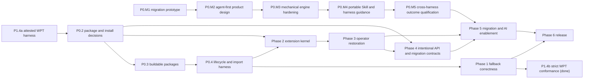

# RxJS Next active project plan

## Executive summary

The project will establish a reliable platform Observable foundation before
expanding the operator catalog and migration promises. The user temporarily
prioritized the attested Observable WPT harness and fallback-conformance work
ahead of the package and installation decision. Both slices are complete:
the fallback passes every pinned Observable WPT while exact implementation
identity is proved in every tested realm. D-045 supersedes D-042 and requires
an explicit `Subscriber.next` argument, including `next(undefined)` for a
platform `Subscriber<void>`. The portable RxJS 7-to-Next
marble-test migration
Skill, its independent vetting, and the classified repository port are also
complete. The user has clarified that preservation in a manifest is not enough:
all cases must become executable parity registrations even when their
capabilities are absent. The exhaustive follow-up is complete: 2,201 physical
test declarations expand to 2,338 uniquely identified registrations, including
parameterized and source-skipped evidence. The user has now temporarily
prioritized and completed P0.T3: the durable failure ledger retains every
original failure, all 2,338 registrations pass in cold and polyfill modes, and
the strict RxJS unit gate was green against the artifact then in use. P0.3
later exposed that the focused portion had consumed a stale polyfill build.
P0.4 has reconciled that evidence with one reusable lifecycle contract that
runs against the packaged fallback and a browser-native implementation, and
has completed the package-import safety fixtures. P0.2 has now accepted
the three-package map,
conditional per-realm fallback contract, and migration-over-emulation
direction. P0.3 has now implemented those package decisions, restored clean
publication builds, and added the required import/realm evidence. P0.5 records
the written specification reference, executable WPT pin, maintainer-owned
update policy, and complete all-pass gate. A later
user-prioritized runner follow-up removed expected-failure quarantine. P0.DX4
replaced that custom dynamic launcher and shard renderer with real Vitest files
and stock reporting. The user then clarified that those files must be ordinary
owned migration results rather than generator-owned artifacts, and prioritized
P0.M1 with a publishable, framework-adaptable migration package dogfooded on
this repository. The user-prioritized repository package-manager migration to pnpm 10 is complete
without deciding the P0.2 publication boundary. The root developer command
guide is also concise, task-oriented, and explicit about known failing gates.
The user has now made the complete agent-first migration experience the top
project priority. The focused P0.M1 package is useful mechanical groundwork,
but its nine package tests and unreferenced single source fixture do not prove
general RxJS 7 migration safety. P0.M2 therefore designs the product contract,
fixture/evaluation architecture, and portable distribution model for Codex,
Claude, and Cursor before further implementation. P1.1 returns to `PLANNED`,
and P0.M2 is now the sole `NEXT` item.

No dates, staffing commitments, or final release version are assigned.

## Status protocol

- `DONE`: completion bar met and evidence recorded.
- `NEXT`: the single active step.
- `PLANNED`: sequenced but not active.
- `BLOCKED`: cannot proceed without a named decision or external change.
- `DEFERRED`: accepted work intentionally not designed or scheduled yet.

Keep exactly one `NEXT` item. When it completes, mark it `DONE`, record
verification in the session log, and move `NEXT` to the earliest unblocked
item.

## Success criteria

- Native Observable is preserved and the fallback is installed only according
  to the approved contract.
- Platform behavior passes every selected Observable test from the pinned WPT
  revision, with the related written specification revision recorded for
  diagnosis and reproducibility.
- Symbol extension identity, installation, construction, cancellation, typing,
  and packaging conventions are uniform and tested.
- Supported operators are backed by classified RxJS 7 behavioral evidence.
- RxJS 7 migration mappings are backed by classified evidence and do not imply
  a runtime compatibility package.
- The primary migration experience is agent-led: it assesses the repository,
  protects uncovered behavior with an RxJS 7 baseline, classifies the intended
  Next contract, invokes only proven mechanical transforms, and iterates with
  the developer until agreed build and test gates are green.
- Deterministic transforms are fixture-tested for output, compilation,
  idempotence, diagnostics, and behavior; agent-produced migrations are judged
  by declared contracts and test outcomes rather than exact source shape.
- One portable migration workflow has documented discovery, installation,
  invocation, permission, and verification paths for Codex, Claude, and
  Cursor, with harness-specific adapters kept thin and testable.
- Every published entry point builds and passes import/type fixtures in
  supported environments.
- Migration guidance and future AI tools are generated from accepted behavior,
  not prototype assumptions.

## Active queue

### Phase 0 — Foundation and architectural safety rails

| Status    | ID     | Outcome                                                                                                            |
| --------- | ------ | ------------------------------------------------------------------------------------------------------------------ |
| `DONE`    | P0.1   | Record the charter, current architecture, migration policy, decisions, risks, open questions, and AI working rules |
| `DONE`    | P0.T1  | Design and implement the user-prioritized framework-neutral `@rxjs/test` virtual-time package                      |
| `DONE`    | P0.T2a | Create a portable RxJS 7-to-Next marble-test migration Skill                                                       |
| `DONE`    | P0.T2b | Vet the migration Skill independently before using it on the repository                                            |
| `DONE`    | P0.T2c | Port and classify the RxJS 7 marble-test corpus without repairing production behavior                              |
| `DONE`    | P0.T2d | Materialize every inventoried marble case as an executable parity-test registration                                |
| `DONE`    | P0.T2e | Exhaustively convert remaining runnable RxJS 7 marble evidence and expand capability mappings                      |
| `DONE`    | P0.T2f | Make the default ported-test gate strict and progress-visible                                                      |
| `DONE`    | P0.T3  | Resolve the cold and polyfill RxJS 7 parity failures through the durable operator/function work queue              |
| `DONE`    | P0.DX1 | Migrate repository workspaces, automation, and contributor tooling from Yarn Classic to pnpm 10                    |
| `DONE`    | P0.DX2 | Make the root developer command guide concise, accurate, and task-oriented                                         |
| `DONE`    | P0.DX3 | Add cached one-shot bundle comparison for current Next and published RxJS versions                                 |
| `DONE`    | P0.DX4 | Materialize normal rxTest specs with stock Vitest reporting and real source locations                              |
| `DONE`    | P0.I1  | Add four explicit Symbol-based Observable-to-async-iterator strategies                                             |
| `DONE`    | P0.2   | Decide the package map and native-versus-polyfill installation contract                                            |
| `DONE`    | P0.3   | Restore green builds and coherent public entry points for the selected package map                                 |
| `DONE`    | P0.4   | Add a native/fallback lifecycle test harness and package-import fixtures                                           |
| `DONE`    | P0.M1  | Publish and dogfood one-time RxJS 7-to-Next test migration tooling                                                 |
| `NEXT`    | P0.M2  | Design the agent-first migration product, contracts, fixture strategy, and cross-harness distribution              |
| `PLANNED` | P0.M3  | Harden `@rxjs/migrate` as the deterministic mechanical engine with comprehensive executable fixtures               |
| `PLANNED` | P0.M4  | Publish the portable migration Skill and thin Codex, Claude, and Cursor integration guidance                       |
| `PLANNED` | P0.M5  | Qualify the end-to-end agent workflow on representative repositories and behavioral outcome gates                  |
| `DONE`    | P0.5   | Pin the written Observable reference and require every selected test from the executable WPT revision to pass      |

#### P0.1 completion evidence

- Added the `docs/rxjs-next` document set and root `AGENTS.md`.
- Mapped all current packages and the Symbol extension inventory.
- Verified four unique polyfill tests and one RxJS operator test pass.
- Verified the polyfill package build fails because ambient platform
  declarations are disconnected from the build entry.
- Verified the RxJS package build fails because the root `tshy` export is
  invalid.

#### P0.T1 completion evidence

- Added the framework-neutral `@rxjs/test` package and public `rxTest`
  function; no scheduler instance or manual scheduler mode is exposed.
- Added marble parsing, async virtual-time controls, default and configurable
  assertions, and distinct `cold`, `hot`, and platform `observable` sources.
- Isolated marble grammar in a pure internal parser with direct unit coverage,
  independently of the virtual-time runtime.
- Virtualized the supported host timing and clock APIs with exact restoration,
  same-realm serialization, pending-work diagnostics, and task/time guards.
- Passed 66 focused behavior, parser, and cleanup tests, lint, TypeScript source checks,
  Nx build/test targets, the multi-dialect package build, strict declaration
  coexistence with the Observable polyfill, and built ESM/CommonJS imports.
- Recorded D-012 and the complete contract in `TESTING_DESIGN.md`.

#### P0.T2a completion bar

- A repo-committed Skill teaches developers to migrate RxJS 7 TestScheduler
  marble cases to `rxTest`, ColdObservable, and the platform Observable.
- The Skill preserves the caller's test framework, requires the global
  Observable for platform cases, and separates mechanical changes from
  semantic review.
- The Skill and bundled helpers contain no RxJS-repository paths, branches,
  commits, Git operations, or package-internal assumptions.

#### P0.T2a completion evidence

- Added the repo-committed `rxjs-next-marble-migration` Skill with concise
  workflow guidance, conversion and lifecycle references, examples, and a
  migration-report template.
- Added dependency-free file analysis, duplicate-candidate detection,
  review-flag detection, and a portability checker that accepts ordinary
  filesystem paths without source-control behavior.
- Passed helper tests, the portability scan across all nine Skill files, the
  Skill structural validator, and temporary `.skill` packaging.

#### P0.T2b completion bar

- Skill structure, links, examples, helper scripts, and packaging validate.
- Independent skill evaluation has no unresolved blocking or fix-first finding.
- Consumer-style fixtures cover synchronous, higher-order, timed, cancellation,
  duplicate, missing-operator, sharing-divergence, and obsolete-harness cases.
- No repository marble-test port begins before this bar is met.

#### P0.T2b completion evidence

- Exercised the dependency-free analyzer in a temporary consumer-style project
  across synchronous, higher-order, timed, cancellation, duplicate,
  missing-operator, sharing-divergence, and obsolete scheduler-internal cases.
- Parsed representative migrated `rxTest` cases for framework preservation,
  awaited flush, Symbol invocation, and global Observable construction.
- Corrected the one initial evaluation warning by making the Skill trigger
  sentence explicit.
- Passed the structural validator and independent plugin evaluation at 100/100
  with no failures, warnings, or fix-first recommendations.

#### P0.T2c completion bar

- Every inventoried RxJS 7 marble case has exactly one recorded disposition:
  active, expected failure, missing API, deduplicated, or unsupported/obsolete.
- Shared definitions can run in isolated ColdObservable, polyfill, and
  native-if-present modes without importing the platform constructor.
- Repository notes reconcile source counts, duplicate provenance, known
  failures, missing APIs, and semantic divergences.
- Production Observable, operator, and direct-subscription implementations are not
  changed to make the port pass.

#### P0.T2c completion evidence

- Read the production `7.x` ref without checking it out and pinned
  `e5351d02e225e275ac0e497c7b66eaa5f0c88791` only in the repository port
  records.
- Reconciled all 2,146 inventoried cases as 333 active, 422 expected failure,
  1,251 missing API, 4 deduplicated, and 136 unsupported/obsolete.
- Added a reproducible generated manifest retaining original provenance,
  converted definitions, classifications, reasons, capability gaps, and exact
  duplicate links.
- Added isolated cold, polyfill, native-if-present, and per-mode audit commands.
  Normal cold and polyfill each register all 2,146 source cases; native
  detection skips explicitly in the current Node realm. Cold audit records 335
  passes and 1,811 failures; polyfill audit records 340 passes and 1,806
  failures.
- Recorded the platform shared/ref-counted lifecycle separately from cold-mode
  expectations and required platform cases to construct
  from the ambient Observable.
- Added D-013 and the detailed port notes. No production implementation was
  changed, and P0.2 is restored as the single `NEXT` item.

#### P0.T2d completion bar

- All 2,146 inventoried source cases are registered by the parity harness,
  including missing APIs, scheduler/harness dependencies, deduplicated
  provenance, and obsolete coverage.
- Missing capabilities fail with explicit source-linked capability diagnostics
  rather than being omitted from test collection.
- The raw parity command reports the complete pass/fail/duplicate disposition
  without changing production operators or direct-subscription behavior.
- Normal and platform modes remain bounded; any required sharding or process
  isolation is part of the harness rather than a reason to omit cases.
- Port notes, verification evidence, and the generated manifest agree on the
  registered total.

#### P0.T2d completion evidence

- Preserved a mechanically generated executable program for every manifest
  entry, including all four deduplicated source locations and all 136
  scheduler/harness-dependent cases.
- Registered all 2,146 cases in cold, polyfill, and native-if-present modes.
  Mode-specific pass baselines execute verified cases normally; every other
  non-duplicate case remains an expected-failure parity gate until its exact
  capability and behavior are available.
- Made missing APIs and unavailable harness facilities fail with explicit
  source ID, original claim, and capability/rewrite reason. The raw cold audit
  reports 1,811 failures and 335 passes; the polyfill audit reports 1,806
  failures and 340 passes.
- Added role-aware import mapping so
  `source.pipe(operator(arg1, arg2))` invokes its exact or unified Next Symbol
  as `source[targetSymbol](...adaptedArgs)`, separately from static factory
  Symbols, ambient-platform constructions, and standalone values.
- Added one machine-readable capability registry and the generated
  `RxJS-7-parity.md` map covering 113 RxJS 7 operators and 34 creation/utility
  functions, including every missing exact surface and marble-case usage
  counts.
- Passed the complete 2,146-registration cold and polyfill gates, native
  auto-detection, manifest validation, parity-document freshness, and
  reproducible generation. No production source was changed by the port. P0.2
  is restored as the single `NEXT` item.

#### P0.T2e completion bar

- Re-audit every unsupported or missing-capability disposition against the
  current RxJS Next source and platform Observable surface.
- Prefer an executable mechanical conversion for every source-linked claim,
  including helper-generated and scheduler-shaped cases, while preserving
  explicit failures for unavailable behavior.
- Run the complete cold and polyfill inventories plus native auto-detection and
  raw audits without changing production operators to satisfy expectations.
- Regenerate the capability map, parity document, dispositions, mode
  baselines, and notes from the pinned read-only RxJS 7 source revision.

#### P0.T2e completion evidence

- Reconciled 2,201 physical declarations into 2,338 unique registrations,
  including 169 parameterized variants and all four source-skipped cases.
- Preserved an executable converted program for every registration. Only 11
  cases remain classified unsupported/obsolete, and each produces an explicit
  source-linked diagnostic rather than disappearing from the suite.
- Expanded the executable capability registry to 51 operator mappings, 18
  factory mappings, and 11 standalone values, including exact, partial, and
  unified mappings for the newly available APIs.
- Added unique case-ID baselines, complete sharded audit merging, ambient
  native-constructor identity checks, and five dedicated platform lifecycle
  cases.
- Passed the complete 2,338-case normal cold and polyfill gates. Raw audits
  recorded 432 cold passes with 1,906 failures and 436 polyfill passes with
  1,902 failures. Native mode skipped explicitly in the current Node realm.
- Regenerated the manifest, parity map, reviewed baselines, and port notes
  without changing production source.

#### P0.T2f completion bar

- Every applicable ported registration uses ordinary test semantics in the
  default cold, polyfill, and native-if-present modes.
- Recorded pass baselines cannot skip, quarantine, or invert a default test
  result.
- The launcher continues through every shard, reports visible progress while
  they run, expands every failed shard's diagnostics, and exits nonzero when
  any test fails.
- No production Observable, operator, or direct-subscription behavior changes.

#### P0.T2f completion evidence

- Removed the mode-baseline registration branch and all `it.fails` use from the
  ported suite; all applicable manifest cases now register with ordinary
  `it(...)`.
- Added one in-place interactive status line, refreshed on shard completion and
  every ten seconds, showing completed, running, queued, failed, and elapsed
  counts. Non-interactive output emits only a final progress summary.
- Regenerated the manifest so now-visible failure reasons describe failing
  parity evidence without claiming those tests remain quarantined.
- Ran the default `test:ported` command through all 16 cold and all 16 polyfill
  shards. Cold completed in 84 seconds and polyfill in 94 seconds; every shard
  exposed failures, all failed-shard diagnostics were expanded, and the command
  returned exit code 1 as intended.
- Preserved the one proven non-yielding converted program as a registered,
  immediate explicit failure so it cannot freeze its shard. Production source
  was unchanged.

#### P0.T3 completion bar

- `RXJS_7_PORTED_FAILURES.md` retains every cold or polyfill failure by stable
  case ID, even after the case becomes `FIXED`.
- Every tracked case belongs to exactly one operator/function work packet and
  uses only `TODO`, `IN-PROCESS`, `FIXED`, or a `BLOCKED` status with a named
  dependency.
- Each packet is resolved at the correct platform, intentional Next, harness, or
  approved-divergence boundary without weakening RxJS 7 behavioral evidence.
- Complete cold and polyfill audits account for all 2,338 cases, every tracked
  row is `FIXED`, and the normal strict ported-test gate passes.
- Completion evidence and the final session log are recorded before restoring
  P0.2 as the single `NEXT` item.

#### P0.T3 completion evidence

- The durable ledger retains all 1,923 cases that failed an authoritative
  audit, assigns each to exactly one of 140 work packets, and marks every row
  `FIXED`.
- Complete cold and polyfill audits each passed all 2,338 registrations with
  zero failures. The final manifest has 1,503 active, 831
  compatibility/expected-failure, and 4 exact-deduplicate registrations; every
  non-duplicate registration still executes with ordinary strict semantics.
- `pnpm --filter rxjs test` passed 705 focused source tests, then both complete
  parity modes.
- Scheduler-specific RxJS 7 evidence is resolved at the explicit
  migration-evidence boundary recorded in D-033. No public scheduler class,
  general scheduler argument, string-named RxJS method, or global-registry
  Symbol was introduced.
- P0.2 is restored as the single `NEXT` item.

#### P0.DX1 completion evidence

- Pinned pnpm 10.34.5, made `pnpm-workspace.yaml` authoritative, generated a
  pnpm lockfile from the former Yarn lockfile, and removed Yarn tooling and
  lockfile support.
- Kept pnpm's isolated linker, added explicit Chai and Yargs dependencies
  exposed by that layout, and limited the temporary polyfill bridge to one
  documented root public-hoist without changing the published package contract.
- Added a version-bounded dependency-build policy with `strictDepBuilds`,
  converted CI, release, documentation, generated commands, and contributor
  guidance, and retained npm for publication and end-user installation.
- Patched the pinned Husky 4 hook runner to use `pnpm exec`, preserving the
  configured commit hooks under pnpm 10 without a dependency upgrade.
- Passed a clean frozen install and a stable repeat install, five-project Nx
  discovery, 53 polyfill tests, 66 `@rxjs/test` tests plus package fixtures, six
  focused RxJS tests, parity freshness, WPT import verification, and the strict
  attested WPT run with 52/52 URLs, 525/525 upstream subtests, and 52/52
  identity attestations.
- Confirmed the docs app resolves published RxJS 7.8.1 and does not receive the
  local polyfill bridge. The release dry-run reaches the unchanged package
  build/lint baseline. Existing Angular/TypeScript peer warnings, the Node 24
  docs-test ESM failure, the optional RE2 Node 24 build failure, and the known
  RxJS Next package build/lint failures remain out of scope.
- Restored P0.2 as the single `NEXT` item.

#### P0.DX2 completion evidence

- Replaced the root setup list with compact, task-oriented command tables for
  workspace discovery, fast package feedback, documentation, WPT, and release
  preparation.
- Highlighted the common inner-loop commands and named all five pnpm workspace
  projects.
- Distinguished focused green checks from the intentionally failing full RxJS
  parity suite and known P0.3 build/lint baselines.
- Linked specialized docs and verified the listed commands against current
  workspace scripts while keeping P0.2 as the single `NEXT` item.

#### P0.DX3 completion evidence

- Added a one-shot production Webpack comparison for the current RxJS Next
  runtime surface with and without the Observable fallback, plus the public
  root surface of selected published RxJS versions.
- Kept the analyzer toolchain in a disposable pnpm project and left workspace
  dependencies and the lockfile unchanged.
- Cached each published version's standalone bundle, complete module stats,
  registry integrity, and configuration fingerprint under an ignored local
  cache. Exact cache hits do not resolve or rebuild the published package;
  `--refresh` is the explicit rebuild path.
- Flattened fresh and cached compilations into one analyzer-compatible stats
  document and generated one static gzip-first report under
  `dist/bundle-analysis/`.
- Verified CLI parsing, source filtering, cache keys, and stats composition
  with focused Node tests. The default `7.8.2` integration run, cache-hit
  reuse, and refresh behavior are recorded in the session log.

#### P0.DX4 completion evidence

- Materialized 147 formatted Vitest files per execution mode, with 2,338
  direct `rxTest` cases in each and source-pinned RxJS 7 URL comments.
- Removed the dynamic registration module and custom shard/progress launcher.
  Normal runs use Vitest's public built-in default reporter unchanged, so
  diagnostics point to real repository files and lines.
- Made cold construction explicit without replacing `globalThis.Observable`:
  cold fixtures extend `ColdObservable`, hot fixtures extend the active global
  constructor and derive ordinary platform Observables, and `observable()`
  directly models that global constructor.
- Complete built-in JSON audits record 2,296/2,338 cold passes and
  2,316/2,338 fallback-platform passes. Generated file/declaration order maps
  audit results back to manifest case IDs without polluting human test names.
- Kept P0.5 as the sole project-level `NEXT` item.

#### P0.M1 completion evidence

- Added the publishable `@rxjs/migrate` workspace package with a
  framework-neutral migration core,
  a one-time CLI, reusable Skill assets, and bounded local MCP capabilities.
- Source- and target-test-framework concerns are adapters. The first supported
  path migrates Mocha/Chai tests to Vitest without coupling `rxTest` conversion
  semantics to Vitest.
- Dogfooded its Mocha/Chai-to-Vitest adapter while adopting the repository's
  ported corpus as ordinary human-readable
  specs with local file names and file-level source repository, revision, and
  path provenance. No test tells contributors to edit or rerun a generator.
- Each migrated test calls `rxTest` through normal test-framework code. Any
  migration-specific comment explains a real semantic rewrite; parameterized
  source cases are materialized as direct tests rather than dynamic runners.
- Cold and platform source lifecycles remain explicit in the test files. Only
  the repository-owned platform execution matrix selects native versus
  polyfill Observable implementations in isolated realms.
- The former test-file generator is not part of the test, audit, or contributor
  workflow. Stock Vitest reporters continue to provide clickable real paths.
- Verified 9 package tests, lint, ESM/CommonJS imports, CLI dry run, package
  build and publication dry run, and the portable Skill checks. Focused
  `@rxjs/test` and RxJS source suites pass 75/75 and 733/733 tests.
- Complete owned-file audits cover all 2,338 cases per mode and retain the
  reviewed 2,296 cold and 2,316 fallback-platform passes. Representative
  formerly dynamic suites pass 176/176 direct tests; the focused concat
  failure reports its real checked-in file and line through stock Vitest.

#### P0.M2 completion bar

- A maintainer-facing design document defines the migration user journey:
  repository/version and coverage assessment; warnings and test
  recommendations; optional pre-migration characterization tests that pass on
  RxJS 7; explicit target-contract classification; mechanical transformation;
  and an interactive build/test/repair loop that ends green or with a
  developer-accepted, documented blocker.
- Product boundaries are explicit. `@rxjs/migrate` is the deterministic,
  versioned codemod engine and never claims to complete a migration alone. The
  portable Skill is the primary reasoning and orchestration layer. A separate
  MCP is included only if the design identifies capabilities that a
  machine-readable CLI and local agent tools cannot provide adequately.
- The design identifies one canonical Skill source and a distribution/version
  model that avoids duplicated instructions while documenting discovery,
  installation, invocation, permissions, and updates for Codex, Claude, and
  Cursor. Shared workflow semantics are portable; harness-specific material is
  limited to adapters and installation instructions.
- A fixture and evaluation specification distinguishes deterministic golden
  transformations from nondeterministic agent outcomes. Mechanical fixtures
  cover parsing, exact or invariant output shape, compilation, idempotence,
  diagnostics, and behavior. Agent fixtures use RxJS 7 characterization
  baselines, explicit Next-contract manifests, compile/build/test outcomes,
  intentional divergences, and required refusal/escalation cases.
- The design includes representative fixture categories for `ColdObservable`,
  platform sharing/ref counting, Subjects, cancellation, teardown order,
  scheduling/timing, errors, input conversion, repeated subscriptions,
  unsupported APIs, missing coverage, and mixed mechanically supported and
  unsupported pipelines.
- D-044 and related architecture, compatibility, open-question, and risk
  records are corrected where they overstate current validation or conflate
  the codemod, Skill, CLI, and MCP responsibilities. Later implementation
  steps have developer-ready scope, dependencies, and observable exit gates.

#### P0.M2 execution handoff

- **Objective:** create `docs/rxjs-next/MIGRATION_TOOLING_DESIGN.md` as the
  controlling product and technical design for the complete agent-first
  migration experience.
- **Why now:** migration safety is a release-defining user experience, while
  P0.M1 currently risks making a nine-test codemod prototype and thin MCP look
  like the complete product.
- **Scope in:** audit the present package, Skills, MCP, decisions, and claims;
  specify the user journey and contract-classification protocol; define the
  mechanical and agent fixture schemas; choose canonical Skill ownership and
  Codex/Claude/Cursor distribution boundaries; set explicit MCP decision
  criteria; and correct controlling documentation.
- **Scope out:** production codemod changes, package restructuring, publishing,
  and live cross-harness qualification. Those belong to P0.M3 through P0.M5.
- **Dependencies:** current RxJS Next architecture and migration evidence plus
  the user-approved workflow recorded here. Full operator stabilization is not
  required for the design, because capability claims must be versioned and
  evidence-linked rather than copied into static instructions.
- **Verification:** documentation links resolve; package/Skill/MCP boundaries
  are consistent across the charter, architecture, decisions, compatibility
  policy, open questions, and plan; fixture gates have negative controls; and
  the plan retains exactly one `NEXT` marker.
- **Execution skills:** lead with `developer-experience` for the portable paved
  road and `technical-business-documents` for the durable product contract;
  use TypeScript expertise only when P0.M3 begins implementation.

#### P0.M3 completion bar

- `@rxjs/migrate` exposes a programmatic core and dry-run-first,
  machine-readable CLI with narrow preconditions, structured findings, safe
  file boundaries, and no agent- or harness-specific runtime dependency.
- Comprehensive checked-in input/expected-output fixtures exercise every
  supported mapping and argument adapter plus aliasing, shadowing, mixed
  supported/unsupported pipelines, malformed input, framework preservation,
  platform/cold selection, diagnostics, and negative controls.
- Every successful fixture parses, type-checks against its declared RxJS 7 and
  Next environments as applicable, is idempotent, and runs behavior tests that
  prove the declared preserved claims. A shape-only assertion is never the sole
  evidence for semantic migration.
- CLI/API equivalence, dry-run/write behavior, path containment, package
  imports, publication contents, and failure exit codes are tested. The
  package documentation describes only the mechanically supported subset.

#### P0.M4 completion bar

- One canonical portable Skill implements the agent workflow and consumes the
  versioned mechanical engine and migration evidence without copying mutable
  capability claims into harness-specific instructions.
- The Skill requires an RxJS 7 green baseline, coverage/risk report, explicit
  Next-contract classification, developer interaction for ambiguous intent,
  and post-migration build/test repair. It forbids weakening tests or silently
  selecting platform versus producer-per-subscription behavior.
- Codex, Claude, and Cursor each have tested installation, discovery,
  invocation, permission, and update instructions plus a minimal smoke
  scenario that reaches the same portable workflow.
- Any MCP deliverable has a separately justified contract and validation. If
  no concrete capability exceeds the CLI/local-agent boundary, the accepted
  design records that MCP is unnecessary and ships none.

#### P0.M5 completion bar

- Representative repositories cover application and library layouts,
  TypeScript configurations, test frameworks, strong and weak initial test
  coverage, cold-preserving migrations, intentional platform migrations,
  mixed contracts, and unsupported behavior.
- End-to-end evaluations start from pinned RxJS 7 revisions, record baseline
  tests, run the agent workflow, and judge generated changes by compilation,
  build/test outcomes, contract manifests, diagnostics, and intentional
  divergences rather than exact text.
- Codex, Claude, and Cursor runs demonstrate equivalent safety gates and
  developer decision points. Nondeterministic source variation is permitted;
  undisclosed behavioral variation, skipped required warnings, weakened tests,
  or unsafe automatic contract choices fail the evaluation.
- Release-facing documentation states measured coverage and limitations and
  does not claim general automatic migration beyond the passing fixture and
  representative-repository evidence.

#### P0.I1 completion bar

- Four exact instance Symbols expose lossless FIFO, lossless buffered, lossy
  latest-value, and lossy next-demand async iteration.
- Each invocation returns a fresh lazy generator, preserves the receiver's
  direct-subscription lifecycle, and aborts its observer during generator
  cleanup.
- Focused tests cover synchronous and delayed producers, terminal behavior,
  microtask coalescing, cancellation, platform sharing/ref counting, and
  `ColdObservable` producer-per-subscription behavior.
- Public comments and architecture records explain the implications of
  multiple generators over platform and direct-subscription Observables.

#### P0.I1 completion evidence

- Added `iterateEachValue`, `iterateBufferedValues`, `iterateLatestValue`, and
  `iterateNextValue` exact Symbol modules with a shared internal async-generator
  implementation and detailed API documentation.
- Removed the exploratory `eachValueFrom` and `bufferedValuesFrom` sources and
  package subpaths without aliases. The four replacement subpaths are present
  in both the source build inventory and published export map.
- Added 16 focused behavior, type, lifecycle, error, completion, and
  cancellation tests. The complete RxJS gate passed 101 focused files with 733
  tests, followed by all 2,338 cold and 2,338 polyfill parity cases.
- Recorded D-038 against reviewed `rxjs-for-await` revision
  `94f9cf9cb015ac3700dfd1850eb81d36962eb70f` and updated architecture,
  migration-policy, and open-question records.
- Package metadata parses successfully. The package build reaches only the
  documented P0.3 baseline where `tshy` rejects the existing array-valued root
  source export; it reports no change-specific build diagnostic.
- At the time this evidence was recorded, P0.2 remained the single
  project-level `NEXT` item.

#### P0.2 completion bar

Record accepted decisions covering:

- the purpose or removal of `@rxjs/observable`;
- the final conceptual and npm package boundaries for fallback, extensions,
  testing, and the explicit absence of a runtime compatibility product;
- which package owns ambient platform types;
- explicit versus automatic fallback installation;
- behavior when a native constructor or `EventTarget.when` already exists;
- runtime dependency direction;
- root and subpath import side effects;
- supported realm and server-runtime assumptions for initialization.

Update `ARCHITECTURE.md`, `DECISIONS.md`, `OPEN_QUESTIONS.md`, and package-map
diagrams. No implementation is required for this decision step.

#### P0.2 completion evidence

- Accepted `@rxjs/observable-polyfill`, `rxjs`, and `@rxjs/test` as the three
  target runtime products. Selected `@rxjs/observable` for physical removal in
  P0.3 with no archive, rename, or compatibility reuse.
- Assigned the base ambient `Observable`, `Subscriber`, `ObservableValue`, and
  `EventTarget.when` declarations to the independently publishable polyfill
  package. `rxjs` owns subpath-scoped Symbol augmentations. At P0.2 acceptance,
  `@rxjs/test` remained implementation-neutral; D-043 later gave its explicit
  cold fixture a public `ColdObservable` dependency.
- Required every public `rxjs` entry point to evaluate the conditional
  polyfill initializer. The root exports non-operator core values without
  installing the full Symbol catalog; a Symbol subpath installs only its own
  capability and required kernel dependencies.
- Preserved any existing `Observable` or `EventTarget.when` without probing,
  warning, or replacement. A missing constructor receives the paired RxJS
  fallback `Observable` and `Subscriber`; a missing `when` is filled only when
  `EventTarget` exists.
- Defined the stable
  `Symbol.for('rxjs.observable.polyfill.info.v1')` metadata contract,
  `observablePolyfillInfo`, and `getObservablePolyfillInfo`. Frozen
  `{ packageName, version }` marker-object identity distinguishes installation
  instances without UUID or crypto requirements.
- Defined initialization as independent per window, iframe, worker, or server
  isolate, with no realm traversal or transparent foreign-Observable support.
  The initial capability claim covers browser/worker realms and maintained
  Node releases; other runtimes and hardened surfaces remain unclaimed.
- Rejected a separate RxJS 7 runtime compatibility product. Retained
  `ColdObservable`, Subjects, and Symbol-keyed composition as intentional Next
  APIs, while making documentation, classified evidence, and migration Skills
  the supported migration direction. MCP remains optional and deferred.
- Recorded D-039 through D-041, updated the charter, architecture, migration
  policy, open questions, and package/dependency diagrams, and reserved all
  runtime, manifest, package-removal, and fixture work for P0.3.

#### P0.3 completion bar

- `packages/observable` and its preparation/tooling references are removed.
- The conditional polyfill, read-only version/instance metadata, and detection
  helper implement D-041 without partially installing on failure.
- Every `rxjs` public entry initializes its realm; the root exports only the
  approved non-operator core, and each Symbol subpath installs only its selected
  capability and kernel dependencies.
- `@rxjs/test` continues to require an already active realm constructor and
  never selects or replaces it.
- All selected packages build from a clean checkout on a declared Node runtime.
- Root and subpath exports map to existing sources and generated types.
- Runtime dependencies are declared.
- Source tests are excluded from published output unless deliberately shipped.
- Repository metadata points to the correct package paths.
- At least one ESM and one CommonJS import fixture passes for each claimed
  package format.
- Fixtures prove missing-global installation and marker metadata, preservation
  of native/foreign and earlier-version constructors, independent conditional
  `EventTarget.when`, direct subpath initialization, a root with no operator
  Symbols, separate-realm isolation, and clear failure on unsupported frozen
  targets.

#### P0.3 completion evidence

- Removed `packages/observable`, its root preparation gate, README inventory
  entry, TypeScript bridge, workspace hoist, and lockfile project.
- Made `@rxjs/observable-polyfill` a conditional per-realm initializer with the
  frozen D-041 marker and helper. Property changes are preflighted and applied
  transactionally; unsupported frozen targets fail clearly without retaining
  an Observable, Subscriber, abort bridge, or `EventTarget.when` partial.
- Added the declared polyfill runtime dependency to `rxjs`. Every public source
  entry reaches the initializer; the root exports only the approved
  non-operator core, and individual subpaths retain capability-scoped Symbol
  installation.
- Kept `@rxjs/test` constructor-neutral and added a missing-global import
  fixture proving that importing it does not select or install Observable.
- Replaced the invalid root export array with source-backed root and subpath
  exports. All three manifests emit matching ESM, CommonJS, browser, and
  webpack runtime/declaration paths, point at their actual repository
  directories, include only `dist` plus package metadata, and disable generated
  self-links.
- Added declaration-consumer and built ESM/CommonJS fixtures for all three
  packages. Added isolated-process/worker fixtures for missing globals,
  metadata, foreign and earlier constructors, independent `when`, direct
  subpaths, root Symbol isolation, separate realms, and frozen targets.
- On Node `24.12.0`, `pnpm install --frozen-lockfile`, workspace discovery, and
  `pnpm prepare-packages` pass. Package build/type/import gates pass for all
  three products; dry-run packs contain no source specs.
- The polyfill/harness suite passes 49 tests and `@rxjs/test` passes 73. The
  pinned strict WPT gate passes 52/52 URLs, 525/525 upstream subtests, and
  52/52 exact RxJS identity attestations.
- A clean polyfill build exposed that the prior focused RxJS baseline had
  consumed a stale fallback artifact. The current diagnostic passes 678/733
  focused tests; P0.4 owns the shared selected-implementation lifecycle
  contract needed to restore that command as a blocking gate.

#### P0.4 completion bar

- One test contract can run against a selected native implementation and the
  fallback.
- It covers first subscribe, concurrent observers, late join, individual abort,
  last-observer abort, restart, completion, error, synchronous reentrancy,
  teardown registration, teardown order, and thrown observer callbacks.
- Package fixtures detect missing initialization, wrong side effects, duplicate
  installation, and type visibility.

#### P0.4 completion evidence

- Added one self-contained lifecycle contract and executed that exact function
  against the built `@rxjs/observable-polyfill` package in Node and the native
  Observable in pinned Chrome `150.0.7871.126`.
- The five grouped cases cover first activation, concurrent observers, late
  join, individual and last-observer abort, restart, completion, error,
  synchronous reentrancy, late teardown registration, reverse teardown order,
  and thrown `next`, `error`, and `complete` callbacks.
- Added mixed ESM/CommonJS duplicate-install fixtures in both load orders. They
  prove that a second package dialect preserves the selected `Observable`,
  paired `Subscriber`, `EventTarget.when`, abort bridge, and frozen marker
  object identities.
- The existing missing-global, foreign/native preservation, frozen-target,
  declaration-consumer, and built ESM/CommonJS fixtures continue to prove
  initialization, side-effect, and type-visibility boundaries for all three
  packages.
- Added the lifecycle contract to both pinned and latest-Chrome Observable CI
  jobs. At P0.4 completion, the reusable browser-script runner passed the
  pinned strict WPT gate: 52/52 URLs, 525/525 upstream subtests, and 52/52
  implementation attestations. D-042 temporarily changed the void notification
  contract; D-045 supersedes it and restores the complete required result.
- Reconciled the stale focused suite: 101 files and 733/733 tests pass against
  the rebuilt fallback. A correction audit removed invalid platform-Observable
  wrappers around RxJS 7 arbitrary-subscribable inputs. The complete cold
  migration audit now passes 2,323/2,338 and the fallback audit passes
  2,316/2,338. The 15 shared legacy-input failures and seven additional
  fallback retry/shared-error failures remain executable product evidence; the
  strict all-mode command therefore remains nonzero without weakening or
  quarantining those cases.

#### P0.5 completion bar

- WICG/observable commit `d74bace7cf80200a01c81cfe20961e29ac7fa3d8`
  and its `spec.bs` are recorded as the written reference for understanding
  behavior and diagnosing failures.
- web-platform-tests/wpt commit
  `6a009d73f0d315941b90cac13a9523a2a08c631b` is recorded as the executable
  success gate.
- `pnpm run test:wpt` passes 52/52 URLs, 525/525 upstream subtests, and 52/52
  exact RxJS implementation checks, with no upstream edits, skips, failures,
  errors, timeouts, not-run results, or accepted-failure metadata.
- RxJS maintainers own the pins. A new WPT revision requires an explicit exact
  commit, review of every changed Observable test and realm pattern, verified
  provenance, and the same complete all-pass result before adoption.

#### P0.5 completion evidence

- Restored the Web IDL required-argument check before the fallback
  subscriber's active-state check. Missing arguments now throw even after
  closure, while explicit `undefined` is delivered normally.
- Required an explicit TypeScript value for every platform `Subscriber`, and
  mechanically changed affected `Subscriber<void>` producers to
  `next(undefined)` without changing unrelated `Subject<void>` contracts.
- Superseded D-042 with D-045 and recorded the roles, exact revisions,
  ownership, and update policy for the WICG written reference and executable
  WPT suite.
- Passed 51 focused polyfill tests, the polyfill declaration-consumer check,
  733 focused RxJS tests, 75 `@rxjs/test` tests, pinned-import provenance for
  all 52 URLs, and the five-case shared native/fallback lifecycle contract.
- Against Chrome `150.0.7871.126`, both `pnpm run test:wpt:baseline` and strict
  `pnpm run test:wpt` passed with 52/52 `OK` URLs, 525/525 passing upstream
  subtests, and 52/52 passing exact RxJS implementation attestations.

### Phase 1 — Platform fallback correctness

| Status    | ID    | Outcome                                                                                                          |
| --------- | ----- | ---------------------------------------------------------------------------------------------------------------- |
| `PLANNED` | P1.1  | Close conditional-installation conformance gaps exposed after the P0.3 package implementation                    |
| `PLANNED` | P1.2  | Bring core subscription, abort, teardown, error-reporting, and `Observable.from` behavior to the pinned baseline |
| `PLANNED` | P1.3  | Bring native platform methods and `EventTarget.when` to the pinned baseline                                      |
| `DONE`    | P1.4a | Build the attested Observable WPT test harness and record its stable current-behavior baseline                   |
| `DONE`    | P1.4b | Make the fallback pass the pinned Observable WPT suite                                                           |

#### P1.4a completion bar

- WPT is pinned to
  `6a009d73f0d315941b90cac13a9523a2a08c631b`, and only its approved
  Observable dependency closure is vendored byte-for-byte with Git-blob
  provenance and an exact generated URL inventory.
- The ignored execution tree instruments window, dedicated-worker, same-origin
  iframe, and Web IDL coverage without modifying imported WPT sources.
- Every expected URL has exactly one unsuppressible passing attestation proving
  the active constructor, `subscribe`, and `EventTarget.prototype.when` are the
  exact RxJS bundle identities, differ from captured native references, and
  report the expected bundle SHA-256.
- Negative controls prove native leakage, restored native identities, a wrong
  bundle ID, a missing worker/iframe attestation, and allowlisted attestation
  results all fail the independent auditor.
- The official runner, exact Chrome for Testing `150.0.7871.126`, and matching
  driver are checksum-locked and cached so a warm second run needs no network.
- The default `test:wpt` command is a strict conformance gate with readable
  terminal failures. The explicitly named baseline diagnostic distinguishes
  harness/report failures from known Observable behavior failures, and three
  consecutive complete runs must agree before granular expectations are
  accepted.
- Importer, provenance, inventory, realm-pattern, and report-auditor unit tests
  pass; CI uploads raw reports, diffs, logs, inventories, and per-realm
  identities.
- No production source, public API, ambient type, export, runtime dependency,
  installation contract, or migration-contract changes.

#### P1.4b completion bar

- `test:wpt` passes against the approved WPT and browser revisions.
- Behavior fixes remain within the accepted native-first installation and
  platform-lifecycle architecture.
- Each obsolete failure expectation is deliberately removed as its behavior is
  corrected.

#### P1.4b completion evidence

- Corrected the platform lifecycle without introducing RxJS 7 cold semantics:
  subscriber closure now preserves abort reasons, aborts before LIFO teardown,
  executes late teardowns immediately, retains shared/ref-counted production,
  and reports late or unhandled errors through the platform-shaped global path.
- Added the non-constructible global `Subscriber` surface and required Web IDL
  names, tags, descriptors, argument checks, and detached-realm behavior.
- Corrected `Observable.from` conversion order and Observable identity,
  Promise completion, sync/async iterator acquisition, close reasons, protocol
  errors, pending-result behavior, and microtask timing. The explicit async
  iterator loop documents why `for await...of` cannot preserve these observable
  protocol details.
- Corrected pinned platform behavior in `takeUntil`, `take`, `drop`, `every`,
  `reduce`, `inspect`, and Promise-returning consumers without adding
  string-named legacy RxJS behavior.
- Added a scoped abort-algorithm bridge because public `abort` event listeners
  run too late to model the DOM-standard cancellation order. Signals without
  registered Observable work continue through the captured native abort
  implementation.
- Fixed generated attestation registration so upstream `setup()` properties
  are established before the identity subtest starts the reporting protocol.
  The vendored WPT sources remain byte-for-byte unchanged.
- Passed the strict `test:wpt` command with 52/52 URLs `OK`, 525/525 upstream subtests
  `PASS`, and 52/52 exact-identity attestations in Chrome for Testing
  `150.0.7871.126`. The passing implementation bundle for that run was
  `778edfac15639cd4531a590cd36450ad273a0a692df2e8a1436564dca3cb89f8`.
- Regenerated the baseline after three further identical complete attested
  runs, deleting all 25 obsolete failure `.ini` files. The package's 49 focused
  tests and pinned-import verification pass.
- Reconfirmed the existing P0.3 blocker: package build and lint still fail
  because the ambient declarations are disconnected from the package and root
  TypeScript configurations. No package-boundary work was folded into this
  conformance slice.

#### P1.4a completion evidence

- Vendored exactly 29 files under `dom/observable/tentative/` and eight
  source-derived support files: 37 upstream files and 716,874 bytes total.
  Provenance records every Git blob and SHA-256; the generated inventory
  contains only 52 `/dom/observable/tentative/` URLs.
- Verified all 52 URLs run exactly once and all 52 exact-identity attestations
  pass against implementation bundle
  `c03cd03b65e0337e0f73f202602529b87db1c2dfb1271bbd2e6857477c258e2a`.
  Evidence includes dedicated-worker, Web IDL, and four combined
  window/same-origin-iframe attestations covering all nine reviewed child
  realms.
- Recorded the initial granular expectation metadata after three identical
  complete runs. That pre-P1.4b baseline was 33 `OK`, 15 `ERROR`, and 4
  `TIMEOUT` top-level results, with 314 `PASS`, 159 `FAIL`, 8 `TIMEOUT`, and 6
  `NOTRUN` reported upstream subtests.
- Passed 45 harness unit tests covering import/provenance/inventory/closure,
  realm review, report completeness and classification, stability, and every
  required attestation negative control. The package's four existing source
  tests also pass.
- Passed `wpt:doctor`, `wpt:verify-import`, `test:wpt:baseline`, and
  two further consecutive narrowed-closure runs with
  `RXJS_WPT_OFFLINE=1`. Chrome for Testing and ChromeDriver were both exactly
  `150.0.7871.126`.
- Added blocking path-filtered strict-conformance CI, a scheduled advisory
  latest-Chrome job, cache keys, fixed concurrency/timeouts, and
  always-uploaded raw reports, concise summaries, logs, inventories, and
  per-realm identity evidence.
- Declared Node 24 tooling support and moved both WPT workflow jobs to Node 24;
  import verification, harness tests, doctor, and browser execution work on
  Node `24.12.0` without bypassing the engine check.
- Made no production source, public API, ambient type, export, runtime
  dependency, installation-contract, or migration-contract change.

Phase exit:

- the fallback passes the agreed local lifecycle/conversion suite;
- native preservation is enforced;
- known differences from the pinned specification are listed;
- no main-library work depends on undocumented fallback behavior.

### Phase 2 — Symbol extension kernel

| Status    | ID   | Outcome                                                                                       |
| --------- | ---- | --------------------------------------------------------------------------------------------- |
| `PLANNED` | P2.1 | Decide Symbol identity, versioning, duplicate-install, realm, and collision policy            |
| `PLANNED` | P2.2 | Implement one typed extension installer for static and instance capabilities                  |
| `PLANNED` | P2.3 | Define constructor preservation, input conversion, cancellation, and error-forwarding helpers |
| `PLANNED` | P2.4 | Convert a small representative operator set to the kernel and validate native/fallback parity |

Representative pilot set:

- one native-overlapping synchronous operator such as `map` or `filter`, with
  both the platform string form and RxJS Symbol form tested;
- one RxJS-only synchronous operator such as `scan`;
- one higher-order operator such as `switchMap`;
- one time-based operator such as `timeout`;
- one static factory such as `timer`;
- `pipe` or its approved replacement.

Phase exit:

- the pilot operators share one implementation pattern;
- direct subpath imports are deterministic;
- duplicate installation and type augmentation are tested;
- no string-named RxJS property is added to the platform API;
- the native-overlap pilot proves that the string-named platform method remains
  untouched and the corresponding Symbol-keyed RxJS form coexists with it;
- any additional behavior in the RxJS form is documented and tested.

### Phase 3 — Operator restoration and parity

| Status    | ID   | Outcome                                                                         |
| --------- | ---- | ------------------------------------------------------------------------------- |
| `PLANNED` | P3.1 | Inventory the former RxJS 7 public operator and creation API by migration value |
| `PLANNED` | P3.2 | Create and maintain the migration-evidence ledger                               |
| `PLANNED` | P3.3 | Restore operators in small families using the extension kernel                  |
| `PLANNED` | P3.4 | Classify, retain, or rewrite former RxJS 7 tests for each restored family       |

Do not use “all former tests pass” as an unqualified milestone. The gate is that
every supported API has portable or rewritten evidence and every divergence is
explicit.

### Phase 4 — Intentional API and migration contracts

| Status    | ID   | Outcome                                                                                      |
| --------- | ---- | -------------------------------------------------------------------------------------------- |
| `PLANNED` | P4.1 | Stabilize intentional cold, Subject, and Symbol-composition APIs on their own Next contracts |
| `PLANNED` | P4.2 | Complete the migration-evidence ledger for prioritized RxJS 7 public APIs                    |
| `PLANNED` | P4.3 | Record unsupported RxJS 7 imports, types, schedulers, interop, and deprecated aliases        |
| `PLANNED` | P4.4 | Add representative migration fixtures for the accepted API and lifecycle boundaries          |

Phase exit:

- intentional Next APIs are explicit in imports and types;
- producer, sharing, and cancellation semantics are documented directly;
- every migration mapping links behavioral evidence and required source work;
- unsupported RxJS 7 categories are documented without an emulation promise.

### Phase 5 — Migration experience and AI enablement

| Status     | ID   | Outcome                                                                                 |
| ---------- | ---- | --------------------------------------------------------------------------------------- |
| `PLANNED`  | P5.1 | Write migration guidance from the migration-evidence ledger and accepted divergences    |
| `PLANNED`  | P5.2 | Validate mechanical and semantic migration steps on representative applications         |
| `DEFERRED` | P5.3 | Design the broader RxJS usage/migration Skill portfolio and distribution                |
| `DEFERRED` | P5.4 | Design broader plugin orchestration and write permissions beyond the read-only MCP core |

AI tools must consume versioned project knowledge and produce reviewable
changes. They must not infer migration safety solely from matching operator
names.

### Phase 6 — Release readiness

| Status    | ID   | Outcome                                                                               |
| --------- | ---- | ------------------------------------------------------------------------------------- |
| `PLANNED` | P6.1 | Finalize version naming, supported environments, support policy, and release channels |
| `PLANNED` | P6.2 | Complete package, type, bundle, performance, and conformance gates                    |
| `PLANNED` | P6.3 | Publish API, migration, and contributor documentation                                 |
| `PLANNED` | P6.4 | Run pre-release adoption, resolve blockers, and approve the major release             |

## Dependencies

The first standards revision can be pinned while build work proceeds, but
conformance implementation depends on a runnable harness.

## Risk register

| Risk                                                   | Impact                                                    | Likelihood | Current response                                                                                                         |
| ------------------------------------------------------ | --------------------------------------------------------- | ---------- | ------------------------------------------------------------------------------------------------------------------------ |
| Native/fallback lifecycle evidence regresses           | Package acquisition can pass while semantics diverge      | Medium     | P0.4's shared contract blocks drift; seven fallback-only lifecycle failures are retained for Phase 1                     |
| Upstream proposal changes                              | Fallback and native behavior drift                        | High       | Pin revisions before conformance claims                                                                                  |
| Prototype code becomes accidental policy               | Semantics are preserved without review                    | High       | Documents distinguish current fact from accepted direction                                                               |
| Symbol identity fails with duplicate installs          | Extensions are present under inaccessible keys            | High       | P2.1 plus package fixtures                                                                                               |
| RxJS 7 suite pressures platform behavior backward      | Native and fallback layers diverge                        | High       | Mandatory classification; evidence never implies a runtime compatibility product                                         |
| Migration evidence is mistaken for emulation           | Users depend on unsupported RxJS 7 surfaces               | Medium     | Publish explicit source actions, semantic-review flags, and unsupported categories                                       |
| Global patching fails in hardened realms               | Library cannot initialize                                 | Medium     | Leave hardened surfaces unclaimed and require clear non-partial installation failure                                     |
| Tooling is designed before APIs stabilize              | Skills encode obsolete migrations                         | Medium     | P0.M2 requires versioned capability evidence and portable workflow invariants; P0.M3 expands only for accepted contracts |
| Mechanical output is mistaken for a complete migration | Users silently receive the wrong Observable lifecycle     | High       | P0.M2 makes the agent workflow primary and requires explicit contract classification before codemods                     |
| Agent output is judged only by source shape            | Nondeterministic rewrites can hide behavioral regressions | High       | P0.M2/P0.M5 require RxJS 7 baselines, contract manifests, compilation, and behavioral outcome gates                      |
| Harness-specific instructions drift                    | Codex, Claude, and Cursor provide inconsistent safety     | Medium     | P0.M4 keeps one canonical portable Skill and tests only thin harness-specific installation adapters                      |
| Current CI/release infrastructure assumes RxJS 7       | Published artifacts fail despite source tests             | High       | Package-import fixtures and release gates precede expansion                                                              |
| WPT runs accidentally exercise native Observable       | False confidence in fallback behavior                     | High       | P1.4a exact-identity attestation and an independent, unsuppressible report audit                                         |
| WPT/browser setup is too large or network-dependent    | Slow or skipped local and CI validation                   | Medium     | Vendor only the approved closure and checksum-cache the sparse runner and exact browser artifacts                        |

## Out of scope until activated

- final documentation-site architecture;
- a complete operator priority list;
- release dates.

## Session log

### 2026-07-24 — Documentation foundation

- Analyzed branch history, packages, source modules, manifests, tests, and the
  current Observable specification/WPT locations.
- Created the project charter, architecture, compatibility policy, decision
  log, open-question register, active plan, and repository AI guidance.
- Verified the narrow source-test and build baseline recorded under P0.1.
- Set P0.2, package and installation contract decisions, as the only `NEXT`
  step.

### 2026-07-24 — Symbol patching rationale

- Documented why exact Symbol keys make import-time prototype patching safe
  from accidental name collisions.
- Recorded the contrast with RxJS 5 `rxjs/add/operator/*` string-key patching.
- Clarified that `Symbol.for` trades away some collision isolation and requires
  an explicit namespacing decision.

### 2026-07-24 — Dual platform and RxJS operator surface

- Accepted that RxJS exports Symbols for operators such as `map` and `filter`
  even when the platform provides same-familiar-name string methods.
- Recorded `observable.map(project)` as the platform contract and
  `observable[map](project)` as the RxJS contract.
- Allowed the RxJS form to delegate or provide additional functionality while
  requiring the platform method to remain untouched and all differences to be
  documented and tested.

### 2026-07-24 — User-prioritized attested Observable WPT harness

- Recorded the explicit priority change from P0.2 to the test-infrastructure
  slice P1.4a while preserving one `NEXT` item.
- Split harness construction and its current-failure baseline from P1.4b,
  which will later make the fallback pass the strict conformance gate.
- Accepted WPT commit
  `6a009d73f0d315941b90cac13a9523a2a08c631b`, per-realm exact
  implementation attestation, unsuppressible report auditing, and cached pinned
  browser/runner operation.
- Completed P1.4a with the exact 37-file Observable/support closure, 52-URL
  attested inventory, stable granular failure baseline, negative controls, CI
  evidence, and warm offline proof.
- Restored P0.2 as the single `NEXT` item. Strict WPT conformance remains the
  separate planned P1.4b effort.

### 2026-07-24 — Node 24 WPT tooling support

- Expanded the repository development engine declaration to accept Node 24
  while retaining Node 18 and Node 20.
- Moved the blocking and advisory Observable WPT workflows to Node 24.
- Verified the WPT import, unit, doctor, and browser-baseline paths on Node
  `24.12.0` without an engine-check override.
- Kept P0.2 as the single `NEXT` item; final published-package runtime support
  remains an open release decision.

### 2026-07-24 — Strict default WPT command and terminal diagnostics

- Made the strict `test:wpt` command and the blocking CI job require all upstream WPT results
  to pass; the current implementation therefore exits nonzero.
- Retained the known-failure comparison only as the explicitly named
  `test:wpt:baseline` harness diagnostic.
- Added progress messages, aggregate status and identity counts, every
  non-passing URL and subtest, and direct artifact paths to terminal output.
- Kept P0.2 as the single `NEXT` item; implementation conformance remains the
  separate planned P1.4b effort.

### 2026-07-24 — Pinned Observable WPT conformance

- Temporarily moved `NEXT` from P0.2 to P1.4b at the user's direction, fixed
  only the Observable and `EventTarget.prototype.when` fallback, completed
  P1.4b, and restored P0.2 as the single `NEXT` item.
- Audited the harness before changing behavior: all 52 disposable realms used
  the exact bundled fallback constructor, `subscribe`, and `when` identities;
  no native implementation or later overwrite explained the failures.
- Corrected Subscriber lifecycle, abort/teardown ordering, error reporting,
  detached realms, Web IDL shape, platform input conversion, iterator
  protocols, Promise consumers, and the small set of platform operators
  exposed by the pinned suite.
- Kept the async-iterator conversion as an explicit pull loop and documented
  why `for await...of` cannot express the required acquisition, close-reason,
  timing, and pending-result semantics.
- Corrected generated attestation timing after discovering that an early
  completed identity subtest caused upstream `setup()` options to be ignored.
  No vendored WPT source was edited.
- Passed the pinned strict suite with 52/52 URLs, 525/525 upstream subtests, and
  52/52 exact-identity attestations, then recorded three additional identical
  runs and removed every obsolete failure expectation.
- Passed all 49 package tests and pinned-import verification. Reconfirmed,
  without expanding scope, the documented P0.3 package build/lint configuration
  failure.

### 2026-07-24 — Framework-neutral RxJS testing package

- User-prioritized and completed P0.T1 without changing the active Observable
  acquisition contract still queued at P0.2.
- Added the `@rxjs/test` package with `rxTest`, async virtual-time controls,
  marble assertions, and separate `cold`, `hot`, and platform `observable`
  source models.
- Virtualized timers, animation and idle callbacks, Node immediates and timer
  handles, `AbortSignal.timeout`, clocks, queued microtasks, and `reportError`;
  every patch is restored after success or failure.
- Added the accepted testing design and D-012, plus architecture,
  compatibility, and open-question updates.
- Passed 66 focused tests, lint, TypeScript checks, Nx build/test targets, the
  multi-dialect package build, strict declaration coexistence with the
  Observable polyfill, and built ESM/CommonJS imports. P0.2 remains the single
  `NEXT` item.

### 2026-07-24 — Standalone marble parser follow-up

- Renamed the internal parser boundary to `marble-parser.ts` and kept it free
  of virtual-clock, host, Observable, and assertion dependencies.
- Added 33 direct unit cases for alignment whitespace, duration conversion,
  message diagrams, synchronous groups, hot carets, subscription diagrams,
  time diagrams, animation/idle timing plans, Unicode markers, and invalid
  grammar.
- Locked the alignment example to the source column of `^` and documented the
  difference between source-only spacing and ignored in-string padding.
- Kept the parser internal so this implementation improvement does not create
  an unreviewed public subpath; P0.2 remains the single `NEXT` item.

### 2026-07-25 — RxJS 7 marble-test migration Skill and classified port

- Temporarily moved `NEXT` from P0.2 through the user-ordered Skill creation,
  independent vetting, and repository port steps, advancing only after each
  completion bar passed.
- Added the portable `rxjs-next-marble-migration` Skill with framework-neutral
  conversion guidance, lifecycle classifications, examples, reporting, and
  dependency-free analysis and portability helpers.
- Passed helper fixtures, portability checks, structural validation, temporary
  packaging, and independent plugin evaluation at 100/100 with no blocking or
  fix-first findings.
- Read the production `7.x` ref without checking it out, pinned
  `e5351d02e225e275ac0e497c7b66eaa5f0c88791`, and reconciled all 2,146
  inventoried marble cases into one generated disposition ledger.
- Added isolated cold, polyfill, native-if-present, and raw-audit modes. The
  normal cold and polyfill gates pass; the current Node native mode skips
  explicitly; cold and polyfill audits expose their complete mode-specific
  implementation, capability, conversion, and lifecycle mismatches without
  repairing production behavior.
- Recorded D-013, testing and compatibility updates, and complete port notes.
  Restored P0.2 as the single `NEXT` item.

### 2026-07-25 — Complete executable parity registration and API map

- Reopened the user-prioritized marble port after clarifying that manifest-only
  preservation was insufficient for missing capabilities.
- Materialized all 2,146 source cases as cold test registrations and retained
  executable converted programs for every disposition.
- Corrected the import-role mapper so pipeable operators resolve to exact
  or explicitly unified instance Symbols while creation functions resolve
  independently to static Symbols or ambient-platform constructions.
- Added explicit missing-capability and unavailable-harness failures, plus
  Vitest argument pass-through for focused audits.
- Generated `RxJS-7-parity.md` from the pinned RxJS 7 public indexes and the
  shared machine-readable registry: 113 pipeable operators and 34
  creation/utility functions with current mappings, case counts, partial
  analogues, and missing status.
- Passed all 2,146 normal cold and polyfill source registrations, with four
  exact duplicates skipped in each normal mode. The raw cold audit reports
  1,811 failures and 335 passes; the polyfill audit reports 1,806 failures and
  340 passes. Native mode skips honestly in the current Node realm.
- Added executable unified mappings, including
  `bufferCount(size) → source[buffer]({ maxSize: size })`, and retained
  unsupported overloads as failing parity evidence.
- Restored P0.2 as the single `NEXT` item without changing production source.

### 2026-07-25 — Exhaustive parameterized marble conversion

- Re-audited the pinned source with an AST-based declaration and helper
  expander. The earlier 2,146-case inventory omitted parameterized variants and
  source-skipped evidence; the authoritative inventory is now 2,338
  registrations from 2,201 physical declarations.
- Expanded all loop- and helper-declared variants, including 117 `share`
  configurations, 48 multicasting deprecation equivalents, and four buffer
  cases. All four source-skipped tests remain executable parity evidence.
- Reduced unsupported/obsolete classification from 136 to 11 without guessing
  behavior. The remaining cases protect scheduler-private parser/queue state
  or depend on `phonyMarbelize`.
- Expanded executable API mappings, corrected overload guards, introduced
  unique case-ID baselines and strict sharded audit merging, and protected
  native constructor identity before extension loading.
- Passed both 2,338-registration normal gates and complete cold/polyfill raw
  audits. No production source was changed to satisfy an old expectation.
- Marked P0.T2e complete and restored P0.2 as the single `NEXT` item.

### 2026-07-25 — Ported-test console follow-up

- Replaced per-case success output from normal ported-test commands with a
  concise per-mode summary and an unmistakable final `PASS` or `FAIL`.
- Kept reviewed parity passes and quarantined known gaps separately visible so
  a green harness result does not imply full RxJS 7 behavioral parity.
- Preserved expanded diagnostics for failed shards and direct Vitest reporter
  output when explicit Vitest arguments are supplied.
- Kept P0.2 as the single `NEXT` item.

### 2026-07-25 — Strict ported-test execution and live progress

- Temporarily reprioritized the user-requested P0.T2f runner follow-up and
  restored P0.2 as the single `NEXT` item after completing it.
- Removed expected-failure quarantine from every applicable ported
  registration; recorded baselines remain evidence only.
- Regenerated harness diagnostics to remove stale quarantine wording without
  changing any disposition or converted program.
- Added an in-place shard-completion and heartbeat status so a slow or stalled
  shard remains visible without scrolling the terminal.
- Verified the default cold and polyfill run completed every shard, expanded
  the failures, and returned nonzero without changing production behavior.

### 2026-07-25 — In-place ported-test progress

- Replaced newline-per-update progress with one interactive status line that is
  cleared and redrawn on shard completion and heartbeat refresh.
- Bounded redirected and CI output to one final progress summary.
- Verified an interactive cold run completed all 16 shards in 87 seconds while
  rewriting one progress row, then expanded every failure and returned exit
  code 1 as intended.
- Kept P0.2 as the single `NEXT` item.

### 2026-07-29 — pnpm 10 repository migration

- Temporarily prioritized and completed P0.DX1, replacing Yarn Classic with
  pnpm 10.34.5 across workspace metadata, the lockfile, local scripts, CI,
  release preparation, docs tooling, generated commands, and contributor
  instructions.
- Preserved pnpm's isolated linker and recorded a narrow root-only polyfill
  public-hoist as a temporary workspace bridge that does not decide P0.2.
- Made dependency build scripts reviewable through version-bounded
  `allowBuilds` and `strictDepBuilds`; explicitly denied the message-only
  Core-JS and ES5-Ext scripts.
- Declared the Chai test dependency and the release helper's Yargs dependency
  that the former flat layout had hidden.
- Patched Husky 4's obsolete `pnpx --no-install` hook runner to use
  `pnpm exec`, then exercised the configured commit hooks successfully.
- Passed clean and repeated frozen installs, project discovery, focused package
  and RxJS tests, parity freshness, import verification, and the complete
  cached strict WPT suite. Exercised docs and release paths and retained their
  documented unrelated Node 24 and package-build failures.
- Restored P0.2 as the single `NEXT` item.

### 2026-07-29 — Root developer command guide

- Temporarily prioritized and completed P0.DX2.
- Organized the root README around setup, fast feedback, docs, WPT, and
  maintainer workflows, with concise why/when guidance.
- Highlighted common commands, linked the detailed workflow guides, and called
  out intentionally failing or blocked gates.
- Verified command and project names against the pnpm workspace and restored
  P0.2 as the single `NEXT` item.

### 2026-07-29 — RxJS 7 ported-test failure tracker

- At the user's direction, temporarily moved `NEXT` from P0.2 to P0.T3 and
  created `RXJS_7_PORTED_FAILURES.md` as the durable operator/function
  remediation queue.
- Ran complete 2,338-case cold and polyfill audits. Cold recorded 432 passes
  and 1,906 failures; polyfill recorded 436 passes and 1,902 failures. Their
  union contains 1,921 failing case IDs across 140 owner groups: 1,887 fail in
  both modes, 19 only in cold, and 15 only in polyfill.
- The first cold attempt hit a Vitest cache-directory race and was rejected
  because one shard report was absent. The clean rerun merged all 16 cold
  shards, and the polyfill audit merged all 16 shards on its first attempt.
- Added a reproducible tracker generator and stable case-ID status ledger.
  Regeneration preserves resolved rows as `FIXED`, retains active or blocked
  assignments, and rejects incomplete reports, unknown cases, invalid statuses,
  unnamed blockers, duplicate rows, or missing work packets.
- Ran the normal strict ported gate through all 16 shards in both modes. It
  returned exit code 1 as expected, with both modes failing and no omitted
  shard. The generator's check mode validates all 1,921 rows and 140 packets.
- P0.T3 remains the single `NEXT` item. The first recommended unblocked packet
  is RX7-NEVER: add an explicit observation boundary to the migrated test
  without changing `NEVER` runtime semantics.

### 2026-07-29 — P0.T3 existing-surface remediation wave 1

- Integrated separate reviewed fixes for the `NEVER` observation boundary,
  `raceWith` winner selection and cancellation, unsubscription-only
  observation marbles, overlapping and gapped `bufferCount` windows, seedless
  `scan`, and the `elementAt` default-value overload.
- The shared observation-boundary repair also completed the assigned
  `defaultIfEmpty` cases and repaired affected evidence across 37 owner groups.
  The complete audits now mark 89 original failures `FIXED`.
- Complete 16-shard audits recorded 523 cold passes with 1,815 failures and 525
  polyfill passes with 1,813 failures. The normal strict gate then completed
  all 16 shards in both modes and remained red, as expected, on unresolved
  mapped behavior and intentionally out-of-scope missing APIs.
- Recorded D-015 for count-window configuration on the unified `buffer` Symbol.
  Missing compatibility APIs such as `ArgumentOutOfRangeError` and `finalize`
  remain `TODO`; they were not introduced to make neighboring cases pass.
- The next existing-functionality packet is RX7-IGNORE-ELEMENTS, beginning with
  its never-observation harness boundary before moving to other small mapped
  edge cases. Missing non-scheduler APIs remain a later phase, and all
  scheduler-specific behavior remains deferred until the absolute end of
  P0.T3.
- P0.T3 remains the single project-level `NEXT` item.

### 2026-07-29 — P0.T3 existing-surface remediation wave 2

- Integrated separate reviewed fixes for the `ignoreElements` never-observation
  boundary, nonpositive `skipLast` identity behavior, and nonpositive
  `takeLast` empty behavior. The `takeLast` ambient declaration now exposes
  only the existing exported Symbol rather than a string-named method.
- Complete 16-shard audits recorded 529 cold passes with 1,809 failures and 531
  polyfill passes with 1,807 failures, adding six cases that pass in both
  modes. The normal strict gate again completed every cold and polyfill shard
  and remained red on the unresolved queue.
- The synthetic `ignoreElements` stop closes both its observation and expected
  source-subscription log. It does not alter production semantics or make the
  shared, ref-counted polyfill cold.
- No missing API or scheduler behavior was introduced. The next wave continues
  with small current mappings and their overload/error gaps; scheduler-specific
  cases remain deferred until the absolute end of P0.T3.
- P0.T3 remains the single project-level `NEXT` item.

### 2026-07-29 — P0.T3 existing-surface remediation wave 3

- Integrated separate reviewed fixes for two `switchAll` never-observation
  boundaries, `bufferWhen` source-error and synchronous-selector behavior, and
  the shared `@rxjs/test` same-frame unsubscription contract.
- `expectObservable` windows are now half-open: observation aborts run before
  ordinary work on the exact `!` frame. This repaired the two assigned
  `skipWhile` cases without changing production and also fixed two equivalent
  `takeWhile` cases.
- Complete 16-shard audits recorded 537 cold passes with 1,801 failures and 539
  polyfill passes with 1,799 failures, adding eight cases that pass in both
  modes. The normal strict gate completed all shards in both modes and remained
  red on the unresolved queue.
- All 16 `bufferWhen` cases now pass in both modes. Source errors discard the
  active partial buffer, and a synchronously throwing closing selector errors
  the result before source activation.
- No missing API or scheduler behavior was introduced. Scheduler-specific
  cases remain deferred until the absolute end of P0.T3, and P0.T3 remains the
  single project-level `NEXT` item.

### 2026-07-29 — P0.T3 existing-surface remediation wave 4

- Integrated separate reviewed fixes for three `mergeAll` never-observation
  boundaries, the RxJS 7 `race([sources])` operator overload, and `takeWhile`
  completion, source-error, and inclusive behavior.
- The `takeWhile` production repair forwards the source terminal lifecycle.
  Its RxJS 7 boolean `inclusive` overload is normalized only at the
  compatibility boundary to RxJS Next's `{ includeLast: true }` configuration.
- Complete 16-shard audits recorded 548 cold passes with 1,790 failures and 550
  polyfill passes with 1,788 failures, adding 11 cases that pass in both modes
  and bringing the original fixed cohort to 114.
- The normal strict gate completed all 16 shards in both modes and remained red
  on the unresolved queue. The shared, ref-counted polyfill was not made cold,
  and mode-only lifecycle differences remain visible in the tracker.
- No missing API or scheduler behavior was introduced. The next recommended
  existing-functionality packet is RX7-SKIP-LAST; scheduler-specific cases
  remain deferred until the absolute end of P0.T3, and P0.T3 remains the single
  project-level `NEXT` item.

### 2026-07-29 — P0.T3 existing-surface remediation wave 5

- Integrated separate reviewed fixes for the `skipLast` and `takeLast`
  never-observation boundaries, the static RxJS 7 `race([sources])` overload,
  and `sequenceEqual` length-mismatch completion.
- `sequenceEqual` now decides false as soon as a completed shorter input makes
  equality impossible and completes the derived subscriber so its AbortSignal
  closes both inputs. The RxJS 7 comparator overload and never-observation
  evidence remain separate unresolved work.
- Complete 16-shard audits recorded 557 cold passes with 1,781 failures and 559
  polyfill passes with 1,779 failures, adding nine cases that pass in both modes
  and bringing the original fixed cohort to 123.
- The normal strict gate completed all 16 shards in both modes and remained red
  on the unresolved queue. The shared, ref-counted polyfill was not made cold,
  and its mode-only lifecycle differences remain explicit evidence.
- No missing API or scheduler behavior was introduced. The next recommended
  existing-functionality packet is RX7-SWITCH-MAP-TO; scheduler-specific cases
  remain deferred until the absolute end of P0.T3, and P0.T3 remains the single
  project-level `NEXT` item.

### 2026-07-29 — P0.T3 existing-surface remediation wave 6

- Integrated separate reviewed fixes for three `switchMapTo`
  never-observation boundaries, `repeat` count semantics, and the RxJS 7
  `retry` reset-on-success default.
- `repeat` now treats `count` as the exact total source-activation count and
  completes without source activation for nonpositive counts. Its focused
  shared-polyfill coverage verifies that concurrent observers still share each
  repeated upstream activation.
- RxJS Next retains its intentional `retry` default of
  `resetOnSuccess: true`; the RxJS 7 compatibility adapter supplies the legacy
  `false` default without changing production semantics.
- Complete 16-shard audits recorded 575 cold passes with 1,763 failures and 577
  polyfill passes with 1,761 failures, adding 18 cases that pass in both modes
  and bringing the original fixed cohort to 141. Three count-root spillovers in
  delay-config cases passed without implementing scheduler behavior.
- The normal strict gate completed all 16 shards in both modes and remained red
  on the unresolved queue. No missing API or scheduler behavior was introduced.
  RX7-TO-ARRAY is the next recommended packet; its polyfill-only
  multiple-subscription evidence must preserve the shared, ref-counted
  lifecycle rather than making the polyfill cold.
- Scheduler-specific work remains deferred until the absolute end of P0.T3,
  and P0.T3 remains the single project-level `NEXT` item.

### 2026-07-29 — P0.T3 existing-surface remediation wave 7

- Integrated separate reviewed fixes for `toArray` lifecycle evidence,
  `onErrorResumeNext` sequencing and never boundaries, and same-frame hot
  observation ordering required by mapped concat/merge flattening cases.
- Mode-aware migrated evidence now retains RxJS 7's two cold upstream
  subscriptions while expecting one shared upstream subscription from the
  ref-counted platform polyfill. The rewrite is restricted to intentional
  subscription multiplicity and cannot alter values, errors, completion, or
  cancellation evidence.
- `onErrorResumeNext` now sequences the instance receiver before configured
  sources, advances on both completion and error, swallows exhausted errors,
  preserves constructor behavior, and cancels through the derived
  subscriber's AbortSignal.
- `@rxjs/test` now orders same-frame work as observation boundary, observation
  start, then ordinary source work. This observes hot frame-zero values without
  weakening the half-open `!` contract.
- Complete 16-shard audits recorded 606 cold passes with 1,732 failures and 608
  polyfill passes with 1,730 failures, adding 31 passes in each mode and
  bringing the original fixed cohort to 172. The shared fixes also repaired
  related concat/merge flattening, throttle-error, and TestScheduler evidence.
- The normal strict gate completed all 16 shards in both modes and remained red
  on the unresolved queue. No missing API or RxJS scheduler/provider behavior
  was introduced. Although RX7-DEBOUNCE-TIME is the generated recommendation,
  time/scheduler-related packets remain deferred until the absolute end; the
  next wave continues with non-time-based mapped behavior.
- P0.T3 remains the single project-level `NEXT` item.

### 2026-07-29 — P0.T3 existing-surface remediation wave 8

- Integrated separate reviewed commits for 24 finite observation boundaries,
  `exhaustMap` active-inner lifecycle, and source-led `withLatestFrom`
  semantics.
- The boundary commit closed only observations and source subscriptions still
  active at the original diagram horizon. It completed the mapped `concat`,
  `race`, and `concatMapTo` packets without changing production behavior.
- `exhaustMap` now counts an accepted inner before activation, ignores later
  outer values until that inner completes, delays result completion while an
  inner remains active, and propagates the result subscriber's AbortSignal to
  inner work. The root fix completed `exhaustAll` and repaired nine finite
  `exhaustMap` cases as spillover.
- `withLatestFrom` now activates latest-only inputs before the primary source,
  emits only on primary values after every latest-only input has a value, and
  terminates with the primary source. The optional projection is represented
  by the Symbol contract and executable port adapter.
- Focused lifecycle evidence confirms that concurrent polyfill observers share
  one ref-counted producer activation for both `exhaustMap` and
  `withLatestFrom`; no cold-per-subscription behavior was introduced into the
  platform layer.
- Complete 16-shard audits recorded 662 cold passes with 1,676 failures and 663
  polyfill passes with 1,675 failures, adding 56 and 55 passes respectively,
  with no regressions and 228 cases fixed from the original cohort. The
  one-pass mode delta is historical: the `withLatestFrom` throw case already
  passed in polyfill mode before this wave.
- The normal strict gate completed all 16 shards in both modes and remained red
  on the unresolved queue. No missing API or scheduler/provider behavior was
  introduced. The next wave continues non-time mapped behavior and finite
  observation evidence; scheduler-specific work remains deferred until the
  absolute end.
- P0.T3 remains the single project-level `NEXT` item.

### 2026-07-29 — P0.T3 existing-surface remediation wave 9

- Integrated separate reviewed commits for 22 remaining non-time composition
  observation boundaries, the instance `concat` receiver lifecycle, and the
  `sequenceEqual` comparator overload.
- The harness-only commit added finite horizons for mapped `merge`,
  `mergeWith`, `concatAll`, `concatMap`, `exhaustMap`, and `switchMap` cases.
  It closed only source and inner subscriptions still active at the original
  marble horizon.
- Instance `concat` had prepended its receiver before delegating to instance
  `merge`, which prepended the same receiver again. Removing that duplicate
  activation completed the non-scheduler `endWith` cohort and repaired
  additional `concatWith` and legacy concat evidence. Focused lifecycle tests
  prove serial ordering, no append after error, one receiver activation, and
  ref-counted cancellation after the last polyfill observer leaves.
- `sequenceEqual` now accepts the existing RxJS 7 comparator overload, calls it
  once per paired value, concludes on false, propagates comparator errors, and
  cancels both inputs through the result AbortSignal. Concurrent observers
  share one comparison run.
- Complete 16-shard audits recorded 721 cold passes with 1,617 failures and 722
  polyfill passes with 1,616 failures, adding 59 passes in each mode with no
  regressions and bringing the original fixed cohort to 287.
- The normal strict gate completed all 16 shards in both modes and remained red
  on the unresolved queue. The excluded `endWith` scheduler cases remain
  untouched. No missing API or scheduler/provider behavior was introduced; the
  next wave continues with current subjects and other non-time mapped
  behavior.
- P0.T3 remains the single project-level `NEXT` item.

### 2026-07-29 — P0.T3 existing-surface remediation wave 10

- Integrated separate reviewed commits for the RxJS 7 `buffer` notifier
  lifecycle, class-local `Subject.asObservable()` views, and the remaining
  mapped `mergeMap`/`mergeMapTo` evidence.
- The `buffer` compatibility adapter retains one closing-notifier subscription
  across boundaries, emits empty buffers where RxJS 7 does, discards partial
  buffers on errors, and closes both source and notifier through the shared
  platform lifecycle.
- `Subject.asObservable()` returns a distinct non-mutating base-Observable view
  without adding a string-named method to `Observable.prototype`. Migrated hot
  fixtures receive the equivalent method only as a test-owned property.
- Reused RxJS 7 cold inners remain shared, ref-counted producers in polyfill
  mode. Mode-aware merge-mapping evidence records the resulting joined
  emissions, subscription intervals, and restarts after zero-subscriber gaps;
  no cold-per-subscription fallback was introduced.
- Complete 16-shard audits recorded 737 cold passes with 1,601 failures and 754
  polyfill passes with 1,584 failures. That adds 16 cold and 32 polyfill passes
  with no regressions and brings the original fixed cohort to 319 cases.
- The normal strict gate completed all 16 shards in both modes and remained red
  on the unresolved queue. No missing API or scheduler/provider behavior was
  introduced. Time- and scheduler-related packets remain deferred until the
  absolute end of P0.T3.
- P0.T3 remains the single project-level `NEXT` item.

### 2026-07-29 — P0.T3 existing-surface remediation wave 11

- Integrated separate reviewed commits for finite `concatWith`, legacy concat,
  and `retry` observation boundaries; selector and numeric `debounce`
  lifecycles; retry delay-notifier ownership; and the unified `audit`/`throttle`
  implementation.
- A proposed rewrite of legacy `concat(e2, testScheduler)` was rejected because
  removing the scheduler argument would weaken the original behavioral claim.
  That case and the explicit concat/endWith scheduler overloads remain
  untouched in the scheduler-last queue.
- Selector debounce now retains values across empty selector completion and
  flushes on source completion. Numeric debounce resets one host timer, flushes
  on source completion, and cancels that timer through the result lifecycle.
- Retry delay selectors now receive one-based counts even with an infinite
  budget. A notifier's first value cancels it before the next source attempt;
  notifier completion, error, and selector failure terminate through their
  documented paths.
- `audit` and `throttle` share one Symbol implementation while retaining their
  distinct trailing-window restart behavior. Focused tests preserve one
  ref-counted source and duration activation for concurrent polyfill observers;
  no mode-specific value rewrite or cold fallback was introduced.
- Complete 16-shard audits recorded 820 cold passes with 1,518 failures and 837
  polyfill passes with 1,501 failures. That adds 83 passes in each mode with no
  regressions, including 14 `auditTime`/`throttleTime` spillovers, and brings the
  original fixed cohort to 402 cases.
- The normal strict gate completed both modes and remained red on the unresolved
  queue. No missing API, scheduler argument, scheduler injection, provider, or
  scheduler-class behavior was introduced. Remaining scheduler-specific concat
  and endWith cases stay deferred.
- P0.T3 remains the single project-level `NEXT` item.

### 2026-07-29 — Ported marble-test performance correction

- Paused further P0.T3 packet delegation to profile why the virtual-time marble
  suite was taking real minutes. No real-timer leak was found: numeric-timer
  cases execute through virtual scheduling and its bounded task guard.
- One failed `instanceOf(Subject)` assertion took about 44.3 seconds because
  Chai/Loupe treated the platform Observable `inspect` operator as a custom
  formatter, invoked it recursively, and eventually overflowed the stack.
  Ported Chai assertions now install a temporary, non-enumerable display hook
  only during synchronous formatting and remove it in `finally`. The same
  assertion now fails with its genuine diagnostic in about 5 milliseconds,
  while the Observable `inspect` operator remains unchanged and usable.
- The runner now defaults to one process per mode instead of repeating Vitest
  transformation and collection across 16 processes. Explicit shard-count and
  concurrency overrides remain available for diagnostic isolation.
- On the current 2,338-case manifest, complete JSON audits take about 2.7
  seconds cold and 2.5 seconds polyfill. The full strict cold-plus-polyfill
  command, including approximately 5.7 MB of expected failure diagnostics,
  completes in about 6 seconds.
- One-process and explicit 16-shard audits produced identical case titles and
  statuses: 820 cold passes with 1,518 failures and 837 polyfill passes with
  1,501 failures. The speedup does not quarantine failures or change the
  polyfill's shared, ref-counted behavior.
- P0.T3 remains the single project-level `NEXT` item, but further parity work
  remains paused pending user direction.

### 2026-07-29 — P0.T3 existing-surface remediation wave 12

- Resumed the active P0.T3 goal after the performance correction and integrated
  the remaining mapped numeric `auditTime` lifecycle plus finite
  `auditTime`/`throttleTime` never-source observation boundaries.
- `auditTime` now uses the unified throttle implementation without restarting a
  numeric duration from a trailing emission. Focused fake-timer evidence proves
  that concurrent polyfill observers retain one shared source activation and
  timer until the final observer aborts.
- Rejected proposed rewrites for the remaining `concatMap`, `exhaustMap`, and
  `switchMap` map-and-flatten cases. Their projected inners require the missing
  RxJS Symbol `map`; substituting the platform string `map` would violate the
  API boundary and hide a missing capability. All three remain `TODO`.
- Complete one-process audits recorded 826 cold passes with 1,512 failures and
  843 polyfill passes with 1,495 failures. That adds six passes in each mode
  with no regressions and brings the original fixed cohort to 408 cases.
- The normal strict gate completed both modes and remained red on the unresolved
  queue. No missing API, scheduler argument, scheduler injection, provider, or
  scheduler-class behavior was introduced.
- P0.T3 remains the single project-level `NEXT` item.

### 2026-07-29 — P0.T3 existing-surface remediation wave 13

- Integrated separate reviewed commits for ordinary standalone `zip`
  completion and cancellation, per-case static-zip capability liveness, five
  finite observation horizons, and explicit projection-overload
  classification.
- Ordinary `zip(sources)` now completes when any completed input's queue is
  exhausted, completes for zero inputs, and stops activating later synchronous
  inputs after termination. The exploratory `fillAfterComplete` path remains
  separate. D-022 records the lifecycle contract.
- Focused source evidence proves concurrent polyfill observers share one zip
  state and one activation per input: one observer leaving retains the work,
  while the final observer abort cancels every input.
- Removed a false per-case dependency on an unused suite-level
  `queueScheduler` alias without adding scheduler support. Exactly 20
  non-projection static-zip cases are now `FIXED`; the missing operator
  Symbols, scheduler case, and result-selector overloads remain untouched.
- Two identity-shaped projection cases now happen to produce the expected
  tuples, but remain explicitly `compatibility-only`/`missing-api` and `TODO`
  because the projection overload is not represented. Their output coincidence
  is not counted as API support.
- Complete one-process audits recorded 848 cold passes with 1,490 failures and
  865 polyfill passes with 1,473 failures. That adds 22 passes in each mode
  with no regressions and brings the original fixed cohort to 428 cases.
- All 91 focused source tests passed. The normal strict gate completed both
  modes and remained red on the unresolved queue. No missing operator,
  projection overload, scheduler argument, scheduler injection, provider, or
  scheduler-class behavior was introduced.
- P0.T3 remains the single project-level `NEXT` item.

### 2026-07-29 — P0.T3 existing-surface final audit and zip hardening

- Replaced the first standalone-zip completion patch with reviewed commit
  `9ab5aa5cb`, after reverting it in `f16352d9b`. The replacement retains the
  shortest-input completion and sibling-cancellation behavior while also
  draining the exploratory `fillAfterComplete` path without an all-complete
  infinite loop. Ten focused zip tests cover zero inputs, synchronous empty
  inputs, final-buffer draining, input errors, shared ref-counted observers,
  last-observer cancellation, and finite fill completion.
- Commit `ab482214b` corrected the first finite zip observation boundary from
  frame 15 to frame 18 so it preserves the full original source-diagram
  horizon. The expected notifications were not changed.
- Commit `98277dbc9` corrected instance `combineLatest` so the lower-level
  combine primitive, rather than both layers, owns the receiver subscription.
  Four focused tests preserve exact tuple arity, single receiver activation,
  cancellation, static forms, and one shared ref-counted activation for
  concurrent polyfill observers.
- Complete one-process audits recorded 865 cold passes with 1,473 failures and
  865 polyfill passes with 1,473 failures. The 17 new cold passes are legacy
  projection cases that now terminate without invoking their selector; they do
  not represent the missing projection overload and remain `TODO`. Manifest
  generation now classifies all 31 such legacy projection cases as
  compatibility-only `missing-api`, preserving the same 428-case fixed cohort
  with zero `IN-PROCESS` or `BLOCKED` rows. The strict cold-plus-polyfill gate
  completed and remained red only on the unresolved queue; all 101 focused
  source tests and the parity freshness check passed.
- A fresh audit found 136 remaining `TODO` cases whose programs mention
  `rxTestScheduler` or `testScheduler`; 110 currently fail first on the
  undefined name. None are missed safe helper-receiver rewrites: 105 exercise
  real scheduler arguments or injection, 14 exercise scheduler parser, queue,
  export, or other internals, and 17 fail first on an unrelated missing API.
  A global scheduler alias was rejected because it would turn those explicit
  scheduler claims into misleading harness behavior.
- The final existing-capability audit found no remaining non-scheduler case
  backed by a current implementation or executable mapping. Remaining
  unresolved rows require missing non-scheduler APIs, unsupported legacy
  overloads, compatibility decisions, or the scheduler-last phase. The next
  implementation phase is missing non-scheduler operators and functions;
  scheduler arguments, providers, classes, and internals remain the absolute
  final P0.T3 phase. The scheduler-last boundary also retains the current
  `animationFrames` case and 20 `timeout` configuration cases: their callbacks
  do not all pass an explicit scheduler, but the claims are inherently about
  frame or timeout scheduling.
- The package build and lint commands still hit the documented exploratory
  package baselines: `tshy` rejects source-path exports and ESLint points the
  RxJS package at the Observable package's TypeScript project. Neither command
  reached a change-specific diagnostic.
- P0.T3 remains the single project-level `NEXT` item.

### 2026-07-29 — Workspace test-command normalization

- Audited all five workspace package manifests and confirmed that
  `@rxjs/observable-polyfill`, `@rxjs/observable`, `@rxjs/test`, `rxjs`, and
  `rxjs.dev` each expose a package-level `test` command for their relevant
  suite.
- Renamed the RxJS ported-test command surface from `test:ported:*` to
  `test:unit:*` while retaining `test/ported` as the source-provenance
  boundary. The ordinary RxJS `test` target now delegates to `test:unit`,
  which runs 101 focused source tests before the complete cold and polyfill
  parity modes. Watch mode remains limited to the focused source suite.
- Updated the command guide, testing architecture and decision record, port
  notes, generated parity and failure-ledger instructions, and their
  generators. The parity-document freshness and fresh failure-tracker checks
  passed, and no user-facing `test:ported` command remains outside historical
  plan evidence.
- Package `test` commands passed for `@rxjs/observable-polyfill` (53 tests),
  `@rxjs/observable` (18), and `@rxjs/test` (72). The renamed RxJS target passed
  all 101 focused tests, then exercised all 2,338 cases in both modes and
  remained intentionally red at 865 passes and 1,473 failures per mode on the
  existing P0.T3 queue.
- The `rxjs.dev` `test` command correctly invokes the Angular unit-test target,
  but the existing legacy toolchain fails before collection with
  `ts26.createNull is not a function`. Command examples now pass Angular
  options directly through pnpm without an extra `--`.
- P0.T3 remains the single project-level `NEXT` item.

### 2026-07-29 — P0.T3 missing non-scheduler API wave

- Added and publicly mapped exact Symbol contracts for notifier gates,
  property/query/empty/sequence utilities, static partition and generation,
  count windows, and recursive expansion.
- Preserved platform-owned string methods, one shared/ref-counted state machine
  per active producer run, `AbortSignal` cancellation, and nonterminal
  count-window cancellation. Generator-owned rewrites bound never and
  cancellation evidence without changing RxJS 7 notifications or source
  subscriptions. Reused recursive platform fixtures retain their intentional
  shared-producer expectation.
- Passed 108 focused tests for the newly added APIs. Complete 2,338-case audits
  recorded 1,508 cold passes with 830 failures and 1,505 polyfill passes with
  833 failures, adding 150 passes in each mode with no regressions. The durable
  ledger now contains 1,067 `FIXED` and 854 `TODO` rows, with no
  `IN-PROCESS` or `BLOCKED` rows.
- The remaining `generate`, `expand`, and `startWith` scheduler overloads stay
  in the scheduler-last queue. The strict `test:unit` gate remains red only on
  unresolved packets. P0.T3 remains the single project-level `NEXT` item, and
  P0.2 is not advanced.

### 2026-07-29 — P0.T3 completion

- Completed the remaining operator, creation, composition, lifecycle, replay,
  and scheduler-timing packets in small reviewed commits. The final host-time
  surface includes exact Symbols for `timestamp`, `timeInterval`,
  `sampleTime`, `delay`, `bufferTime`, `windowTime`, `observeOn`, and
  `subscribeOn`, plus corrected `animationFrames` and `timeout` lifecycle
  behavior.
- Kept platform timing on host APIs and `AbortSignal` cancellation. Legacy
  scheduler classes, providers, queue/parser internals, and scheduler arguments
  were not restored in production; their ported behavioral claims run through
  explicit `@rxjs/test` timing rewrites and test-local compatibility evidence
  under D-033.
- Regenerated the authoritative manifest and ran complete audits. Cold passed
  2,338 of 2,338 cases, and polyfill passed 2,338 of 2,338 cases. The failure
  tracker retains all 1,923 historical failures across 140 packets and marks
  every row `FIXED`.
- Passed the strict `pnpm --filter rxjs test` contributor gate: 98 focused
  source-test files with 705 tests, followed by both complete parity modes.
  Parity-document freshness and zero-failure ledger regeneration checks also
  passed.
- Marked P0.T3 `DONE` and restored P0.2 as the single project-level `NEXT`
  item.

### 2026-07-30 — Direct global host-scheduling boundary

- Removed the exploratory `animationFrameProvider` runtime and parity fixture.
  `animationFrames` now schedules and cancels directly through late
  `globalThis` lookups.
- Normalized RxJS Next host timers, intervals, animation frames, clocks, and
  cancellation calls to explicit `globalThis.*` access without changing the
  narrow timestamp-provider overloads.
- Rewrote inherited provider-spy evidence around public Observable behavior and
  direct host APIs. Added focused integration coverage proving that already
  imported RxJS modules and ordinary application scheduling share the same
  `rxTest` virtual host timeline.
- Recorded D-034. P0.2 remains the single project-level `NEXT` item.

### 2026-07-30 — Hot and cold producer terminology

- Defined hot and cold solely by whether the producer exists before a
  subscription or is created during it; sharing, multicasting, replay, and ref
  counting remain separate properties.
- Removed the “cold until subscribed” shorthand for the platform Observable
  and documented its exact lifecycle: the first subscription creates an active
  producer, concurrent subscriptions join it, and a later subscription after
  ref-count closure creates another.
- Recorded that every instantiated Subject is hot and that `ColdSubject` is
  misnamed prototype debt. Its material lifecycle distinction from `Subject`
  is per-observer subscription plumbing used by the `BehaviorSubject` and
  `ReplaySubject` prototypes for late-observer replay.
- Made no rename or removal. That choice remains part of the compatibility and
  package-boundary design, and P0.2 remains the single project-level `NEXT`
  item.

### 2026-07-30 — Per-subscription Subject base rename

- Renamed the exploratory `ColdSubject` class and public subpath to the
  abstract `PerSubscriptionSubjectBase`; no compatibility alias remains.
- Added a protected `_subscribe` hook with detailed lifecycle guidance,
  retained the lower-level fanout helper for replay ordering, and made the
  constructor protected so the base is visibly subclass-only.
- Migrated the behavior- and replay-subject factories and added focused
  evidence that the hook runs for every direct subscription, including late
  terminal subscribers.
- Recorded D-036 and the native-interoperability warning: platform methods can
  use the internal subscription algorithm and bypass an overridden JavaScript
  `subscribe()` method.
- Passed the full `rxjs` gate: 100 focused files with 710 tests, followed by
  all 2,338 cold and 2,338 polyfill parity cases. The parity document freshness
  check and `git diff --check` also passed.
- The pre-existing package-tooling failures remain unchanged: ESLint still
  points at `packages/observable/tsconfig.json`, and `tshy` rejects the current
  root export-array shape before compiling sources. A direct TypeScript
  diagnostic produced no errors in the renamed base or its behavior/replay
  subclasses after filtering out the repository's existing errors.
- This user-directed compatibility cleanup does not advance P0.2, which
  remains the single project-level `NEXT` item.

### 2026-07-30 — ColdObservable native and Symbol construction boundary

- Accepted one globally shared, ABI-versioned construction protocol at
  `Symbol.for('rxjs.kernel.create.v1')` while retaining exact module-owned
  Symbols for public operators and factories.
- Made protocol installation idempotent for compatible callable slots and a
  hard error for a non-callable collision.
- Kept `ColdObservable` as a real platform subclass. Native string methods
  delegate through fresh base Observable views and return platform
  Observables; native Promise consumers activate the source through the same
  boundary.
- Overrode `[create]` so RxJS Symbol operators return plain ColdObservables,
  including when the receiver is a behavior or replay Subject derived through
  `PerSubscriptionSubjectBase`.
- Removed `mergeMap` and `switchMap` native-method shortcuts that bypassed the
  receiver's `[create]` policy in their default configurations.
- Added focused constructor, native-method inventory, Promise-consumer,
  duplicate-copy Symbol identity, Symbol-operator, and derived-Subject tests.
- Regenerated the source-pinned port manifest for the accepted cold-subclass
  identity rule. The full RxJS gate passes 717 focused tests and all 2,338
  cases in both cold and polyfill modes.
- Recorded D-037. This user-directed compatibility/kernel slice does not
  advance the package-map decision; P0.2 remains the single project-level
  `NEXT` item.

### 2026-07-30 — Symbol-based async iteration strategies

- Temporarily prioritized and completed P0.I1 at the user's direction, using
  `rxjs-for-await` revision
  `94f9cf9cb015ac3700dfd1850eb81d36962eb70f` as the behavioral source.
- Added exact Symbols for lossless each-value and buffered iteration plus
  lossy latest-value and next-demand iteration. Every invocation returns a
  fresh, lazy, one-shot async generator and aborts its observer during
  generator cleanup.
- Documented and tested the lifecycle distinction: concurrent generators keep
  independent conversion state while joining one shared, ref-counted platform
  producer, whereas `ColdObservable` starts an independent producer for each
  generator.
- Removed the two exploratory standalone conversion helpers and replaced their
  package subpaths with the four explicit Symbol modules.
- Passed 16 focused async-iteration tests and the full RxJS gate: 101 focused
  files with 733 tests, followed by every one of the 2,338 cold and 2,338
  polyfill parity cases.
- Confirmed the package build stops at the unchanged P0.3 `tshy` root-export
  baseline before source compilation. Recorded D-038 and restored P0.2 as the
  sole project-level `NEXT` item.

### 2026-07-30 — P0.2 package and installation contract

- Accepted `@rxjs/observable-polyfill`, `rxjs`, and `@rxjs/test` as the final
  target package map and selected `@rxjs/observable` for removal in P0.3.
- Made the polyfill package independently publishable and responsible for the
  base ambient platform types. `rxjs` depends on it and initializes the current
  realm through every public entry. D-043 later added the public
  `ColdObservable` dependency used by `@rxjs/test.cold()`.
- Defined a non-install-all `rxjs` root for intentional non-operator core APIs
  and capability-scoped Symbol subpaths.
- Preserved existing Observable and `EventTarget.when` implementations,
  specified paired fallback installation, and defined the read-only
  `observablePolyfillInfo`/`getObservablePolyfillInfo` detection contract.
- Limited initialization to the importing window, iframe, worker, or server
  isolate and left transparent cross-realm operation, hardened surfaces, and
  untested runtimes outside the initial support claim.
- Superseded the proposed RxJS 7 compatibility library and pipeable facade.
  Retained cold, Subject, and Symbol-composition APIs as intentional Next
  contracts and made migration documentation and Skills the supported path.
- Recorded D-039 through D-041, reconciled the charter, architecture,
  migration-evidence policy, open questions, future phases, risks, and package
  diagrams, marked P0.2 `DONE`, and advanced P0.3 as the sole `NEXT` item.
- This decision-only step changed no package metadata or runtime code.

### 2026-07-30 — Cached bundle-size comparison

- Temporarily prioritized and completed P0.DX3 without changing the accepted
  package map or implementing the P0.3 package build.
- Added `pnpm run analyze:bundles` to compare fresh native and fallback RxJS
  Next bundles with cached published RxJS root bundles in one static
  webpack-bundle-analyzer UI.
- Isolated the pinned Webpack, analyzer, TypeScript loader, and published RxJS
  installs from the workspace. Published caches are keyed by exact version,
  registry integrity, and bundle-configuration fingerprint; `--refresh`
  rebuilds them explicitly.
- Added focused Node tests and documented version selection, cache reuse,
  refresh, no-open behavior, and generated artifact locations.
- `pnpm run test:bundle-analysis` passed 8 focused tests covering CLI parsing,
  tag-to-version normalization, configuration fingerprints, cache paths, source
  discovery, and combined-stats construction.
- A default `7.8.2` cache-miss run generated the native, fallback, and published
  assets plus the static report. A second run reported the published target as
  reused and left its bundle, stats, and metadata timestamps and SHA-256 hashes
  unchanged; `--refresh` then rebuilt that cache generation and advanced its
  metadata timestamp.
- The final combined map contained distinct `rxjs-next-native.js`,
  `rxjs-next-polyfill.js`, and `rxjs-7.8.2.js` assets with ungrouped module
  records. The Observable fallback appeared only in the polyfill target, and no
  specs or `src/testing` modules were present.
- `git diff --check` passed. The disposable installs changed neither the root
  dependency graph nor `pnpm-lock.yaml`; generated reports and published caches
  remained in ignored output locations.
- Restored P0.3 as the sole project-level `NEXT` item.

### 2026-07-30 — P0.3 package implementation

- Removed the unused `@rxjs/observable` package and its preparation, workspace,
  TypeScript, README, and lockfile references without changing the concurrent
  bundle-analysis implementation.
- Implemented conditional, transactional fallback acquisition with frozen
  version metadata and detection; preserved existing constructors and
  `EventTarget.when`, and limited the abort bridge to fallback installation.
- Made the three accepted packages independently buildable with correct
  dependency direction, repository metadata, root/subpath exports, generated
  declarations, and no source specs or self-links in dry-run packs.
- Added package declaration consumers, ESM/CommonJS imports, and isolated realm
  fixtures covering every P0.3 installation and side-effect claim.
- Passed the frozen-lockfile install, workspace discovery, publication
  preparation, all three package gates, 49 polyfill/harness tests, 73
  `@rxjs/test` tests, pinned-import verification, and strict conformance with
  525/525 upstream subtests and 52/52 identity attestations.
- Recorded the newly visible stale-artifact focused-test discrepancy for P0.4:
  after rebuilding the polyfill, 678/733 focused RxJS tests pass before the
  ported parity launcher runs.
- Marked P0.3 `DONE` and advanced P0.4 as the sole project-level `NEXT` item.

### 2026-07-30 — P0.4 native/fallback lifecycle safety rail

- Added one package-independent lifecycle contract and ran it unchanged against
  the built fallback in Node and the native Observable in pinned Chrome
  `150.0.7871.126`; all five grouped cases passed.
- Covered shared activation, late joins, observer and producer cancellation,
  restart, completion, error, synchronous reentrancy, teardown registration
  and ordering, and host reporting for thrown observer callbacks.
- Added mixed ESM/CommonJS duplicate-install fixtures in both load orders and
  wired the lifecycle contract into the pinned and latest-Chrome WPT jobs.
- Reconciled the rebuilt focused RxJS suite to 733/733 passing tests. A later
  correction audit removed invalid wrappers that replaced RxJS 7
  arbitrary-subscribable inputs, leaving those 15 claims as executable
  compatibility failures instead of manufactured passes.
- Recorded 2,323/2,338 cold passes and 2,316/2,338 fallback passes. The latter
  includes the same 15 legacy-input failures plus seven fallback-only
  retry/shared-error failures. The focused suites, package gates, package
  source suites, parity/tracker freshness checks, shared lifecycle contract,
  pinned-import verification, and the then-strict 525-subtest WPT conformance
  gate pass.
- Marked P0.4 `DONE` and advanced P0.5 as the sole project-level `NEXT` item.

### 2026-07-30 — P0.4 `Subscriber<void>` correction

- Removed the call-site workaround that changed void notifications from
  `subscriber.next()` to `subscriber.next(undefined)`.
- Kept the ordinary `next(value: T)` signature; TypeScript already permits its
  argument to be omitted for `Subscriber<void>` while rejecting an omitted
  value for `Subscriber<number>`. Cold and test subscribers need no special
  overloads or casts.
- Made an omitted fallback runtime argument emit `undefined`; added type and
  runtime regression coverage and recorded D-042.
- Passed all package builds, polyfill type/import/source tests, 73
  `@rxjs/test` tests, the 733-test focused RxJS suite, and the five-case
  native/fallback lifecycle contract. The later correction audit records 15
  shared legacy-input failures and seven additional fallback lifecycle
  failures without changing their programs.
- The strict pinned WPT diagnostic now passes 522/525 upstream subtests and all
  52 identity attestations. Its Web IDL, window, and worker argument-presence
  failures are the explicit D-042 divergence; upstream sources remain
  unchanged.
- Kept P0.5 as the sole project-level `NEXT` item so the revision policy can
  formalize how accepted divergences are recorded.

### 2026-07-31 — `Subscriber<void>` correction audit

- Removed the unnecessary conditional-tuple overloads, optional implementation
  parameters, casts, and `dematerialize` workaround introduced during the
  first correction attempt.
- Confirmed with the repository TypeScript compiler that the ordinary
  `next(value: T)` signature already permits `next()` for `T = void` and still
  rejects an omitted value for `T = number`.
- Restored `ColdSubscriber`, `PlatformSubscriber`, the independent test
  subscriber, and `dematerialize` to their pre-correction source exactly.
- Removed generated platform-Observable wrappers that had changed 15 RxJS 7
  arbitrary-subscribable claims. Those programs now retain their original
  inputs, carry `compatibility-only` classifications, and fail honestly.
- Retained only the fallback runtime removal of the missing-argument throw,
  one runtime regression test, one public type regression test, and the
  documentation required for the resulting WPT divergence.
- Corrected a native lifecycle-runner branch so assertion failures report
  immediately instead of surfacing as browser timeouts, and regenerated the
  stale manifest and failure ledger from complete audits.
- Package builds, type coverage, 50 polyfill tests, 73 `@rxjs/test` tests, and
  all 733 focused RxJS tests pass. The complete audits record 2,323 cold and
  2,316 fallback passes out of 2,338. P0.5 remains the sole `NEXT` item.

### 2026-07-31 — P0.DX4 real test files and stock reporting

- Replaced the single dynamically registered parity suite and custom
  shard/progress launcher with 294 formatted Vitest files: 147 cold and 147
  platform files, each using normal `describe`, `it`, direct public Symbol
  calls, and `await rxTest(...)`.
- Kept RxJS 7 provenance as source comments while making every failure
  location a real repository path and line. Normal commands use the
  unmodified Vitest default reporter.
- Refactored `rxTest` fixtures so cold explicitly extends `ColdObservable`, hot
  extends the active global constructor and derives ordinary platform
  Observables, and `observable()` directly uses `globalThis.Observable`.
- Removed the cold-mode global constructor replacement. Cold static factories
  now name `ColdObservable` explicitly in the migrated examples.
- Used Vitest's built-in JSON reporter for complete evidence and mapped results
  through a static migration report. Audits record 2,296 cold and 2,316
  fallback-platform passes out of 2,338; the failure tracker was regenerated
  without machine IDs in test titles.
- `@rxjs/test` source and public type suites pass with 75 runtime tests. Native
  mode remains explicitly skipped in the current Node realm. P0.5 remains the
  sole `NEXT` item.

### 2026-07-31 — P0.M1 owned migrations and `@rxjs/migrate`

- Added the independently publishable `@rxjs/migrate` development package
  with a framework-neutral semantic transform, caller-supplied capability
  maps, a generic framework-adapter interface, a Mocha/Chai-to-Vitest adapter,
  dry-run-first CLI, bundled Skill assets, and two read-only source-content MCP
  tools. The transform also handles production `pipe(...)` expressions without
  requiring a test framework or `TestScheduler`.
- Dogfooded the package while adopting 294 files as ordinary repository-owned
  Vitest source: 147 cold and 147 platform files, each with file-level source
  repository, exact revision, and path provenance. All 2,338 cases per mode
  are direct tests that call `rxTest`; parameterized registrations are
  materialized rather than dynamically generated.
- Removed the test-file generator, generated tree, custom Chai/spy support
  layer, and generator script. The Vitest config now collects the owned files
  directly with its stock default reporter. Audit and tracker tools use a
  static migration report only for case identity.
- Verified 9 migration-package tests, lint, builds, ESM/CommonJS imports, CLI
  dry run, package publication contents, Skill helper/portability checks, 75
  `@rxjs/test` tests, and 733 focused RxJS tests. Formerly dynamic share and
  multicasting samples pass all 176 direct tests.
- Complete JSON audits cover all 2,338 tests per mode and retain 2,296 cold and
  2,316 fallback-platform passes with no pending tests. The reviewed product
  failures remain ordinary failures; a focused concat run points to the real
  checked-in spec line. Native mode skips explicitly in the current Node realm.
- Recorded D-044, marked P0.M1 `DONE`, and advanced P0.5 as the sole `NEXT`
  item.

### 2026-07-31 — P0.5 complete pinned Observable conformance

- Restored required-argument behavior for fallback `Subscriber.next` and made
  `Subscriber<void>.next()` a declaration error while preserving explicit
  `next(undefined)` delivery. The runtime check is enforced before delivery
  even when the subscriber is already closed.
- Updated only platform-Subscriber void notification call sites; unrelated
  `Subject<void>` APIs retain their own contracts.
- Recorded WICG/observable
  `d74bace7cf80200a01c81cfe20961e29ac7fa3d8` as the written reference and
  web-platform-tests/wpt
  `6a009d73f0d315941b90cac13a9523a2a08c631b` as the executable gate. D-045
  supersedes D-042 and permits no RxJS-specific WPT exceptions.
- Passed focused runtime and type tests, import/provenance verification for all
  52 generated URLs, the five-case native/fallback lifecycle contract, and the
  complete-result baseline.
- Strict `pnpm run test:wpt` passed in Chrome `150.0.7871.126`: 52/52 URLs were
  `OK`, 525/525 upstream subtests passed, and 52/52 exact RxJS implementation
  attestations passed, with zero failures, errors, timeouts, skips, not-run
  results, or accepted-failure metadata.
- Marked P0.5 `DONE` and advanced P1.1 as the sole project-level `NEXT` item.

### 2026-07-31 — Agent-first migration experience reprioritized

- Made the complete RxJS 7-to-Next migration user experience the top project
  priority and returned P1.1 to `PLANNED` without changing its scope.
- Added P0.M2 through P0.M5 for product and fixture design, deterministic
  `@rxjs/migrate` hardening, one portable Skill with Codex/Claude/Cursor
  integration guidance, and representative end-to-end outcome qualification.
- Recorded the primary workflow as repository assessment, coverage warnings,
  optional pre-migration characterization tests that pass on RxJS 7, explicit
  Next-contract selection, bounded codemods, and an interactive green build and
  test loop.
- Required both deterministic golden/compile/idempotence/behavior fixtures and
  nondeterministic agent evaluations based on contract manifests and outcomes.
  MCP is now an evidence-driven optional decision rather than an assumed
  deliverable.
- Set P0.M2 as the sole `NEXT` item. This was a plan-only reprioritization; no
  product code or test baseline changed.
