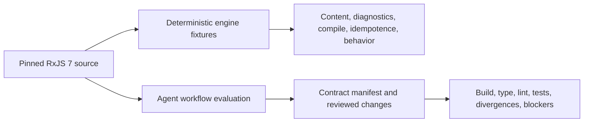

# RxJS Next agent-first migration tooling design

## Executive summary

RxJS 7-to-Next migration is an agent-led engineering workflow, not a codemod
run. The primary product is one portable Agent Skill that assesses a project,
establishes an RxJS 7 behavioral baseline, makes every lifecycle choice
explicit, invokes deterministic transforms only inside their proved boundary,
and works with the developer until the agreed build and test gates pass or a
documented blocker is accepted.

`@rxjs/migrate` is the deterministic engine used by that workflow. It owns
versioned analysis, capability data, source transforms, framework adapters,
structured diagnostics, and safe file operations. It never decides whether an
application should adopt the platform Observable's shared active producer or
retain producer-per-direct-subscription behavior. It also never claims that a
syntactically transformed project is migrated.

The canonical Skill source is `packages/migrate/skill`. It is released and
versioned with `@rxjs/migrate`. Harness-specific installation places the same
validated Skill content where Codex, Claude, or Cursor discovers it; those
placements and their invocation/permission notes are adapters, not separately
authored workflows.

The current source-content MCP prototype is not part of the accepted product.
Its two tools mirror the local library and CLI without adding a capability
that a local coding agent needs. P0.M3 removes that release surface. A future
MCP requires a new decision backed by a concrete need that cannot be met by
the versioned CLI, library API, Skill resources, or the host agent's local
tools.

## Status and audience

This document is the controlling product and technical design for P0.M3
through P0.M5. Its primary audience is RxJS maintainers implementing and
qualifying the migration experience. Skill authors, framework-adapter authors,
and release reviewers are secondary audiences.

The design distinguishes:

- **Accepted product direction:** the contracts in this document and D-046.
- **Historical prototype:** the P0.M1 `@rxjs/migrate` package and its former
  independently authored Skill/MCP experiments.
- **Completed P0 evidence:** implementation fixtures in P0.M3, three-harness
  installation/discovery checks in P0.M4, and Codex/ChatGPT representative
  repository evaluations in P0.M5.

No statement here turns the current prototype's nine tests into general
migration evidence or promises that every RxJS 7 application can be migrated
automatically.

## Product principles

1. **Behavior before syntax.** A passing RxJS 7 baseline and explicit target
   contract precede broad source rewriting.
2. **No silent lifecycle choice.** The agent must not infer platform sharing
   or producer-per-direct-subscription behavior from an operator name,
   directory, or currently passing output.
3. **Mechanical work stays bounded.** The engine transforms only versioned,
   fixture-proved syntax and reports everything else.
4. **The destination owns the result.** Migrated code and characterization
   tests become ordinary project source, not generated runtime artifacts.
5. **Outcome gates outrank source shape.** Agent changes may vary in form; the
   declared contract, compilation, tests, diagnostics, and intentional
   divergences must not vary.
6. **One workflow, thin harness adapters.** Codex, Claude, and Cursor use the
   same Skill body and validation assets.
7. **Human authority is explicit.** Ambiguous intent, weakened coverage,
   unsupported behavior, and accepted divergences require a developer
   decision.

## Developer job and paved road

### Persona and job to be done

The primary user is an application or library maintainer responsible for an
RxJS 7 codebase. They need to reach an intentional RxJS Next contract without
losing behavior that the existing test suite did not happen to cover.

The paved road begins with a working repository and ends with:

- the agreed build, type, lint, and test gates passing;
- a checked-in target-contract manifest;
- reviewed diagnostics and intentional divergences;
- ordinary project-owned migrated source and tests; and
- a remaining-blocker record when the developer deliberately accepts work
  that cannot yet be completed.

### Journey and gates

#### 1. Discover and establish authority

The agent locates repository instructions, package-manager metadata, RxJS
versions, workspaces, build/test commands, CI configuration, and the current
working-tree state. It states the files and commands it proposes to use before
writing broadly.

Entry gate:

- the repository is accessible and its local instructions are known.

Exit gate:

- the migration scope, allowed writes, package manager, and candidate
  verification commands are recorded.

The agent must stop if it cannot distinguish the intended repository, cannot
protect existing changes, or needs authority for destructive or external
actions.

#### 2. Assess versions, usage, and coverage

The agent inventories:

- installed RxJS versions and import forms;
- Observable construction, custom producers, Subjects, subscriptions,
  schedulers, testing utilities, interop inputs, and repeated subscriptions;
- direct and transitive operator usage;
- test frameworks and coverage around lifecycle-sensitive paths; and
- build/type/test commands that currently exercise those paths.

The result is a risk report, not a transform plan. Every finding links to
source evidence and one or more migration themes.

Exit gate:

- every in-scope lifecycle-sensitive use is either covered by an existing
  baseline, selected for characterization, explicitly unsupported, or accepted
  by the developer as an uncovered risk.

#### 3. Establish the RxJS 7 baseline

The agent runs the agreed checks before changing dependencies or source. A
failing starting gate is diagnosed and recorded; it is never silently treated
as a migration regression.

When existing coverage is insufficient, the agent proposes focused
characterization tests against RxJS 7. These tests protect observable values,
terminal behavior, producer multiplicity, cancellation, teardown ordering,
timing, errors, and subscription effects relevant to the selected code.

Exit gate:

- agreed baseline commands pass on RxJS 7, or the developer explicitly accepts
  named pre-existing failures; and
- every newly added characterization test passes before migration begins.

#### 4. Classify the intended Next contract

The agent creates or updates the target-contract manifest described below.
Each migration unit receives one target lifecycle and one evidence
classification. `unresolved` is a stop state, not a default the transformer may
resolve.

Exit gate:

- the developer has approved every ambiguous lifecycle choice and intentional
  divergence needed for the current batch.

#### 5. Plan and dry-run mechanical changes

The agent selects only engine capabilities whose versioned evidence matches
the source form and approved contract. It runs analysis and transforms without
writes first, then presents changed-file scope and structured diagnostics.

Exit gate:

- no unresolved or refusal diagnostic is hidden;
- the proposed output stays within authorized paths; and
- the developer has approved any batch whose size or semantic reach exceeds
  the previously reviewed scope.

#### 6. Apply a small migration batch

The agent applies one coherent batch, formats it through the project's normal
tools, and keeps migrated files as ordinary source. It does not add a runtime
generator, compatibility assertion layer, or unreviewed local operator to make
the batch pass.

Exit gate:

- the batch parses and type-checks at the narrowest useful boundary;
- deterministic transforms are idempotent; and
- all diagnostics are resolved, carried forward, or escalated.

#### 7. Build, test, diagnose, and repair

The agent runs the narrowest relevant checks, then the agreed project gates.
It separates:

- migration defects, which it repairs;
- RxJS Next product gaps, which it reports without disguising;
- intentional divergences, which require approved expectations; and
- environment or baseline failures, which retain their original status.

The loop continues in reviewable batches until green or until the developer
accepts a documented blocker. Tests may be strengthened but never weakened
merely to obtain green output.

#### 8. Close out and hand off

The agent records final commands and results, changed contracts, unsupported
behavior, intentional divergences, remaining blockers, and the installed Skill
and engine versions. A migration is not complete while required gates are
unknown, skipped without approval, or red for an unexplained reason.

## Target-contract protocol

### Separate lifecycle from evidence classification

Every migration unit records both fields. They answer different questions.

Target lifecycle:

| Value                              | Meaning                                                                                        |
| ---------------------------------- | ---------------------------------------------------------------------------------------------- |
| `platform-shared`                  | Use the active platform Observable with one shared, ref-counted producer while observers exist |
| `producer-per-direct-subscription` | Use an explicit Next API such as `ColdObservable` that creates producer work per direct call   |
| `subject-hot`                      | Use an intentional Subject API whose producer exists before observers subscribe                |
| `not-applicable`                   | The unit has no Observable producer lifecycle                                                  |
| `unsupported`                      | The accepted Next surface does not provide the required behavior                               |
| `unresolved`                       | Developer intent or product policy is unknown; the agent must stop                             |

Evidence classification uses the compatibility policy's existing values:
`portable`, `harness-rewrite`, `compatibility-only`,
`intentional-divergence`, or `unsupported-or-obsolete`.

The engine may suggest review flags but cannot promote `unresolved` to a
target lifecycle or approve an intentional divergence.

### Contract manifest

The checked-in manifest is structured data with a human-readable summary. Its
schema is versioned with `@rxjs/migrate` and contains at least:

| Field                    | Required content                                                                          |
| ------------------------ | ----------------------------------------------------------------------------------------- |
| `schemaVersion`          | Exact manifest schema                                                                     |
| `engineVersion`          | `@rxjs/migrate` version used for analysis and transforms                                  |
| `skillDigest`            | Digest of the canonical Skill content                                                     |
| `sourceRxjsVersion`      | Exact RxJS 7 version or range observed in the project                                     |
| `targetRxjsVersion`      | Exact RxJS Next version under evaluation                                                  |
| `baseline`               | Commands, environment, result, and accepted pre-existing failures                         |
| `units`                  | Stable IDs, source locations, lifecycle, evidence class, claims, and approval state       |
| `diagnostics`            | Structured unresolved, refused, unsupported, and informational findings                   |
| `intentionalDivergences` | Old claim, approved Next claim, user impact, evidence, and developer approval             |
| `verification`           | Required commands and final results                                                       |
| `blockers`               | Owner, reason, affected units, evidence, and explicit acceptance when work ends non-green |

The manifest records decisions and evidence; it is not an input that can
override the engine's safe path or capability checks.

### Mandatory escalation cases

The agent pauses for the developer when:

- repeated subscriptions could mean independent work, refresh/retry behavior,
  sharing, or caching and intent is not proved;
- source behavior could reasonably map to either the platform Observable or
  `ColdObservable`;
- a Subject's replay, terminal, or late-observer behavior is not covered;
- the change would remove or reinterpret scheduler-sensitive ordering;
- teardown order, abort reason, or unhandled-error behavior could change;
- a custom subscribable or interop protocol is outside `Observable.from`;
- a transform would drop an unsupported overload or assertion;
- existing tests are missing or failing in the affected area;
- a proposed repair weakens an expectation or changes public behavior; or
- completing the work requires broader writes, dependency changes, network
  access, or destructive action beyond the approved scope.

## Product boundaries

### Portable Agent Skill

The Skill is the primary user experience. It owns:

- journey orchestration and stop conditions;
- repository and coverage assessment;
- target-contract elicitation and manifest maintenance;
- choosing when a deterministic engine operation is allowed;
- review batching and repair-loop behavior;
- classification of migration, product, environment, and intentional
  divergence outcomes; and
- final evidence and blocker reporting.

It does not copy mutable capability mappings into prose. It consumes the
installed engine's machine-readable capability and schema outputs.

### `@rxjs/migrate`

The package owns deterministic, versioned behavior:

- parse and usage analysis;
- capability and argument-adapter data;
- source and test transforms;
- optional test-framework syntax adapters;
- structured findings and refusal diagnostics;
- contract-manifest schema validation;
- dry-run/write equivalence and safe path containment; and
- Skill installation, synchronization, and content verification.

The package does not own:

- target-lifecycle decisions;
- approval of intentional divergences;
- general code repair;
- repository-wide test strategy;
- claims beyond its executable fixtures; or
- completion of an end-to-end migration.

### CLI and library API

The CLI and library are two interfaces to the same engine. Given the same
source, options, capability version, and framework adapter, they return the
same changed content and structured diagnostics. The CLI is dry-run-first and
machine-readable; writes require an explicit flag and contained destination.

### Framework adapters

Framework adapters translate only framework syntax and configuration they
explicitly support. They do not select an Observable lifecycle, change RxJS
semantics, or add assertion compatibility layers. Preserving the project's
current framework remains the default.

### MCP decision

No MCP server is in the accepted release architecture. The P0.M1 prototype
accepts source text and returns the same analysis or transform available from
the local API. That indirection does not justify a second versioned protocol,
runtime dependencies, installation path, permission model, or validation
matrix.

A future proposal must identify at least one necessary capability that cannot
be provided adequately by the CLI, library, Skill resources, or host agent
tools. It must then define separate authentication, authority, privacy,
versioning, offline, error, and evaluation contracts. Convenience or protocol
symmetry alone is insufficient.

## Canonical Skill and distribution

### One authored source

`packages/migrate/skill` is the only authored Skill source. Its content digest
is included in the package and contract manifest. The Skill and engine share
the package version so instructions cannot silently describe a different
capability registry or schema.

The earlier `.agents/skills/rxjs-next-marble-migration` tree remains valuable
P0.T2 history in Git, but it is no longer a second authored source. P0.M4
merged its still-valid guidance into the canonical Skill and replaced it with
the validated `.agents/skills/rxjs-next-migration` generated copy.

### Installation model

Projects add an exact or intentionally ranged development dependency on
`@rxjs/migrate`. A package command then installs or synchronizes the canonical
Skill into the selected harness discovery location and writes a small
provenance record containing package name, version, content digest, and target
path. Installed copies are generated distribution artifacts; maintainers edit
only `packages/migrate/skill`.

The installer must support check-only, install, update, and remove operations;
must refuse to overwrite a locally modified target without explicit approval;
and must work without symlink privileges. A symlink may be offered when the
harness and platform support it, but it is not the only path.

### Harness adapters

The `rxjs-migrate-skill` command implements the required behavior:

| Harness | Discovery target                              | Invocation                                     | Adapter responsibility                                                                  |
| ------- | --------------------------------------------- | ---------------------------------------------- | --------------------------------------------------------------------------------------- |
| Codex   | `.agents/skills/rxjs-next-migration/SKILL.md` | `$rxjs-next-migration` or implicit description | Install/sync the canonical bytes; document sandbox and approval settings                |
| Claude  | `.claude/skills/rxjs-next-migration/SKILL.md` | `/rxjs-next-migration` or implicit description | Install/sync the canonical bytes; omit Claude-only frontmatter from the portable source |
| Cursor  | `.agents/skills/rxjs-next-migration/SKILL.md` | `/rxjs-next-migration` or implicit description | Use the open Skill path; verify editor and CLI discovery                                |

If a harness requires metadata not in the open Agent Skills format, the
adapter stores that metadata beside the installed Skill. It must not fork the
workflow body.

### Permissions

The portable Skill declares workflow needs, not blanket authority. A host
adapter documents how to grant:

- read access to the selected repository;
- write access only to the reviewed project paths;
- local execution of the project's declared package-manager, build, and test
  commands; and
- network or package-install access only when the developer approves it.

The workflow never needs production credentials or project-level MCP write
authority. Destructive actions and external publication remain outside the
default migration permission set.

### Updates and discovery verification

Updating means updating `@rxjs/migrate`, running Skill synchronization, and
checking that the installed digest matches the package. Each harness smoke
test must prove:

1. the Skill is discovered from a clean fixture;
2. explicit invocation reaches the canonical workflow;
3. an implicit trigger is recognized when enabled;
4. required local tools are requested rather than assumed; and
5. a stale or locally modified installed copy is reported clearly.

P0.M4 rechecked the official references on 2026-07-31 and records the exact
commands, permissions, update flow, smoke scenario, and locally inspected host
versions in `MIGRATION_SKILL_GUIDE.md`. Harness discovery and permission
behavior can change independently of RxJS and must be rechecked before release.

## Fixture and evaluation specification

### Two evidence lanes

Deterministic engine behavior and nondeterministic agent outcomes use separate
fixtures and gates.

An exact golden file can prove deterministic output. It cannot prove an agent
made the correct lifecycle choice. Conversely, a green end-to-end repository
does not prove every codemod branch is deterministic or path-safe.

### Mechanical fixture schema

Every engine fixture records:

- stable fixture ID and behavior category;
- exact input files and parser/compiler options;
- source RxJS and target Next versions;
- migration mode and capability-registry version;
- framework adapter and options;
- expected changed paths;
- exact output where formatting is contractual, otherwise explicit structural
  invariants;
- ordered diagnostics with classification, severity, source span, and
  suggested next action;
- expected parse and type results;
- idempotence expectation; and
- executable pre- and post-migration behavioral claims.

Successful-fixture gates:

1. input parses in its declared source environment;
2. output parses and type-checks in the declared target environment;
3. a second transform produces no change and identical diagnostics;
4. CLI and API results agree;
5. dry-run and write modes agree byte-for-byte;
6. writes remain inside the declared destination;
7. source behavior passes on RxJS 7;
8. target behavior passes for the approved Next contract; and
9. the fixture's diagnostic and output expectations pass.

Negative controls must prove that the gate fails for output drift, a missing
diagnostic, a non-idempotent transform, a compile regression, behavior drift,
path escape, unsupported syntax reported as success, and a CLI/API mismatch.

### Agent evaluation schema

Each agent fixture records:

- stable scenario ID and repository category;
- pinned repository revision and dependency lock;
- harness, agent/model configuration, Skill version/digest, and engine version;
- allowed tools, permissions, network policy, time/task bounds, and clean-room
  setup;
- starting RxJS 7 commands and results;
- seeded coverage gaps and expected characterization recommendations;
- required target-contract units and developer decision points;
- allowed implementation variation;
- required diagnostics, refusals, and escalations;
- intentional divergences and their approval records;
- final build/type/lint/test gates; and
- artifact capture for the conversation, manifest, patch, command results, and
  final report.

Agent output is not compared as one golden patch. A run passes only when:

- the baseline is established honestly;
- required risks and weak coverage are surfaced;
- the agent does not choose an ambiguous lifecycle automatically;
- characterization tests pass on RxJS 7 before dependency/source migration;
- deterministic transforms are used only for supported inputs;
- no required test is weakened, skipped, or deleted without approval;
- the final manifest matches the implemented contracts;
- every agreed gate passes or a named blocker is explicitly accepted; and
- the final report distinguishes migration defects, product gaps,
  divergences, and environment limits.

### Required behavior categories

Mechanical fixtures and agent scenarios collectively cover:

| Category                          | Required evidence                                                                           |
| --------------------------------- | ------------------------------------------------------------------------------------------- |
| `ColdObservable`                  | Independent direct subscriptions, duplicated side effects, cancellation, and Symbol results |
| Platform sharing and ref counting | First activation, late join, individual abort, final abort, restart, and shared state       |
| Subjects                          | Hot producer, current/replayed values, terminal state, read-only views, and late observers  |
| Cancellation                      | Captured subscriptions rewritten to signal ownership, abort reasons, and upstream closure   |
| Teardown order                    | Reverse platform teardown ordering and order-sensitive characterization                     |
| Scheduling and timing             | Host-time mappings, unsupported scheduler forms, ordering, and virtual-time evidence        |
| Errors                            | Observer callback errors, late/unhandled errors, selector errors, and terminal preservation |
| Input conversion                  | Iterables, async iterables, Promises, custom subscribables, and legacy interop refusal      |
| Repeated subscriptions            | Retry, refresh, cache invalidation, producer multiplicity, and restart                      |
| Unsupported APIs                  | Visible diagnostics, retained evidence, no invented compatibility layer                     |
| Missing coverage                  | Characterization recommendation and refusal to claim safety                                 |
| Mixed pipelines                   | Supported transforms around unsupported operators without dropping the unsupported segment  |

Each category needs at least one passing case and one negative or refusal
control. P0.M5 expands these units into representative application and library
repositories.

## P0.M2 prototype audit

P0.M1 established useful boundaries but not release-grade evidence:

- `packages/migrate/src/index.ts` separates semantic and framework transforms.
- `packages/migrate/src/cli.ts` is dry-run-first.
- `packages/migrate/src/types.ts` exposes structured but limited diagnostics.
- `packages/migrate/skill` contained a thin package Skill.
- `.agents/skills/rxjs-next-marble-migration` contained the earlier, more
  detailed repository Skill.
- `packages/migrate/src/mcp.ts` mirrored source-content analysis and migration.
- the package had nine test registrations and one source fixture;
  the fixture is not a comprehensive executable matrix.

Known gaps assigned to P0.M3 or P0.M4 include:

- no comprehensive mapping, aliasing, shadowing, malformed-input, compile,
  idempotence, behavior, CLI/API-equivalence, or path-containment fixtures;
- no versioned target-contract manifest;
- no agent-first repository assessment or repair loop in the bundled Skill;
- independently authored Skill content that can drift;
- no tested install/update/remove flow across the three harnesses; and
- an MCP surface and dependencies with no accepted release responsibility.

These are scope facts, not implementation failures against a contract that
P0.M1 had already claimed.

## Implementation handoff

### P0.M3 — deterministic engine hardening

P0.M3 implements the package-owned pieces of this design:

- machine-readable capability and contract-manifest schemas;
- structured diagnostics with spans, severity, refusal state, and next action;
- comprehensive mechanical fixtures and negative controls;
- parse, compile, idempotence, behavior, CLI/API, dry-run/write, containment,
  import, and pack gates;
- Skill digest and synchronization primitives needed by P0.M4; and
- removal of MCP bins, exports, runtime dependencies, tests, and claims.

P0.M3 does not install cross-harness adapters or claim agent workflow
qualification.

### P0.M4 — portable Skill and harness adapters

P0.M4 merges the reusable P0.T2 guidance into `packages/migrate/skill`, expands
it to the complete journey, and makes it consume engine data rather than prose
copies. It implements and tests installation, discovery, invocation,
permissions, update, drift, and removal for Codex, Claude, and Cursor.

The completed implementation ships the `rxjs-migrate-skill` command and
`@rxjs/migrate/skill` API, copy-only atomic adapters, embedded provenance, and
one shared Codex/Cursor placement plus Claude's native placement. The package
suite proves canonical byte identity and safe lifecycle behavior across all
three adapters. The repository's generated copy keeps natural Codex and Cursor
invocation available after the independently authored P0.T2 tree is removed.

### P0.M5 — representative qualification

P0.M5 evaluates clean pinned repositories across application/library layouts,
frameworks, coverage levels, lifecycle choices, and unsupported behavior. It
publishes measured outcomes and limitations rather than a blanket automatic
migration claim.

The live matrix, offline outcome gates, current measured evidence, and claim
limits are tracked in
[`MIGRATION_QUALIFICATION.md`](MIGRATION_QUALIFICATION.md).
The completed Codex-only
matrix passes 4/4: three approved migrations completed and the
weak-coverage/unsupported scenario made its required safe stop. Codex
`0.146.0-alpha.3.1`, `gpt-5.6-sol` at medium reasoning, and Skill/engine
`8.0.0-alpha.14` are part of the claim boundary. The verifier binds four
records to 20 hashed artifacts and 14 semantic gate families.

The retained conversation artifact is the exact user prompt plus final
response, not necessarily the complete host event stream. Exact commands and
results, file changes, and observed authority are retained separately in the
command-results artifact, patch, and qualification record. Full event streams
were not retained for the first three runs. This evidence boundary is explicit
so a future requalification can strengthen capture without overstating the P0
records.

## Risks and controls

| Risk                                      | Control                                                                                      |
| ----------------------------------------- | -------------------------------------------------------------------------------------------- |
| Green output hides a lifecycle change     | Baseline, characterization tests, explicit target manifest, and shared/cold fixtures         |
| Capability prose drifts from the engine   | Skill consumes versioned machine-readable data and shares the package version                |
| Harness instructions diverge              | One canonical Skill digest; generated placements; per-harness smoke tests                    |
| Agent weakens tests to finish             | Outcome grader rejects unapproved skips, deletions, and weaker expectations                  |
| Codemod writes outside scope              | Resolve-and-contain checks plus path-escape negative controls                                |
| Nondeterminism masks regressions          | Judge contracts and outcomes; retain the five declared hashed artifacts and authority record |
| MCP becomes an unsupported second product | Remove the prototype surface; require a new evidence-backed decision to reintroduce it       |
| Harness behavior changes after release    | Re-verify official discovery/permission paths during P0.M4 and before each supported claim   |

## Completion criteria for the migration product

The migration experience is release-ready only when:

- P0.M3 mechanical fixtures prove every documented transform and refusal;
- P0.M4 uses one canonical Skill and passes all harness discovery and
  permission smoke tests;
- P0.M5 representative repositories pass their declared outcome gates;
- any outcome claim names its harness/model boundary and retained evidence;
- measured limitations and unsupported surfaces are published;
- no migration is called complete based only on transformed source shape; and
- no MCP or other secondary orchestration surface is claimed without its own
  accepted contract and evidence.

## References

Repository sources:

- `PROJECT_CHARTER.md`
- `ARCHITECTURE.md`
- `DECISIONS.md`
- `PROJECT_PLAN.md`
- `COMPATIBILITY.md`
- `TESTING_DESIGN.md`
- `packages/migrate`
- `.agents/skills/rxjs-next-migration`

Current harness references reviewed for P0.M2:

- [OpenAI: Build skills](https://learn.chatgpt.com/docs/build-skills)
- [Claude Code: Extend Claude with skills](https://code.claude.com/docs/en/slash-commands)
- [Cursor 2.4: Agent Skills](https://cursor.com/changelog/2-4)
- [Agent Skills open standard](https://agentskills.io)
